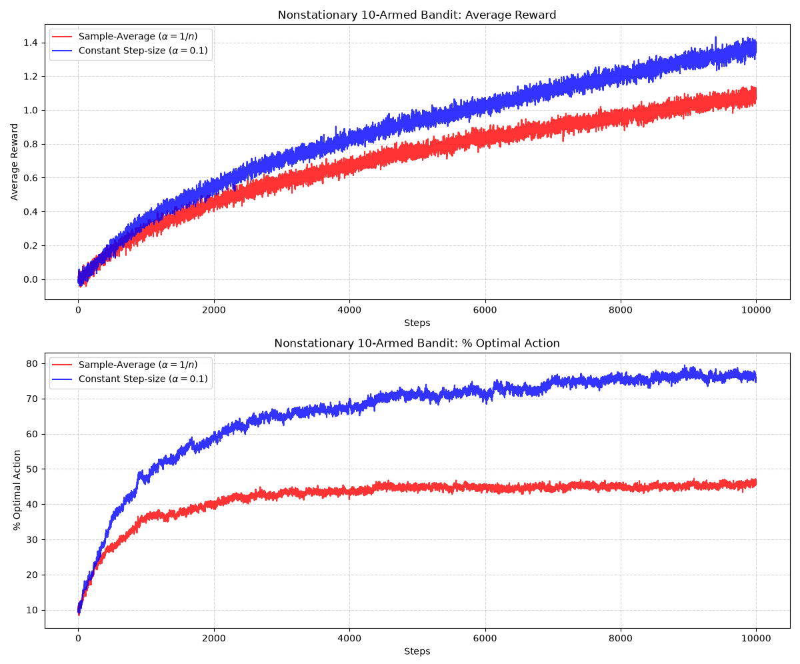

# Part I: Tabular Solution Methods

## Chapter 2

### 2.2 Action-value Methods

**动作价值方法：**

包含两个环节的闭环方法体系：

1. **价值估计：** 根据历史交互数据，计算或更新各个动作的预期收益估计值 $Q_t(a)$。
2. **动作选择：** 利用这些估计值，决定下一步要执行哪一个动作（例如贪婪选择、$\epsilon$-贪婪选择）。

**真实价值 $q_*(a)$：**

当动作 $a$ 被选择时，环境反馈的奖励的**数学期望（总体均值）**：
$$
q_*(a) \doteq \mathbb{E}[R_t \mid A_t = a]
$$
真实价值对智能体而言是未知的。

**估计价值 $Q_t(a)$：**

在离散时间步 $t$ 做出决策之前，智能体根据前 $t-1$ 步收集到的样本所计算出的**样本均值**。
$$
Q_t(a) \doteq \frac{\text{在 } t \text{ 之前选择动作 } a \text{ 获得的奖励总和}}{\text{在 } t \text{ 之前选择动作 } a \text{ 的次数}} = \frac{\sum_{i=1}^{t-1} R_i \cdot \mathbb{1}_{A_i = a}}{\sum_{i=1}^{t-1} \mathbb{1}_{A_i = a}}
$$

> [!IMPORTANT]
>
> 简单来说就是$q$没办法获取用$Q$代替。
>
> 真实动作价值 $q_*(a)$ 定义为执行动作 $a$ 时环境所反馈奖励的数学期望：
> $$
> q_*(a) \doteq \mathbb{E}[R \mid A = a] = \sum_{r} r \cdot P(R = r \mid A = a) \quad \text{或} \quad \int r \cdot p(r \mid A = a) \, dr
> $$
> 要直接算出 $q_*(a)$ 的解析解，前提是智能体必须预先掌握环境完整的概率转移机制或奖励条件概率分布 $P(R = r \mid A = a)$。在强化学习设定中，环境对智能体而言是未知的黑盒，分布函数不可见，因此智能体**无法通过解析计算直接得出 $q_*(a)$**。
>
> ### 1. 为什么用 $Q_t(a)$ 代替 $q_*(a)$？
>
> 智能体的核心任务是最大化累积回报，理想决策规则依赖于真实价值：
> $$
> A^* = \arg\max_{a} q_*(a)
> $$
> 由于 $q_*(a)$ 无法直接获取，决策系统必须寻找一个能够在经验中计算的**统计代理量***。$Q_t(a)$ 即为该代理量。它放弃了对环境先验分布的依赖，转而通过实际交互收集样本，计算经验算术平均：
>
> $$
> Q_t(a) = \frac{1}{N_t(a)} \sum_{i=1}^{t-1} R_i \cdot \mathbb{1}_{A_i=a}
> $$
> 在动作决策阶段（例如贪婪选择），智能体直接用 $Q_t(a)$ 替换掉未知的 $q_*(a)$：
> $$
> A_t = \arg\max_{a} Q_t(a)
> $$
> 
>- **渐进等价性：**
> 
>  当采样次数 $N_t(a)$ 较少时，$Q_t(a)$ 包含随机噪声，与 $q_*(a)$ 存在偏差；但依据大数定律，只要采样次数充分大，$Q_t(a)$ 会在概率意义下收敛至 $q_*(a)$。也就是说，这种替代在极限状态下是无损的。

**贪婪选择：**
$$
A_t \doteq \arg\max_a Q_t(a)
$$
​	**最大化即时收益：** 贪婪选择完全信任当前维护的经验估计值 $Q_t(a)$，每一步都只选取眼前估值最高的动作，目的是榨取当前已掌握知识的最大价值。  

​	**零探索：** 该策略完全不花费时间去尝试那些“当前看来较差”的动作。它默认当前估值低的动作真的差，不会去检验它们是否可能因为样本不足而被低估。  

纯贪婪选择极易陷入**局部最优**而错失全局最优：

1. **初期噪声导致的偏见：**

   假设动作 $a_1$ 的真实期望收益 $q_*(a_1) = 10$，动作 $a_2$ 的真实期望收益 $q_*(a_2) = 20$（$a_2$ 是真实最优动作）。

2. **偶发样本的误导：**

   在最初尝试中：

   - 动作 $a_1$ 随机摇出了一个偏高的奖励 $12 \implies Q(a_1) = 12$。
   - 动作 $a_2$ 随机摇出了一个偏低的奖励 $5 \implies Q(a_2) = 5$。

3. **策略死锁：** 根据 $A_t \doteq \arg\max_a Q_t(a)$，智能体认定 $a_1$ 优于 $a_2$。由于纯贪婪策略绝不尝试表现劣势的动作，动作 $a_2$ 将**永远不再被选择**。其估计值 $Q(a_2)$ 将永远停留在 $5$，智能体永远没有机会通过大数定律修正对 $a_2$ 的估计，从而终身错失真正的高回报动作。  

### 2.3 The 10-armed Testbed

#### Exercise 2.2 

| **时间步 t** | **决策前的估计值向量 ** | **当前贪婪动作集合**         | **实际执行动作** | **获得奖励 ** | **ε 分支发生判定** |
| ------------ | ----------------------- | ---------------------------- | ---------------- | ------------- | ------------------ |
| **$t = 1$**  | $[0,\ 0,\ 0,\ 0]$       | $\{1, 2, 3, 4\}$（全部并列） | $A_1 = 1$        | $R_1 = -1$    | **可能发生**       |
| **$t = 2$**  | $[-1,\ 0,\ 0,\ 0]$      | $\{2, 3, 4\}$（三者并列）    | $A_2 = 2$        | $R_2 = 1$     | **可能发生**       |
| **$t = 3$**  | $[-1,\ 1,\ 0,\ 0]$      | $\{2\}$                      | $A_3 = 2$        | $R_3 = -2$    | **可能发生**       |
| **$t = 4$**  | $[-1,\ -0.5,\ 0,\ 0]$   | $\{3, 4\}$                   | $A_4 = 2$        | $R_4 = 2$     | **必然发生**       |
| **$t = 5$**  | $[-1,\ 1/3,\ 0,\ 0]$    | $\{2\}$                      | $A_5 = 3$        | $R_5 = 0$     | **必然发生**       |

#### Exercise 2.3

**$\varepsilon = 0.01$ 的方法在“累积奖励”和“选择最优动作的概率”两项指标上均表现最好**。

在 10 臂老虎机测试平台中，$k = 10$。各动作真实价值独立抽自标准正态分布 $q_*(a) \sim \mathcal{N}(0, 1)$：

- 10 个标准正态随机变量的最大值期望：$q_*(a^*) \approx 1.55$
- 10 个动作的整体均值期望：$\bar{q}_* = \frac{1}{10} \sum_{a=1}^{10} q_*(a) \approx 0$

> [!IMPORTANT]
>
> 10 臂老虎机实验设定中，10 个动作的真实价值 $q_*(1), q_*(2), \dots, q_*(10)$ 是独立同分布地从标准正态分布中采样的，即：
> $$
> q_*(a) \sim \mathcal{N}(\mu, \sigma^2) = \mathcal{N}(0, 1) \quad (\text{对每个 } a = 1, \dots, 10)
> $$
>
> ### 1. 为什么 10 个动作的整体均值期望 $\bar{q}_* \approx 0$？
>
> 整体均值定义为 10 个动作真实价值的算术平均：
> $$
> \bar{q}_* = \frac{1}{10} \sum_{a=1}^{10} q_*(a)
> $$
> 求其数学期望，利用**期望的线性性质**（求和与常数倍数可与期望符号直接交换）：
> $$
> \mathbb{E}[\bar{q}_*] = \mathbb{E}\left[ \frac{1}{10} \sum_{a=1}^{10} q_*(a) \right] = \frac{1}{10} \sum_{a=1}^{10} \mathbb{E}[q_*(a)] \\
> \mathbb{E}[\bar{q}_*] = \frac{1}{10} \sum_{a=1}^{10} 0 = \frac{1}{10} \times 0 = 0
> $$
> 此外，根据正态分布独立求和性质，$\bar{q}_*$ 本身也服从正态分布：
> $$
> \bar{q}_* \sim \mathcal{N}\left(0, \frac{1}{10}\right)
> $$
> 这意味着在单次老虎机任务中，这 10 个动作的平均值就在 $0$ 附近波动（标准差仅约为 $0.316$）。而在书中图 2.2 的实验中，数据是对 **2000 个独立老虎机任务**取了平均，依据大数定律，跨这 2000 个任务的整体均值高度精确地收敛于 **$0$**。
>
> ### 2. 为什么 10 个动作的最大值期望 $q_*(a^*) \approx 1.55$？
>
> 最优动作的真实价值定义为 10 个独立标准正态随机变量的最大值：
> $$
> q_*(a^*) = \max_{1 \le a \le 10} q_*(a)
> $$
> 最大值的期望不能直接套用简单的均值相加，必须通过极值与顺序统计量进行推导。
>
> #### 第一步：求解最大值的累积分布函数（CDF）
>
> 设标准正态分布的累积分布函数为 $\Phi(x) = P(X \le x)$，概率密度函数为 $\phi(x) = \frac{1}{\sqrt{2\pi}} e^{-x^2 / 2}$。事件“10 个独立变量的最大值小于等于 $x$”，等价于“**这 10 个变量中的每一个都小于等于 $x$**”：
>
> $$
> F_{\max}(x) = P\Big(\max(X_1, \dots, X_{10}) \le x\Big) = P(X_1 \le x, X_2 \le x, \dots, X_{10} \le x)
> $$
> 由于这 10 个变量相互独立：
> $$
> F_{\max}(x) = \prod_{a=1}^{10} P(X_a \le x) = [\Phi(x)]^{10}
> $$
> 
>#### 第二步：求解最大值的概率密度函数（PDF）
> 
>对累积分布函数 $F_{\max}(x)$ 求导，得到概率密度函数 $f_{\max}(x)$：
> $$
> f_{\max}(x) = \frac{d}{dx} \Big([\Phi(x)]^{10}\Big) = 10 [\Phi(x)]^9 \cdot \phi(x)
> $$
> 
>#### 第三步：计算最大值的数学期望
> 
>根据连续型随机变量的期望公式：
> $$
> \mathbb{E}[q_*(a^*)] = \int_{-\infty}^{\infty} x \cdot f_{\max}(x) \, dx = \int_{-\infty}^{\infty} 10 x [\Phi(x)]^9 \phi(x) \, dx
> $$
> 由于标准正态分布的 $\Phi(x)$ 不存在初等函数形式的原函数，该定积分通常通过数值积分或查阅《正态顺序统计量表》求得：
> $$
> \int_{-\infty}^{\infty} 10 x [\Phi(x)]^9 \phi(x) \, dx \approx 1.53875 \approx 1.54 \sim 1.55
> $$
> 
>#### 第四步：直观分位数视角
> 
>从分位数理解：当从连续分布中抽取 $n = 10$ 个样本并从低到高排序时，最大的那个样本所对应的累积概率分位数平均落在：
> $$
> \frac{n}{n + 1} = \frac{10}{11} \approx 90.91\%
> $$
> 在标准正态分布表中，寻找使累积概率达到约 $90.9\%$ 的 $z$ 分数（分位点）：
> $$
> \Phi^{-1}(0.9091) \approx 1.34
> $$
> 结合正态分布右侧长尾的高值拉动，经概率密度加权积分后，最终的期望值严格定格在约 **$1.54$ 到 $1.55$** 之间。在书中的 2000 次蒙特卡洛模拟实验中，记录到的各次任务最优动作均值即稳定在这一数值。

##### 指标一：选择最优动作的概率（$P(A_t = a^*)$）

只要 $\varepsilon > 0$，每个动作都会被无限次采样，依据大数定律，估计值必将收敛到真实值（$Q_t(a) \to q_*(a)$），算法在远期必能 100% 识别出哪个是最优动作 $a^*$。一旦最优动作被锁定，智能体选择该动作的极限概率为：

$$
P(A_t = a^*) = (1 - \varepsilon) + \frac{\varepsilon}{k}
$$

1. **$\varepsilon = 0.01$：**
   $$
   P = (1 - 0.01) + \frac{0.01}{10} = 0.99 + 0.001 = 99.1\%
   $$

2. **$\varepsilon = 0.1$：**
   $$
   P = (1 - 0.1) + \frac{0.1}{10} = 0.90 + 0.01 = 91.0\%
   $$

3. **$\varepsilon = 0$（纯贪婪）：**

   由于缺乏探索机制，算法极易锁死在局部次优解。

##### 指标二：长期单步期望奖励与累积奖励

当完全锁定最优动作后，单步期望奖励的理论极限公式为：
$$
\mathbb{E}[R] = (1 - \varepsilon) q_*(a^*) + \varepsilon \bar{q}_*
$$
代入 $q_*(a^*) \approx 1.55$ 与 $\bar{q}_* \approx 0$ 计算各算法的极限水平：

1. **$\varepsilon = 0.01$：**
   $$
   \mathbb{E}[R]_{0.01} = (1 - 0.01) \times 1.55 + 0.01 \times 0 = 0.99 \times 1.55 \approx 1.535
   $$

2. **$\varepsilon = 0.1$：**
   $$
   \mathbb{E}[R]_{0.1} = (1 - 0.10) \times 1.55 + 0.10 \times 0 = 0.90 \times 1.55 \approx 1.395
   $$

### 2.4 Incremental Implementation

为了将计算和内存降至常数级别 $O(1)$，样本均值的增量递推推导：
$$
\begin{aligned} Q_{n+1} &= \frac{1}{n}\sum_{i=1}^n R_i \\ &= \frac{1}{n}\left( R_n + \sum_{i=1}^{n-1} R_i \right) \\ &= \frac{1}{n}\left( R_n + (n-1)\frac{1}{n-1}\sum_{i=1}^{n-1} R_i \right) \\ &= \frac{1}{n}\left( R_n + (n-1)Q_n \right) \\ &= \frac{1}{n}\left( R_n + n Q_n - Q_n \right) \\ &= Q_n + \frac{1}{n}\Big[R_n - Q_n\Big] \quad (2.3) \end{aligned}
$$

- **资源极小化：** 智能体无需记录历史奖励列表，内存中仅需常数空间存储当前估计值 $Q_n$ 与计数器 $n$。每获得一次新奖励 $R_n$，只需执行公式 的常数次算术运算即可完成估值刷新。
- **边界有效性：** 该递推在 $n = 1$ 时依然成立：代入得 $Q_2 = Q_1 + \frac{1}{1}(R_1 - Q_1) = R_1$，表明初始设定的任意先验值 $Q_1$ 会在完成第 1 次真实尝试后被自动抵消抹平，直接精确更新为初次奖励 $R_1$。

强化学习中反复出现的核心通用结构：
$$
\text{NewEstimate} \leftarrow \text{OldEstimate} + \text{StepSize} \Big[\text{Target} - \text{OldEstimate}\Big]
$$

- **旧估计值（$\text{OldEstimate}$）：** 当前已有的认知基准 $Q_n$。
- **目标（$\text{Target}$）：** 当前环境反馈的新信号（即时奖励 $R_n$），代表估值应当靠近的期望方向（即使单次信号带有随机噪声）。
- **误差（$\text{Error} = [\text{Target} - \text{OldEstimate}]$）：** 观测目标与现有估计之间的差距，直接指明了当前估计的偏差方向与幅度。
- **步长（$\text{StepSize}$）：** 调节向目标逼近的更新步幅。在样本平均法中，步长参数随着时间步动态衰减，即 $\text{StepSize} = \frac{1}{n}$。

### 2.5 Tracking a Nonstationary Problem

**平稳问题 vs. 非平稳问题**：之前使用的样本平均法仅适用于奖励概率分布恒定不变的“平稳环境”；而在实际强化学习中，环境大多是“非平稳的”，即动作产生奖励的概率会随时间动态改变。因此必须赋予较新的奖励更高的权重，衰减较久远的奖励，从而具备持续跟踪变化的能力。

将原先随试验次数变化的步长替换为一个常数 $\alpha \in (0, 1]$，更新规则变为：
$$
Q_{n+1} \doteq Q_n + \alpha [R_n - Q_n]
$$

> [!IMPORTANT]
>
> **“步长”在机器学习和深度学习中通常就被称为“学习率”。**在更新公式中：
>$$
> Q_{n+1} \doteq Q_n + \alpha [R_n - Q_n]
> $$
> 
> - **公式结构**：
>
>   $$\text{新估计值} \leftarrow \text{旧估计值} + \text{步长} \times [\text{实际目标} - \text{旧估计值}]$$
>
>   其中 $[R_n - Q_n]$ 是**预测误差（Error）**。

通过逐步展开该递推式，可推导出估计值与所有历史奖励及初始估计 $Q_1$ 的显式关系：
$$
\begin{aligned} Q_{n+1} &= Q_n + \alpha [R_n - Q_n] \\ &= \alpha R_n + (1 - \alpha) Q_n \\ &= \alpha R_n + (1 - \alpha) [\alpha R_{n-1} + (1 - \alpha) Q_{n-1}] \\ &= \alpha R_n + (1 - \alpha)\alpha R_{n-1} + (1 - \alpha)^2 Q_{n-1} \\ &= \dots \\ &= (1 - \alpha)^n Q_1 + \sum_{i=1}^n \alpha (1 - \alpha)^{n-i} R_i \end{aligned}
$$
**数学特性：指数近因加权平均**

- **权重归一性**：各项权重的总和恒等于 1：
  $$
  (1 - \alpha)^n + \sum_{i=1}^n \alpha (1 - \alpha)^{n-i} = 1
  $$

- **指数衰减**：历史奖励 $R_i$ 所分配到的权重为 $\alpha(1 - \alpha)^{n-i}$。因为 $1 - \alpha < 1$，随着时间间隔 $(n - i)$ 的增加，该奖励的权重呈**指数级衰减**。这种方法因此被称为**指数近因加权平均**。

- 特殊极限：若 $\alpha = 1$，则 $Q_{n+1} = R_n$，只保留最近一次的奖励。

**收敛性条件与对比分析**

随机逼近理论给出了步长序列 $\{\alpha_n(a)\}$ 能保证以概率 1 收敛到真实价值的充要条件：

> [!IMPORTANT]
>
> #### 1. 步长序列 $\{\alpha_n(a)\}$
>
> 在实际估计中，步长不一定是一个固定的常数，它可以随着尝试次数 $n$ 的增加而改变（下标 $n$ 表示动作 $a$ 被选择的第 $n$ 次）。例如第 1 次更新用 $\alpha_1 = 1$，第 2 次用 $\alpha_2 = 0.5$……这一串按顺序排列的步长数值构成了**步长序列**。
>
> #### 2. 真实价值（True Value, $q_*$）
>
> 对于多臂老虎机中的某个动作 $a$，每拉动一次获得的奖励 $R$ 通常带有一些随机噪声。但从数学期望的角度来看，它存在一个客观存在的平均回报：
>
> $$
> q_*(a) \doteq \mathbb{E}[R_t \mid A_t = a]
> $$
> 这就是“真实价值”。我们计算的 $Q_n$ 是我们在有限次试验下的**估计值**。
>
> #### 3. 以概率 1 收敛
>
> 这是概率论中的几乎必然收敛，其严格数学定义为：
>
> $$
> P\left( \lim_{n \to \infty} Q_n = q_* \right) = 1
> $$
> 
>
> - **含义**：因为奖励 $R_n$ 本身具有随机性，所以在理论上可能出现极其罕见的极端情况。“以概率 1 收敛”意味着：在所有可能的随机试验路径中，估计值 $Q_n$ 最终没有收敛到 $q_*$ 的概率集合测度为 0。

$$
\sum_{n=1}^\infty \alpha_n(a) = \infty \quad \text{且} \quad \sum_{n=1}^\infty \alpha_n^2(a) < \infty
$$

- **第一项条件 $\sum \alpha_n = \infty$**：步长必须足够大，以克服任意初始状态或前期的随机扰动。
- **第二项条件 $\sum \alpha_n^2 < \infty$**：步长后期必须足够小，以消除随机波动，保证最终收敛。

#### Exercise 2.4

当步长参数随更新次数变化为 $\alpha_k$ 时，增量更新公式写为：
$$
Q_{k+1} = Q_k + \alpha_k [R_k - Q_k] = \alpha_k R_k + (1 - \alpha_k) Q_k
$$
将上式逐步向前代入展开：

- $k = 1$ 时：
  $$
  Q_2 = \alpha_1 R_1 + (1 - \alpha_1) Q_1
  $$

- $k = 2$ 时：
  $$
  Q_3 = \alpha_2 R_2 + (1 - \alpha_2) Q_2 = \alpha_2 R_2 + (1 - \alpha_2)\alpha_1 R_1 + (1 - \alpha_2)(1 - \alpha_1) Q_1
  $$

- $k = 3$ 时：
  $$
  Q_4 = \alpha_3 R_3 + (1 - \alpha_3)\alpha_2 R_2 + (1 - \alpha_3)(1 - \alpha_2)\alpha_1 R_1 + (1 - \alpha_3)(1 - \alpha_2)(1 - \alpha_1) Q_1
  $$

归纳到第 $n+1$ 次估计值 $Q_{n+1}$（综合了前 $n$ 个奖励与初始估计 $Q_1$）：
$$
Q_{n+1} = \left[ \prod_{j=1}^n (1 - \alpha_j) \right] Q_1 + \sum_{i=1}^n \alpha_i \left[ \prod_{j=i+1}^n (1 - \alpha_j) \right] R_i
$$
约定空乘积 $\prod_{j=n+1}^n (1 - \alpha_j) = 1$

在一般步长序列 $\{\alpha_k\}$ 下，第 $i$ 次观测到的奖励 $R_i$ 所分配的权重 $w_i$ 为：
$$
w_i = \alpha_i \prod_{j=i+1}^{n} (1 - \alpha_j)
$$

- **初始估计 $Q_1$ 的权重**为：$\prod_{j=1}^n (1 - \alpha_j)$。
- **物理意义**：第 $i$ 次奖励在刚加入时被赋予了 $\alpha_i$ 的权重；在其之后每经历一次新的更新（$j = i+1, \dots, n$），该奖励的权重都会被乘上衰减系数 $(1 - \alpha_j)$。
- **特例验证**：
  - 当 $\alpha_j = \alpha$（常数）时，$\prod_{j=i+1}^n (1 - \alpha) = (1 - \alpha)^{n-i}$。
  - 当 $\alpha_j = \frac{1}{j}$（样本平均法）时，代入化简可得 $w_i = \frac{1}{n}$，即所有历史奖励等权重。

#### Exercise 2.5 (programming)

[Exercise](E:\Desktop\Documents\BIT\RL\Note\code\Excerise2.5.py)： “理论上限为 91%”（即 $1 - \varepsilon + \frac{\varepsilon}{10} = 0.9 + 0.01 = 0.91$）存在一个关键前提：**智能体在进行贪婪利用时，必须 100% 准确地挑中当前真正的最优动作**。

### 2.6 Optimistic Initial Values

#### Exercise 2.6

**极高的初始估计值与纯贪婪策略（$\epsilon = 0$）相结合，导致所有 2000 次实验在时间步上产生了高度“周期同步”的轮询试探。**

**1. 第 1～10 步：强制均匀轮询**

- 10 个动作的初始值均为 $Q_1(a) = +5$。而真实收益均值仅在 0 附近（标准差为 1），实际奖励很少超过 3。
- 只要某个动作被选过一次，其估值按 $Q \leftarrow 0.9 \times 5 + 0.1 \times R \approx 4.5 + 0.1 R$ 更新，必然显著低于未尝试动作的 5.0。
- 因此在贪婪策略下，智能体在前 10 步会**严格按次序将每个动作轮流试探一次**。在此期间，选择最优动作的概率恒定在 $1/10 = 10\%$ 左右。

**2. 第 11 步：第一个显著尖峰（Spike）**

- 到第 10 步结束时，所有动作均被试探过一次，估计值均落在 4.2～4.8 区间内。
- 第 11 步时。由于最优动作（$q_*$ 最大的动作）在统计上获得高奖励的概率最高，因此它最有希望在第一轮后保留最高的估计值。
- 跨 2000 次独立任务平均后，第 11 步选择最优动作的比例会**瞬间暴涨**，形成第一个突出的尖峰。

> [!IMPORTANT]
>
> ### 为什么最优动作的奖励会在 1～2 左右？
>
> 期望为 0 的是**所有动作的平均先验期望**，而非**最优动作的真实期望**。
>
> 数据生成包含两层高斯分布：
>
> 1. **第一层：动作真实价值的生成（任务初始化）**
>
>    对于每个赌博机任务，10 个动作的真实价值 $q_*(a)$ 是独立从标准正态分布中采样生成的：
>    $$
>    q_*(a) \sim \mathcal{N}(0, 1) \quad (a = 1, 2, \dots, 10)
>    $$
>
> 2. **第二层：每次执行动作时获得的即时奖励**
>
>    当选择动作 $a$ 时，实际产出的奖励是以该动作的真实价值为均值、方差为 1 的正态分布：
>    $$
>    R_t \sim \mathcal{N}(q_*(a), 1)
>    $$
>
> **极值统计量（Order Statistics）的作用：**
>
> 所谓的“最优动作”$a^*$，定义为这 10 个动作中真实价值最大的那个：
> $$
> a^* = \arg\max_{a} q_*(a) \\
> q_*(a^*) = \max \{ q_*(1), q_*(2), \dots, q_*(10) \}
> $$
> 在统计学中，10 个独立的标准正态分布变量 $\mathcal{N}(0, 1)$ 的最大值，其期望值并非 0，而是：
> $$
> \mathbb{E}[q_*(a^*)] = \mathbb{E}\left[\max_{1 \le i \le 10} X_i\right] \approx 1.54
> $$
>
> - 一个**随机动作**的真实价值均值是 0；
> - 但**这 10 个动作里最好的动作**，其真实价值 $q_*(a^*)$ 的均值约为 1.54。
>
> 当智能体拉动最优动作 $a^*$ 时，获得的奖励 $R$ 满足：
> $$
> \mathbb{E}[R \mid a^*] = q_*(a^*) \approx 1.54
> $$
> 由于方差为 1，其采样的单次奖励大多落在 $[1.54 - 1, 1.54 + 1] = [0.54, 2.54]$ 的区间内，因此通常集中在 1～2 左右。

**3. 第 12～20 步：估值再次被拉低与骤降**

- 尽管最优动作在第 11 步被选中，但它产出的真实奖励依然远远低于它当时的估计值。
- 这次更新会使最优动作的估值再次缩水，从而低于那些在第 1 轮表现尚可、但还未在第 2 轮被更新过的次优动作。
- 智能体感到“失望”，转而去尝试其他次优动作，导致最优动作的被选比例迅速断崖式下跌。

**4. 后续震荡与逐步平滑**

- 这种“最优动作被试探 $\to$ 估值受挫降低 $\to$ 轮流试探其他动作”的过程会以约 10 步为周期反复上演，因此在步数 21、31 附近会看到微弱的次级波峰。
- 随着步数推移，由于不同任务中随机奖励的差异，各任务进入下一轮更新的时间点逐渐错开，周期性的尖峰最终被平滑成一条平稳上升的收敛曲线。

#### Exercise 2.7

**1. 迹 $\bar{o}_n$ 的通项公式求解**

根据式 (2.9)，迹 $\bar{o}_n$ 的递推公式为：   

$$
\bar{o}_n = \bar{o}_{n-1} + \alpha(1 - \bar{o}_{n-1}) = (1 - \alpha)\bar{o}_{n-1} + \alpha
$$
两边同时减去 1，可得：

$$
\bar{o}_n - 1 = (1 - \alpha)(\bar{o}_{n-1} - 1)
$$
由于初始状态 $\bar{o}_0 = 0$，即 $\bar{o}_0 - 1 = -1$，递推展开得到：   

$$
\bar{o}_n - 1 = -(1 - \alpha)^n \implies \bar{o}_n = 1 - (1 - \alpha)^n
$$

> [!IMPORTANT]
>
> **强化学习角度：对恒定目标 1 的“跟踪误差”衰减**
>
> 式 (2.9) 原始定义为：   
> $$
> \bar{o}_n = \bar{o}_{n-1} + \alpha(1 - \bar{o}_{n-1})
> $$
> 强化学习中最基础的增量更新结构是：
> $$
> \text{新估计} = \text{旧估计} + \text{步长} \times (\text{目标} - \text{旧估计})
> $$

**2. 步长 $\beta_n$ 的展开与化简**

根据式 (2.8)，处理第 $n$ 个奖励时的步长为 $\beta_n = \frac{\alpha}{\bar{o}_n}$。由此可推导系数 $(1 - \beta_n)$：   

$$
1 - \beta_n = 1 - \frac{\alpha}{\bar{o}_n} = \frac{\bar{o}_n - \alpha}{\bar{o}_n}
$$

> [!IMPORTANT]
>
> 此处要注意我们的最终目的，比如看看最终目的是什么形式$Q_n$,以此来构造新的形式说不定有好的解，以及也可以通过强化学习的直觉来构造。

利用递推关系 $\bar{o}_n - \alpha = (1 - \alpha)\bar{o}_{n-1}$，可将其写为：
$$
1 - \beta_n = \frac{(1 - \alpha)\bar{o}_{n-1}}{\bar{o}_n}
$$
特别地，当 $n = 1$ 时：

$$
\bar{o}_1 = 1 - (1 - \alpha)^1 = \alpha \implies \beta_1 = \frac{\alpha}{\alpha} = 1
$$
因此：

$$
1 - \beta_1 = 0
$$
**3. 类比式 (2.6) 展开动作价值估计**

在处理了 $n$ 次奖励后，动作价值更新规则为，并将其递推展开得到：：

$$
Q_{n+1} = Q_n + \beta_n (R_n - Q_n) = (1 - \beta_n) Q_n + \beta_n R_n\\
Q_{n+1} = \left[ \prod_{j=1}^n (1 - \beta_j) \right] Q_1 + \sum_{i=1}^n \beta_i \left[ \prod_{j=i+1}^n (1 - \beta_j) \right] R_i
$$
其中规定当 $i = n$ 时，空乘积 $\prod_{j=n+1}^n (1 - \beta_j) = 1$。

**4. 消除初始偏差证明**

考察初始估计值 $Q_1$ 的系数：

$$
\prod_{j=1}^n (1 - \beta_j) = (1 - \beta_1)(1 - \beta_2)\cdots(1 - \beta_n)
$$
因为 $1 - \beta_1 = 0$，所以在 $n \ge 1$ 时该连乘积恒等于 0：

$$
\prod_{j=1}^n (1 - \beta_j) = 0
$$
这意味着初始估计 $Q_1$ 在第一次获得奖励后就被完全覆盖，更新结果不再保留任何初始偏差。   

**5. 指数近期加权平均证明**

对于任意奖励 $R_i$（$1 \le i \le n$），其权重系数为：

$$
w_i = \beta_i \prod_{j=i+1}^n (1 - \beta_j)
$$
将 $1 - \beta_j = \frac{(1 - \alpha)\bar{o}_{j-1}}{\bar{o}_j}$ 代入连乘项中，分子与分母形成连锁对消：

$$
\prod_{j=i+1}^n (1 - \beta_j) = \prod_{j=i+1}^n \left( (1 - \alpha) \frac{\bar{o}_{j-1}}{\bar{o}_j} \right) = (1 - \alpha)^{n-i} \cdot \left( \frac{\bar{o}_i}{\bar{o}_{i+1}} \frac{\bar{o}_{i+1}}{\bar{o}_{i+2}} \cdots \frac{\bar{o}_{n-1}}{\bar{o}_n} \right) = (1 - \alpha)^{n-i} \frac{\bar{o}_i}{\bar{o}_n}
$$
将该结果乘上 $\beta_i = \frac{\alpha}{\bar{o}_i}$：

$$
w_i = \frac{\alpha}{\bar{o}_i} \cdot (1 - \alpha)^{n-i} \frac{\bar{o}_i}{\bar{o}_n} = \frac{\alpha (1 - \alpha)^{n-i}}{\bar{o}_n}
$$
代入 $\bar{o}_n = 1 - (1 - \alpha)^n$，得到最终的展开形式：

$$
Q_{n+1} = \sum_{i=1}^n \frac{\alpha (1 - \alpha)^{n-i}}{1 - (1 - \alpha)^n} R_i
$$

- **权重归一化**：权重之和满足

  $$
  \sum_{i=1}^n w_i = \frac{\alpha}{1 - (1 - \alpha)^n} \sum_{i=1}^n (1 - \alpha)^{n-i} = \frac{\alpha}{1 - (1 - \alpha)^n} \cdot \frac{1 - (1 - \alpha)^n}{\alpha} = 1
  $$

- **近期加权特性**：权重按 $(1 - \alpha)^{n-i}$ 随着时间推移呈指数级衰减，越近获得的奖励权重越大。

### 2.7 Upper-Confidence-Bound Action Selection

#### Exercise 2.8

**1. 为什么第 11 步奖励显著激增**

- **前 10 步的强制遍历**：测试环境为 10 臂赌博机（$k = 10$）。根据 UCB 规则，未尝试过的动作优先被视作最大化动作。因此在前 10 步中，算法必须把所有 10 个动作各自尝试一次。前 10 步的平均收益即为所有臂的全局平均收益（期望约为 0）。   

- **第 11 步蜕变为纯贪婪选择**：到第 11 步（$t = 11$）时，所有动作的被选次数均为 $N_{11}(a) = 1$。观察 UCB 选择公式：   
  $$
  A_{11} = \arg\max_a \left[ Q_{11}(a) + c\sqrt{\frac{\ln 11}{N_{11}(a)}} \right]
  $$
  由于所有动作的 $N_{11}(a)$ 均为 1，其不确定性奖励项 $c\sqrt{\frac{\ln 11}{1}}$ 对所有动作完全相同。   

- 公式退化为纯贪婪决策：$A_{11} = \arg\max_a Q_{11}(a)$。算法在第 11 步必然会挑选前 10 步中单次采样奖励最高的那个动作执行，因而第 11 步的期望收益瞬间大幅上升，形成峰值。   

**2. 为什么随后的步数(从第十二步往后)奖励会迅速下降**

- **最优动作的置信上界骤降**：在第 11 步被选中的动作（设为 $a^*$），其选择次数更新为 $N_{12}(a^*) = 2$。此时它的不确定性加成项被分母稀释为：
  $$
  c\sqrt{\frac{\ln 12}{2}} \approx c \times 0.707 \sqrt{\ln 12}
  $$
  
- **次优动作的置信上界相对占优**：其余 9 个在前 10 步表现一般甚至极差的动作，由于仅被尝试过 1 次，其计数依然为 $N_{12}(a) = 1$，加成项依然高达：
  $$
  c\sqrt{\frac{\ln 12}{1}} = c\sqrt{\ln 12}
  $$

- **强迫探索拉低平均收益**：当 $c = 2$ 时，二者在不确定性项上的差距为：   
  $$
  2 \times (\sqrt{\ln 12} - \sqrt{\ln 12 / 2}) \approx 2 \times 1.576 \times (1 - 0.707) \approx 0.92
  $$
  这个巨大的探索加成往往超过了动作估计值 $Q(a)$ 本身的差距。因此在第 12 步及随后的几步中，算法被迫掉头去尝试其他 9 个历史表现平庸但尚未被二次确认的次优动作，从而导致平均奖励在第 11 步后明显跌落。   

**3. 为什么 $c = 1$ 时该峰值不明显**

- 当探索系数由 $c = 2$ 降低到 $c = 1$ 时，次选动作与被选中动作之间的探索加成差距缩减为原本的一半（约 0.46）。   
- 此时，第 11 步胜出动作 $a^*$ 的 $Q$ 值优势更容易压过缩小后的探索项差距，使得算法在第 12 步有更大概率继续利用 $a^*$ 而不是被迫遍历差动作，因而曲线震荡被抚平，峰值不再突兀。   

### 2.8 Gradient Bandit Algorithms

在强化学习中，终极目标是让智能体在每一步获得的**期望奖励最大化**。   

**1. 性能指标（目标函数）：** 在时刻 $t$，系统获得的期望奖励记为 $\mathbb{E}[R_t]$。根据概率论，期望值等于“执行某个动作的概率”乘以“该动作带来的真实期望奖励”，对所有可能的动作 $x$ 求和：   
$$
\mathbb{E}[R_t] = \sum_{x} \pi_t(x) q_*(x)
$$

- $x$：遍历动作空间里的每一个动作。   
- $\pi_t(x)$：选择动作 $x$ 的概率（由偏好度 $H_t$ 经 Softmax 计算得出）。   
- $q_*(x)$：动作 $x$ 的**真实期望奖励**（客观存在的真实均值）。   

**2. 理想中的梯度上升：** 要让期望奖励 $\mathbb{E}[R_t]$ 最大，最直接的方法就是微积分中的**梯度上升法**：沿着目标函数关于参数 $H_t(a)$ 的偏导数，即梯度，方向走：   
$$
H_{t+1}(a) \doteq H_t(a) + \alpha \frac{\partial \mathbb{E}[R_t]}{\partial H_t(a)}
$$
**3. 核心困境：** 真实世界中，智能体**根本不知道每个动作的真实期望奖励 $q_*(x)$ 是多少**因此我们**无法直接算出真实的梯度**。   

**解决思路**：我们需要通过数学变换，把真实梯度改写成一个“期望形式 $\mathbb{E}[\dots]$”，这样就能用每一步实际观测到的单次样本去替代整个期望。   

#### 梯度的数学变换

**第 1 步：展开真实梯度** 对目标函数求偏导：   
$$
\frac{\partial \mathbb{E}[R_t]}{\partial H_t(a)} = \frac{\partial}{\partial H_t(a)} \left[ \sum_{x} \pi_t(x) q_*(x) \right] = \sum_{x} q_*(x) \frac{\partial \pi_t(x)}{\partial H_t(a)}
$$
因为真实期望 $q_*(x)$ 是环境本身的客观属性，不依赖于智能体的偏好度 $H_t$，所以对 $H_t$ 求导时只有策略概率 $\pi_t(x)$ 会发生变化。  

**第 2 步：引入基准项 $B_t$**
$$
\sum_{x} q_*(x) \frac{\partial \pi_t(x)}{\partial H_t(a)} = \sum_{x} (q_*(x) - B_t) \frac{\partial \pi_t(x)}{\partial H_t(a)}
$$
减去 $B_t$ 的本质就是进行零中心化：它不改动统计学上的理论终点，但大幅抹去了采样过程中的共性背景噪声，从而让每一次采样的数值波动（方差）最小化。

> **原因**：因为所有动作的概率之和恒等于 1（即 $\sum_x \pi_t(x) = 1$），对常数 1 求导恒等于 0：   
> $$
> \sum_{x} \frac{\partial \pi_t(x)}{\partial H_t(a)} = \frac{\partial}{\partial H_t(a)} \left( \sum_{x} \pi_t(x) \right) = \frac{\partial (1)}{\partial H_t(a)} = 0
> $$
> 展开乘积项可知：
> $$
> \sum_x B_t \frac{\partial \pi_t(x)}{\partial H_t(a)} = B_t \sum_x \frac{\partial \pi_t(x)}{\partial H_t(a)} = B_t \cdot 0 = 0
> $$

因此，**减去任意与动作 $x$ 无关的常数标量 $B_t$，总梯度的数学期望绝对不会改变**。

**第 3 步：似然比技巧（构造期望形式）** 在求和项中人为乘以 $\frac{\pi_t(x)}{\pi_t(x)}$：   
$$
\sum_{x} \pi_t(x) \left[ (q_*(x) - B_t) \frac{\frac{\partial \pi_t(x)}{\partial H_t(a)}}{\pi_t(x)} \right]
$$
注意看：式子变成了“某个量乘以它的发生概率 $\pi_t(x)$，然后再求和”。根据期望定义 $\sum_x P(x) f(x) = \mathbb{E}[f(X)]$，求和号可以等价改写为对实际执行动作 $A_t$ 的数学期望：   
$$
= \mathbb{E}\left[ (q_*(A_t) - B_t) \frac{\frac{\partial \pi_t(A_t)}{\partial H_t(a)}}{\pi_t(A_t)} \right]
$$
**第 4 步：用样本替代期望，即消除未知的 $q_*$**

- 虽然不知道真实期望值 $q_*(A_t)$，但在时刻 $t$ 实际执行动作 $A_t$ 后，环境会反馈一个真实的即时奖励 $R_t$。   

- 按照定义，即时奖励在当前动作下的条件期望刚好等于真实期望：$\mathbb{E}[R_t \vert{} A_t] = q_*(A_t)$。   

- 同时把基准项设为历史平均奖励 $B_t = \bar{R}_t$。 因此可以用实际获得的单次观测样本 $R_t$ 无偏地替换 $q_*(A_t)$：   
  $$
  = \mathbb{E}\left[ (R_t - \bar{R}_t) \frac{\frac{\partial \pi_t(A_t)}{\partial H_t(a)}}{\pi_t(A_t)} \right]
  $$

> [!IMPORTANT]
>
> **期望本质上就是加权求和**，而在条件给定的情况下，单次采样的随机变量 $R_t$ 对所有可能结果求和求均值后，恰好退化成了其条件期望 $q_*(A_t)$。   
>
> 只要外层仍然包裹着期望符号 $\mathbb{E}[\dots]$，在内层用随机变量 $R_t$ 代替其理论均值 $q_*(A_t)$，数学上就是严格等价且无偏的。 

#### Softmax 导数的推导

为了完成整个推导，必须算出 Softmax 的偏导数 $\frac{\partial \pi_t(x)}{\partial H_t(a)}$，  **商的求导法则** $\left[\frac{f}{g}\right]' = \frac{f'g - fg'}{g^2}$。   对于 Softmax：
$$
\pi_t(x) = \frac{e^{H_t(x)}}{\sum_{y=1}^k e^{H_t(y)}}
$$
现在对某个特定动作 $a$ 的偏好度 $H_t(a)$ 求导：   

1. **分母对 $H_t(a)$ 求导**： 求和项中只有当 $y = a$ 时那项包含 $H_t(a)$，其余各项导数均为 0，所以 $\frac{\partial g}{\partial H_t(a)} = e^{H_t(a)}$。   
2. **分子对 $H_t(a)$ 求导**：
   - 如果 $x = a$，则分子是 $e^{H_t(a)}$，导数为 $e^{H_t(a)}$。   
   - 如果 $x \neq a$，分子根本不含 $H_t(a)$，导数为 $0$。 为了把这两种情况写在一个统一公式里，书中引入了指示函数 $\mathbf{1}_{a=x}$。因此分子的导数可以紧凑地写作 $\mathbf{1}_{a=x} e^{H_t(x)}$。   

代入商法则展开：
$$
\frac{\partial \pi_t(x)}{\partial H_t(a)} = \frac{\left(\mathbf{1}_{a=x} e^{H_t(x)}\right) \sum_{y} e^{H_t(y)} - e^{H_t(x)} e^{H_t(a)}}{\left(\sum_{y} e^{H_t(y)}\right)^2}\\
= \mathbf{1}_{a=x} \frac{e^{H_t(x)}}{\sum_y e^{H_t(y)}} - \frac{e^{H_t(x)}}{\sum_y e^{H_t(y)}} \cdot \frac{e^{H_t(a)}}{\sum_y e^{H_t(y)}}\\
= \mathbf{1}_{a=x} \pi_t(x) - \pi_t(x)\pi_t(a) \\
= \pi_t(x) (\mathbf{1}_{a=x} - \pi_t(a))
$$
将其代入，分子分母的 $\pi_t(A_t)$ **完全消掉**：   
$$
\frac{\partial \mathbb{E}[R_t]}{\partial H_t(a)} = \mathbb{E}\left[ (R_t - \bar{R}_t) \frac{\frac{\partial \pi_t(A_t)}{\partial H_t(a)}}{\pi_t(A_t)} \right]\\
 = \mathbb{E}\left[ (R_t - \bar{R}_t) (\mathbf{1}_{a=A_t} - \pi_t(a)) \right]
$$
在**随机梯度上升**中，我们不需要在每一步算完完整的数学期望，而是直接**用单次采样的瞬时值来代替期望值**进行参数迭代（把期望符号 $\mathbb{E}$ 去掉）：   
$$
H_{t+1}(a) = H_t(a) + \alpha (R_t - \bar{R}_t) (\mathbf{1}_{a=A_t} - \pi_t(a))
$$

#### Exercise 2.9

二选一的决策中，**绝对分数毫无意义，相对差距才决定一切**。

**Softmax 分布定义：**

在强化学习和多分类任务中，包含温度参数 $\tau > 0$ 的 Softmax 分布定义为：
$$
P(A = a_i) = \frac{e^{Q(a_i) / \tau}}{\sum_{j} e^{Q(a_j) / \tau}}
$$
**Sigmoid)函数定义：**

标准 Sigmoid 函数 $\sigma(x)$ 定义为：
$$
\sigma(x) = \frac{1}{1 + e^{-x}}
$$
将 $P(a_1)$ 的分子和分母同时除以 $e^{Q(a_1) / \tau}$：
$$
P(a_1) = \frac{\frac{e^{Q(a_1) / \tau}}{e^{Q(a_1) / \tau}}}{\frac{e^{Q(a_1) / \tau}}{e^{Q(a_1) / \tau}} + \frac{e^{Q(a_2) / \tau}}{e^{Q(a_1) / \tau}}} \\
= \frac{1}{1 + e^{-\frac{Q(a_1) - Q(a_2)}{\tau}}}
$$
令自变量 $x$ 表示两个动作价值在温度归一化后的差值：
$$
x = \frac{Q(a_1) - Q(a_2)}{\tau}
$$
即
$$
P(a_1) = \sigma(x) = \sigma\left(\frac{Q(a_1) - Q(a_2)}{\tau}\right)
$$
根据全概率公式，动作 $a_2$ 的概率应为 $1 - P(a_1)$。通过 Sigmoid 函数性质 $\sigma(-x) = 1 - \sigma(x)$ 进行验证：
$$
P(a_2) = 1 - P(a_1) = 1 - \frac{1}{1 + e^{-x}} = \frac{1 + e^{-x} - 1}{1 + e^{-x}} = \frac{e^{-x}}{1 + e^{-x}} \\
 = \frac{1}{e^x + 1} = \frac{1}{1 + e^x} = \sigma(-x)
$$
将 $x = \frac{Q(a_1) - Q(a_2)}{\tau}$ 代入，即：
$$
P(a_2) = \sigma\left(\frac{Q(a_2) - Q(a_1)}{\tau}\right)
$$

### 2.9 Associative Search (Contextual Bandits)

### Exercise 2.11 (programming)

- **常数步长 $\epsilon$-greedy（$\alpha = 0.1$，红色实线）**：曲线单调向下因为在 200,000 步的长序列下，各臂价值变化是渐进的，极小的探索率（$\epsilon = 1/128$）就足以在极低探索代价下捕获漂移的最优臂；随着 $\epsilon$ 增大（$1/64 \to 1/4$），探索频次增加，拉低了平均收益。
- **样本平均 $\epsilon$-greedy（红色虚线）—— 全面落后于常数步长**：其估计值按 $1/N$ 更新。到了几十万步后，$1/N \approx 0$，估计值基本“僵死”，完全无法适应环境漂移，收益显著低于常数步长版本。
- **乐观初始化贪婪（$\alpha = 0.1$，黑色实线）**—— 呈现完全水平的一条直线：因为乐观初始值 $Q_0$的影响在最初几百步就衰减殆尽了。而在后 100,000 步中，智能体以纯贪婪（$\epsilon = 0$）运行，一旦动作价值发生漂移，它由于缺乏持续探索能力，只能被动困在局部最优中。
- **UCB（蓝色实线）**：平稳环境中 UCB 是第一名，但在非平稳环境下彻底失效。因为置信上限加成项 $c \sqrt{\frac{\ln t}{N_t(a)}}$ 随时间收窄，不再进行有效探索；且样本平均使得价值估计严重滞后。
- **梯度 Bandit（绿色实线）**：其基准项 $\bar{R}$ 是按全局样本平均更新的，无法跟踪非平稳奖励的水平漂移；当 $\alpha$ 过大时偏好值震荡失稳。

