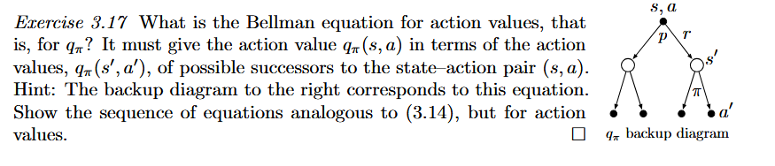
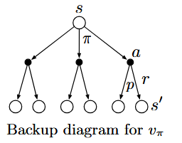
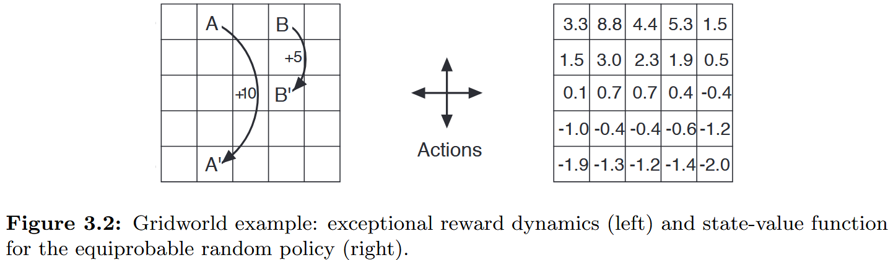
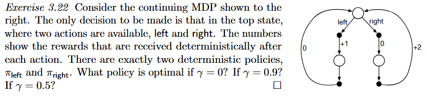

# Part I: Tabular Solution Methods

## Chapter 3 Finite Markov Decision Processes

### 3.1 The Agent–Environment Interface

#### 四参数环境动力学函数

系统在当前时刻的状态与奖励随机变量 $(S_t, R_t)$ 仅由前一时刻的状态与动作 $(S_{t-1}, A_{t-1})$ 决定。该联合条件概率分布即为环境动力学函数：
$$
p(s', r \mid s, a) \doteq \Pr\{S_t = s', R_t = r \mid S_{t-1} = s, A_{t-1} = a\} 
$$

- **物理意义**：当前处于状态 $s$，采取动作 $a$ 后，环境**同时**发生“转移到状态 $s'$ 且返还即时奖励 $r$”的联合概率。

- **完备性与全概率归一化**：给定任意确定的状态 $s$ 与合法动作 $a \in \mathcal{A}(s)$，所有可能的转移目标 $s'$ 与可能获得的奖励 $r$ 的概率之和必为 1：
  $$
  \sum_{s' \in \mathcal{S}} \sum_{r \in \mathcal{R}} p(s', r \mid s, a) = 1, \quad \forall s \in \mathcal{S}, a \in \mathcal{A}(s)
  $$

#### 状态转移概率

求在状态 $s$ 执行动作 $a$ 后，转移到 $s'$ 的概率，不关注中途获得何种奖励：
$$
p(s' \mid s, a) \doteq \Pr\{S_t = s' \mid S_{t-1} = s, A_{t-1} = a\}
$$

- **推导机制（边缘化求和）**：根据全概率公式，对所有可能的即时奖励 $r \in \mathcal{R}$ 求和以消去 $r$：
  $$
  p(s' \mid s, a) = \sum_{r \in \mathcal{R}} p(s', r \mid s, a)
  $$

#### 状态-动作对的期望奖励

在状态 $s$ 做出动作 $a$ 后，能获得的即时奖励期望值（此时转移尚未实际发生）：
$$
r(s, a) \doteq \mathbb{E}[R_t \mid S_{t-1} = s, A_{t-1} = a] \\
 = \sum_{r \in \mathcal{R}} r \sum_{s' \in \mathcal{S}} p(s', r \mid s, a)
$$

- **推导步骤**：

  根据离散随机变量数学期望定义：
  $$
  \mathbb{E}[R_t \mid S_{t-1}=s, A_{t-1}=a] = \sum_{r \in \mathcal{R}} r \cdot \Pr\{R_t = r \mid S_{t-1}=s, A_{t-1}=a\}
  $$
  其中奖励 $r$ 的边际概率需对所有可能的下一状态 $s'$ 求和：
  $$
  \Pr\{R_t = r \mid S_{t-1}=s, A_{t-1}=a\} = \sum_{s' \in \mathcal{S}} p(s', r \mid s, a)
  $$

#### 状态-动作-下一状态三元组的期望奖励

在状态 $s$ 执行动作 $a$ 且**已知系统已确定转移到下一状态 $s'$** 的条件下，所获奖励的期望值：
$$
r(s, a, s') \doteq \mathbb{E}[R_t \mid S_{t-1} = s, A_{t-1} = a, S_t = s'] \\
= \sum_{r \in \mathcal{R}} r \frac{p(s', r \mid s, a)}{p(s' \mid s, a)}
$$

1. **展开条件期望**：
   $$
   r(s, a, s') = \sum_{r \in \mathcal{R}} r \cdot \Pr(R_t = r \mid S_t = s', S_{t-1} = s, A_{t-1} = a)
   $$
   定义事件：$A: (R_t = r)$， $B: (S_t = s')$， 背景条件 $C: (S_{t-1} = s, A_{t-1} = a)$。

   待求解项为：$\Pr(A \mid B, C)$。

2. **化简困境与目标**：

   环境动力学模型仅提供以 $C$（即 $s, a$）为条件的概率 $p(s', r \mid s, a)$，无法直接输入以 $(B, C)$ 为条件的分布。目标是将 $\Pr(A \mid B, C)$ 转化为仅以 $C$ 为条件的表达式。

3. **由定义展开并上下同除以 $\Pr(C)$**：

   根据条件概率原始定义：
   $$
   \Pr(A \mid B, C) = \Pr(A \mid B \cap C) = \frac{\Pr(A \cap B \cap C)}{\Pr(B \cap C)}\\
    = \frac{\frac{\Pr(A \cap B \cap C)}{\Pr(C)}}{\frac{\Pr(B \cap C)}{\Pr(C)}}
   $$

4. **复原条件概率**：

   - 分子项：$\frac{\Pr((A \cap B) \cap C)}{\Pr(C)} = \Pr(A \cap B \mid C)$

   - 分母项：$\frac{\Pr(B \cap C)}{\Pr(C)} = \Pr(B \mid C)$

     故得出转换恒等式：
     $$
     \Pr(A \mid B, C) = \frac{\Pr(A, B \mid C)}{\Pr(B \mid C)}
     $$

5. **代回 MDP 物理变量**：

   - 分子为四参数联合概率：$\Pr(S_t = s', R_t = r \mid S_{t-1} = s, A_{t-1} = a) = p(s', r \mid s, a)$

   - 分母为三参数边缘转移概率：$\Pr(S_t = s' \mid S_{t-1} = s, A_{t-1} = a) = p(s' \mid s, a)$

     因此：
     $$
     \Pr(R_t = r \mid S_{t-1} = s, A_{t-1} = a, S_t = s') = \frac{p(s', r \mid s, a)}{p(s' \mid s, a)}
     $$

#### Exercise 3.2

##### **部分可观测系统中的历史强依赖任务**

- **机理**：标准 MDP 强依赖**马尔可夫性质**，即 $P(s_{t+1}, r_{t+1} \mid s_t, a_t) = P(s_{t+1}, r_{t+1} \mid s_t, a_t, s_{t-1}, a_{t-1}, \dots)$。
- **为何 MDP 难以有效表达**：
  - 当智能体只能获取不完全的局部观测 $o_t$时，当前观测完全不具备马尔可夫性。
  - 尽管理论上可将“从初始步到当前步的全部历史轨迹” $h_t = (o_0, a_0, \dots, o_t)$ 重新定义为新的“状态”，但在实际计算中，该历史状态空间随时间步呈指数级爆炸，使得基于状态转移表的规划与学习彻底失去**实用性**。

##### 开放式自我演化与内在动机任务

- **机理**：生物与通用智能系统的演进常表现为“探索未知、积累多样化技能、增强对环境的掌握力”（如好奇心驱动、无监督技能发现）。
- **为何 MDP 难以有效表达**：
  - 这类任务根本不存在一个外在预设的“目标状态”或“外部奖励标量”。强行设计启发式的内在奖励信号极易导致智能体陷入局部极值（如“电视机雪花噪点陷阱”，因噪点永远无法预测而永远获得高内在奖励）。

#### Exercise 3.3

##### 划定边界的根本法则

划分“智能体”与“环境”时，不能依赖物理外壳（如皮肤、汽车铁壳）作为界限，必须依据以下**根本原则**：

> Anything that cannot be changed arbitrarily by the agent is considered to be outside the agent and thus part of its environment.

- **为什么肌肉应被视作环境**：
  - 人不能随意让肌肉凭空产生无限的力量；肌肉会疲劳、会有乳酸堆积、会有反射弧延迟、会发生痉挛。决策中枢（脑）无法单方面突破这些生理约束，因此肌肉是约束决策的“外部被控对象（环境）”。
- **为什么轮胎力矩不能作为人机驾驶任务的动作**：
  - 驾驶员无法凭空命令“轮胎瞬间输出 $400\text{ N}\cdot\text{m}$ 扭矩”。结冰路面上油门踩死也产生不了该力矩，因为它是动力学交互的状态结果。**如果一个量依赖环境物理动力学才能生成，它就必须是状态，而绝不能是动作。**

##### 划界是自由选择，还是存在根本性制约？

**这既不是完全自由的随意选择，也不是单一物理客观固定的。**

- **非自由性（刚性物理约束）**：边界的选择受制于**因果控制律**。智能体必须具有对其动作的完全直接控制权。你绝不能把“车身速度”设为动作，因为速度必须通过对加速度的积分以及与地面阻力的交互才能达成；同理，你不能把“在冰面上停止”直接设为动作。
- **自由性（工程抽象自由）**：在满足可控性边界的范围内，界限的位置完全取决于系统设计者的关注焦点与层级化架构：
  - 若研究的是**车辆极限漂移与动态避障**，边界应划在车辆底层底盘控制接口；
  - 若研究的是**无人车智慧城市调度**，底层车辆应全部内化为“环境”，智能体的动作应划在宏观路由层。

#### Exercise 3.4

根据条件概率乘法公式：
$$
p(s', r \mid s, a) = p(s' \mid s, a) \cdot \Pr\{R_t = r \mid S_{t-1}=s, A_{t-1}=a, S_t=s'\}
$$
在回收机器人任务中，**一旦 $(s, a, s')$ 确定，所获得的奖励 $r$ 是完全确定性的**：
$$
\Pr\{R_t = r(s, a, s') \mid s, a, s'\} = 1
$$
因此：

- 当 $r = r(s, a, s')$ 时：$p(s', r \mid s, a) = p(s' \mid s, a)$
- 当 $r \neq r(s, a, s')$ 时：$p(s', r \mid s, a) = 0$

题目要求**只为所有满足 $p(s', r \mid s, a) > 0$ 的四元组绘制一行**。

| **s**    | **a**        | **s′**   | **r**               | **p(s′,r∣s,a)** |
| -------- | ------------ | -------- | ------------------- | --------------- |
| **high** | **search**   | **high** | $r_{\text{search}}$ | $\alpha$        |
| **high** | **search**   | **low**  | $r_{\text{search}}$ | $1 - \alpha$    |
| **low**  | **search**   | **high** | $-3$                | $1 - \beta$     |
| **low**  | **search**   | **low**  | $r_{\text{search}}$ | $\beta$         |
| **high** | **wait**     | **high** | $r_{\text{wait}}$   | $1$             |
| **low**  | **wait**     | **low**  | $r_{\text{wait}}$   | $1$             |
| **low**  | **recharge** | **high** | $0$                 | $1$             |

### 3.3 Returns and Episodes

- **核心目标：** 强化学习的非形式化目标是让智能体在长期运行中最大化所获得的累积奖励。   
- **期望回报：** 算法优化的具体目标是最大化**期望回报**，其中回报记为 $G_t$，它被明确定义为未来奖励序列的某种特定数学函数。   

#### 折扣回报

为确保无限时域下的数学严谨性与收敛性。智能体的目标转变为选择动作 $A_t$ 以最大化期望折扣回报：   
$$
G_t \doteq R_{t+1} + \gamma R_{t+2} + \gamma^2 R_{t+3} + \dots = \sum_{k=0}^{\infty} \gamma^k R_{t+k+1}
$$

- **级数收敛性：** 当 $\gamma < 1$，并且环境给出的即时奖励序列 $\{R_k\}$ 是有界的，其无穷级数求和就必定收敛为有限数值。    

连续两个时间步的回报并非孤立存在，二者遵循关键的递推关系：   
$$
\begin{aligned} G_t &\doteq R_{t+1} + \gamma R_{t+2} + \gamma^2 R_{t+3} + \gamma^3 R_{t+4} + \dots \\ &= R_{t+1} + \gamma \left( R_{t+2} + \gamma R_{t+3} + \gamma^2 R_{t+4} + \dots \right) \\ &= R_{t+1} + \gamma G_{t+1}  \end{aligned}
$$

- **适用条件：** 对所有 $t < T$ 均成立，即使终止事件恰好在 $t+1$ 步发生也依然有效，其前提是统一定义终止时刻的回报为零：$G_T = 0$。   

> [!IMPORTANT]
>
> 设一个回合在时刻 $T$ 结束（$T$ 是终止时刻）：   
>
> - 在时刻 $t = T - 1$（最后一幕决策）：
>   - 智能体处于非终止状态 $S_{T-1}$。
>   - 智能体做出最后一个动作 $A_{T-1}$。
>   - 环境给出最后一个即时奖励 $R_T$（即 $R_{(T-1)+1}$），并且系统转移到了**终止状态** $S_T$。
> - 在时刻 $t+1 = T$：
>   - 系统已经进入终止状态，游戏/分幕结束，再也不会有后续的状态转移，也不会再产生任何新的奖励。
>
> 此时，对于 $t = T - 1$ 来说，**终止事件恰好就发生在紧接着的下一步 $t+1 = T$**。   在时刻 $t = T - 1$，我们可以从两个角度来看待回报 $G_{T-1}$：   
>
> #### 角度一：根据回报的原始定义
>
> 在 $T-1$ 时刻之后，由于游戏在时刻 $T$ 就彻底结束了，整个生命周期里**真正能拿到的最后一个奖励就是 $R_T$**。因此，根据原始定义，这最后一刻的回报显然就是：   
> $$
> G_{T-1} = R_T
> $$
>
> #### 角度二：强行套用递推
>
> $$
> G_t = R_{t+1} + \gamma G_{t+1}
> $$
>
> 如果我们希望这个递推公式对最后一时刻 $t = T - 1$ 也同样成立，把 $t = T - 1$ 直接代入公式中：
> $$
> G_{T-1} = R_{(T-1)+1} + \gamma G_{(T-1)+1}
> $$
> 也就是：
> $$
> G_{T-1} = R_T + \gamma G_T
> $$
> 为了让这个等式在任意折扣率 $\gamma \in (0, 1]$ 下都能恒成立，**唯一的数学要求就是定义**：
> $$
> G_T \doteq 0
> $$
> 只要人为统一定义 $G_T = 0$，递推公式 $G_t = R_{t+1} + \gamma G_{t+1}$ 就可以无缝覆盖到 $t = T-1$（即倒数第一步），公式不会在终点处崩溃。   
>
> $G_t$ 的本质是“从时刻 $t$ 往后看，未来能拿到的所有奖励的总和”。   
>
> - 当时间到达时刻 $T$ 时，系统已经进入了终止状态。   
> - 游戏已经结束，后面**不存在任何未来的时间步**，未来产生的奖励序列为 $0, 0, 0, \dots$。
> - 因此，“在终点之后还能获得的累积奖励”客观上就是 0。定义 $G_T = 0$ 在物理世界与任务逻辑上完全合理。   
> - 同理，终止状态的价值函数也必然严格为零：$V(\text{terminal}) = 0$。

#### Exercise 3.6

- **分幕式任务（Episodic task）：** 倒立摆一旦倾倒失败，该回合立即宣告结束，环境进入终止状态，时间轴在第 $T$ 步截断。 
- **奖励规则：** 失败之前的所有步骤奖励全为 $0$，只有在失败那一瞬间给出的即时奖励为 $-1$。   

假设在当前时刻 $t$，倒立摆还能坚持 $K$ 个时间步，并在第 $t+K$ 步发生失败（即终止时间 $T = t+K$）：   

- $R_{t+K} = -1$（分幕结束瞬间的奖励）   
- $G_{t+K} = 0$（终止状态之后的回报严格为 0）   

根据带折扣的回报定义公式：
$$
G_t = R_{t+1} + \gamma R_{t+2} + \gamma^2 R_{t+3} + \dots + \gamma^{K-1} R_{t+K} \\
\begin{aligned}  &= 0 + \gamma \cdot 0 + \dots + \gamma^{K-2} \cdot 0 + \gamma^{K-1} \cdot (-1) \\ &= -\gamma^{K-1} \end{aligned}
$$

>Alternatively, we could treat pole-balancing as a continuing task, using discounting. In this case the reward would be 1 on each failure and zero at all other times. The return at each time would then be related to K 1, where K is the number of time steps before failure (as well as to the times of later failures).

在持续性任务中回报与 $-\gamma^{K-1}$ 相关。两者虽然都含有 $-\gamma^{K-1}$ 项，但存在以下本质区别：   

- **分幕式任务：** 系统在第 $t+K$ 步失败后**分幕彻底终止**。后续没有任何时间步，因此**没有任何后续惩罚**，回报中**只有且仅有**当前这一幕失败所带来的单项惩罚：   
  $$
  G_t^{\text{episodic}} = -\gamma^{K-1}
  $$

- **持续性任务：** 时间轴是无限延伸的（$T = \infty$）。当第 $t+K$ 步发生失败后，环境只是就地复位，系统继续运行。这意味着智能体在未来的更远处还会发生第 2 次失败、第 3 次失败…… 设后续失败分别发生在距离时刻 $t$ 为 $K_2, K_3, \dots$ 步时，则持续性任务的回报为：   
  $$
  G_t^{\text{continuing}} = -\gamma^{K-1} - \gamma^{K_2-1} - \gamma^{K_3-1} - \dots
  $$

- **分幕式任务中：** 智能体在做决策时，只需要最大化当前这一个 Episode 的存活时间 $K$。只要坚持得足够久（$K \to \infty$），$G_t \to 0$。   
- **持续性任务中：** 智能体即便挺过了第一次失败，未来的策略好坏依然会通过折现持续影响当下的回报 $G_t$。

### 3.4 Unified Notation for Episodic and Continuing  Tasks

回报 $G_t$ 可以统一定义为式：   
$$
G_t \doteq \sum_{k=t+1}^{T} \gamma^{k-t-1} R_k
$$
该式涵盖了两种情况：

- **分幕式任务**：$T < \infty$，且允许 $\gamma = 1$；   
- **连续性任务**：$T = \infty$，此时必须有 $\gamma < 1$ 以保证求和收敛。 两者的唯一限制是 $T = \infty$ 与 $\gamma = 1$ 不能同时发生，避免回报级数发散。

### 3.5 Policies and Value Functions

#### 回报（Return）与状态价值（State Value）

- **一般情况下（随机系统）**：状态价值是回报的**条件数学期望。回报是沿单条具体轨迹采样的随机变量，状态价值是对所有可能轨迹的回报按其发生概率加权求和得到的确定标量。
- **特殊情况下（确定性系统）**：当策略 $\pi(a\vert{}s)$、奖励函数 $p(r\vert{}s,a)$、状态转移概率 $p(s'\vert{}s,a)$ 均为确定性时，从特定状态出发的后续轨迹唯一，回报退化为常数，**状态价值在数值上完全等价于该唯一轨迹的回报**。

#### Exercise 3.11

**根据全期望公式对动作展开**，智能体在状态 $S_t = s$ 下根据策略 $\pi(a \mid s) = \Pr(A_t = a \mid S_t = s)$ 选择动作 $a$：
$$
\mathbb{E}[R_{t+1} \mid S_t = s] = \sum_{a \in \mathcal{A}(s)} \pi(a \mid s) \, \mathbb{E}[R_{t+1} \mid S_t = s, A_t = a]
$$
**计算给定状态和动作时的奖励期望**，根据离散随机变量的数学期望定义：
$$
\mathbb{E}[R_{t+1} \mid S_t = s, A_t = a] = \sum_{r \in \mathcal{R}} r \cdot \Pr(R_{t+1} = r \mid S_t = s, A_t = a)
$$
**利用四参数转移概率函数 $p(s', r \mid s, a)$ 进行边缘化**
$$
p(s', r \mid s, a) \doteq \Pr(S_{t+1} = s', R_{t+1} = r \mid S_t = s, A_t = a)
$$
对所有可能的下一状态 $s'$ 求和，即可得到奖励 $r$ 的边际条件概率：
$$
\Pr(R_{t+1} = r \mid S_t = s, A_t = a) = \sum_{s' \in \mathcal{S}} p(s', r \mid s, a)得到：
$$
也即
$$
\mathbb{E}[R_{t+1} \mid S_t = s] = \sum_{a \in \mathcal{A}(s)} \pi(a \mid s) \sum_{s' \in \mathcal{S}} \sum_{r \in \mathcal{R}} r \, p(s', r \mid s, a)
$$

#### 状态价值函数（State-Value Function, $v_\pi$）

- **定义**：在策略 $\pi$ 下，状态 $s$ 的价值函数记为 $v_\pi(s)$，表示智能体从状态 $s$ 开始、且此后始终遵循策略 $\pi$ 行动时所能获得的期望回报。   

- **MDP 下的数学表达**：
  $$
  v_\pi(s) \doteq \mathbb{E}_\pi [G_t \mid S_t = s] = \mathbb{E}_\pi \left[ \sum_{k=0}^\infty \gamma^k R_{t+k+1} \;\middle\vert{}\; S_t = s \right], \quad \forall s \in \mathcal{S}
  $$

  - **期望算子 $\mathbb{E}_\pi[\cdot]$**：表示在智能体遵循策略 $\pi$ 的前提下对随机变量取期望值，其中 $t$ 可以是任意时间步。   
  - **回报（$G_t$）**：在此处表示带折扣的未来累积奖励之和，$\gamma \in [0, 1]$ 为折扣因子。
  - **终止状态约定**：若任务中存在终止状态，其状态价值恒为零（$v_\pi(\text{terminal}) = 0$）。   
  - **数学本质**：$G_t$ 是一个随机变量。对于给定的初始状态 $S_t = s$，因为后续的每一个动作、转移状态和即时奖励都可能存在随机波动，也即可以认为每一次策略都不同，但是只统计这一次策略，每次沿环境运行所走出的轨迹不同，计算得到的 $G_t$ 数值也不同。$v_\pi(s)$ 是一个**确定性的标量**。它消除了单次轨迹采样的偶然性(均值)，反映了从该状态出发长期收益的理论平均水平。

#### 动作价值函数（Action-Value Function, $q_\pi$）

- **定义**：在策略 $\pi$ 下，在状态 $s$ 执行动作 $a$ 的价值记为 $q_\pi(s, a)$，表示智能体从状态 $s$ 开始，首先执行指定动作 $a$，此后各步均遵循策略 $\pi$ 行动时所能获得的期望回报。   

- **MDP 下的数学表达**：
  $$
  q_\pi(s, a) \doteq \mathbb{E}_\pi [G_t \mid S_t = s, A_t = a] = \mathbb{E}_\pi \left[ \sum_{k=0}^\infty \gamma^k R_{t+k+1} \;\middle\vert{}\; S_t = s, A_t = a \right]
  $$

##### 动作价值 $q_\pi(s, a)$ 与其**后继动作价值 $q_\pi(s', a')$** (Exercise 3.17)

右侧的树状回溯图从上到下直观展示了信息和价值的流动路径：   

1. **顶层根节点（实心黑点 $(s, a)$）**：智能体已经在状态 $s$ 选定了动作 $a$。此时动作已经确定，无需再对策略 $\pi$ 求期望。   
2. **第一层分支（环境动态转移）**：环境根据动态转移概率 $p(s', r \mid s, a)$ 产生即时奖励 $r$，并转移到下一个状态 $s'$（空心圆圈表示状态）。   
3. **第二层分支（智能体决策）**：到达新状态 $s'$ 后，智能体依据其策略 $\pi(a' \mid s')$ 选择下一个动作 $a'$。   
4. **底层叶子节点（实心黑点 $(s', a')$）**：进入后继状态-动作对 $(s', a')$，其期望累积回报定义为 $q_\pi(s', a')$。   

因此，计算 $q_\pi(s, a)$ 就是沿着这棵树自底向上进行两次期望加权：先按策略 $\pi$ 对后继动作 $a'$ 求期望，再按环境模型 $p$ 对所有可能的转移 $(s', r)$ 求期望。根据动作价值函数的原始定义，在策略 $\pi$ 下，状态-动作对 $(s, a)$ 的价值是给定当前状态与动作时的折现回报期望：   
$$
q_\pi(s, a) \doteq \mathbb{E}_\pi \left[ G_t \;\middle\vert{}\; S_t = s, A_t = a \right]
$$
利用回报的递归分解关系 $G_t = R_{t+1} + \gamma G_{t+1}$，展开期望：
$$
q_\pi(s, a) = \mathbb{E}_\pi \left[ R_{t+1} + \gamma G_{t+1} \;\middle\vert{}\; S_t = s, A_t = a \right] \\
 = \sum_{s'} \sum_{r} p(s', r \mid s, a) \left[ r + \gamma\, \mathbb{E}_\pi \left[ G_{t+1} \;\middle\vert{}\; S_{t+1} = s' \right] \right]
$$
注意，中间项 $\mathbb{E}_\pi \left[ G_{t+1} \;\middle\vert{}\; S_{t+1} = s' \right]$ 正是下一状态的价值 $v_\pi(s')$。而从状态 $s'$ 出发的价值，等于其后续所有可能执行的动作 $a'$ 对应的动作价值 $q_\pi(s', a')$ 按策略概率 $\pi(a' \mid s')$ 的加权和：
$$
\mathbb{E}_\pi \left[ G_{t+1} \;\middle\vert{}\; S_{t+1} = s' \right] = \sum_{a'} \pi(a' \mid s') \mathbb{E}_\pi \left[ G_{t+1} \;\middle\vert{}\; S_{t+1} = s', A_{t+1} = a' \right] = \sum_{a'} \pi(a' \mid s') q_\pi(s', a')
$$
将此项代入前面的展开式中：
$$
\begin{aligned} q_\pi(s, a) &\doteq \mathbb{E}_\pi \left[ G_t \;\middle\vert{}\; S_t = s, A_t = a \right] \\ &= \mathbb{E}_\pi \left[ R_{t+1} + \gamma G_{t+1} \;\middle\vert{}\; S_t = s, A_t = a \right] \\ &= \sum_{s', r} p(s', r \mid s, a) \left[ r + \gamma\, \mathbb{E}_\pi \left[ G_{t+1} \;\middle\vert{}\; S_{t+1} = s' \right] \right] \\ &= \sum_{s', r} p(s', r \mid s, a) \left[ r + \gamma \sum_{a'} \pi(a' \mid s') \mathbb{E}_\pi \left[ G_{t+1} \;\middle\vert{}\; S_{t+1} = s', A_{t+1} = a' \right] \right] \\ &= \sum_{s', r} p(s', r \mid s, a) \left[ r + \gamma \sum_{a'} \pi(a' \mid s') q_\pi(s', a') \right] \end{aligned}
$$

##### 动作价值期望形式与状态价值(全期望公式/Exercise 3.18)

$$
q_\pi(s, a) \doteq \mathbb{E}_\pi \left[ R_{t+1} + \gamma G_{t+1} \;\middle\vert{}\; S_t = s, A_t = a \right]\\
 = \mathbb{E}\left[ R_{t+1} \;\middle\vert{}\; S_t = s, A_t = a \right] + \gamma \mathbb{E}_\pi \left[ G_{t+1} \;\middle\vert{}\; S_t = s, A_t = a \right]
$$

看右边，此时智能体只知道当前是 $(S_t = s, A_t = a)$，还不知道下一刻会跳到哪个状态 $S_{t+1}$。概率论中的全期望公式指出：**对未来的总期望，可以先假设下一状态 $S_{t+1}$ 已知求条件期望，再对所有可能的 $S_{t+1}$ 求外层平均**：
$$
\mathbb{E}_\pi \left[ G_{t+1} \;\middle\vert{}\; S_t = s, A_t = a \right] = \underbrace{\mathbb{E}_{S_{t+1}} \Big[ \overbrace{\mathbb{E}_\pi \left( G_{t+1} \;\middle\vert{}\; S_t = s, A_t = a, S_{t+1} \right)}^{\text{内层：已知具体跳到了哪个 } S_{t+1} \text{ 时的回报均值}} \;\Big\vert{}\; S_t = s, A_t = a \Big]}_{\text{外层：由于实际会跳到哪个 } S_{t+1} \text{ 还不确定，对所有可能的下一状态求加权平均}}
$$
根据马尔可夫性质：**一旦当前状态（在 $t+1$ 时刻即为 $S_{t+1}$）已经确定，未来的发展轨迹只取决于当前状态，与过去的历史（如何来到这个状态的 $S_t, A_t$）完全无关**。因此，条件项里的 $S_t = s, A_t = a$ 就可以被直接剔除：
$$
\mathbb{E}_\pi \left[ G_{t+1} \;\middle\vert{}\; S_t = s, A_t = a, S_{t+1} \right] = \mathbb{E}_\pi \left[ G_{t+1} \;\middle\vert{}\; S_{t+1} \right] \\
 = v_\pi(S_{t+1})
$$
把这一项重新放回外层的期望结构中，$v_\pi(\cdot)$ 本身已经是一个**确定性的数学函数**（即给定一个具体状态 $s'$，其期望长期价值 $v_\pi(s')$ 是一个固定常数）。在方括号内部，**唯一剩下的随机变量就是下一时刻的状态 $S_{t+1}$**。既然括号里只有 $S_{t+1}$ 是随机的，这个期望本质上就是在对 $S_{t+1}$ 的概率分布做加权平均，省略下标$S_{t+1}$：
$$
\mathbb{E}_\pi \left[ G_{t+1} \;\middle\vert{}\; S_t = s, A_t = a \right] = \mathbb{E} \left[ v_\pi(S_{t+1}) \;\middle\vert{}\; S_t = s, A_t = a \right]
$$
最后，将这项与即时奖励项重新合并：
$$
q_\pi(s, a) = \mathbb{E}\left[ R_{t+1} + \gamma v_\pi(S_{t+1}) \;\middle\vert{}\; S_t = s, A_t = a \right]
$$

#### 两类价值函数的关系(Exercise3.12/13)

1. **随机性的双重来源**：

   - 在 $\mathbb{E}_\pi[\cdot]$ 展开时，未来的轨迹随机性来自两个方面：
     1. **策略随机性**：未来每个时间步动作的选择概率分布由 $\pi(A_{t+k} \mid S_{t+k})$ 决定。
     2. **环境动态随机性**：环境在给定动作后的下一个状态转移与即时奖励由转移模型 $p(S_{t+k+1}, R_{t+k+1} \mid S_{t+k}, A_{t+k})$ 决定。

2. **$v_\pi(s)$ 与 $q_\pi(s, a)$ 的内在桥梁**：

   - **从 $q_\pi$ 到 $v_\pi$(Exercise 3.12)**：在状态 $s$ 下，智能体按概率 $\pi(a \mid s)$ 选择各个动作。因此，状态价值 $v_\pi(s)$ 等于在该状态下执行所有可能动作的动作价值 $q_\pi(s, a)$ 的加权期望：
     $$
     v_\pi(s) = \sum_{a \in \mathcal{A}(s)} \pi(a \mid s) \, q_\pi(s, a)
     $$

   - **策略改进的作用**：$v_\pi(s)$ 反映的是当前策略的综合表现；而 $q_\pi(s, a)$ 允许我们人为干预第一步动作 $a$。若存在某一动作 $a^*$ 使得 $q_\pi(s, a^*) > v_\pi(s)$，则说明在状态 $s$ 选择动作 $a^*$ 比遵循原策略更好，后续策略迭代与 **Q-Learning** 等算法的核心理论基础。

   - **从 $v_\pi$ 到 $q_\pi$（Exercise 3.13）**：第一步动作 $a$ 已经确定执行，接下来将由环境根据四参数联合概率 $p(s', r \mid s, a)$ 产生即时奖励 $r$ 并转移到新状态 $s'$，后续的长期收益即为 $v_\pi(s')$，故必须对环境动态 $p$ 进行期望加权。

   $$
   q_\pi(s, a) = \sum_{s' \in \mathcal{S}} \sum_{r \in \mathcal{R}} p(s', r \mid s, a) \left[ r + \gamma \, v_\pi(s') \right]
   $$

   > [!IMPORTANT]
   >
   > ### Exercise 3.12 推导过程
   >
   > 1. **根据状态价值函数的定义**
   >
   >    状态 $s$ 在策略 $\pi$ 下的价值定义为从状态 $s$ 出发并遵循策略 $\pi$ 所能获得的期望回报：   
   >    $$
   >    v_\pi(s) \doteq \mathbb{E}_\pi [G_t \mid S_t = s]
   >    $$
   >
   > 2. **利用全期望公式对第一步动作 $A_t$ 进行条件展开**
   >
   >    智能体在状态 $S_t = s$ 时，依据策略概率分布 $\pi(a \mid s) = \Pr(A_t = a \mid S_t = s)$ 选择动作 $a \in \mathcal{A}(s)$。根据全期望定律，将动作 $A_t$ 边缘化展开：   
   >    $$
   >    \mathbb{E}_\pi [G_t \mid S_t = s] = \sum_{a \in \mathcal{A}(s)} \Pr(A_t = a \mid S_t = s) \, \mathbb{E}_\pi [G_t \mid S_t = s, A_t = a]
   >    $$
   >
   > 3. **代入策略与动作价值函数定义**
   >
   >    - 依据策略的定义，$\Pr(A_t = a \mid S_t = s) = \pi(a \mid s)$。   
   >    - 动作价值函数 $q_\pi(s, a)$ 的定义，$\mathbb{E}_\pi [G_t \mid S_t = s, A_t = a] = q_\pi(s, a)$。   
   >
   >    将上述两项直接代入展开式中，即得：
   >    $$
   >    v_\pi(s) = \sum_{a \in \mathcal{A}(s)} \pi(a \mid s) \, q_\pi(s, a)
   >    $$
   >
   > ### Exercise 3.13 推导过程
   >
   > 1. **根据动作价值函数的定义**
   >
   >    根据式 (3.13)，在状态 $s$ 采取动作 $a$ 后的价值定义为：   
   >    $$
   >    q_\pi(s, a) \doteq \mathbb{E}_\pi [G_t \mid S_t = s, A_t = a]
   >    $$
   >
   > 2. **利用回报的递归分解展开 $G_t$**
   >
   >    根据 MDP 中回报的时序递归关系 $G_t = R_{t+1} + \gamma G_{t+1}$，代入期望式中：
   >    $$
   >    q_\pi(s, a) = \mathbb{E}_\pi [R_{t+1} + \gamma G_{t+1} \mid S_t = s, A_t = a]
   >    $$
   >
   > 3. **对下一步的转移结果 $(S_{t+1}, R_{t+1})$ 取条件期望**
   >
   >    由四参数环境转移概率函数 $p(s', r \mid s, a) \doteq \Pr(S_{t+1} = s', R_{t+1} = r \mid S_t = s, A_t = a)$，利用离散随机变量的联合分布期望展开公式：   
   >    $$
   >    \mathbb{E}_\pi [R_{t+1} + \gamma G_{t+1} \mid S_t = s, A_t = a] = \sum_{s' \in \mathcal{S}} \sum_{r \in \mathcal{R}} p(s', r \mid s, a) \, \mathbb{E}_\pi [R_{t+1} + \gamma G_{t+1} \mid S_t = s, A_t = a, S_{t+1} = s', R_{t+1} = r] \\
   >    \mathbb{E}[R_{t+1} + \gamma G_{t+1} \mid S_t=s, A_t=a] = \sum_{s', r} \underbrace{\Pr(S_{t+1}=s', R_{t+1}=r \mid S_t=s, A_t=a)}_{\text{环境转移概率 } p(s', r \mid s, a)} \cdot \underbrace{\mathbb{E}[R_{t+1} + \gamma G_{t+1} \mid S_t=s, A_t=a, S_{t+1}=s', R_{t+1}=r]}_{\text{假定特定分支 }(s', r)\text{ 发生后的期望}}
   >    $$
   >
   > 4. **化简条件期望项**
   >
   >    在给定 $S_{t+1} = s'$ 且 $R_{t+1} = r$ 的条件下：
   >
   >    >“在给定 $S_{t+1} = s'$ 且 $R_{t+1} = r$ 的条件下”，正是全期望公式右侧被求和项中的那个**条件期望项**。当我们把注意力放到单条分支，即**条件已经包含了 $S_{t+1} = s'$ 且 $R_{t+1} = r$** 时，期望项内部发生了两处本质变化：
   >    >
   >    >#### 1. 即时奖励项 $R_{t+1}$ 从“随机变量”变成了“已知常数”
   >    >
   >    >在条件里已经写明了“$R_{t+1}$ 发生的值是 $r$”，因此在这个条件下，$R_{t+1}$ 不再有任何不确定性：
   >    >$$
   >    >\mathbb{E}[R_{t+1} \mid \dots, R_{t+1}=r] = r
   >    >$$
   >    >
   >    >#### 2. 未来回报项 $G_{t+1}$ 根据马尔可夫性质简化
   >    >
   >    >未来回报 $G_{t+1} = R_{t+2} + \gamma R_{t+3} + \dots$ 依赖于从 $t+1$ 开始往后的整个轨迹。
   >    >
   >    >在给定条件中，包含了：
   >    >
   >    >- 过去的信息：$S_t = s, A_t = a$
   >    >- 当前刚刚产生的信息：$R_{t+1} = r$
   >    >- 新到达的状态：$S_{t+1} = s'$
   >    >
   >    >根据**马尔可夫性质（Markov Property）**：未来只取决于现在所处的状态，与过去的历史无关。即：一旦你知道了新的起点是 $S_{t+1} = s'$，过去的 $S_t=s$、$A_t=a$ 以及即时拿到的奖励 $R_{t+1}=r$ 对 $t+1$ 之后的未来状态和收益分布没有任何附加影响。因此，多余的条件可以直接舍弃：
   >    >$$
   >    >\mathbb{E}[G_{t+1} \mid S_t = s, A_t = a, R_{t+1}=r, S_{t+1} = s'] = \mathbb{E}[G_{t+1} \mid S_{t+1} = s']
   >    >$$
   >
   >    - 即时奖励 $R_{t+1}$ 已经确定为具体值 $r$。
   >
   >    - 根据马尔可夫性质，未来回报 $G_{t+1}$ 仅取决于当前所处的新状态 $S_{t+1} = s'$，与过去的 $S_t$ 和 $A_t$ 独立：
   >      $$
   >      \mathbb{E}_\pi [G_{t+1} \mid S_t = s, A_t = a, S_{t+1} = s', R_{t+1} = r] = \mathbb{E}_\pi [G_{t+1} \mid S_{t+1} = s']
   >      $$
   >
   >    状态价值函数的定义，从时间步 $t+1$ 出发的期望回报即为新状态的价值函数：   
   >    $$
   >    \mathbb{E}_\pi [G_{t+1} \mid S_{t+1} = s'] = v_\pi(s')
   >    $$
   >    因此条件期望项化简为：
   >    $$
   >    \mathbb{E}_\pi [R_{t+1} + \gamma G_{t+1} \mid S_t = s, A_t = a, S_{t+1} = s', R_{t+1} = r] = r + \gamma \, v_\pi(s')
   >    $$
   >
   > 5. **代回求和式**
   >
   >    将化简后的项代入步骤 3 的联合概率求和表达式中：
   >    $$
   >    q_\pi(s, a) = \sum_{s' \in \mathcal{S}} \sum_{r \in \mathcal{R}} p(s', r \mid s, a) \left[ r + \gamma \, v_\pi(s') \right]
   >    $$
#### 贝尔曼期望方程

贝尔曼方程的核心思想是：**“当前状态的价值，等于当前步的即时奖励加上后继状态价值的折现期望。”**它将一个长期累积收益的求解问题，转化为了**相邻两个时间步之间的递归一致性关系**。
$$
v_\pi(s) = \sum_{a \in \mathcal{A}(s)} \pi(a \mid s) \sum_{s', r} p(s', r \mid s, a) \left[ r + \gamma v_\pi(s') \right], \quad \forall s \in \mathcal{S}
$$

#### 回溯图

右下角的树状图即为 $v_\pi$ 的**回溯图**，它形象地展示了信息如何从“未来”反向流动到“现在”：

1. **顶层空心圆（Root node, $s$）**：代表当前所处的状态 $s$。
2. **连接的分支与实心圆（$a$）**：
   - 从空心圆连出的每条分支代表智能体可能选择的一个动作 $a$。
   - 实心圆代表**状态-动作对（ $(s, a)$）**。
   - 从 $s$ 到实心圆的分支权重是策略概率 $\pi(a \mid s)$。
3. **更下层的分支与底层的空心圆（$s'$）**：
   - 从实心圆向外延伸的分支代表环境的随机反馈，伴随即时奖励 $r$。
   - 底部的空心圆是后继状态 $s'$。
   - 从实心圆到底层空心圆的分支权重是转移概率 $p(s', r \mid s, a)$。

整个图展示了一个**两层加权平均**：先根据转移概率 $p$ 对所有可能的 $(s', r)$ 进行平均，得到在状态 $s$ 下执行动作 $a$ 的动作价值 $q_\pi(s, a)$；再根据策略 $\pi$ 对所有动作 $a$ 进行平均，最终汇聚并“更新”得到根节点 $s$ 的价值 $v_\pi(s)$。

####  Gridworld&向量化

通过一个 $5 \times 5$ 的网格世界示例，展示了如何应用贝尔曼方程求解马尔可夫决策过程的状态价值函数 $v_\pi$，揭示“即时奖励”与“长期价值”之间的本质区别。   

该网格世界由以下要素构成：

- **状态空间**：网格中的 25 个方格分别对应环境中的 25 个状态。   
- **动作空间**：在任意格子中，智能体均可执行 4 种动作：上（north）、下（south）、东（east）、西（west）。   
- **动力学与即时奖励规则**：
  - **常规移动**：动作在网格内部正常移动 1 格，即时奖励为 $0$。   
  - **撞墙惩罚**：若动作会导致智能体越出网格边界，智能体位置保持不变（停在原格），但会获得 $-1$ 的即时奖励。   
  - **特殊状态 $A$**：在 $A$ 采取任意动作，均确定性地获得 $+10$ 的即时奖励，并被瞬移到格子 $A'$）。   
  - **特殊状态 $B$**：在 $B$ 采取任意动作，均确定性地获得 $+5$ 的即时奖励，并被瞬移到格子 $B'$。   
- **评估策略与折现**：智能体执行**等概率随机策略**（4 个方向各占 $25\%$ 的选择概率，即 $\pi(a \mid s) = 0.25$），未来奖励的折现因子 $\gamma = 0.9$。   

右侧数值表格是根据贝尔曼期望方程建立的 25 元一次线性方程组的精确解：   
$$
v_\pi(s) = \sum_{a} \pi(a \mid s) \sum_{s', r} p(s', r \mid s, a) \left[ r + \gamma v_\pi(s') \right]
$$
每个格子的数值代表从该格子出发、在随机策略下长期累积折扣回报的期望值。   

> [!IMPORTANT]
>
> **贝尔曼方程不是“按时间先后单向递推”的计算公式，而是一个由所有状态互相约束构成的“联立线性方程组”。**在 $5 \times 5$ 的网格世界中，一共有 25 个状态（$s_1, s_2, \dots, s_{25}$）。根据贝尔曼方程，**每一个状态都对应一个关于后继状态的方程**：
>
> - 状态 $A$ 的方程：$v_\pi(A) = 10 + 0.9 \, v_\pi(A')$
> - 状态 $A'$ 的方程：智能体在 $A'$ 有 4 个方向可以选择，向西或向下会撞墙（得到 $-1$ 并留在原地），向北或向东会进入其他邻居格子（得到 $0$）。因此 $v_\pi(A')$ 的方程会同时包含 $v_\pi(A')$ 自身、上方格子的价值、右方格子的价值。
> - 其他 23 个格子：每一个格子的价值，都等于周围 4 个邻居格子价值与即时奖励的加权平均。
>
> 这就构成了 **25 个未知数、25 个线性方程** 的方程组：
> $$
> \begin{cases} v_\pi(s_1) = c_{1,1} v_\pi(s_1) + c_{1,2} v_\pi(s_2) + \dots + c_{1,25} v_\pi(s_{25}) + r_1 \\ v_\pi(s_2) = c_{2,1} v_\pi(s_1) + c_{2,2} v_\pi(s_2) + \dots + c_{2,25} v_\pi(s_{25}) + r_2 \\ \quad \vdots \\ v_\pi(s_{25}) = c_{25,1} v_\pi(s_1) + c_{25,2} v_\pi(s_2) + \dots + c_{25,25} v_\pi(s_{25}) + r_{25} \end{cases}
> $$
> $c_{i,j}$ 代表**线性方程组中后继状态价值 $v_\pi(s_j)$ 的系数**。严格物理含义是：**折现因子 $\gamma$ 乘以在策略 $\pi$ 下，从当前状态 $s_i$ 一步转移到状态 $s_j$ 的综合转移概率。**
>
> 回顾贝尔曼期望方程：
> $$
> v_\pi(s) = \sum_{a} \pi(a \mid s) \sum_{s', r} p(s', r \mid s, a) \left[ r + \gamma v_\pi(s') \right]
> $$
> 将中括号内的即时奖励项 $r$ 与未来折现项 $\gamma v_\pi(s')$ 拆开：
> $$
> v_\pi(s) = \underbrace{\sum_{a} \pi(a \mid s) \sum_{s', r} p(s', r \mid s, a) \, r}_{\text{在状态 } s \text{ 下获得的期望即时奖励 } r(s)} + \gamma \sum_{s'} \left( \sum_{a} \pi(a \mid s) p(s' \mid s, a) \right) v_\pi(s')
> $$
> 若将当前状态记为 $s_i$，后继状态记为 $s_j$，并令：
>
> - **期望即时奖励项**：
>   $$
>   r_i = \sum_{a} \pi(a \mid s_i) \sum_{s', r} p(s', r \mid s_i, a) \, r
>   $$
>
> - **单步综合转移概率**（在状态 $s_i$ 执行策略 $\pi$ 转移到 $s_j$ 的概率）：
>   $$
>   P_\pi(s_j \mid s_i) = \sum_{a} \pi(a \mid s_i) p(s_j \mid s_i, a)
>   $$
>
> 则贝尔曼方程可简化为：
> $$
> v_\pi(s_i) = r_i + \sum_{j=1}^{25} \underbrace{\Big( \gamma \cdot P_\pi(s_j \mid s_i) \Big)}_{c_{i,j}} v_\pi(s_j) \\
> c_{i,j} = \gamma \cdot P_\pi(s_j \mid s_i)
> $$
> 将所有 $c_{i,j}$ 排列成一个 $25 \times 25$ 的系数矩阵 $\mathbf{C}$：
> $$
> \mathbf{C} = \begin{bmatrix} c_{1,1} & c_{1,2} & \dots & c_{1,25} \\ c_{2,1} & c_{2,2} & \dots & c_{2,25} \\ \vdots & \vdots & \ddots & \vdots \\ c_{25,1} & c_{25,2} & \dots & c_{25,25} \end{bmatrix} = \gamma \mathbf{P}_\pi
> $$
> 其中 $\mathbf{P}_\pi$ 就是在策略 $\pi$ 下的状态转移概率矩阵。
>
> 写成矩阵形式就是：
> $$
> \mathbf{v}_\pi = \mathbf{r}_\pi + \gamma \mathbf{P}_\pi \mathbf{v}_\pi \\
> (\mathbf{I} - \gamma \mathbf{P}_\pi) \mathbf{v}_\pi = \mathbf{r}_\pi \implies \mathbf{v}_\pi = (\mathbf{I} - \gamma \mathbf{P}_\pi)^{-1} \mathbf{r}_\pi
> $$
> 因此，25 个数值是**通过矩阵求逆一次性、同时解出来的**(一般不用，难以求解)。不存在“谁先算出来、谁后算出来”的先后顺序。

- **状态 $A$ 价值低于即时奖励**： 进入 $A$ 虽然能瞬间拿到 $+10$，但它强制将智能体送入劣势位置 $A'$。$A'$ 贴近下边界，在随机策略下智能体极易连续撞墙扣分，因此 $A'$ 的长期价值是负数（$-1.3$）。后继状态的负收益拖累了 $A$，使得 $A$ 的综合长远价值低于 $+10$。   
- **状态 $B$ 价值高于即时奖励**： 进入 $B$ 获得的即时奖励只有 $+5$，但它将智能体送至开阔的中心区域 $B'$。在 $B'$ 处撞墙风险低，且在后续随机漫步中有一定概率再次踩入 $A$ 或 $B$ 重新获利，使得 $B'$ 的长期价值为正（$+0.4$）。后继状态的正收益反哺了 $B$，使得其综合长远价值超过 $+5$。   
- **下边缘与四周整体偏负**： 网格下部和边角处呈现大片负值（如 $-1.9, -1.3, -2.0$），是因为在随机策略下，靠近墙壁意味着极高的撞墙概率，惩罚在长期累积中占据了主导。   
- **正向奖励的空间扩散**： 网格上方的常规格子普遍为正值（如 $3.3, 4.4, 1.5$），这是因为它们在地理上邻近 $A$ 和 $B$。随机移动只需少数几步即可落入 $A$ 或 $B$，因此折现衰减较少，享受到了高奖励状态向四周“辐射”的红利。   

**状态价值衡量的是全局长远收益，而不是短期的贪婪回报**；未来的处境（后继状态价值）会通过折现直接对当前状态的价值定性产生决定性影响。   

#### 向量化迭策略算法

在实际计算中，直接对高维矩阵求逆代价过大，因此采用迭代逼近的方法：   
$$
v_{k+1} = r_\pi + \gamma P_\pi v_k
$$

1. **初始化**：任意选择一个初始向量 $v_0$。  
2. **终止条件**：当前后两次迭代的差值小于预设阈值 $\max_{s} \vert{}v_{k+1}(s) - v_k(s)\vert{} < \theta$ 时停止。

#### Exercise 3.15

折扣总回报的定义：
$$
G_t \doteq \sum_{k=0}^{\infty} \gamma^k R_{t+k+1}
$$
假设为每一步的所有即时奖励都加上一个常数 $c$，即新的奖励序列为 $R'_{t+k+1} = R_{t+k+1} + c$。则新的折扣回报 $G'_t$ 为：
$$
G'_t = \sum_{k=0}^{\infty} \gamma^k R'_{t+k+1} = \sum_{k=0}^{\infty} \gamma^k (R_{t+k+1} + c) \\
= \sum_{k=0}^{\infty} \gamma^k R_{t+k+1} + c \sum_{k=0}^{\infty} \gamma^k \\
= G_t + \frac{c}{1 - \gamma}
$$
状态价值函数 $v_\pi(s)$ 定义为策略 $\pi$ 下从状态 $s$ 出发的回报期望：
$$
v'_\pi(s) \doteq \mathbb{E}_\pi \left[ G'_t \mid S_t = s \right] \\
 = \mathbb{E}_\pi \left[ G_t + \frac{c}{1 - \gamma} \;\middle\vert{}\; S_t = s \right] \\
 = \mathbb{E}_\pi [G_t \mid S_t = s] + \frac{c}{1 - \gamma} \\
 = v_\pi(s) + \frac{c}{1 - \gamma}
$$
令 $v_c = \frac{c}{1 - \gamma}$，由于 $v_c$ 仅由常数 $c$ 和折扣因子 $\gamma$ 决定，与当前状态 $s$ 及策略 $\pi$ 均无关，因此每个状态的价值都精准地增加了常数 $v_c$：
$$
v'_\pi(s) = v_\pi(s) + v_c
$$

- **同一策略下不同状态的相对差值**：
  $$
  v'_\pi(s_1) - v'_\pi(s_2) = \left(v_\pi(s_1) + v_c\right) - \left(v_\pi(s_2) + v_c\right) = v_\pi(s_1) - v_\pi(s_2)
  $$

- **不同策略在同一状态下的优劣比较**：
  $$
  v'_{\pi_1}(s) - v'_{\pi_2}(s) = \left(v_{\pi_1}(s) + v_c\right) - \left(v_{\pi_2}(s) + v_c\right) = v_{\pi_1}(s) - v_{\pi_2}(s)
  $$

无论如何平移，状态间的相对优劣以及不同策略之间的优劣排序都严格保持不变，因此最优策略 $\pi_*$ 也不会改变。

#### Exercise 3.16

分幕式任务中，给所有奖励加上常数 $c$ **会产生显著影响，不能保持任务性质不变**。  假设智能体在时间步 $T$ 达到终止状态，从时间步 $t$ 开始的折现总回报定义为：
$$
G_t = \sum_{k=0}^{T-t-1} \gamma^k R_{t+k+1}
$$
若将每个时间步的奖励都加上常数 $c$（即 $R'_{t+k+1} = R_{t+k+1} + c$），新的回报为：
$$
G'_t = \sum_{k=0}^{T-t-1} \gamma^k (R_{t+k+1} + c) = G_t + c \sum_{k=0}^{T-t-1} \gamma^k
$$

1. **未折现情况（$\gamma = 1$）**：
   $$
   G'_t = G_t + c(T - t)
   $$

2. **折现情况（$\gamma < 1$）**：
   $$
   G'_t = G_t + c \cdot \frac{1 - \gamma^{T-t}}{1 - \gamma}
   $$

- 在连续任务中，步数无穷大（$T \to \infty$），新增的附加值是一个与状态和策略均无关的全局固定常数 $\frac{c}{1-\gamma}$，因此不影响任何状态或动作之间的相对差值。   
- 在分幕式任务中，距离回合结束所剩的步数 $(T - t)$ 是一个**变量**，取决于智能体采取的具体策略和路径长度。加上 $c$ 后，回报的增加量与**步数的长短**挂钩：
  - **当 $c > 0$ 时**：智能体每多存活一步就能白拿 $+c$ 的奖励。长路径相比短路径获得了更多额外奖励，这会鼓励智能体“故意拖延”，甚至陷入死循环以无限获取奖励，拒绝终止回合。
  - **当 $c < 0$ 时**：智能体每多走一步就会额外扣除 $\vert{}c\vert{}$ 的惩罚。这强烈激励智能体寻求尽可能少步数的路径来终止回合；如果负惩罚过大，智能体甚至可能优先选择“立即结束回合的失败状态/陷阱”，而不是多花几步走到真正的目标终点。

### 3.6 Optimal Policies and Optimal Value Functions

#### 策略的偏序关系

价值函数为策略空间建立了一种偏序比较机制：   

- **策略优劣的定义**：对于两个策略 $\pi$ 与 $\pi'$，如果策略 $\pi$ 在**所有状态**下的期望回报均大于或等于 $\pi'$，则定义策略 $\pi$ 优于或等于 $\pi'$（记作 $\pi \ge \pi'$）。   

- **数学表达**：
  $$
  \pi \ge \pi' \iff v_\pi(s) \ge v_{\pi'}(s), \quad \forall s \in \mathcal{S}
  $$

- **偏序与全序的区别**：

  - 这是一种**偏序关系**，而非全序。如果策略 $\pi_1$ 在部分状态优于 $\pi_2$，而在其他状态劣于 $\pi_2$，两者在该定义下不可比。   
  - 只有在所有状态 $s \in \mathcal{S}$ 下的表现均不逊色，才能判定一个策略全局优于另一个策略。   

#### 最优策略（ $\pi_*$）

- **存在性定理**：在有限 MDP 中，始终存在至少一个策略，其表现优于或等于所有其他策略。   
- **最优策略定义**：该优于或等于所有策略的策略即被称为**最优策略**。   
- **多解性与统一记号**：
  - 满足最优条件的策略可能不止一个。   
  - 无论有多少个最优策略，均统一用符号 $\pi_*$ 表示。   
  - 所有最优策略必然共享相同的最优状态价值函数与最优动作价值函数。   

#### 最优状态价值函数（ $v_*$）

- **定义**：所有最优策略共同拥有的状态价值函数称为最优状态价值函数，记作 $v_*$。   

- **数学定义**：   
  $$
  v_*(s) \doteq \max_\pi v_\pi(s), \quad \forall s \in \mathcal{S}
  $$

  $$
  \text{一个状态的最优价值} = \max_{\text{候选动作}} (\text{该动作带来的期望总收益})\\
  \begin{aligned} v_*(s) &= \max_{a \in \mathcal{A}(s)} q_{\pi_*}(s, a) \\ &= \max_a \mathbb{E}_{\pi_*}[G_t \mid S_t = s, A_t = a] \\ &= \max_a \mathbb{E}_{\pi_*}[R_{t+1} + \gamma G_{t+1} \mid S_t = s, A_t = a] \\ &= \max_a \mathbb{E}[R_{t+1} + \gamma v_*(S_{t+1}) \mid S_t = s, A_t = a]  \\ &= \max_a \sum_{s', r} p(s', r \mid s, a) \left[ r + \gamma v_*(s') \right] \end{aligned}
  $$

- **物理含义**：$v_*(s)$ 代表智能体从状态 $s$ 出发，在环境允许的所有可能策略下，理论上所能取得的最大期望长远回报。   

> [!IMPORTANT]
>
> 其还有一种形式为
> $$
> v(s) = \max_{\pi} \sum_{a} \pi(a|s) \left( \sum_{r} p(r|s,a)r + \gamma \sum_{s'} p(s'|s,a)v(s') \right), \quad \forall s \in \mathcal{S}
> $$
> 和上述形式完全等价。对于 
> $$
> \sum_r p(r \mid s, a) r + \gamma \sum_{s'} p(s' \mid s, a) v(s')
> $$
> 根据全概率公式，边缘概率与联合概率 $p(s', r \mid s, a)$ 的关系为：
> $$
> p(r \mid s, a) = \sum_{s'} p(s', r \mid s, a), \quad p(s' \mid s, a) = \sum_r p(s', r \mid s, a)
> $$
> 利用期望的线性性质将两项合并，得到：   
> $$
> \sum_r \left( \sum_{s'} p(s', r \mid s, a) \right) r + \gamma \sum_{s'} \left( \sum_r p(s', r \mid s, a) \right) v(s') = \sum_{s', r} p(s', r \mid s, a) [r + \gamma v(s')]
> $$
> 该项的物理意义就是特定状态-动作对的价值 $q(s, a)$。   
>
> 将上述的结果代入，得到：
> $$
> v(s) = \max_\pi \sum_a \pi(a \mid s) q(s, a)
> $$
> 因为策略概率必须满足非负性且归一化：
> $$
> \pi(a \mid s) \ge 0 \quad \text{且} \quad \sum_a \pi(a \mid s) = 1
> $$
> 数学上，$\sum_a \pi(a \mid s) q(s, a)$ 是集合 $\{q(s, a) \mid a \in \mathcal{A}(s)\}$ 的**凸组合**。一组数的加权平均值，其理论最大值必然等于这组数中的**最大单项**，只需将权重全部集中在最大的那一项上，即构造一个确定性最优策略 $\pi(a^* \mid s) = 1$：
> $$
> \max_\pi \sum_a \pi(a \mid s) q(s, a) = \max_{a} q(s, a)
> $$
> 也即
> $$
> v(s) = \max_a \sum_{s', r} p(s', r \mid s, a) [r + \gamma v(s')][cite: 8]
> $$

#### 最优动作价值函数（$q_*$）

- **定义**：所有最优策略同样共享唯一的最优动作价值函数，记作 $q_*$。

- **数学定义**：   
  $$
  q_*(s, a) \doteq \max_\pi q_\pi(s, a), \quad \forall s \in \mathcal{S}, a \in \mathcal{A}(s) \\
  q_*(s, a) = \mathbb{E}[R_{t+1} + \gamma v_*(S_{t+1}) \mid S_t = s, A_t = a]
  $$

- 类似的，将 $v_*(S_{t+1}) = \max_{a'} q_*(S_{t+1}, a')$ 代入动作价值定义中，可直接得出 $q_*$ 的贝尔曼最优方程：   
  $$
  \begin{aligned} q_*(s, a) &= \mathbb{E} \left[ R_{t+1} + \gamma \max_{a'} q_*(S_{t+1}, a') \;\middle\vert{}\; S_t = s, A_t = a \right] \\ &= \sum_{s', r} p(s', r \mid s, a) \left[ r + \gamma \max_{a'} q_*(s', a') \right] \end{aligned}
  $$
  
- **物理含义**：对于状态-动作对 $(s, a)$，$q_*(s, a)$ 衡量的是：在状态 $s$ 下**固定执行动作 $a$**，此后所有步长均**遵循最优策略**时所获得的期望回报。   

#### 从最优价值函数导出最优策略

求解出 $v_*$ 或 $q_*$ 后，获取最优策略的方法如下：

##### 基于最优状态价值函数 $v_*$

- **动作选择准则**：在任意状态 $s$ 下，只要某个动作能够在贝尔曼最优方程中达到最大值，就可以将其选为最优动作：   
  $$
  \pi_*(a \mid s) > 0 \quad \text{仅当} \quad a = \arg\max_{a \in \mathcal{A}(s)} \sum_{s', r} p(s', r \mid s, a) \left[ r + \gamma v_*(s') \right]
  $$

- **单步前向搜索**：

  - 智能体只需向前看一步（考察所有候选动作能到达的后继状态及其即时奖励），不需要递归展开多步未来的推演。   

- **贪婪策略**

  - 在传统计算机科学中，“贪婪”往往意味着只顾眼前局部利益而牺牲长期全局最优。但在强化学习中，**针对 $v_*$ 的贪婪策略在长远意义上是真正全局最优的**。   $v_*$ 并不是局部的静态评估，它**已经将未来所有可能遭遇的奖励及其最优决策全部折现并囊括在内**。$v_*$ 把长期的最优化总回报转化为了每个状态当前立即可得的局部标量。   

- **局限性**：必须掌握环境动力学模型 $p(s', r \mid s, a)$，否则无法计算各个动作的期望值。   

##### 基于最优动作价值函数 $q_*$

- **动作选择准则**：
  $$
  a^* = \arg\max_{a \in \mathcal{A}(s)} q_*(s, a)
  $$
  $q_*$ 实际上将所有单步前向搜索的计算结果预先缓存了起来。   智能体**甚至不需要做单步前向搜索**，只需在当前状态的所有动作中查找最大标量值即可。   

- **无模型决策**：

  - 选择动作时**完全不需要知道环境的状态转移概率 $p(s', r \mid s, a)$**，也无需知道后继状态的可能取值及其转移机制。      

#### BOE 的不动点形式、压缩映射定理与最优性

贝尔曼最优方程写为：
$$
v(s) = \max_{\pi} \sum_{a \in \mathcal{A}(s)} \pi(a|s) \left( \sum_{r} p(r|s,a)r + \gamma \sum_{s'} p(s'|s,a)v(s') \right), \quad \forall s \in \mathcal{S}
$$
其中方括号内的项就是动作价值：
$$
q(s, a) = \sum_{r} p(r|s, a)r + \gamma \sum_{s'} p(s'|s, a)v(s')
$$
因此式子可以简写为对策略概率分布 $\pi$ 的最大化：
$$
v(s) = \max_{\pi} \sum_{a} \pi(a|s) q(s, a)
$$

- 策略概率满足：$\sum_a \pi(a|s) = 1$ 且 $\pi(a|s) \ge 0$。
- $\sum_a \pi(a|s) q(s, a)$ 实际上是各个动作价值 $q(s, a)$ 的**凸组合（加权平均）**。
- **定理/直观推导**：加权平均数必然小于等于加权项中的最大值：
  $$
  \sum_a \pi(a|s) q(s, a) \le \left(\sum_a \pi(a|s)\right) \max_{a} q(s, a) = \max_a q(s, a)
  $$
- 等号成立当且仅当将所有权重 $1$ 全部集中在使 $q(s, a)$ 最大的动作上！

右端对策略 $\pi$ 的最大化可以直接化简为对动作 $a$ 的离散最大化：
$$
v(s) = \max_{a \in \mathcal{A}(s)} q(s, a)
$$
并且这个最大化是由一个**确定性贪婪策略**达到的：
$$
\pi(a|s) = \begin{cases} 1, & a = a^* \\ 0, & a \ne a^* \end{cases} \quad \text{其中 } a^* = \arg\max_a q(s, a)
$$
它将连续空间中求最优分布（连续凸优化）的困难问题，直接降维成了在有限离散动作集合中取 $\max$ 的简单代数问题，并证明了最优策略无需随机化，确定性策略即可达到最优。

---

##### BOE 的不动点方程形式

贝尔曼最优方程写为矩阵向量形式：
$$
v = \max_{\pi} \left( r_\pi + \gamma P_\pi v \right)
$$
其中 $\max_\pi$ 表示逐元素取最大值。定义映射/算子 $f: \mathbb{R}^{|\mathcal{S}|} \to \mathbb{R}^{|\mathcal{S}|}$：
$$
f(v) := \max_{\pi} \left( r_\pi + \gamma P_\pi v \right)
$$
其第 $s$ 个元素为：
$$
[f(v)]_s = \max_{a} q(s, a)
$$
于是，BOE 可以精炼地表达为一个不动点方程：
$$
v = f(v)
$$
含有 $\max$ 算子，它是**高度非线性**的，无法像求解 $v = r + \gamma P v \implies v = (I - \gamma P)^{-1}r$ 那样直接求矩阵逆。该怎么解？数学上如何保证有解且唯一？只要证明了 $v=f(v)$ 中的 $f$ 是一个“压缩映射”，我们就能直接使用数学界现成的核武器——**巴拿赫不动点定理**。这不仅能一举证明**最优价值 $v^*$ 必定存在且唯一**，还可以求出解的收敛算法（**值迭代算法** $v_{k+1} = f(v_k)$），因为相当于他的bootstrap输入的值和输出的值是相同的，就说明他是唯一的。

---

##### 压缩映射定理

为求解 $v = f(v)$，课件引入了泛函分析中最著名的定理之一：**巴拿赫不动点定理（Banach Fixed-Point Theorem/Contraction Mapping Theorem）**。

1. **不动点**：若 $x \in X$ 满足 $f(x) = x$，则称 $x$ 为函数 $f$ 的一个不动点。
2. **压缩映射**：若函数 $f: X \to X$ 满足：
   $$
   \|f(x_1) - f(x_2)\| \le \gamma \|x_1 - x_2\|
   $$
   其中 $\gamma \in (0, 1)$ 是严格小于 1 的常数（压缩因子），$\|\cdot\|$ 为任意向量范数。
   
   - **直观意义**：经过 $f$ 变换后，任意两个点之间的“距离”按比例 $\gamma$ 缩小了，整个空间像被“挤压”了一样。

对于定义在**完备空间**上的方程 $x = f(x)$，若 $f$ 是压缩映射，则：
1. **存在性**：必然存在不动点 $x^*$ 满足 $f(x^*) = x^*$。
2. **唯一性**：该不动点 $x^*$ 是**唯一的**（不存在两个不同的解）。
3. 考虑迭代序列：
   $$
   x_{k+1} = f(x_k)
   $$
   从**任意初始猜测 $x_0$** 出发，序列 $\{x_k\}$ 当 $k \to \infty$ 时必收敛于唯一不动点 $x^*$，且收敛速度是**指数级快速收敛**的：
   $$
   \|x_k - x^*\| \le \gamma^k \|x_0 - x^*\|
   $$

> [!IMPORTANT]
>
> ### 完备空间
>
> 通俗地说：**一个空间如果“没有孔洞、没有缝隙”，序列在里面无限靠近时极限依然在这个空间内，它就是完备的。**
>
> - **不完备的反例（有理数空间 $\mathbb{Q}$）**：
>   考虑数列：$1, 1.4, 1.41, 1.414, 1.4142, \dots$
>   这个数列每一项都是有理数（分数），各项之间越来越近。但在数学极限下，它收敛到 $\sqrt{2}$。
>   然而 $\sqrt{2}$ 是无理数，它**掉到了有理数空间外面**！这意味着有理数空间像个满是针眼的筛子，是有漏洞的。
> - **完备的例子（实数空间 $\mathbb{R}$ 与有限维向量空间 $\mathbb{R}^n$）**：
>   实数空间填满了所有无理数漏洞。在实数空间中，任何自身越来越靠近的序列，其极限一定还是实数。
> - **为什么需要完备空间？**
>   压缩映射定理中，序列 $x_{k+1} = f(x_k)$ 每次变换都把距离压缩，彼此越来越靠近。但如果空间本身不完备，最终的那个“收敛目标（不动点）”就可能掉出空间之外，导致方程在该空间内“无解”。而在强化学习中，状态价值向量 $v \in \mathbb{R}^{|\mathcal{S}|}$ 属于有限维实数空间，所以不动点一定落在该空间内。

---

##### BOE 的求解与值迭代算法

- **定理**：在最大范数（$\infty$-范数，$\|x\|_\infty = \max_i |x_i|$）下，贝尔曼最优算子 $f(v) = \max_\pi (r_\pi + \gamma P_\pi v)$ 是一个**严格的压缩映射**：
  $$
  \|f(v_1) - f(v_2)\|_\infty \le \gamma \|v_1 - v_2\|_\infty
  $$
  
  - 此处的压缩常数**恰好就是强化学习系统中的折扣因子 $\gamma \in (0, 1)$**！
  
  - **存在性**：BOE 必然存在解 $v^*$。
  
  - **唯一性**：BOE 的解 $v^*$ 必然唯一。
  
  - **迭代算法**：可以通过简单的自迭代求解：
    $$
    v_{k+1} = f(v_k) = \max_{\pi} \left( r_\pi + \gamma P_\pi v_k \right)
    $$
    无论初始价值向量 $v_0$ 如何选取，该序列 $\{v_k\}$ 都以参数 $\gamma$ 对应的指数速率收敛至真实解 $v^*$。
  

---

##### 策略最优性与最优策略构造

有了 BOE 的唯一解 $v^*$ 之后，随之而来的关键疑问是：**这个 $v^*$ 到底代表什么物理含义？它真的是强化学习中“最好的价值”吗？**

从 $v^*$ 得到策略 $\pi^*$：已知 $v^* = \max_\pi (r_\pi + \gamma P_\pi v^*)$。设达到这个最大值的策略为：
$$
\pi^* = \arg\max_\pi (r_\pi + \gamma P_\pi v^*)
$$
代入后得到：
$$
v^* = r_{\pi^*} + \gamma P_{\pi^*} v^*
$$
对于任意固定策略 $\pi$，其状态价值方程（贝尔曼方程）：
$$
v_\pi = r_\pi + \gamma P_\pi v_\pi
$$
由于矩阵 $(I - \gamma P_{\pi^*})$ 可逆，上述方程的解是唯一的，因此：
$$
v^* = v_{\pi^*}
$$
**$v^*$ 恰好就是策略 $\pi^*$ 所对应的真实状态价值函数**

- **策略最优性定理**：设 $v^*$ 是 BOE 的唯一解，而 $v_\pi$ 是**任意给定策略 $\pi$** 的状态价值函数（满足 $v_\pi = r_\pi + \gamma P_\pi v_\pi$），则必然有：
  $$
  v^* \ge v_\pi, \quad \forall \pi
  $$
  （这里的 $\ge$ 是向量逐元素成立，即对所有状态 $s \in \mathcal{S}$，都有 $v^*(s) \ge v_\pi(s)$）。
- 不存在任何其他策略能在任何一个状态上取得比 $v^*$ 更高的累积回报，**$v^*$ 就是所有策略价值的理论天花板（最优状态价值）**。

最优策略 $\pi^*$ 到底长什么样？如何把它取出来？
$$
\pi^*(s) = \arg\max_\pi \sum_a \pi(a|s) \underbrace{\left( \sum_r p(r|s, a)r + \gamma \sum_{s'} p(s'|s, a)v^*(s') \right)}_{q^*(s, a)}
$$

- 在任意状态 $s \in \mathcal{S}$ 下，定义动作价值函数：
  $$
  q^*(s, a) := \sum_r p(r|s, a)r + \gamma \sum_{s'} p(s'|s, a)v^*(s')
  $$
  则只要采取**确定性贪婪选择**：
  $$
  a^*(s) = \arg\max_{a \in \mathcal{A}(s)} q^*(s, a) \\
  \pi^*(a|s) = \begin{cases} 1, & a = a^*(s) \\ 0, & a \ne a^*(s) \end{cases}
  $$
  此策略 $\pi^*$ 就是求解 BOE 得到的**最优策略**！
  

#### Exercise 3.22

$$
\begin{cases} v_{\text{left}}(s_0) = 1 + \gamma v_{\text{left}}(s_L) \\ v_{\text{left}}(s_L) = 0 + \gamma v_{\text{left}}(s_0) \end{cases}  
$$

$$
v_{\text{left}}(s_0) = 1 + \gamma (0 + \gamma v_{\text{left}}(s_0)) = 1 + \gamma^2 v_{\text{left}}(s_0)\\
(1 - \gamma^2) v_{\text{left}}(s_0) = 1 \implies \mathbf{v_{\text{left}}(s_0) = \frac{1}{1 - \gamma^2}}
$$

$$
\begin{cases} v_{\text{right}}(s_0) = 0 + \gamma v_{\text{right}}(s_R) \\ v_{\text{right}}(s_R) = 2 + \gamma v_{\text{right}}(s_0) \end{cases}
$$

$$
v_{\text{right}}(s_0) = 0 + \gamma (2 + \gamma v_{\text{right}}(s_0)) = 2\gamma + \gamma^2 v_{\text{right}}(s_0)\\ 
(1 - \gamma^2) v_{\text{right}}(s_0) = 2\gamma \implies \mathbf{v_{\text{right}}(s_0) = \frac{2\gamma}{1 - \gamma^2}}
$$

由于分母 $(1 - \gamma^2) > 0$（对任意 $\gamma \in [0, 1)$ 恒成立），两者作差比较分子即可：
$$
v_{\text{left}}(s_0) - v_{\text{right}}(s_0) = \frac{1 - 2\gamma}{1 - \gamma^2}
$$

| 折扣因子 $\gamma$  |     $v_{\text{left}}(s_0)$     |    $v_{\text{right}}(s_0)$     |         最优策略         | 智能体决策特征                               |
| :----------------- | :----------------------------: | :----------------------------: | :----------------------: | :------------------------------------------- |
| **$\gamma = 0$**   |            **$1$**             |              $0$               | **$\pi_{\text{left}}$**  | 极端短视，只抓眼前利益                       |
| **$\gamma = 0.5$** | **$\frac{4}{3} \approx 1.33$** | **$\frac{4}{3} \approx 1.33$** |      **两者皆最优**      | 临界均衡点（未来收益折现后刚好抵消即时收益） |
| **$\gamma = 0.9$** |             $5.26$             |           **$9.47$**           | **$\pi_{\text{right}}$** | 具备远见，为追求长远高回报愿意承受短期牺牲   |

#### $v_*$和$q_*$的互相表示形式(Exercise)

---

##### 用 $q_*$ 表示 $v_*$(3.25)

$$
v_*(s) = \max_{a \in \mathcal{A}(s)} q_*(s, a)
$$

- 一个状态在最优策略下的价值 $v_*(s)$，必然等于从该状态出发、能够执行的所有可选动作中**最大的那个动作价值**。

---

##### 用 $v_*$ 和四元概率 $p$ 表示 $q_*$(3.26)

$$
q_*(s, a) = \sum_{s' \in \mathcal{S}} \sum_{r \in \mathcal{R}} p(s', r \mid s, a) \Big[ r + \gamma v_*(s') \Big] \\
q_*(s, a) = \sum_{s', r} p(s', r|s, a)[r + \gamma v_*(s')]
$$

- 在状态 $s$ 采取特定动作 $a$ 的动作价值 $q_*(s, a)$，等于**即时奖励 $r$** 加上**下一状态的最优价值折现 $\gamma v_*(s')$**，在环境所有可能出现的 $(s', r)$ 上的**加权期望平均**。

> - 把 **3.26** 代入 **3.25**，立即得到教材经典的 **$v_*$ 贝尔曼最优方程**：
>   $$
>   v_*(s) = \max_a \sum_{s', r} p(s', r \mid s, a) [r + \gamma v_*(s')]
>   $$
> - 把 **3.25** 代入 **3.26**，立即得到教材经典的 **$q_*$ 贝尔曼最优方程**：
>   $$
>   q_*(s, a) = \sum_{s', r} p(s', r \mid s, a) \left[ r + \gamma \max_{a'} q_*(s', a') \right]
>   $$

---

##### 用 $q_*$ 表示 $\pi_*$(3.27)

$$
\pi_*(a \mid s) = \begin{cases} 1, & a = \arg\max\limits_{a' \in \mathcal{A}(s)} q_*(s, a') \\ 0, & \text{其他} \end{cases}
$$

$$
\pi_*(s) = \arg\max\limits_{a \in \mathcal{A}(s)} q_*(s, a)
$$

##### 用 $v_*$ 和四元概率 $p$ 表示 $\pi_*$(3.28)

将  3.26 中 $q_*(s, a)$ 的展开式直接代入 $\arg\max$ 中：
$$
\pi_*(a \mid s) = \begin{cases} 1, & a = \arg\max\limits_{a' \in \mathcal{A}(s)} \sum\limits_{s', r} p(s', r \mid s, a') \Big[ r + \gamma v_*(s') \Big] \\ 0, & \text{其他} \end{cases}
$$

$$
\pi_*(s) = \arg\max\limits_{a \in \mathcal{A}(s)} \sum\limits_{s', r} p(s', r \mid s, a') [r + \gamma v_*(s')]
$$

| 对比项                     | Exercise 3.27：$\pi_*$ 来自 $q_*$                            | Exercise 3.28：$\pi_*$ 来自 $v_*$                            |
| :------------------------- | :----------------------------------------------------------- | :----------------------------------------------------------- |
| **求解最优动作所需条件**   | **只需比大小**：$\arg\max_a q_*(s, a)$                       | **必须做一步前瞻计算**：$\arg\max_a \sum p [r + \gamma v_*]$ |
| **是否依赖环境模型 $p$？** | Model-Free                                                   | Model-Based                                                  |
| **对实际算法设计的指导**   | **这就是为什么无模型强化学习（如 Q-learning、SARSA、DQN）全部选择去学习 $Q$ 值而不是 $V$ 值！** 只要学出了 $q_*$，即使对真实世界物理规律一无所知，只要在当前状态下挑数值最大的动作去执行就是全局最优！ | 如果只学 $v_*$，要挑出最优动作，智能体必须提前预知“如果我选 $a$，下一状态会按什么概率分布变成 $s'$”。现实中很多复杂场景根本无法获得这个模型。 |

#### 贝尔曼方程和贝尔曼最优方程(Exercise)

| 维度           | 普通贝尔曼方程（评估某特定策略 $\pi$）                       | 贝尔曼最优方程（求解全局最优价值 $v_*$）                     |
| :------------- | :----------------------------------------------------------- | :----------------------------------------------------------- |
| **目标角色**   | 评价**某一个指定策略 $\pi$** 的优劣程度                      | 寻找**所有可能策略中**最好的天花板表现                       |
| **一句话本质** | **加权平均（求期望）**：当前价值 = 下一步即时奖励与后续价值按策略概率的**加权平均** | **挑出最大的那个（取 $\max$）**：当前价值 = 尝试所有可选动作，取预期回报**最大的那个动作** |
| **代数性质**   | **线性方程**（可直接矩阵求逆解析解）                         | **非线性方程**（含 $\max$，必须迭代求解）                    |

---

##### BellmanEquation for $v_\pi$

**当智能体严格按照策略 $\pi$ 行动时，每个状态的真实长期价值 $v_\pi$ 是多少？**
$$
v_\pi(s) = \sum_{a \in \mathcal{A}(s)} \pi(a \mid s) \sum_{s' \in \mathcal{S}} \sum_{r \in \mathcal{R}} p(s', r \mid s, a) \Big[ r + \gamma v_\pi(s') \Big], \quad \forall s \in \mathcal{S} \\
v_\pi(s) = \sum_{a \in \mathcal{A}(s)} \pi(a \mid s) \left[ \sum_{r} p(r \mid s, a)r + \gamma \sum_{s'} p(s' \mid s, a) v_\pi(s') \right]\\
v_\pi(s) = \mathbb{E}_\pi \Big[ R_{t+1} + \gamma v_\pi(S_{t+1}) \;\Big|\; S_t = s \Big](期望形式) \\
v_\pi = r_\pi + \gamma P_\pi v_\pi (矩阵形式)
$$

---

##### Bellman Optimality Equation for $v_*$

**不需要指定策略，系统在理论上能够达到的极限最优价值 $v_*$ 是多少？**
$$
v_*(s) = \max_{a \in \mathcal{A}(s)} \sum_{s' \in \mathcal{S}} \sum_{r \in \mathcal{R}} p(s', r \mid s, a) \Big[ r + \gamma v_*(s') \Big], \quad \forall s \in \mathcal{S} \\
v_*(s) = \max_{a \in \mathcal{A}(s)} \left[ \sum_{r} p(r \mid s, a)r + \gamma \sum_{s'} p(s' \mid s, a) v_*(s') \right]\\
v_*(s) = \max_{a \in \mathcal{A}(s)} \mathbb{E} \Big[ R_{t+1} + \gamma v_*(S_{t+1}) \;\Big|\; S_t = s, A_t = a \Big](期望形式) \\
v_* = \max_{\pi} \left( r_\pi + \gamma P_\pi v_* \right)(矩阵形式/不动点方程，通过值迭代的方式求解)
$$

##### 概率函数写贝尔曼方程

1. **三元概率函数——状态转移概率**：
   $$
   p(s' \mid s, a) \doteq \Pr(S_{t+1}=s' \mid S_t=s, A_t=a) = \sum_{r \in \mathcal{R}} p(s', r \mid s, a)
   $$

2. **二元奖励函数——状态-动作对的期望即时奖励**：
   $$
   r(s, a) \doteq \mathbb{E}[R_{t+1} \mid S_t=s, A_t=a] = \sum_{r \in \mathcal{R}} r \sum_{s' \in \mathcal{S}} p(s', r \mid s, a)
   $$

书原本采用四元联合分布 $p(s', r \mid s, a)$。对于任意依赖于下一状态 $s'$ 的价值评估函数 $\text{Val}(s')$，我们利用线性期望性质进行拆分：

$$
\sum_{s' \in \mathcal{S}} \sum_{r \in \mathcal{R}} p(s', r \mid s, a) \Big[ r + \gamma \text{Val}(s') \Big] \\
= \underbrace{\sum_{r \in \mathcal{R}} r \sum_{s' \in \mathcal{S}} p(s', r \mid s, a)}_{\text{根据式 (3.5)，正好等于 } r(s, a)} + \gamma \sum_{s' \in \mathcal{S}} \underbrace{\left(\sum_{r \in \mathcal{R}} p(s', r \mid s, a)\right)}_{\text{根据式 (3.4)，正好等于 } p(s' \mid s, a)} \text{Val}(s')\\
= \mathbf{r(s, a) + \gamma \sum_{s' \in \mathcal{S}} p(s' \mid s, a) \text{Val}(s')}
$$

---

###### Bellman Equation for $q_\pi$
评估在给定策略 $\pi$ 下的动作价值。当前动作 $a$ 已经确定，因此下一状态的价值为后续所有动作的策略加权平均 $\sum_{a'} \pi(a'|s') q_\pi(s', a')$：

$$
\mathbf{q_\pi(s, a) = r(s, a) + \gamma \sum_{s' \in \mathcal{S}} p(s' \mid s, a) \sum_{a' \in \mathcal{A}(s')} \pi(a' \mid s') q_\pi(s', a')}
$$

---

###### Bellman Optimality Equation for $q_*$
求解系统的最优动作价值。当前动作 $a$ 已指定，而对下一个状态 $s'$ 允许采取最优决策，即挑选最大的后续动作价值 $\max_{a'} q_*(s', a')$：

$$
\mathbf{q_*(s, a) = r(s, a) + \gamma \sum_{s' \in \mathcal{S}} p(s' \mid s, a) \max_{a' \in \mathcal{A}(s')} q_*(s', a')}
$$

| 目标函数          | 对应方程           | 核心数学表达式（用 $p(s'\|s, a)$ 和 $r(s, a)$ 表示）         |
| :---------------- | :----------------- | :----------------------------------------------------------- |
| **$v_\pi(s)$**    | 贝尔曼状态期望方程 | $v_\pi(s) = \sum\limits_a \pi(a \mid s) \Big[ r(s, a) + \gamma \sum\limits_{s'} p(s' \mid s, a) v_\pi(s') \Big]$ |
| **$v_*(s)$**      | 贝尔曼状态最优方程 | $v_*(s) = \max\limits_a \Big[ r(s, a) + \gamma \sum\limits_{s'} p(s' \mid s, a) v_*(s') \Big]$ |
| **$q_\pi(s, a)$** | 贝尔曼动作期望方程 | $q_\pi(s, a) = r(s, a) + \gamma \sum\limits_{s'} p(s' \mid s, a) \sum\limits_{a'} \pi(a' \mid s') q_\pi(s', a')$ |
| **$q_*(s, a)$**   | 贝尔曼动作最优方程 | $q_*(s, a) = r(s, a) + \gamma \sum\limits_{s'} p(s' \mid s, a) \max\limits_{a'} q_*(s', a')$ |
