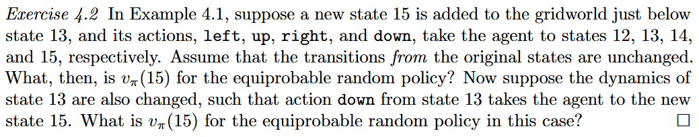
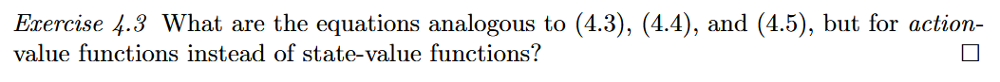
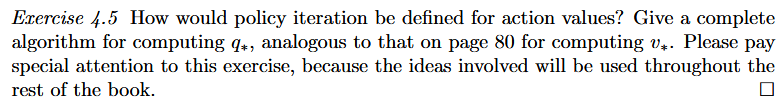
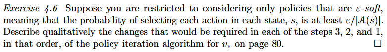
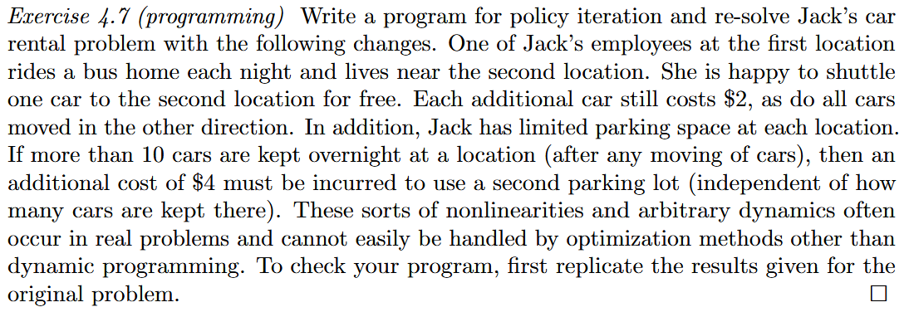
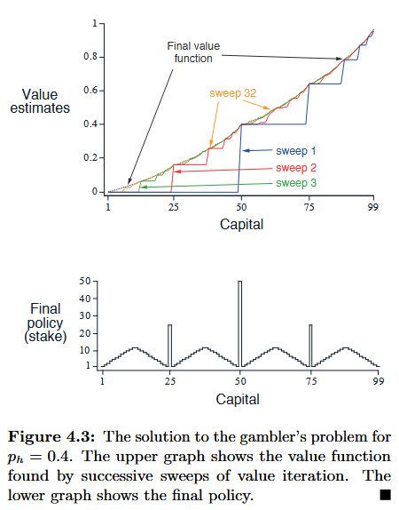
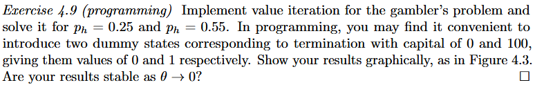

# Chapter 4 Dynamic Programming

1. **什么是强化学习里的动态规划？为什么它明明要求“上帝视角”我们还要学它？**
2. **给定一个策略，如何计算出每个状态的真实价值（策略评估 / 预测问题）？**
3. **如何把数学上的“方程”变成计算机可以执行的“迭代算法”（期望更新）？**

* **前提假设（上帝视角）**：DP 假设我们拥有环境的**完美模型**。也就是说，系统在状态 $s$ 下采取动作 $a$ 后，会以多大概率转移到新状态 $s'$、拿到多少奖励 $r$——即转移概率 $p(s', r \mid s, a)$ 是**完全已知**的。
* **局限性**：现实世界里我们很少能有这么完美的数学模型，而且当状态空间很大时计算极其昂贵。
* **DP 是整个强化学习的理论基石**！后续章节学的各种算法（如蒙特卡洛 MC、时序差分 TD、Q-learning 等），本质上都是**在没有完美模型、算力有限的情况下，去逼近 DP 的效果**。

DP 的核心操作：把“等式”变成“赋值更新”在第 3 章中，我们推导出了**贝尔曼最优方程**：
$$
v_*(s) = \max_a \sum_{s', r} p(s', r \mid s, a) [r + \gamma v_*(s')]\\
q_*(s, a) = \sum_{s', r} p(s', r \mid s, a) [r + \gamma \max_{a'} q_*(s', a')]
$$
这些方程表达的是最优状态必须满足的**自洽等式（平衡条件/不动点）**。

* **DP 的妙处在于**：既然等式两边在最优时相等，那我们就可以把等号右边当成计算公式，把等号变成**赋值符号（$\leftarrow$）**，不断用右边的计算结果来更新左边，一步步逼近真正的最优值。

## 4.1 Policy Evaluation (Prediction)

这一小节解决的是**预测问题（Prediction / Policy Evaluation）**：假设智能体**固定遵循某种策略 $\pi$**，我们怎么算出每个状态的价值 $v_\pi(s)$？

 DP 的更新被称为 **期望更新**：在计算 $v_{k+1}(s)$ 时，算法并不是让智能体去环境里“试走一步”，而是利用转移概率模型 $p(s', r \mid s, a)$，**把未来所有可能的分支全部算了一遍加权平均**（即数学期望）。

1. **与后续章节方法（无模型算法）的本质对比**：
   * **DP 的期望更新（全树展开）**：需要知道环境模型，穷举计算所有可能到达的下一状态的平均值；
   * **MC / TD 的采样更新（单线抽样）**：不需要知道环境模型，智能体亲自去随机走到哪一个下一状态 $S_{t+1}$，就拿那一个实际发生的样本来进行更新。

状态价值函数的展开：
$$
v_\pi(s) = \sum_a \pi(a|s) \sum_{s', r} p(s', r \mid s, a) [r + \gamma v_\pi(s')]
$$
如果有 $|\mathcal{S}|$ 个状态， 本质上就是包含 $|\mathcal{S}|$ 个未知数的**多元一次线性方程组**，但复杂度极高。于是提出了迭代法：

1. **初始化**：初始化状态价值 $v_0(s)$（例如全初始化为 0，终止状态必须为 0）；
2. **逐步迭代更新**：
   $$
   v_{k+1}(s) \leftarrow \sum_a \pi(a|s) \sum_{s', r} p(s', r \mid s, a) [r + \gamma v_k(s')]
   $$
   
   * **左边 $v_{k+1}(s)$**：当前状态的**新估计值**；
   * **右边 $v_k(s')$**：后续状态的**旧估计值**。
3. **收敛性保证**：根据数学上的压缩映射定理（Banach Fixed-point Theorem），只要折扣因子 $\gamma < 1$（或任务最终必然终止），当迭代次数 $k \to \infty$ 时，这组序列 $v_k$ 一定会严格收敛到唯一的真实解 $v_\pi$。这就是**不动点迭代**的思想。

### Exercise 4.2



* 题干说明：**原状态的转移保持不变（transitions from original states are unchanged）**。
* 这意味着：没有其他状态能走到状态 15，状态 15 是一个“只能出、不能进”的单向状态。
* 因此，**原有所有状态的价值 $v_\pi(1) \sim v_\pi(14)$ 完全不受影响**。

从状态 15 出发，4 个动作分别转移到：
* $\text{left} \to 12$
* $\text{up} \to 13$
* $\text{right} \to 14$
* $\text{down} \to 15$（留在原地）

建立状态 15 的价值方程：
$$
v_\pi(15) = \sum_a \pi(a \mid 15) \big[ r + \gamma v_\pi(s') \big] \\
= -1 + \frac{1}{4} \big[ v_\pi(12) + v_\pi(13) + v_\pi(14) + v_\pi(15) \big] \\
 = \mathbf{-20}
$$

---

状态 13 向下的动作改为进入状态 15，求 $v_\pi(15)$，条件变化

* 原来在状态 13 时向下走（$\text{down}$）是撞墙，停留在状态 13。
* 现在向下走改为：**直接进入新状态 15**。
* 此时状态 13 和状态 15 之间形成了**双向连通**（13 可以走到 15，15 也可以走到 13）。

对于状态 13，4 个动作（上、左、右、下）分别走向 9、12、14、15：
$$
v_\pi(13) = -1 + \frac{1}{4} \big[ v_\pi(9) + v_\pi(12) + v_\pi(14) + v_\pi(15) \big] \quad \text{--- (式 1)}
$$
对于状态 15，4 个动作（上、左、右、下）分别走向 13、12、14、15：
$$
v_\pi(15) = -1 + \frac{1}{4} \big[ v_\pi(13) + v_\pi(12) + v_\pi(14) + v_\pi(15) \big] \quad \text{--- (式 2)}
$$
将 (式 1) 与 (式 2) 相减：
$$
v_\pi(13) - v_\pi(15) = \frac{1}{4} \big[ v_\pi(9) - v_\pi(13) \big]
$$
观察网格对称性与已知条件：在原网格中，状态 9 和状态 13 的价值本身就完全相同（都为 $-20$）：
$$
v_\pi(9) = v_\pi(13) = -20 \implies v_\pi(9) - v_\pi(13) = 0 \\
\therefore v_\pi(13) - v_\pi(15) = 0 \implies v_\pi(13) = v_\pi(15)
$$
既然 $v_\pi(13) = v_\pi(15)$，我们把 (式 1) 里的 $v_\pi(15)$ 换回 $v_\pi(13)$：
$$
v_\pi(13) = -1 + \frac{1}{4} \big[ v_\pi(9) + v_\pi(12) + v_\pi(14) + v_\pi(13) \big]
$$
这**与原系统里的状态 13 贝尔曼方程一模一样**！根据压缩映射与贝尔曼方程的**唯一解定理：

* 状态 1 到 14 的真实价值依然可以完美自洽地保持不变；
* 状态 15 的价值恒等于状态 13 的价值：
  $$
  v_\pi(15) = v_\pi(13) = \mathbf{-20}
  $$

> [!IMPORTANT]
>
> 如果你直接假设“原网络其他 14 个状态的价值都不变”，那在逻辑上确实涉嫌**“循环论证”**。前面的解释之所以能这么做，是因为它本质上是一种**“先猜后证的验证法”**。
>
> ---
>
> 假设这是一道完全独立的题目，我们不知道 $v(15)$ 是多少，也不知道原网络变不变。在整个 15 个状态的网络中，只有状态 13 和状态 15 的转移规则涉及彼此：
>
> * 状态 13 往四周走（上、左、右、下）对应 9、12、14、15：
>   $$
>   v(13) = -1 + \frac{1}{4} \big[ v(9) + v(12) + v(14) + v(15) \big] \quad \text{--- (1)}
>   $$
> * 状态 15 往四周走（上、左、右、下）对应 13、12、14、15：
>   $$
>   v(15) = -1 + \frac{1}{4} \big[ v(13) + v(12) + v(14) + v(15) \big] \quad \text{--- (2)}
>   $$
>
> 直接将式 (1) 减去式 (2)：
> $$
> v(13) - v(15) = \frac{1}{4} \big[ v(9) - v(13) \big]\\
>  \implies v(15) = \frac{5}{4} v(13) - \frac{1}{4} v(9)
> $$
> 状态 15 的价值，被牢牢锁死在状态 13 和状态 9 的线性关系之中。
>
> 到了这一步，整个系统由 15 个未知数、15 个线性方程构成：
> $$
> \mathbf{V} = \mathbf{R} + P_\pi \mathbf{V} \implies (I - P_\pi)\mathbf{V} = \mathbf{R}
> $$
> 求解这个系统的**标准正统数学方法**只有两种：
>
> 1. **解线性方程组（矩阵求逆/高斯消元）**：直接求解 $(I - P_\pi)^{-1} \mathbf{R}$，解出来必然是 $v(15) = -20, v(13) = -20$；
> 2. **利用对称性构造试探解并证明唯一性**：数学定理规定：**有限状态 MDP 的贝尔曼期望方程有且仅有唯一解**。如果我们尝试构造一个解：令 $\tilde{v}(15) = \tilde{v}(13) = v_{\text{orig}}(13) = -20$，代入全部 15 个方程，发现它使得所有方程两端完全自洽。根据**“唯一解定理”**，只要你找到了一组解满足方程组，它**百分之百就是那个唯一的真解**，不需要再担心“会不会存在另外一组解使得其它状态变了”。
>
> **“零扰动吸收”（Zero Perturbation）**：当一个状态转移的目标状态，其期望价值恰好等于原先的期望价值时（即 $v(15) = v(13)$），这个局部的拓扑改变**对整个全局系统的价值流动产生 0 扰动**！
>
> * **如果脱离第一问，直接假设其他状态不变去算第二问，是不严谨的**；
> * 但第二问答案仍然是 $-20$ 这件事，无论你是用**第一性的矩阵消元**、还是用**代码从零迭代**，都能得到 100% 相同的结果；

### Exercise 4.3



* **状态价值 $v_\pi(s)$**：起点是状态 $s$。
  * 第一步：智能体根据策略 $\pi(a|s)$ **挑选动作 $a$**；
  * 第二步：环境根据 $p(s', r \mid s, a)$ **给出即时奖励 $r$ 并转移到新状态 $s'$**。
* **动作价值 $q_\pi(s, a)$**：起点已经是 $(s, a)$（动作已经选定了）。
  * 第一步：环境根据 $p(s', r \mid s, a)$ **给出即时奖励 $r$ 并转移到新状态 $s'$**；
  * 第二步：在下一状态 $s'$，智能体再按策略 $\pi(a' \mid s')$ **挑选下一个动作 $a'$**，落入 $(s', a')$。

---

**原公式 (4.3) 是 $v_\pi(s)$ 的期望形式**：
$$
v_\pi(s) = \mathbb{E}_\pi [R_{t+1} + \gamma v_\pi(S_{t+1}) \mid S_t=s]
$$
**对应到 $q_\pi(s, a)$**：
条件中加上当前动作 $A_t = a$，未来回报替换为下一时刻的动作价值 $q_\pi(S_{t+1}, A_{t+1})$：
$$
\mathbf{q_\pi(s, a) = \mathbb{E}_\pi \big[ R_{t+1} + \gamma q_\pi(S_{t+1}, A_{t+1}) \;\big|\; S_t = s, A_t = a \big]}
$$

---

**原公式 (4.4) 是 $v_\pi(s)$ 的求和展开形式**：
$$
v_\pi(s) = \sum_a \pi(a|s) \sum_{s', r} p(s', r \mid s, a) [r + \gamma v_\pi(s')]
$$
**对应到 $q_\pi(s, a)$**：
因为当前动作 $a$ 已经确定，所以外层不需要对 $a$ 求和；我们需要先对环境转移 $(s', r)$ 求期望，再对下一步的所有可能动作 $a'$ 按策略加权：
$$
\mathbf{q_\pi(s, a) = \sum_{s', r} p(s', r \mid s, a) \left[ r + \gamma \sum_{a'} \pi(a' \mid s') q_\pi(s', a') \right]}
$$

> **注**：中括号内的 $\sum_{a'} \pi(a' \mid s') q_\pi(s', a')$，本质上正是下一状态的价值 $v_\pi(s')$。

---

**原公式 (4.5) 是 $v$ 的迭代更新规则**：
$$
v_{k+1}(s) \doteq \sum_a \pi(a|s) \sum_{s', r} p(s', r \mid s, a) [r + \gamma v_k(s')]
$$
**对应到 $q$ 的迭代更新规则**：
用第 $k$ 轮的动作价值估值 $q_k$ 来计算第 $k+1$ 轮的动作价值 $q_{k+1}$：
$$
\mathbf{q_{k+1}(s, a) \doteq \sum_{s', r} p(s', r \mid s, a) \left[ r + \gamma \sum_{a'} \pi(a' \mid s') q_k(s', a') \right]} \\
\mathbf{q_{k+1}(s, a) \doteq \mathbb{E}_\pi \big[ R_{t+1} + \gamma q_k(S_{t+1}, A_{t+1}) \;\big|\; S_t = s, A_t = a \big]}
$$

---

| 形式                 | 状态价值函数 $v_\pi$                                         | 动作价值函数 $q_\pi$                                         |
| :------------------- | :----------------------------------------------------------- | :----------------------------------------------------------- |
| **期望式 (4.3)**     | $v_\pi(s) = \mathbb{E}_\pi [R_{t+1} + \gamma v_\pi(S_{t+1}) \mid S_t=s]$ | $q_\pi(s, a) = \mathbb{E}_\pi [R_{t+1} + \gamma q_\pi(S_{t+1}, A_{t+1}) \mid S_t=s, A_t=a]$ |
| **求和式 (4.4)**     | $\sum_a \pi(a\|s) \sum_{s', r} p(s', r \| s, a) [r + \gamma v_\pi(s')]$ | $\sum_{s', r} p(s', r \| s, a) \left[ r + \gamma \sum_{a'} \pi(a' \| s') q_\pi(s', a') \right]$ |
| **迭代更新式 (4.5)** | $v_{k+1}(s) \leftarrow \sum_a \pi(a\|s) \sum_{s', r} p [r + \gamma v_k(s')]$ | $q_{k+1}(s, a) \leftarrow \sum_{s', r} p \left[ r + \gamma \sum_{a'} \pi(a' \| s') q_k(s', a') \right]$ |

## 4.2 Policy Improvement

在 4.1 节中，我们耗费大量算力去计算一个固定策略 $\pi$ 的状态价值函数 $v_\pi(s)$。**计算价值函数从来不是目的，寻找最优策略才是终极目标。**那么，当我们手里拿到了当前策略的 $v_\pi(s)$ 之后，**如何修改策略才能让分数更高？**

* 假设当前有一个确定性策略 $\pi$（即遇到状态 $s$ 总是选择动作 $\pi(s)$），我们已经算出了它的真实价值 $v_\pi$。
* 现在面临一个选择：在某个特定状态 $s$ 下，我们如果**不按规矩出牌**，改选另一个动作 $a \ne \pi(s)$，这到底是变好了还是变差了？

当我们**只在当前状态 $s$ 选用新动作 $a$ 一次，之后的所有未来时间步，依然严格按照原策略 $\pi$ 行事。**这种行为方式带来的期望总回报，正是我们在第 3 章学过的**动作价值函数 $q_\pi(s, a)$**：
$$
q_\pi(s, a) \doteq \mathbb{E}\big[ R_{t+1} + \gamma v_\pi(S_{t+1}) \;\big|\; S_t=s, A_t=a \big] = \sum_{s', r} p(s', r \mid s, a) \big[ r + \gamma v_\pi(s') \big]
$$

* **若 $q_\pi(s, a) > v_\pi(s)$**：说明哪怕你仅仅“任性这一步”，后续全按老套路走，总收益都比“从头到尾按老套路走”要高！
* **直觉推论**：那么**以后每次只要来到状态 $s$，我都果断选择动作 $a$**，长期以往，总收益一定会更高！

#### 策略提升定理

设 $\pi$ 和 $\pi'$ 为任意两个确定性策略。如果对于**所有的**状态 $s \in \mathcal{S}$，新策略在单步下的动作价值都不低于老策略的状态价值：
$$
q_\pi(s, \pi'(s)) \ge v_\pi(s) 
$$
那么，新策略在全局上必定**处处不劣于**老策略，即对于所有状态 $s \in \mathcal{S}$：
$$
v_{\pi'}(s) \ge v_\pi(s)
$$
采用的是**递归套叠展开法**：

$$
\begin{aligned}
v_\pi(s) &\le q_\pi(s, \pi'(s))  \\
&= \mathbb{E}\big[ R_{t+1} + \gamma v_\pi(S_{t+1}) \;\big|\; S_t=s, A_t=\pi'(s) \big] & \text{（展开动作价值 q 的定义）} \\
&= \mathbb{E}_{\pi'}\big[ R_{t+1} + \gamma \mathbf{v_\pi(S_{t+1})} \;\big|\; S_t=s \big] & \text{（因为动作由新策略 } \pi' \text{ 给出）} \\
&\le \mathbb{E}_{\pi'}\big[ R_{t+1} + \gamma \mathbf{q_\pi(S_{t+1}, \pi'(S_{t+1}))} \;\big|\; S_t=s \big]  \\
&= \mathbb{E}_{\pi'}\big[ R_{t+1} + \gamma \mathbb{E}_{\pi'}[R_{t+2} + \gamma v_\pi(S_{t+2}) \mid S_{t+1},A_{t+1}=\pi'(S_{t+1})] \;\big|\; S_t=s \big] & \text{（再次展开内部的 q）} \\
&= \mathbb{E}_{\pi'}\big[ R_{t+1} + \gamma R_{t+2} + \gamma^2 \mathbf{v_\pi(S_{t+2})} \;\big|\; S_t=s \big] & \text{（利用全期望法则合并）} \\
&\le \mathbb{E}_{\pi'}\big[ R_{t+1} + \gamma R_{t+2} + \gamma^3 \mathbf{v_\pi(S_{t+3})} \;\big|\; S_t=s \big] \\
&\;\; \vdots & \text{（展开到无穷远）} \\
&\le \mathbb{E}_{\pi'}\big[ R_{t+1} + \gamma R_{t+2} + \gamma^2 R_{t+3} + \dots \;\big|\; S_t=s \big] \\
&= v_{\pi'}(s) & \text{（新策略从头执行到尾的真实期望回报）}
\end{aligned}
$$

我们把每一层里的“老价值 $v_\pi$”，都用“换成新动作带来的更优动作价值 $q_\pi$”去替换。每替换一步，不等号就成立一次；把整条时间轴上的所有步骤全部替换掉后，老策略的影子彻底消失，变成了**完全由新策略 $\pi'$ 驱动的未来回报之和**，自然就证明了 $v_\pi(s) \le v_{\pi'}(s)$！

> [!IMPORTANT]
>
> #### 全期望法则
>
> * **外层期望**：站在时刻 $t$ 看，已知当前在状态 $S_t=s$，动作按策略 $\pi'$ 选；
> * **内层期望**：站在时刻 $t+1$ 看，已知到了状态 $S_{t+1}$，且时刻 $t+1$ 的动作也是按 $\pi'$ 选的（$A_{t+1} = \pi'(S_{t+1})$）。
>
> 因为整个过程**未来所有的动作都是由策略 $\pi'$ 选取的**，根据概率论中的**条件全期望法则（塔式法则）：$\mathbb{E}[\mathbb{E}[X \mid Y] \mid Z] = \mathbb{E}[X \mid Z]$**：
>
> > “在时刻 $t$，对（在时刻 $t+1$ 发生的期望）再求期望，就等于直接站在时刻 $t$ 对未来求总期望！”
>

---

#### 贪婪策略提升

上述定理不仅适用于“只改一个状态”，**而是对所有状态同时进行贪心优化**，在每一个状态 $s$，哪个动作的单步前瞻回报 $q_\pi(s, a)$ 最高，新策略就选哪个：

$$
\begin{aligned}
\pi'(s) &\doteq \arg\max_a q_\pi(s, a) \\
&= \arg\max_a \mathbb{E}\big[ R_{t+1} + \gamma v_\pi(S_{t+1}) \;\big|\; S_t=s, A_t=a \big] \\
&= \arg\max_a \sum_{s', r} p(s', r \mid s, a) \big[ r + \gamma v_\pi(s') \big] 
\end{aligned}
$$

“贪婪（Greedy）”往往意味着短视（只看眼前）。**但强化学习里的贪婪完全不同！**
* 观察公式，贪婪最大化的是：
  $$
  \underbrace{r}_{\text{即时奖励}} + \gamma \underbrace{v_\pi(s')}_{\text{长远价值}}
  $$
* 因为 $v_\pi(s')$ 已经打包包含了下一状态往后**所有的未来期望回报**，所以看似只贪心往前看了一步，实际上**把未来的全盘利益都综合算进去了**！
* 由贪心构造可知，必然满足 $q_\pi(s, \pi'(s)) = \max_a q_\pi(s, a) \ge q_\pi(s, \pi(s)) = v_\pi(s)$，从而必然触发策略提升定理：**新贪婪策略必定单调不劣于原策略！**

假设经过贪婪提升后，新策略 $\pi'$ **并没有比老策略好，而是表现得一模一样**，即：
$$
v_{\pi'} = v_\pi
$$
此时，把 $v_{\pi'}$ 代入贪婪公式 ，对于所有状态 $s$，都有：
$$
v_{\pi'}(s) = \max_a \sum_{s', r} p(s', r \mid s, a) \big[ r + \gamma v_{\pi'}(s') \big]
$$
**也即贝尔曼最优方程**:

1. 如果新策略变好了，策略成功得到了提升；
2. 如果新策略没有变好，那么**此时的策略必然已经达到了全局最优策略 $\pi_*$，其价值也达到了最优价值 $v_*$！**

> [!IMPORTANT]
>
> 你之所以觉得“左边是 $s$，右边是 $s'$，所以它不是 $x = f(x)$”，是因为你把目光聚焦在**单独某一个格子上了。在数学和强化学习里，**这个 $x$ 根本不是某一个格子的数值，而是“整张地图所有格子的数值打包组成的一个大向量”！**
>
> 假设地图上只有两个格子：**状态 1** 和 **状态 2**。
> * 在状态 1，只能跳到状态 2；
> * 在状态 2，只能跳到状态 1。
>
> 我们把它们的贝尔曼方程写出来：
> $$
> \begin{cases}
> v(1) = -1 + \gamma \, v(2) & \text{（左边是状态 1，右边是它的下一个状态 2）} \\
> v(2) = -1 + \gamma \, v(1) & \text{（左边是状态 2，右边是它的下一个状态 1）}
> \end{cases}
> $$
>
> 令向量 $\mathbf{V} = \begin{bmatrix} v(1) \\ v(2) \end{bmatrix}$。把这两个方程合写成矩阵形式：
> $$
> \begin{bmatrix} v(1) \\ v(2) \end{bmatrix} = \begin{bmatrix} -1 \\ -1 \end{bmatrix} + \gamma \begin{bmatrix} 0 & 1 \\ 1 & 0 \end{bmatrix} \begin{bmatrix} v(1) \\ v(2) \end{bmatrix} 
> $$
>
> $$
> \implies \underbrace{\begin{bmatrix} v(1) \\ v(2) \end{bmatrix}}_{\mathbf{V}} = f\Bigg(\underbrace{\begin{bmatrix} v(1) \\ v(2) \end{bmatrix}}_{\mathbf{V}}\Bigg)
> $$
>
> ---
>
> ### 贝尔曼最优算子
>
> 1. 假设你的迷宫有 15 个格子。
>    那么未知数 $x$ 不是一个数字，而是一个 **15 维的向量**：
>    $$
>    \mathbf{v} = \begin{bmatrix} v(1) \\ v(2) \\ \vdots \\ v(15) \end{bmatrix}
>    $$
>    
> 2. 贝尔曼方程右边那一长串：
>    $$
>    \max_a \sum_{s', r} p(s', r \mid s, a) [r + \gamma v(s')]
>    $$
>    被数学家定义为一个**算子（Operator）**，记作 $\mathcal{T}^*$（叫做**贝尔曼最优算子**）。
>    
>    * 这个算子是干嘛的？
>    * 它吃进去一个 15 维的向量 $\mathbf{v}$；
>    * 对每个格子算一遍右边的式子；
>    * 吐出来一个新的 15 维向量 $\mathcal{T}^*(\mathbf{v})$。
>    
> 3. 所以，全地图 15 个格子的方程同时成立，在代数上写出来就是：
>    $$
>    \mathbf{v} = \mathcal{T}^*(\mathbf{v})
>    $$
>
> 也即**不动点方程(Fixed-point Equation), $x = f(x)$**

## 4.3 Policy Iteration

| 算法名称                     | 4.1 迭代策略评估<br>(Policy Evaluation)                      | 4.3 策略迭代<br>(Policy Iteration, PI)                       | 4.4 价值迭代<br>(Value Iteration, VI)                       |
| :--------------------------- | :----------------------------------------------------------- | :----------------------------------------------------------- | :---------------------------------------------------------- |
| **终极目标**                 | **只打分（预测）**<br>测算给定策略 $v_\pi$                   | **求最优（控制）**<br>寻找 $\pi_*$ 和 $v_*$                  | **求最优（控制）**<br>寻找 $\pi_*$ 和 $v_*$                 |
| **核心更新公式**             | $v(s) \leftarrow \mathbf{\sum_a \pi(a\|s)} \sum p [r + \gamma v(s')]$ | 内层用 4.1 算到底，<br>外层用 $\pi'(s) \leftarrow \arg\max_a q(s, a)$ | $v(s) \leftarrow \mathbf{\max_a} \sum p [r + \gamma v(s')]$ |
| **内部结构**                 | 单重循环（只刷一个策略的分数）                               | **双重嵌套大循环**：<br>内层刷满分，外层改策略               | **单重扁平大循环**：<br>边刷分边取最大值                    |
| **中间存不存在策略 $\pi$？** | 存在（是固定的输入常数）                                     | **必须全程维护**显式策略数组 $\pi$                           | **全程不需要维护**策略，只在最后提取一次                    |
| **单次大迭代的开销**         | 小                                                           | **极大**（每次都要把内层算到死）                             | **极小**（每次只对所有状态扫一遍）                          |
| **收敛终止条件**             | 数值稳定：$\Delta < \theta$                                  | **策略稳定**：`old_action == new_action`                     | 数值稳定：$\Delta < \theta$                                 |

* **4.1 策略评估（Policy Evaluation）**：给定策略 $\pi$，忠实地计算出其状态价值 $v_\pi$（**打分**）；
* **4.2 策略提升（Policy Improvement）**：根据价值 $v_\pi$，通过单步贪心构造出更好的新策略 $\pi'$（**升级**）。

**4.3 策略迭代就是将这两者组合成一个**完整的“控制算法”**，其终极目标是：**从一个任意的初始策略出发，自动、自主地寻找全局最优策略 $\pi_*$ 和最优价值 $v_*$**

算法的演化链条呈现出交替推进的形式：
$$
\pi_0 \xrightarrow{\text{E}} v_{\pi_0} \xrightarrow{\text{I}} \pi_1 \xrightarrow{\text{E}} v_{\pi_1} \xrightarrow{\text{I}} \pi_2 \xrightarrow{\text{E}} \dots \xrightarrow{\text{I}} \pi_* \xrightarrow{\text{E}} v_*
$$

* $\xrightarrow{\text{E}}$ 表示 **策略评估（Policy Evaluation）**：将当前策略的价值彻底算到收敛；
* $\xrightarrow{\text{I}}$ 表示 **策略提升（Policy Improvement）**：用贪婪算子产生一个严格更优的新策略。

根据 4.2 节的策略提升定理：
$$
v_{\pi_{k+1}}(s) \ge v_{\pi_k}(s), \quad \forall s \in \mathcal{S}
$$

* 每一代新策略的表现，在**每一个状态**上都**单调不劣于**老策略。
* **严格提升**：只要当前策略还不是全局最优策略，新策略就必定在至少一个状态上产生**严格大于（$>$）**的提升，绝对不会原地踏步。

### 策略迭代伪代码

> **1. 初始化（Initialization）：**
>
> * 对所有状态 $s \in \mathcal{S}$，任意初始化价值函数与策略：
>   $$
>   V(s) \in \mathbb{R} \quad (\text{通常初始化为 } 0，\text{终止状态必须为 } V(\text{terminal}) = 0)\\
>   \pi(s) \in \mathcal{A}(s) \quad (\text{任意指定一个确定性动作})
>   $$
>
> ---
>
> **2. 策略评估（Policy Evaluation —— 内层循环）：**
> * **Loop（循环多轮 Sweep）:**
>   * 误差追踪器归零：$\Delta \leftarrow 0$
>   * **Loop for each $s \in \mathcal{S}$（遍历每一个非终止状态）:**
>     * 记录旧值：$v \leftarrow V(s)$
>     * 贝尔曼更新（按当前策略 $\pi(s)$ 走）：
>       $$
>       V(s) \leftarrow \sum_{s', r} p(s', r \mid s, \pi(s)) \big[ r + \gamma V(s') \big]
>       $$
>     * 跟踪全图最大变动量：
>       $$
>       \Delta \leftarrow \max\big(\Delta, \, |v - V(s)|\big)
>       $$
>   * **until $\Delta < \theta$** 
>
> ---
>
> **3. 策略提升（Policy Improvement —— 外层升级）：**
> * 假定策略已稳定：$policy\text{-}stable \leftarrow \text{true}$
> * **For each $s \in \mathcal{S}$（对每一个状态做贪心决策）:**
>   * 记录旧动作：$old\text{-}action \leftarrow \pi(s)$
>   * 贪婪挑选当前期望最大的动作：
>     $$
>     \pi(s) \leftarrow \arg\max_a \sum_{s', r} p(s', r \mid s, a) \big[ r + \gamma V(s') \big]
>     $$
>   * 检查动作是否改变：
>     $$\text{若 } old\text{-}action \neq \pi(s)，\text{则标记 } policy\text{-}stable \leftarrow \text{false}$$
> * **停机判定：**
>   
>   * **若 $policy\text{-}stable == \text{true}$**：说明全图动作均不再改变，**终止算法**，输出当前的 $V \approx v_*$ 和 $\pi \approx \pi_*$；
>   * **否则**：带着新策略 $\pi$ 与现存价值 $V$，**返回步骤 2（开启新一轮评估）**。

### Exercise 4.5



在 4.3 节原本的算法中，我们维护的是**状态价值函数 $V(s)$**。现在要求我们全部换成**动作价值函数 $Q(s, a)$**。

* **如果使用 $V(s)$ 做策略提升：**
  $$
  \pi(s) \leftarrow \arg\max_a \mathbf{\sum_{s', r} p(s', r \mid s, a)} \big[ r + \gamma V(s') \big]
  $$
  **致命缺陷**：要挑出最好的动作，你必须知道环境转移概率 $p(s', r \mid s, a)$！也就是说，**离开环境模型，$V(s)$ 根本无法直接指导行动！**
  
* **如果使用 $Q(s, a)$ 做策略提升：**
  $$
  \pi(s) \leftarrow \mathbf{\arg\max_a Q(s, a)}
  $$
  **神级优势**：**它完全不需要环境转移概率 $p$！**
  智能体不需要做任何单步前瞻预测，只需要低头查一眼表格：“在状态 $s$ 下，哪一个动作存的 $Q$ 值最大，我就选哪一个！”

> **1. 初始化（Initialization）：**
>
> * 对所有 $s \in \mathcal{S}, a \in \mathcal{A}(s)$，任意初始化动作价值：
>   $$
>   Q(s, a) \in \mathbb{R} \quad (\text{终止状态固定为 } Q(\text{terminal}, \cdot) = 0)
>   $$
> * 对所有 $s \in \mathcal{S}$，任意初始化确定性策略：
>   $$
>   \pi(s) \in \mathcal{A}(s)
>   $$
>
> ---
>
> **2. 策略评估（Policy Evaluation —— 针对动作价值 $Q$）：**
> * **Loop（循环进行多轮 Sweep）:**
>   * 误差追踪器归零：$\Delta \leftarrow 0$
>   * **Loop for each $s \in \mathcal{S}, a \in \mathcal{A}(s)$（遍历所有状态-动作对）:**
>     * 暂存旧值：$q \leftarrow Q(s, a)$
>     * 贝尔曼期望更新（下一时刻的动作为 $\pi(s')$）：
>       $$
>       Q(s, a) \leftarrow \sum_{s', r} p(s', r \mid s, a) \big[ r + \gamma Q\big(s', \pi(s')\big) \big]
>       $$
>     * 跟踪全表最大变化量：
>       $$
>       \Delta \leftarrow \max\big(\Delta, \, |q - Q(s, a)|\big)
>       $$
>   * **until $\Delta < \theta$** （当全表最大改变量小于预设精度阈值 $\theta > 0$ 时，停止评估）
>
> ---
>
> **3. 策略提升（Policy Improvement —— 极简纯查表）：**
> * 假定策略已稳定：$policy\text{-}stable \leftarrow \text{true}$
> * **For each $s \in \mathcal{S}$（对每一个状态进行策略改进）:**
>   * 记录旧动作：$old\text{-}action \leftarrow \pi(s)$
>   * 
>     * 计算当前旧动作的价值：$q_{\text{old}} \leftarrow Q(s, old\text{-}action)$
>     * 计算所有动作能达到的最大价值：$q_{\max} \leftarrow \max_a Q(s, a)$
>     * **若 $q_{\text{old}} \ge q_{\max}$：**
>       * 保持原动作不变：$\pi(s) \leftarrow old\text{-}action$
>     * **否则：**
>       * 贪心选取最大动作：
>         $$\pi(s) \leftarrow \arg\max_a Q(s, a)$$
>       * 标记策略变动：$policy\text{-}stable \leftarrow \text{false}$
>
> * **停机判定：**
>   * **若 $policy\text{-}stable == \text{true}$**：说明全图策略稳定，**终止算法**，输出当前的 $Q \approx q_*$ 以及 $\pi \approx \pi_*$；
>   * **否则**：带着新策略 $\pi$ 和现存的 $Q$ 表，**返回步骤 2**。

在原始公式里，确实有两个求和号：
$$
V(s) \leftarrow \mathbf{\sum_a \pi(a \mid s)} \mathbf{\sum_{s', r}} p(s', r \mid s, a) \big[ r + \gamma V(s') \big]
$$

* **外层求和 $\sum_a$**：智能体在状态 $s$ 按照概率 $\pi(a|s)$ 掷骰子挑选动作 $a$；
* **内层求和 $\sum_{s', r}$**：选定动作后，环境根据概率 $p(s', r \mid s, a)$ 决定转移到哪个新状态 $s'$ 并给出奖励 $r$。

在 4.3 节的策略迭代中，我们处理的是**确定性策略**：
* 智能体在状态 $s$，**100% 只会执行唯一的那个动作 $\pi(s)$**；
* 其他所有动作的概率全是 $0$！
* 所以，外层的求和号 $\sum_a \pi(a \mid s)$ 瞬间**塌缩消失**了，只留下那唯一的一个动作 $\pi(s)$！

于是，原始公式蜕变成了你的**第一张图的样子**：
$$
V(s) \leftarrow \mathbf{\sum_{s', r}} p(s', r \mid s, \mathbf{\pi(s)}) \big[ r + \gamma V(s') \big]
$$

> **看清楚**：动作求和号 $\sum_a$ 没了，只剩下环境转移的 $\sum_{s', r}$！

---

在对动作价值 $Q$ 进行更新时，它最原始的样子长这样：
$$
Q(s, a) \leftarrow \mathbf{\sum_{s', r}} p(s', r \mid s, a) \left[ r + \gamma \mathbf{\sum_{a'} \pi(a' \mid s')} Q(s', a') \right]
$$
请仔细看这个原始式子里的两个求和号：

* **外层求和 $\sum_{s', r}$**：当前状态 $s$ 和当前动作 $a$ 是**一开始就指定好的**，做完动作后，环境以概率 $p(s', r \mid s, a)$ 把你送到下一状态 $s'$ 并给奖励 $r$；
* **内层求和 $\sum_{a'}$**：到达下一状态 $s'$ 后，智能体要掷骰子决定**下一步执行哪个动作 $a'$**（所以下一步需要对动作加权求和 $\sum_{a'} \pi(a' \mid s')$）。

同样是因为：**策略 $\pi$ 是确定性的！**
* 当智能体到达下一状态 $s'$ 后，它不需要掷骰子去挑下一步动作，它**100% 必定且只会执行动作 $\pi(s')$**！

* 也就是说，在内层的求和中：
  $$
  \mathbf{\sum_{a'} \pi(a' \mid s')} Q(s', a') = Q\big(s', \mathbf{\pi(s')}\big)
  $$

> [!IMPORTANT]
>
> 根据状态价值函数 $V$ 的基本定义：
> > **在某个状态 $s'$ 的价值 $V(s')$，本质上就是把该状态下所有可能动作的收益 $Q(s', a')$，按照策略挑选的概率进行加权平均！**
>
> 数学定义式就是：
> $$
> V(s') \equiv \sum_{a'} \pi(a' \mid s') Q(s', a')
> $$
> 所以，这一长串求和号，**就是 $V(s')$ **
>
> ---
>
> 因为 $\pi$ 变成确定性策略了，智能体在 $s'$ 不再掷骰子，**100% 只选动作 $\pi(s')$**。所以那个加权平均直接退化为那一项：
> $$
> \sum_{a'} \pi(a' \mid s') Q(s', a') = 1.0 \times Q(s', \pi(s')) + 0 + 0 \dots = Q\big(s', \pi(s')\big)
> $$
> 既然这一串就是 $V(s')$，那么就意味着：
> $$
> V(s') = Q\big(s', \pi(s')\big)
> $$
>
> > 但是并不是说整个 $Q$ 表都等于 $V$（比如那些**没被策略选中的垃圾动作**，它们的 $Q(s', a')$ 分数很低，并不等于 $V(s')$）；
> > 而是：**只有被当前策略唯一相中的那个动作，它的 $Q\big(s', \pi(s')\big)$ 才完完全全等于该状态的 $V(s')$！**
>

### Exercise 4.6



* **先看步骤 3（策略提升）**：我们必须先搞清楚在 $\varepsilon$-soft 限制下，新策略能被“提升”成什么样子（即 $\varepsilon$-greedy 策略）；
* **再看步骤 2（策略评估）**：由于新策略变成了带有概率分布的随机策略，评估公式必须做出相应调整；
* **最后看步骤 1（初始化）**：为了配合整个算法流程，初始策略的数据结构和赋值方式也随之确定。

---

**步骤 3：策略提升（Policy Improvement）的改变**

原算法追求绝对的确定性贪婪（$100\%$ 选最优动作，其余动作概率为 $0$）：
$$
\pi(s) \leftarrow \arg\max_a \sum_{s', r} p(s', r \mid s, a) \big[ r + \gamma V(s') \big]
$$
因为每个动作的选择概率**不能低于** $\frac{\varepsilon}{|\mathcal{A}(s)|}$，智能体不能再 $100\%$ 偏执地选一个动作，此时能做到的极限就是构造 **$\varepsilon$-贪婪策略**：

1. **找到贪心动作**：
   依然先找到使得单步前瞻期望最大的那个动作：
   $$
   a^* = \arg\max_a \sum_{s', r} p(s', r \mid s, a) \big[ r + \gamma V(s') \big]
   $$
2. **分配概率分布**：
   * 对最优动作 $a^*$，分配绝大部分概率：
     $$
     \pi(a^* \mid s) \leftarrow 1 - \varepsilon + \frac{\varepsilon}{|\mathcal{A}(s)|}
     $$
   * 对所有其他非最优动作 $a \neq a^*$，分配保底探索概率：
     $$
     \pi(a \mid s) \leftarrow \frac{\varepsilon}{|\mathcal{A}(s)|}
     $$
     *(若有多个动作并列最优，可将剩余概率 $1 - \varepsilon$ 在它们之间平分)*
3. **策略稳定判定的修改**：
   因为 $\varepsilon$ 是固定常数，只要每个状态下的**最优动作 $a^*$ 没有发生改变**，整个概率分布 $\pi(a \mid s)$ 就没有改变。因此，检查 $a^*$ 是否改变即可判定策略是否稳定。

---

**步骤 2：策略评估的改变**

原算法针对的是确定性动作 $\pi(s)$，所以没有动作求和号：
$$
V(s) \leftarrow \sum_{s', r} p(s', r \mid s, \mathbf{\pi(s)}) \big[ r + \gamma V(s') \big]
$$
现在的策略 $\pi$ 是一个**具有概率分布的随机策略**（每一个动作都有被执行的可能，不能忽略非最优动作带来的微小概率和收益）。

因此，评估更新公式必须还原为完整的贝尔曼期望方程：

$$
V(s) \leftarrow \sum_{a \in \mathcal{A}(s)} \mathbf{\pi(a \mid s)} \sum_{s', r} p(s', r \mid s, a) \big[ r + \gamma V(s') \big] \\
V(s) \leftarrow \left( 1 - \varepsilon + \frac{\varepsilon}{|\mathcal{A}(s)|} \right) q(s, a^*) + \sum_{a \neq a^*} \frac{\varepsilon}{|\mathcal{A}(s)|} q(s, a)
$$
其中 $q(s, a) = \sum_{s', r} p(s', r \mid s, a) [r + \gamma V(s')]$。

---

**步骤 1：初始化的改变**

* 状态价值：$V(s) \in \mathbb{R}$，任意初始化；
* 策略：$\pi(s) \in \mathcal{A}(s)$，是一个一维数组（每个状态存一个确定的动作标签）。

* **策略的存储结构变化**：
  $\pi$ 不能再用简单的单一动作数组表示，必须是一个**二维概率分布矩阵** $\pi(a \mid s)$（记录每个状态下每个动作的执行概率）。
* **初始概率赋值要求**：初始策略不能随意乱填，必须**严格满足 $\varepsilon$-soft 约束**（即所有状态的所有动作概率都 $\ge \frac{\varepsilon}{|\mathcal{A}(s)|}$）。
  
  * **最简单、最标准的方式**：直接初始化为**等概率随机策略**：
    $$
    \pi(a \mid s) \leftarrow \frac{1}{|\mathcal{A}(s)|}, \quad \forall s \in \mathcal{S}, a \in \mathcal{A}(s)
    $$
    （因为对任何 $\varepsilon \le 1$，都有 $\frac{1}{|\mathcal{A}(s)|} \ge \frac{\varepsilon}{|\mathcal{A}(s)|}$，天然合法）；
  * 状态价值函数 $V(s)$ 依然可以任意初始化为实数（终止状态 $V(\text{terminal}) = 0$）。

### Exercise 4.7



| 项目               | 原版（Example 4.2）                    | 修改版（Exercise 4.7） | 规则细节                                                     |
| :----------------- | :------------------------------------- | :--------------------- | :----------------------------------------------------------- |
| **夜间挪车成本**   | 每搬 1 辆车固定收 $\$2$                | **单向免费 1 辆车**    | - 若从**店1 $\to$ 店2**（$a > 0$），第 1 辆车由下班搭便车的员工免费开过去，其余每辆收 $\$2$（成本 $= 2 \times \max(a - 1, 0)$）<br>- 若从**店2 $\to$ 店1**（$a < 0$），无免费福利，每辆照常收 $\$2$（成本 $= 2 \times \|a\|$） |
| **车库停车成本**   | 车库停多少车都免费（上限20）           | **超过 10 辆收停车费** | 夜间挪车完成后，**分别检查**两家店留下的车数：<br>- 若店1车数 $> 10$，扣除额外成本 $\$4$<br>- 若店2车数 $> 10$，扣除额外成本 $\$4$<br>*(注：两家店独立计算，若都 $>10$，当晚总共扣 $\$8$)* |
| **租金收益与概率** | 租出 1 辆车赚 $\$10$；泊松分布参数不变 | **完全保持不变**       | 租车和还车都是白天独立发生，收益与转移概率计算完全不变       |

如果我们每次评估状态时都去实时计算复杂的泊松分布，代码会极慢。利用**两家店白天独立运作**的特点，我们可以将问题分为两步：

1. **离线预计算（只算一次）**：
   - 转移矩阵 $T_1, T_2 \in \mathbb{R}^{21 \times 21}$：$T_i[n', s'']$ 表示“早晨有 $n'$ 辆车，到晚上营业结束剩下 $s''$ 辆车”的概率。
   - 白天期望租金 $R_1^{\text{day}}, R_2^{\text{day}} \in \mathbb{R}^{21}$：$R_i^{\text{day}}[n']$ 表示“早晨有 $n'$ 辆车时，白天期望能赚到的租金”。
   
2. **在线策略迭代（纯矩阵/向量运算）**：
   - 遇到任意状态 $(n_1, n_2)$ 和动作 $a$，只需直接查表切片出概率向量 $t_1, t_2$，利用 `t1 @ V @ t2.T` 秒级完成期望计算！

```python
# ==============================================================================
# 第一部分：离线预计算
# ==============================================================================
初始化:
    T1 = 零矩阵(21, 21)   # 店1转移矩阵：行=早晨车数 n1_prime, 列=明晚车数 s1_prime
    T2 = 零矩阵(21, 21)   # 店2转移矩阵
    R1_day = 零向量(21)    # 店1白天平均租金收益
    R2_day = 零向量(21)    # 店2白天平均租金收益

对 每个地点 i in {1, 2}:
    # 此处的RL是以每天晚上为基准，因此此处的早晨严格来说是明天早晨
    对 早晨车数 n_prime 从 0 到 20:   
        对 租车需求 req 从 0 到 11 (泊松截断):
            实际租车数 = min(n_prime, req)
            Ri_day[n_prime] += P(req) * (实际租车数 * 10)
            
            对 还车数量 ret 从 0 到 11 (泊松截断):
                明晚关门车数 s_end = min(20, n_prime - 实际租车数 + ret)
                # 有很多情况使得其早晨和晚上的车不一样比如+1 -1  +2 -2，因此需要累加所有情况。
                Ti[n_prime, s_end] += P(req) * P(ret)


# ==============================================================================
# 第二部分：单步动作价值 Q(s, a) 计算函数（核心矩阵形式）
# ==============================================================================
函数 计算Q值(n1, n2, a, 价值矩阵 V, 折扣率 gamma=0.9):
    # 1. 搬车后早晨的车数，此处的n1实际上是前一天晚上即晚上，因此n1_prime是明天早晨
    n1_prime = n1 - a
    n2_prime = n2 + a
    
    # 2. 计算修改后的夜间即时成本 (Exercise 4.7 规则)
    # (a) 搬车费用（店1到店2有一辆免费，店2到店1无免费）
    如果 a > 0:
        move_cost = 2 * (a - 1)
    否则:
        move_cost = 2 * abs(a)
        
    # (b) 车库溢出停车费（分别检查两店是否 > 10 辆）
    parking_cost = 0
    如果 n1_prime > 10: parking_cost += 4
    如果 n2_prime > 10: parking_cost += 4
    
    # 3. 明天白天的总即时收益 (白天租金 - 夜间搬车费 - 停车费)
    即时期望收益 R = R1_day[n1_prime] + R2_day[n2_prime] - move_cost - parking_cost
    
    # 4. 矩阵形式计算明晚未来状态期望价值 E[V(S_{t+1})]
    t1 = T1[n1_prime, :]     # 形状 (1, 21)：店1在白天有n1_prime辆车，明晚各车数[0,20]概率行向量，这个在下方会对n1/2_prime进行递归。
    t2 = T2[n2_prime, :]     # 形状 (1, 21)：店2在白天有n2_prime辆车，明晚各车数概率行向量
    
    未来期望价值 = t1 @ V @ t2.T   # (1x21) @ (21x21) @ (21x1) = 标量数值
    
    # 5. 贝尔曼备份
    返回 R + gamma * 未来期望价值


# ==============================================================================
# 第三部分：策略迭代主循环 
# ==============================================================================
初始化:
    V = 零矩阵(21, 21)       # 初始价值函数
    pi = 零矩阵(21, 21)      # 初始策略（所有状态动作均为 0）

循环 直到 策略稳定 (policy_stable == True):
    
    # ---- 1. 策略评估 (Policy Evaluation) ----
    循环 直到 价值收敛:
        delta = 0
        对 n1 从 0 到 20:
            对 n2 从 0 到 20:
                old_v = V[n1, n2]
                a = pi[n1, n2]
                # 策略是固定的，因此此处V就是Q
                V[n1, n2] = 计算Q值(n1, n2, a, V)
                delta = max(delta, abs(old_v - V[n1, n2]))
        若 delta < 1e-4 则 终止循环
        
    # ---- 2. 策略提升 (Policy Improvement) ----
    policy_stable = True
    对 n1 从 0 到 20:
        对 n2 从 0 到 20:
            old_action = pi[n1, n2]
            
            # 找到当前状态下合法的动作范围 [-min(n2, 5), min(n1, 5)]  左闭右开
            合法动作列表 = [a for a in range(-5, 6) if -n2 <= a <= n1]
            
            # 贪婪选择能够让 Q(s, a) 最大的动作
            best_action = argmax_{a in 合法动作列表} (计算Q值(n1, n2, a, V))
            
            pi[n1, n2] = best_action
            
            若 best_action != old_action:
                policy_stable = False
```

---

对于 `未来期望价值 = t1 @ V @ t2.T`：

$$
\underbrace{t_1}_{(1 \times 21)} \;\times\; \underbrace{V}_{(21 \times 21)} \;\times\; \underbrace{t_2^T}_{(21 \times 1)}
$$

$V$ 是整个强化学习系统的**状态价值矩阵（State-Value Matrix）**，它的形状是 $(21, 21)$：

- **行（Rows，第 $0 \sim 20$ 行）**：对应 **1号店晚上关门时的车数**（$s_1$）
- **列（Columns，第 $0 \sim 20$ 列）**：对应 **2号店晚上关门时的车数**（$s_2$）

表格里的每一个元素 $V[s_1, s_2]$，记录的就是：

> **“如果在某天晚上关门时，1号店有 $s_1$ 辆车，2号店有 $s_2$ 辆车，未来长期总共期望能赚多少钱（状态价值）。”**

$$
V = 
\begin{array}{c|ccccc}
 & \textbf{2号店剩0辆} & \textbf{2号店剩1辆} & \textbf{2号店剩2辆} & \cdots & \textbf{2号店剩20辆} \\
\hline
\textbf{1号店剩0辆} & V[0, 0] & V[0, 1] & V[0, 2] & \cdots & V[0, 20] \\
\textbf{1号店剩1辆} & V[1, 0] & V[1, 1] & V[1, 2] & \cdots & V[1, 20] \\
\textbf{1号店剩2辆} & V[2, 0] & V[2, 1] & V[2, 2] & \cdots & V[2, 20] \\
\vdots & \vdots & \vdots & \vdots & \ddots & \vdots \\
\textbf{1号店剩20辆} & V[20, 0] & V[20, 1] & V[20, 2] & \cdots & V[20, 20] \\
\end{array}
$$

$$
\underbrace{t_1}_{(1 \times 21)} \;\times\; \underbrace{V}_{(21 \times 21)} \;\times\; \underbrace{t_2^T}_{(21 \times 1)}
$$

1. **$t_1$ 的 21 个元素，刚好对应 $V$ 的 21 行（1号店明晚的各种可能车数）**：

   - 算 `t1 @ V` 时，就是在拿 1号店明晚剩各辆车的概率，去**对 $V$ 的每一行做加权平均**。

   > [!IMPORTANT]
   >
   > ### 宏观整体视角：把 $V$ 的每一行加权相加
   >
   > 在线性代数中，**“一个行向量乘一个矩阵”**，在整体上等价于：**把这个矩阵的所有“行”按概率加权混合在一起**：
   >
   > $$
   > t_1 @ V = p_0 \times (\text{第 0 整行}) + p_1 \times (\text{第 1 整行}) + \dots + p_{20} \times (\text{第 20 整行})
   > $$
   >
   > 举个最简单的数字直观感受一下：
   > $$
   > [0.6, \; 0.4] \times \begin{bmatrix} 10 & 20 \\ 30 & 40 \end{bmatrix}
   > $$
   > 它其实等于：
   > $$
   > 0.6 \times [10, \; 20] + 0.4 \times [30, \; 40] = [6, \; 12] + [12, \; 16] = [18, \; 28]
   > $$

   - 算完之后，**1号店明晚的不确定性被消除了**，得到一个长度为 21 的行向量。

2. **结果再乘以 $t_2^T$（2号店明晚的各种可能车数）**：

   - 这个中间行向量的 21 个元素，刚好对应 $V$ 的 21 列（2号店明晚的车数）。
   - 拿它再去点乘 $t_2^T$，就是在拿 2号店明晚剩各辆车的概率，去**对每一列做加权平均**。
   - 最终只剩下一个标量数字——明晚两家店总体局面的**总期望价值**！

在数学上，这一行代码等价于下面这个双重求和：
$$
\sum_{s_1''=0}^{20} \sum_{s_2''=0}^{20} \underbrace{t_1[s_1'']}_{\text{1号店概率}} \times \underbrace{t_2[s_2'']}_{\text{2号店概率}} \times \underbrace{V[s_1'', s_2'']}_{\text{明晚对应的价值}}
$$

## 4.4 Value Iteration

在策略迭代中，包含两个交替进行的环节：
$$
\pi_0 \xrightarrow{\text{策略评估 } E} v_{\pi_0} \xrightarrow{\text{策略提升 } I} \pi_1 \xrightarrow{\text{策略评估 } E} v_{\pi_1} \dots \xrightarrow{} \pi_*
$$

- **策略评估太慢、太拖沓**：为了精确算出当前策略的真实身价 $v_\pi$，每次都必须开启一个内层 `while` 循环，反反复复扫描全部状态，直到最大变动 $\Delta < \theta$。从数学上讲，只有迭代无限次才能达到绝对精确。

如果把策略评估截断到极致——**只扫描一次（每个状态只算一遍），不等它收敛，立刻就结合贪婪动作进行更新**：
$$
\begin{aligned}
v_{k+1}(s) &\doteq \max_a \mathbb{E}\big[ R_{t+1} + \gamma v_k(S_{t+1}) \mid S_t=s, A_t=a \big] \\
&= \mathbf{\max_a} \sum_{s', r} p(s', r \mid s, a) \big[ r + \gamma v_k(s') \big]
\end{aligned}
$$

- **本质是“贝尔曼最优方程”的算法化**：
  贝尔曼最优方程原本是一个静态的等式 $v_*(s) = \max_a \sum p \dots$。值迭代直接把等号右边当成输入，把左边当成新一步的估计，变成了一个动态更新规则！
- **合二为一的操作**：它在每一步扫描中，**同时完成了“一步策略评估”和“一步策略提升”**。
  - 右侧的 $\sum_{s', r} p(s', r \mid s, a)[r + \gamma v_k(s')]$ 是在评估动作 $a$；
  - 外层的 $\mathbf{\max_a}$ 则是立刻采取贪婪动作（提升）。

```text
算法：值迭代（Value Iteration，估计 π ≈ π*）
────────────────────────────────────────────────────────────────────────
参数：精度阈值 θ > 0
初始化：任意初始化 V(s)，终止状态 V(terminal) = 0

【一：纯价值收敛循环（没有策略 π 出现】
Loop:
    Δ ← 0
    对每一个状态 s ∈ S:
        v ← V(s)
        V(s) ← max_a ∑_{s', r} p(s', r | s, a) [r + γ V(s')]  # 贪婪挑选最大值
        Δ ← max(Δ, |v - V(s)|)
until Δ < θ

【二：最优策略】
输出确定性策略 π ≈ π*：
    π(s) = argmax_a ∑_{s', r} p(s', r | s, a) [r + γ V(s')]
────────────────────────────────────────────────────────────────────────
```

在整个 `Loop` 循环中，**没有显式地去维护、保存一个策略表格 $\pi$**！内存里只有一张价值表 $V(s)$。直到 $V$ 算到满足精度 $\Delta < \theta$ 之后，在最后一步才执行 $\arg\max_a$ 提取出最终的最优策略 $\pi$。

---

| 对比维度         | 策略迭代 (Policy Iteration)                                  | 值迭代 (Value Iteration)                                     |
| :--------------- | :----------------------------------------------------------- | :----------------------------------------------------------- |
| **理论依据**     | **贝尔曼期望方程**<br>$v_\pi(s) = \sum_a \pi(a\|s) \sum p [r + \gamma v(s')]$ | **贝尔曼最优方程**<br>$v_*(s) = \max_a \sum p [r + \gamma v(s')]$ |
| **内存维护对象** | 同时显式维护 **策略表 $\pi$** 和 **价值表 $V$**              | 循环中只维护 **价值表 $V$**，最后提取 $\pi$                  |
| **循环结构**     | **双重嵌套大循环**：<br>外层：策略提升交替<br>内层：策略评估（需多次扫描直到收敛） | **单一扁平循环**：<br>每一轮扫描所有状态，单步直接取 $\max$ 更新 |
| **单次扫描开销** | **小<br/>**（确定性策略下只需计算 1 个动作的期望，无需遍历动作） | **大**<br/>（每个状态必须把**所有可选动作 $a$ 遍历一遍**算 $\max$） |
| **总收敛轮数**   | **少**（通常外层策略只需迭代几次就稳定）                     | **多**（数值需要像渐近线一样慢慢爬到最优）                   |
| **停止条件**     | 策略不再改变（`policy_stable == True`）                      | 价值变化极其微小（$\Delta < \theta$）                        |

### Example 4.3

1. **游戏设定**：
   - 一个赌徒手里有一些筹码（本金 $s$ 美元）。
   - 赌场玩**抛硬币**猜正反：
     - 如果是**正面（Heads）**：赌徒获胜，赢得与本次下注金额相等的钱（净赚 $a$ 元）；
     - 如果是**反面（Tails）**：赌徒失败，输掉本次下注的全部本金（净亏 $a$ 元）。
   - 胜负终止条件：
     - **终极胜利**：本金达到 **\$100**，游戏立刻终止并带着大奖离场！
     - **彻底破产**：本金输到 **\$0**，游戏终止，输光离场。
   - 赌徒的目标：**最大化最终达到 \$100 的概率**。

2. **最致命的核心参数：硬币是不公正的（$p_h = 0.4$）**：
   - 抛出正面的概率仅为 **$p_h = 0.4$**（反面概率为 $0.6$）。
   - 这是一个**对赌徒极其不利**的赌场游戏！

---

这是一个典型的**分幕式（Episodic）、无折扣（$\gamma = 1$）、有限状态**的 MDP：

**1. 状态空间 $\mathcal{S}$**

- 赌徒当前的本金整数值：$s \in \{1, 2, \dots, 99\}$。
- 终止状态：$s = 0$（破产）和 $s = 100$（胜利）。

**2. 动作空间 $\mathcal{A}(s)$（下注金额）**

在手头有 $s$ 元时，下注金额 $a$ 的范围是：
$$a \in \{1, 2, \dots, \mathbf{\min(s, 100 - s)}\}$$

> **为什么上限是 $\min(s, 100 - s)$？**
> - $a \le s$：你不可能下注比你兜里现存资金还多的钱。
> - $a \le 100 - s$：因为目标**仅仅是达到 100**，多赚没有任何额外奖励！如果手头有 80 元，只需赚 20 元就通关了，若下注 30 元赢了变成 110 元，不仅毫无额外好处，输了还会多赔钱，白白增加风险。

- **奖励设置**：中间过程所有下注的即时奖励全为 $0$；**只有在成功达到 \$100 的那一刻，获得 $+1$ 的 Reward**。
- **状态价值 $V(s)$ 的绝妙含义**：
  因为 $\gamma = 1$，整个过程的累计回报要么是 0（破产），要么是 1（赢到100）：
  $$
  V(s) = \mathbb{E}[G_t \mid S_t = s] = 1 \times P(\text{达到100}) + 0 \times P(\text{输光}) = \mathbf{P(\text{在资本为 } s \text{ 时最终获胜的概率})}
  $$
  **状态价值 $V(s)$ 直接等价于：以 $s$ 元起家，最终成功通关的胜率！**
  边界条件：$V(0) = 0$，$V(100) = 1$。

**4. 值迭代公式**
$$
V(s) = \max_{a \in \mathcal{A}(s)} \Big[ p_h \cdot V(s + a) + (1 - p_h) \cdot V(s - a) \Big]
$$
在硬币偏向庄家（$p_h = 0.4 < 0.5$）的情况下，很多人直觉会想：“我是不是应该每次只下注 1 块钱慢慢磨，比较安全稳健？”**大数定律是劣势赌徒最大的敌人！**

- 抛硬币次数越多，大数定律发挥的威力就越强，实际胜率就越无可抗拒地无限逼近 40%。
- 如果你每次只下注 1 块钱，想从 50 块爬到 100 块需要净胜 50 次，在负期望下连续获胜的概率基本是：
  $$
  \left(\frac{0.4}{0.6}\right)^{50} \approx 10^{-9} \quad \text{（几乎为零，必定输得精光）！}
  $$

> [!IMPORTANT]
>
> **经典“赌徒破产问题”（Gambler's Ruin Problem）**。假设赌徒非常保守，**每次只固定下注 1 美元（$a = 1$）**。
>
> - 正面胜率：$p = 0.4$
> - 反面败率：$q = 1 - p = 0.6$
> - 设 $P(s)$ 为“拥有本金 $s$ 美元时，最终能成功赢到 100 美元的概率”。
>
> 只要再抛一次硬币，本金要么变成 $s+1$（概率 $p$），要么变成 $s-1$（概率 $q$）。所以有全概率递推关系：
> $$
> P(s) = p \cdot P(s+1) + q \cdot P(s-1)
> $$
> 边界条件：
>
> - $P(0) = 0$（输光了，胜率为 0）
> - $P(100) = 1$（达到 100，已经获胜，胜率为 1）
>
> #### 2. 求解差分方程
>
> 因为 $p + q = 1$，我们可以把 $P(s)$ 拆成 $(p + q)P(s) = p P(s) + q P(s)$，移项整理得：
> $$
> p \big[ P(s+1) - P(s) \big] = q \big[ P(s) - P(s-1) \big] \\
>  \implies P(s+1) - P(s) = \frac{q}{p} \big[ P(s) - P(s-1) \big]
> $$
> 令单步增量 $\Delta_s = P(s+1) - P(s)$，你会发现它是一个**等比数列**，公比就是 $\frac{q}{p} = \frac{0.6}{0.4} = 1.5$：
> $$
> \Delta_s = \left(\frac{q}{p}\right) \Delta_{s-1} = \dots = \left(\frac{q}{p}\right)^s \Delta_0
> $$
> 利用等比数列求和：
> $$
> P(s) = \sum_{k=0}^{s-1} \Delta_k = \Delta_0 \sum_{k=0}^{s-1} \left(\frac{q}{p}\right)^k = \Delta_0 \cdot \frac{\left(\frac{q}{p}\right)^s - 1}{\frac{q}{p} - 1}
> $$
> 利用边界条件 $P(100) = 1$，求出 $\Delta_0$ 后代回，得到通解公式：
> $$
> P(s) = \frac{\left(\frac{q}{p}\right)^s - 1}{\left(\frac{q}{p}\right)^{100} - 1}
> $$

- **最优生存之道——豪赌策略**：
  既然打持久战必死无疑，赌徒唯一的希望就是**尽可能减少抛硬币的轮数，靠单次运气的脉冲扰动直接通关**！手头有 50 元时，**一把梭哈全部 50 元**！只有一次抛硬币，正面直接到 100 赢下比赛，胜率高达 **40%**！从 $10^{-9}$ 暴增到 $40\%$！

---



观察上半图的收敛过程（`sweep 1`, `sweep 2`, `sweep 3`, ..., `sweep 32`）：你会看到非常神奇的**阶梯跳跃现象**，这完全是**逆向动态规划从终点 100 往回传播（二分回传）**的体现：

1. **第 1 次迭代（Sweep 1）**：
   - 初始所有未终止状态 $V(s) = 0$。
   - 谁能在**一步之内**直接摸到 100？**只有 $s \ge 50$ 的状态！**
   - 比如 $s = 50$，它只要一把梭哈下注 50，有 0.4 的概率摸到 100（得到回报 1）：
     $$V(50) = 0.4 \times V(100) + 0.6 \times V(0) = 0.4 \times 1 + 0 = \mathbf{0.4}$$
   - 所以在 Sweep 1，**从 50 到 99 的价值瞬间全被拔高到了 0.4**，而 $s < 50$ 无论怎么下注一步都到不了 100，所以价值依然是 0。**第一道悬崖阶梯出现在 50！**
2. **第 2 次迭代（Sweep 2）**：
   - 谁能在一步之内摸到 50（从而借由两步摸到 100）？**资本 $s \ge 25$ 的状态！**
   - $s = 25$ 可以下注 25，有 0.4 的概率冲到 50：
     $$V(25) = 0.4 \times V(50) + 0.6 \times 0 = 0.4 \times 0.4 = \mathbf{0.16}$$
   - 同样，手握 75 的人下注 25，赢了直接到 100，输了退守 50，价值跳到更高。
   - **第二道阶梯在 25 和 75 处崩裂开来！**
3. **第 3 次迭代（Sweep 3）**：
   - 阶梯进一步在 $12.5, 37.5, 62.5, 87.5$ 等二分点继续分裂……
   - 最终经过 32 轮迭代后，收敛成了一条略带齿状波浪的曲线。

下半图展示了最终求解出来的最优策略 $\pi(s)$（横坐标是本金 $s$，纵坐标是下注金额 $a$）：

1. **最核心决策点**：
   
   - **$s = 50$ 时，下注 $a = 50$**：40% 概率一步登顶。
   - **$s = 25$ 时，下注 $a = 25$**：赢了刚好凑够 50，进入核心主跳板！
   - **$s = 75$ 时，下注 $a = 25$**：赢了直接到 100 通关；即使输了也刚好退守到 50。
   
2. **自相似的锯齿（分形特征）**：
   
   - 在 $[0, 25]$ 之间，你会看到在 $12$ 左右又耸立起一个次级的小高峰（下注 12）；
   - 在每一个由二进制分界点围成的小区间里，最优策略都在重复类似“尽量一步跳到下一个关键台阶（25, 50, 75）”的逻辑。
   
3. **思考题解答：为什么说最优策略是不唯一的？（最优策略族）**：
   **“This policy is optimal, but not unique... In fact, there is a whole family of optimal policies.”**
   
   **原因在于：存在平局（Ties）**例如当本金 $s = 50$ 时：
   
   - **选择 1（激进梭哈）**：下注 50，胜率是 $0.4 \times 1 = 0.4$；
   - **选择 2（分步走）**：下注其他某些金额（在特定组合下），根据递推展开，其总获胜概率算出来**刚好严格相等**！
   - 代码在寻找最优动作时：`best_a = argmax(Q)`。如果多个动作的 $Q$ 值一模一样，取哪一个取决于你的代码实现。
   - 图 4.3 展示的这套锯齿形态，实际上是**在平局中总是贪心挑选能直接触碰到下一个 2 的幂次方边界（$25, 50, 75, 100$）的动作**所形成的极具美感的策略。如果平局时总是挑最小下注，画出来的图就会截然不同，但它们的总体最终胜率（价值 $V$）是相同的。

### Exericise 4.9



1. **算法实现**：
   编写**值迭代（Value Iteration）**算法，求解赌徒在面对不同硬币时的最优下注策略与最大胜率。
2. **两组不同胜率的求解与对比**：
   - **$p_h = 0.25$**：硬币极度偏向庄家（赌徒胜率极低，属于**深度劣势博弈**）；
   - **$p_h = 0.55$**：硬币偏向赌徒（赌徒胜率过半，属于**正向期望博弈**）。
3. **引入虚拟终止状态（Dummy States）**：
   在数组两端加入 $s = 0$（破产状态，价值钉死为 $0$）和 $s = 100$（胜利状态，价值钉死为 $1$），简化边界条件的计算。
4. **可视化与核心问题回答**：
   - 像原书 Figure 4.3 一样，画出值函数的逐轮收敛曲线与最终的最优下注策略；
   - 回答核心思考题：**当收敛阈值 $\theta \to 0$ 时，计算结果是否具有数值稳定性？**
     - **值函数 $V(s)$：绝对严格稳定**。
       1. - 无论 $p_h$ 为何值，压缩映射原理保证了 $V(s)$ 随着 $\theta \to 0$ 单调、平稳地收敛到唯一的 $v_*(s)$，数值误差小于 $10^{-11}$。
       2. **贪婪策略 $\pi(s)$：出现分化**。
          - **在 $p_h = 0.25$（及 $0.40$）下：未经保护的原生策略是不稳定的**。
            因为存在多个等价最优解（平局 Ties），当 $\theta$ 极小时，底层浮点数的微小扰动会导致未做平局处理的 `argmax` 在等价动作之间剧烈跳跃晃动。
          - **在 $p_h = 0.55$ 下：策略是绝对稳定的**。
            因为全场每个状态的最优动作**唯一且严格为 $a = 1$**，不存在任何平局，策略极度稳定，永不抖动。

| 分析维度           | $p_h = 0.25$（深度劣势赌局）                                 | $p_h = 0.55$（正向优势赌局）                                 |
| :----------------- | :----------------------------------------------------------- | :----------------------------------------------------------- |
| **单步期望**       | $\mathbb{E} = 0.25 - 0.75 = \mathbf{-0.5} < 0$（负收益）     | $\mathbb{E} = 0.55 - 0.45 = \mathbf{+0.1} > 0$（正收益）     |
| **大数定律的身份** | **敌人 / 催命死神**（玩越久，越必死无疑）                    | **朋友 / 财富杠杆**（玩越久，越必然获胜）                    |
| **最优策略流派**   | **豪赌策略（Bold Play）**：大起大落的金字塔锯齿              | **胆小策略（Timid Play）**：全场**永远只下注 1 元**！        |
| **行为逻辑解释**   | 只能靠单步运气的脉冲直接跃迁到关键台阶（25, 50, 75），减少抛硬币的总次数以规避大数定律。 | 既然每赌一把长期期望都是赚的，就要**极度厌恶风险**。下注 1 元可以将单局方差降到最低，杜绝意外爆仓，稳健吃满概率红利。 |
| **收敛轮数**       | **极快**（约 14 轮即可收敛）                                 | **较慢**（需 1600+ 轮，价值像水流一样从 100 逐格回流）       |

```python
# ==============================================================================
# 算法：赌徒问题的值迭代 (Value Iteration for Gambler's Problem)
# ==============================================================================

输入:
    p_h: 硬币正面概率 (例如 0.25 或 0.55)
    theta: 价值收敛阈值 (例如 1e-9)

初始化:
    V = 长度为 101 的浮点型数组，初始全为 0.0
    V[0]   = 0.0    # 破产终止状态身价为 0
    V[100] = 1.0    # 获胜终止状态身价为 1

# ------------------------------------------------------------------------------
# 阶段一：纯价值迭代循环 (Value Iteration Loop)
# ------------------------------------------------------------------------------
循环:
    delta = 0.0
    
    # 遍历所有非终止状态 (本金从 1 到 99)
    对 本金 s 从 1 到 99:
        old_v = V[s]
        
        # 确定当前本金下的合法下注动作区间
        合法动作列表 = 从 1 到 min(s, 100 - s)
        
        # 贝尔曼最优更新：计算所有动作的 Q(s, a)，取最大值
        best_q = -无穷大
        对 每个动作 a in 合法动作列表:
            # 赢了本金变成 s + a，输了本金变成 s - a
            q_sa = p_h * V[s + a] + (1.0 - p_h) * V[s - a]
            若 q_sa > best_q:
                best_q = q_sa
                
        V[s] = best_q
        delta = max(delta, abs(old_v - V[s]))
        
    若 delta < theta:
        跳出循环

# ------------------------------------------------------------------------------
# 阶段二：策略提取 (Deterministic Policy Extraction with Tie-breaking)
# ------------------------------------------------------------------------------
初始化:
    pi = 长度为 101 的整型数组

对 本金 s 从 1 到 99:
    合法动作列表 = 从 1 到 min(s, 100 - s)
    
    # 计算当前收敛值函数下各个动作的 Q 值 (保留 8 位小数防浮点噪声)
    Q_values = [四舍五入(p_h * V[s + a] + (1.0 - p_h) * V[s - a], 8) for a in 合法动作列表]
    
    max_q = max(Q_values)
    
    # 找出所有达到最大值的最优动作列表 
    所有最优动作 = [a for a, q in zip(合法动作列表, Q_values) if q == max_q]
    
    # 平局时选取最小的动作
    pi[s] = 所有最优动作[0]

输出:
    收敛的价值函数 V 和最优确定性策略 pi
```

## Value Iteration VS Policy Iteration

| 步骤                  | Policy Iteration                                             | Value Iteration                                              | Comments                                                     |
| :-------------------- | :----------------------------------------------------------- | :----------------------------------------------------------- | :----------------------------------------------------------- |
| **1) 初始策略**       | $\pi_0$（给定初始策略）                                      | `N/A`（无需初始策略）                                        | 值迭代直接从价值向量起步，不依赖初始策略                     |
| **2) 初始价值**       | $v_{\pi_0} = r_{\pi_0} + \gamma P_{\pi_0} v_{\pi_0}$         | $\mathbf{v_0 := v_{\pi_0}}$                                  | **对齐起点**：人为令 $v_0$ 等于 $\pi_0$ 的真实状态价值 $v_{\pi_0}$ |
| **3) 第一次策略更新** | $\pi_1 = \arg\max_\pi (r_\pi + \gamma P_\pi v_{\pi_0})$      | $\pi_1 = \arg\max_\pi (r_\pi + \gamma P_\pi v_0)$            | **完全一致**：由于 $v_0 = v_{\pi_0}$，两边求出的策略 $\pi_1$ 完全相同 |
| **4) 第一次价值更新** | $\mathbf{v_{\pi_1} = r_{\pi_1} + \gamma P_{\pi_1} v_{\pi_1}}$<br>*(解方程，需迭代 $\infty$ 次)* | $\mathbf{v_1 = r_{\pi_1} + \gamma P_{\pi_1} v_0}$<br>*(直接代入，仅算 $1$ 次)* | **产生分歧**：因为 $v_{\pi_1} \ge v_{\pi_0}$，故必有 **$v_{\pi_1} \ge v_1$**<br>*(左侧是真状态价值，右侧只是中间估计向量)* |
| **5) 第二次策略更新** | $\pi_2 = \arg\max_\pi (r_\pi + \gamma P_\pi v_{\pi_1})$      | $\pi_2' = \arg\max_\pi (r_\pi + \gamma P_\pi v_1)$           | **轨迹分离**：由于 $v_{\pi_1} \neq v_1$，选出的策略开始不同 ($\pi_2 \neq \pi_2'$) |
| **$\vdots$ 后续迭代** | $\vdots$ 最终收敛至 $(v_*, \pi_*)$                           | $\vdots$ 最终收敛至 $(v_*, \pi_*)$                           | **殊途同归**：当 $k \to \infty$ 时，两者必然收敛到同一最优解 |

策略迭代求 $\pi_2$：
$$
\pi_2(s) = \mathbf{\arg\max_a} \sum_{s', r} p(s', r \mid s, a) \big[ r + \gamma v_{\pi_1}(s') \big] = \mathbf{\arg\max_a} \; q_{\pi_1}(s, a)
$$

值迭代求 $\pi_2'$：
$$
\pi_2'(s) = \mathbf{\arg\max_a} \sum_{s', r} p(s', r \mid s, a) \big[ r + \gamma v_1(s') \big] = \mathbf{\arg\max_a} \; q_1(s, a)
$$

在右边的值迭代（Value Iteration）中，我们其实**根本不需要把中间策略 $\pi_2'$ 专门存下来**，而是把第 5 步（选策略 $\pi_2'$）和第 6 步（算价值 $v_2$）直接合并成一步，写成 **$\max_a$**：

$$
v_2(s) = \mathbf{\max_a} \sum_{s', r} p(s', r \mid s, a) \big[ r + \gamma v_1(s') \big]
$$

---

## 4.5 Asynchronous Dynamic Programming

在 4.1 ~ 4.4 节中，无论是策略评估、策略迭代还是值迭代，都有一个共同的底层操作：**系统性全盘扫描（Systematic Sweeps）**。每次更新，都必须把状态集合 $\mathcal{S}$ 从头到尾挨个算一遍（从 $s=1$ 扫到 $s=n$）。

- 书中举了一个著名的经典案例：**西洋双陆棋，其状态空间超过 **$10^{20}$ 种状态！
- 在同步 DP 中，**只要你没扫完这一轮，策略就无法做任何一步提升（Improvement）**！算法被死死卡在一个漫长无望的大循环里，无法取得任何实质进展。

**定义**：异步动态规划是一种**就地更新（In-place）**的迭代算法，它**彻底抛弃了“系统性全盘扫描”的教条**！

1. **任意顺序更新**：想更新哪个状态就更新哪个状态，完全不需要按照从 1 到 $n$ 的固定顺序；
2. **利用手头现成的值**：更新某个状态时，它周围的其他状态处于什么数值，就直接拿过来用，绝不停下来等别人；
3. **频率极度自由**：有的高频核心状态可能已经被更新了 100 次，而某些边缘冷门状态这期间才被更新了 1 次，这完全被允许！

> **收敛唯一底线（公平性原则 ）**：
> 只要保证在无穷长的时间里，**所有状态都能被持续不断地访问并更新到（即没有任何一个状态被永久抛弃）**，在折扣因子 $0 \le \gamma < 1$ 的条件下，异步 DP 就**渐近收敛到最优状态价值 $v_*$**！

## 4.6 Generalized Policy Iteration

**“几乎所有的强化学习算法，本质上都是‘广义策略迭代（GPI）’的具体化身！”**所谓 **广义策略迭代**，是指：**让“策略评估”和“策略提升”两个进程相互作用的宏观思想，完全不拘泥于这两个进程执行的粒度、快慢或细节。**

无论算法多么复杂，其内部必然存在这两个轮子：
1. **评估轮**：以当前策略 $\pi$ 为目标，推动价值函数 $V$ 往真实的收益水平靠拢（$V \to v_\pi$）；
2. **提升轮**：以当前价值 $V$ 为准绳，推动策略 $\pi$ 朝着贪婪最大化的方向改进（$\pi \to \text{greedy}(V)$）。

- **提升拆评估的台**：评估刚辛苦算出了一套精准的价值表 $V$，提升马上说：“既然价值长这样，那我换一套更贪婪的动作 $\pi$ 吧！”——策略一改，刚才辛苦算好的价值表瞬间**全部作废、变得不准确了**！
- **评估拆提升的台**：为了让价值重新变准，评估开始重新计算 $V$——价值一改，刚才觉得很贪婪的动作，**现在看起来又不够贪婪了**！
- 它们在朝着完全相反的方向拉扯：一个在使价值吻合策略，一个在使策略脱离旧价值。

虽然每一次改动都在打破上一轮的平衡，但每一次打破，都把系统整体推向了更高的境界，最终两个进程会达成历史性妥协：**联合收敛到唯一的最优解 $(v_*, \pi_*)$**！

1. 什么时候评估进程会停止产生变动？
   $\implies$ 只有当 **价值与当前策略完全一致** 时（$v = v_\pi$）。
   
2. 什么时候提升进程会停止产生变动？
   $\implies$ 只有当 **策略面对当前价值已经完全贪婪** 时（$\pi = \text{greedy}(v)$）。
   
3. **联立两者**：
   整个系统完全静止的充要条件是：**当前策略 $\pi$，面对它自己评估出来的价值函数 $v_\pi$，处于完全贪婪状态！**
   $$
   \pi(s) = \arg\max_a \sum_{s', r} p(s', r \mid s, a) \big[ r + \gamma v_\pi(s') \big]
   $$
   将这个条件代入贝尔曼期望方程，等号直接蜕变成了**贝尔曼最优方程**！
   $$
   v(s) = \max_a \sum_{s', r} p(s', r \mid s, a) \big[ r + \gamma v(s') \big]
   $$
   根据不动点唯一性定理：**此时的 $v$ 必然就是全局唯一的 $v_*$，此时的 $\pi$ 必然就是全局唯一的 $\pi_*$**
