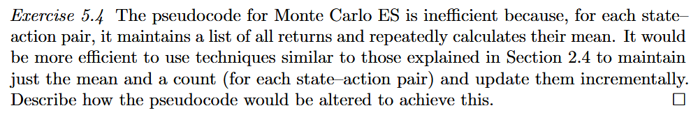
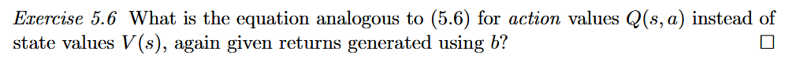
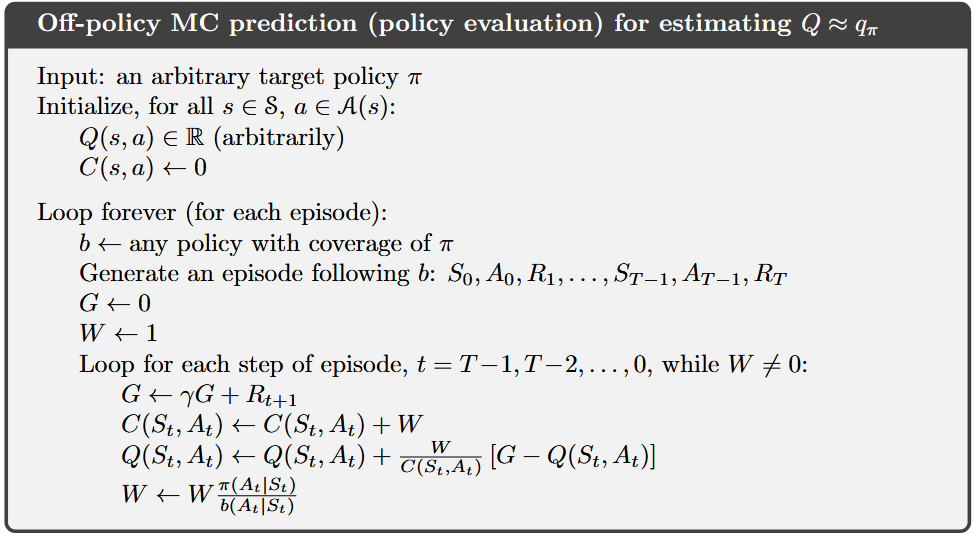

# Chapter 5 Monte Carlo Methods

在第 4 章动态规划（DP）中，我们假设拥有环境的**完全先验知识，即状态转移概率分布 $p(s', r \mid s, a)$ 完全已知。

本章引入的 **蒙特卡洛方法 是全书第一类真正意义上的**无模型（Model-Free）学习算法**——它不再通过解方程“计算”价值函数，而是纯粹从与环境交互产生的**经验，即状态、动作和奖励的采样序列 $(S_0, A_0, R_1, S_1, A_1, R_2, \dots)$ 中学习价值函数与最优策略。MC 方法所需的经验序列可以来自两个途径：

1. **真实经验：

   * 智能体直接与真实物理世界交互产生数据。
   * **惊人之处**：完全不需要任何关于环境动力学的先验知识，仅凭试错就能渐近达到最优行为。

2. **模拟经验**：

   * 由计算机仿真器生成状态转移样本。

   * **既然仿真器也是“模型”，为什么不用 DP 而用 MC？**

     > *"In surprisingly many cases it is easy to generate experience sampled according to the desired probability distributions, but infeasible to obtain the distributions in explicit form."*

---

**仅限分幕式任务**

* 价值函数的定义是未来累积回报的**数学期望**（$v_\pi(s) = \mathbb{E}_\pi[G_t \mid S_t=s]$）；MC 的本质就是用**样本回报的算术平均值**来逼近这一真实期望。

  * 因为 MC 必须依赖**完整回报**（第 6 章 TD 方法使用部分回报 Partial Returns）。

  * 只有当经验被划分为一个个必然会终止的**回合（Episodes）**，才能算出明确定义的完整回报：
    $$
    G_t = R_{t+1} + \gamma R_{t+2} + \dots + \gamma^{T-t-1} R_T
    $$

  * MC 必须等**整局游戏走完结账后**，才能更新价值估计和策略。
  * MC 是**按回合增量式**的，而不是**按步在线式**的。

---

**对比第 2 章多臂老虎机：从“稳态即时奖励”到“非稳态多状态回报”**

* **相似点**：第 2 章的老虎机对每个动作采样并平均**即时奖励**；第 5 章的 MC 对每个“状态-动作对 $(s,a)$”采样并平均**累积回报**。
* **核心区别（多重状态互联导致的“非平稳性”）**：
  * 在 MDP 中存在多个状态，每个状态都像一个独立的老虎机，但这些老虎机之间是**耦合（Interrelated）**的。
  * 你在当前状态 $S_t$ 采取动作 $A_t$ 后拿到的总回报 $G_t$，不仅取决于当前这一步，还**强烈依赖于后续状态 $S_{t+1}, S_{t+2}, \dots$ 所选择的动作**。
  * 当后续状态的策略还在不断学习和改变时，从前面状态 $S_t$ 的视角来看，它所观测到的回报分布是在不断变化的——即**问题变成了非平稳的**。

**对比第 4 章动态规划（DP）：继承广义策略迭代（GPI）以克服非平稳性**

* 为了解决上述由于后续策略变化带来的非平稳性，MC 直接沿用了第 4 章 DP 的核心框架——**广义策略迭代**：
  $$
  \text{策略评估（Prediction：求 } v_\pi \text{ 和 } q_\pi \text{）} \quad \longleftrightarrow \quad \text{策略改进（Policy Improvement：贪婪化 }\pi \text{）}
  $$

* **唯一区别**：DP 的评估步骤是利用环境模型 $p$ **计算**出来的；而 MC 的评估步骤是通过与环境交互的样本回报学习出来的。

## 5.1 Monte Carlo Prediction

这是 MC 方法区别于 DP 和第 6 章 TD 方法最本质的理论特征：

> **定理**：在蒙特卡洛方法中，**对每一个状态的价值估计是完全相互独立的**。某一个状态的价值估计 $V(s)$ **绝不建立在任何其他状态的价值估计 $V(s')$ 之上**——换言之，**蒙特卡洛方法不自举！**

本节解决的是**预测问题**：给定一个固定策略 $\pi$，如何在没有环境模型的情况下，利用采样轨迹估计出状态价值函数 $v_\pi(s)$？

假设智能体遵循策略 $\pi$ 生成了许多条经过状态 $s$ 的回合轨迹。

* **访问**：状态 $s$ 在一个回合中的每一次出现，都称为对状态 $s$ 的一次**访问**。
* 由于同一个回合中可能会打转或往返，状态 $s$ 在**同一条轨迹中可能出现多次**（例如轨迹：$s_1 \to s_2 \to \mathbf{s_1} \to s_5$）。由此衍生出两种统计流派：

| 对比维度           | First-visit MC                                               | Every-visit MC                                               |
| :----------------- | :----------------------------------------------------------- | :----------------------------------------------------------- |
| **核心定义**       | 在同一个回合中，**只统计状态 $s$ 第一次出现** 时对应的后续回报 $G_t$，忽略该回合内后续再次经过 $s$ 的回报。 | 在同一个回合中，**状态 $s$ 每次出现** 时对应的后续回报 $G_t$ 全部计入列表并参与求平均。 |
| **样本独立性**     | **严格独立同分布（i.i.d.）**（因为每个样本来自完全不同的独立回合）。 | **同一回合内的样本存在相关性**（因为第二次访问后的子轨迹是第一次访问后轨迹的子集）。 |
| **无偏性**         | 有限样本下就是 $v_\pi(s)$ 的**严格无偏估计（Unbiased Estimate）**。 | 有限样本下有偏，但当访问次数 $n \to \infty$ 时**渐近无偏**。 |
| **收敛性质**       | 依据大数定律收敛到 $v_\pi(s)$，估计误差的标准差以 **$1/\sqrt{n}$** 的速率下降。 | 同样以二次收敛逼近 $v_\pi(s)$。                              |
| **理论与后续定位** | Sutton 第 5 章主要聚焦的形式。                               | **样本利用率最高**（赵书第 5 章主要采用此形式），且能更自然地推广到第 9 章函数逼近与第 12 章资格迹。 |

> [!IMPORTANT]
>
> 假设折扣因子 $\gamma = 1$（不打折，直接把后续奖励加起来就行）。
> 你在玩一个走房间拿金币的游戏，有 **客厅 $\text{A}$**、**厨房 $\text{B}$** 和 **大门出口 $\text{T}$（终点）**。在**第 1 局游戏**中，你走出了下面这条绕了一圈的路线：
> $$
> \underbrace{S_0 = \mathbf{A}}_{\text{第1次进客厅}} \xrightarrow{\text{捡到 } R_1 = +2} S_1 = \text{B} \xrightarrow{\text{捡到 } R_2 = +3} \underbrace{S_2 = \mathbf{A}}_{\text{第2次进客厅}} \xrightarrow{\text{捡到 } R_3 = +10} S_3 = \text{T (出大门结束)}
> $$
>
> 现在这局游戏结束了，我们要评估 **“客厅 $\text{A}$ 的价值 $V(\text{A})$ 是多少”**。在这**同一局游戏**里，你一共进了**两次**客厅 $\text{A}$（分别在 $t=0$ 和 $t=2$）：
>
> * **第 1 次进客厅（$t=0$ 时刻）**：
>   从 $t=0$ 开始一直到游戏结束，你走过的**完整路径（记为轨迹 ①）**是：
>   $$
>   \text{轨迹 ①}：\quad \mathbf{A} \xrightarrow{+2} \text{B} \xrightarrow{+3} \mathbf{A} \xrightarrow{+10} \text{T} \\
>   G_0 = 2 + 3 + 10 = \mathbf{15}
>   $$
>
> * **第 2 次进客厅（$t=2$ 时刻）**：
>   从 $t=2$ 开始一直到游戏结束，你走过的**剩余路径（记为轨迹 ②）**是：
>   $$
>   \text{轨迹 ②}：\quad \mathbf{A} \xrightarrow{+10} \text{T} \\
>   G_2 = \mathbf{10}
>   $$
>
> * $\text{轨迹 ①} = \big[ \mathbf{A} \xrightarrow{+2} \text{B} \xrightarrow{+3} \underbrace{\mathbf{A} \xrightarrow{+10} \text{T}}_{\text{这就是轨迹 ②！}} \big]$
> * $\text{轨迹 ②} = \big[ \mathbf{A} \xrightarrow{+10} \text{T} \big]$
>
> **轨迹 ② 完完全全就是轨迹 ① 的也就是数学上的“子集”**，这意味着 $G_0$ 和 $G_2$ **根本不是两个独立的事件**！比如在最后一步出大门时，如果你不小心踩了地雷被扣了 $1000$ 分（$R_3 = -1000$），那么 $G_2 = -1000$，$G_0 = 2 + 3 - 1000 = -995$——“两个样本不独立、存在强相关性”。
>
> 面对上面这局出现了两次客厅 $\text{A}$ 的游戏，两种算法的分歧就在这里：
>
> * **首次访问型（First-visit MC）—— “一局只记头一次”**：
>   * 它规定：同一局游戏里，不管你绕回来几次客厅 $\text{A}$，我**只认你第 1 次进客厅（$t=0$）的那笔账**，后面的 $t=2$ 当作没看见！
>   * 所以这局游戏结束后，客厅 $\text{A}$ 的账本里**只存入 1 个数字**：`[15]`，当前平均值 $V(\text{A}) = 15$。
>   * **好处**：因为每局游戏只取 1 个数，第 1 局的数和第 2 局的数来自完全不同的两把游戏，绝对不会出现“你包含我、我包含你”的情况，样本之间 **100% 独立**！
> * **每次访问型（Every-visit MC）—— “来一次记一次，绝不浪费”**：
>   * 它规定：只要你进了客厅 $\text{A}$，每次都算数！
>   * 所以这局游戏结束后，客厅 $\text{A}$ 的账本里**存入了 2 个数字**：`[15, 10]`，当前平均值 $V(\text{A}) = \frac{15 + 10}{2} = \mathbf{12.5}$。
>   * **好处**：只玩了 1 局游戏就攒了 2 个数据，样本利用率极高！虽然 `15` 和 `10` 有点沾亲带故（不独立），但数学家已经证明了：只要玩的局数足够多，它算出来的平均值最终也会一分不差地收敛到真实价值！


> [!CAUTION]
>
> **数学证明补充（源自赵书 Box 5.1：大数定律 Law of Large Numbers）**
> 设每次独立回合首次访问 $s$ 得到的回报 $G^{(i)}$ 为独立同分布（i.i.d.）随机变量，期望为 $\mathbb{E}[G] = v_\pi(s)$，方差为 $\text{Var}[G] = \sigma^2 < \infty$：
>
> 1. **无偏性（期望不变）**：
>    $$
>    \mathbb{E}[\bar{x}] = \mathbb{E}\left[\frac{1}{n}\sum_{i=1}^n G^{(i)}\right] = \frac{1}{n} \sum_{i=1}^n \mathbb{E}[G^{(i)}] = \frac{1}{n} \cdot n v_\pi(s) = v_\pi(s)
>    $$
>
> 2. **方差按 $1/n$ 衰减（标准差按 $1/\sqrt{n}$ 衰减）**：
>    由于各回合相互独立（协方差为 0）：
>    $$
>    \text{Var}[\bar{x}] = \text{Var}\left[\frac{1}{n}\sum_{i=1}^n G^{(i)}\right] = \frac{1}{n^2} \sum_{i=1}^n \text{Var}[G^{(i)}] = \frac{n \sigma^2}{n^2} = \frac{\sigma^2}{n}
>    $$
>    两边开根号，估计误差的标准差为：
>    $$
>    \text{Std}(\bar{x}) = \frac{\sigma}{\sqrt{n}} \propto \frac{1}{\sqrt{n}}
>    $$
>    这意味着：把 MC 的估计误差缩小到原来的 $\frac{1}{10}$，你需要多采样 **$100$ 倍** 的回合数！这也直观解释了为什么 MC 方法虽然无偏，但收敛较慢、方差较大。

```text
算法：First-visit MC prediction（用于估计 V ≈ v_π）
-------------------------------------------------------------------------
输入：待评估的固定策略 π
初始化：
    对所有 s ∈ S，任意初始化 V(s) ∈ R
    对所有 s ∈ S，初始化空列表 Returns(s) ← empty list

无限循环（针对每一个回合 Episode）：
    1. 遵循策略 π 生成一条完整的回合轨迹：S_0, A_0, R_1, S_1, A_1, R_2, ..., S_{T-1}, A_{T-1}, R_T
    2. G ← 0
    3. 逆序循环该回合的每一个时间步，t = T-1, T-2, ..., 0：
           G ← γG + R_{t+1}
           如果状态 S_t 没有在前面的序列 S_0, S_1, ..., S_{t-1} 中出现过（First-visit 检查）：
               将 G 追加到列表 Returns(S_t) 中
               V(S_t) ← average(Returns(S_t))
```

1. **为什么第 3 步一定要“从后往前（$t = T-1, T-2, \dots, 0$）”逆序遍历？**

   * **数学原理（回报的递推性）**：我们在第 3 章推导过相邻时刻回报的递推公式：
     $$
     G_t = R_{t+1} + \gamma G_{t+1} \quad (\text{其中终止时刻 } G_T = 0)
     $$

   * **计算复杂度对比**：

     * 如果**从前往后**算（$t = 0 \to T-1$）：计算 $G_0$ 需要把 $R_1 \sim R_T$ 加一遍（$T$ 次运算），计算 $G_1$ 又要把 $R_2 \sim R_T$ 加一遍（$T-1$ 次运算）……总时间复杂度高达 **$O(T^2)$**！
     * 如果**从后往前**算（$t = T-1 \to 0$）：初始化 $G = 0$，每往退一步只需执行一次乘加 `G ← γG + R_{t+1}`，就能顺带得出每一个时刻的 $G_t$，总时间复杂度骤降为线性 **$O(T)$**！

2. **如何把上面的伪代码改成 `Every-visit MC`？**

   * 只需**删掉 `Unless S_t appears in S_0, S_1, ..., S_{t-1}:` 这一行判断条件**！无论 $S_t$ 在前面有没有出现过，每次遇到都直接执行 `Append G to Returns(S_t)` 并求平均即可。

3. **注意伪代码在采用 `First-visit` 与逆序遍历结合时的微妙之处**：

   * 即使循环是从后往前（$t = T-1 \to 0$）走的，判断“是不是首次访问”看的是 **$S_t$ 有没有在它前面的历史序列 $S_0, S_1, \dots, S_{t-1}$ 中出现过**。
   * 举例：假设轨迹状态为 $S_0=\text{A}, S_1=\text{B}, S_2=\text{A}, S_3=\text{C}$。
     * 当逆序走到 $t=2$（状态 $\text{A}$）时，检查前缀 $S_0, S_1$（即 $\text{A}, \text{B}$），发现 $\text{A}$ 在 $S_0$ 出现过了！所以 $t=2$ 的这次访问被跳过，不记录。
     * 当继续逆序走到 $t=0$（状态 $\text{A}$）时，前缀为空，没有出现过 $\text{A}$，此时才把 $G_0$ 记录进 `Returns(A)`——完美对应了“顺着时间看第一次访问”的 $G_0$！

## 5.2 Monte Carlo Estimation of Action Values

无模型强化学习与基于模型动态规划在**策略改进环节最关键的差异**：

* **5.1 节**：给定策略 $\pi$，评估的是 **状态价值 $v_\pi(s)$**。
* **5.2 节**：给定策略 $\pi$，评估的是 **动作价值 $q_\pi(s, a)$**。

* **有模型设定（DP，第 4 章）—— 仅靠状态价值 $v_\pi(s)$ 即可决定最优策略**：
  在已知环境转移概率 $p(s', r \mid s, a)$ 时，如果我们已经算出了各个房间的状态价值 $v_\pi(s')$，智能体站在当前状态 $s$ 只需**“向前看一步”**，用转移概率对一步后的即时奖励和下一状态价值做加权求和，就能选出最优动作：
  $$
  \pi'(s) = \arg\max_{a \in \mathcal{A}(s)} \underbrace{\sum_{s', r} p(s', r \mid s, a) \big[ r + \gamma v_\pi(s') \big]}_{\text{依赖已知环境模型 } p \text{ 计算出的动作价值}}
  $$
* **无模型设定（MC，第 5 章）—— 仅有状态价值 $v_\pi(s)$ 完全无法选出动作！**
  在没有环境模型（$p(s', r \mid s, a)$ 未知）的情况下，上式中的求和项无法计算。
* **显式估计动作价值 $q_\pi(s, a)$**：
  为了绕开未知的 $p(s', r \mid s, a)$，我们必须直接估计每一个“状态-动作对 $(s, a)$”的价值 $q_\pi(s, a)$。一旦通过采样直接学出了 $q_\pi(s, a)$，策略改进就彻底摆脱了对环境模型的依赖，退化为最简单的**查表取最大值**：
  $$
  \pi'(s) = \arg\max_{a \in \mathcal{A}(s)} q_\pi(s, a)
  $$
  因此，蒙特卡洛方法在控制问题中的首要目标是估计最优动作价值 **$q_*$**；而在利用 GPI 框架逼近 $q_*$ 之前，第一步就是解决动作价值的**策略评估问题（估计 $q_\pi(s, a)$）**。


* 动作价值 $q_\pi(s, a)$ 是从状态 $s$ 出发、第一步执行动作 $a$、并且在此后所有步骤中一直遵循策略 $\pi$ 所获得的期望累积折扣回报：
  $$
  q_\pi(s, a) \doteq \mathbb{E}_\pi \big[ G_t \mid S_t = s, A_t = a \big]
  $$
  
* 在一个回合中，只要智能体到达了状态 $s$ **并且**在该状态下实际执行了动作 $a$，就称状态-动作对 $(s, a)$ 在该回合中被**访问（Visited）**了一次。

* **First-visit 与 Every-visit 的平移推广**：
  1. **First-visit MC**：在每个回合中，仅取状态 $s$ 与动作 $a$ **第一次同时出现**之后所获得的回报 $G_t$ 进行算术平均。
  2. **Every-visit MC**：将一个回合中 $(s, a)$ **每一次出现**之后所获得的回报 $G_t$ 全部计入并求算术平均。

---

**确定性策略下的“探索死锁”**

从数学公式上看，把 $v_\pi(s)$ 换成 $q_\pi(s, a)$ 似乎只是把括号里的变量多加了一个 $a$；但在实际采样中，**许多状态-动作对 $(s, a)$ 可能永远不会被访问到**

* 我们学习动作价值 $Q(s, a)$ 的根本目的，是为了在策略改进时**对同一个状态下的所有可选动作进行横向比较**：
  $$
  \pi'(s) = \arg\max_{a \in \{a_1, a_2, \dots\}} Q(s, a)
  $$
* 要想选出最优动作，我们必须准确估计出每个状态下**所有动作**的价值。

## 5.3 Monte Carlo Control

在未知环境动力学模型的前提下逼近最优策略 $\pi_*$ 与最优动作价值函数 $q_*$。

蒙特卡洛控制的总体架构严格遵循**广义策略迭代**范式。在 GPI 框架下，算法同时维护并交替更新两个核心组件：

* **交替更新的动力学机制（对立与统一的收敛过程）**：
  * **策略评估**：反复调整动作价值函数 $Q$，使其更紧密地逼近当前策略 $\pi$ 对应的真实动作价值函数 $q_\pi$（即 $Q \rightsquigarrow q_\pi$）。
  * **策略改进**：相对于当前的动作价值函数 $Q$，反复将策略调整为贪婪策略（即 $\pi \rightsquigarrow \text{greedy}(Q)$）。
  * **相互博弈与协同收敛**：这两种变化在局部上存在一定程度的对抗性，因为每一次策略 $\pi$ 的改变都会为价值评估创造一个新的**移动目标** $q_\pi$；每一次价值函数 $Q$ 的改变也会为策略改进定义新的贪婪方向。两者交替作用驱动策略与价值函数渐近收敛至唯一的不动点——**最优策略 $\pi_*$ 与最优动作价值函数 $q_*$**。

---

### 经典策略迭代的蒙特卡洛版本

首先考察将经典策略迭代直接移植到蒙特卡洛设定下的理想理论形式。

从任意初始策略 $\pi_0$ 出发，算法交替执行**完备的策略评估（记作 $\xrightarrow{\text{E}}$）**与**完备的策略改进（记作 $\xrightarrow{\text{I}}$）**，最终收敛至最优策略 $\pi_*$ 与最优动作价值函数 $q_*$：

$$
\pi_0 \xrightarrow{\text{E}} q_{\pi_0} \xrightarrow{\text{I}} \pi_1 \xrightarrow{\text{E}} q_{\pi_1} \xrightarrow{\text{I}} \pi_2 \xrightarrow{\text{E}} \cdots \xrightarrow{\text{I}} \pi_* \xrightarrow{\text{E}} q_*
$$

在第 $k$ 轮策略评估阶段（$\pi_k \xrightarrow{\text{E}} q_{\pi_k}$），算法按照 5.2 节所述方法通过采样大量回合来估计动作价值。为了在理论上保证每一轮都能**精确求得真实的动作价值函数 $q_{\pi_k}$**，此处暂时引入两个理想化假设：
1. **试探性出发假设（Assumption of Exploring Starts）**：所有生成的回合均从随机选取的状态-动作对 $(S_0, A_0)$ 出发，且每个状态-动作对被选为起点的概率均大于零；
2. **无限回合假设（Infinite Number of Episodes）**：在每次策略改进前，策略评估阶段均能观测到无穷多个回合（$N(s,a) \to \infty$）。

在上述两项假设同时满足的条件下，依据大数定律，蒙特卡洛方法能够对任意给定的策略 $\pi_k$ 精确计算出无误差的真实动作价值函数 $q_{\pi_k}(s, a)$。

---

### Monte Carlo with Exploring Starts

上述收敛性保证建立在两个在现实中极难满足的强假设之上：
1. **假设一**：所有回合均具备**试探性出发**条件（该假设的移除将推迟至 5.4 节与 5.5 节通过软策略与离轨策略解决）；
2. **假设二**：每次策略评估阶段均可观测**无穷多个回合**。

事实上，这一问题在经典动态规划中同样存在——迭代策略评估同样仅能在迭代次数 $k \to \infty$ 时渐近收敛至真实价值 $v_\pi$。消除这一无限步要求有两种技术途径：

| 对比维度     | 途径一：带误差界限的近似完备评估                             | 途径二：截断/逐回合广义策略迭代                              |
| :----------- | :----------------------------------------------------------- | :----------------------------------------------------------- |
| **核心思想** | 依然坚持在每次策略改进前把 $q_{\pi_k}$ 算准。通过统计学测量与假设推导出估计误差幅值与概率的上界，在每轮评估中采集足够多但有限的回合，确保误差小于预设阈值 $\epsilon$ 后再切换至策略改进。 | **彻底放弃在返回策略改进之前完成策略评估**。在每次评估步中，仅推动价值函数向真实值 $q_{\pi_k}$ **靠近一步**，随即立刻执行策略改进，依靠多轮交替迭代实现最终逼近。 |

将上述“途径二”应用于蒙特卡洛策略迭代，实现方式就是**以单个回合为单位交替执行策略评估与策略改进**：
1. **单回合采样**：遵循当前策略从随机起点 $(S_0, A_0)$ 生成 1 个完整回合；
2. **局部策略评估**：利用该回合观测到的真实回报 $G_t$，仅更新该回合中实际经历过的状态-动作对的价值估计 $Q(S_t, A_t)$；
3. **局部策略改进**：在价值更新后，针对**该回合中所有被访问过的状态 $S_t$**，将其策略改进为相对于最新 $Q(S_t, \cdot)$ 的贪婪动作：$\pi(S_t) \leftarrow \arg\max_a Q(S_t, a)$。

### Exercise 5.4



1. **空间开销无限膨胀**：随着回合数增加，列表 `Returns(s, a)` 的长度随访问次数 $N(s,a)$ 线性增长。
2. **时间开销重复浪费**：每次执行 `average(Returns(S_t, A_t))` 时，计算机都必须将列表中过往全部 $N(s,a)$ 个历史回报重新遍历相加一遍，单次更新耗时为 $O(N(s,a))$。

* **增量式改进原理（将空间与单次时间复杂度降至常数级 $O(1)$）**：
  $$
  Q_{n}(s, a) = Q_{n-1}(s, a) + \frac{1}{n} \Big[ G_n - Q_{n-1}(s, a) \Big]
  $$
  我们无需保存任何历史回报列表，只需为每个状态-动作对额外维护一个标量计数器 $N(s, a) \in \mathbb{N}$ 记录其累计被访问的次数即可。

---

1. **第一处修改（初始化部分 `Initialize`）**：
   
   * **删除**：原伪代码中的 `Returns(s, a) ← empty list, for all s ∈ S, a ∈ A(s)`；
   * **替换为**：初始化访问次数计数器归零：
     $$
     N(s, a) \leftarrow 0, \quad \forall s \in \mathcal{S}, \; a \in \mathcal{A}(s)
     $$
   
2. **第二处修改（内层循环评估更新部分 `Policy Evaluation`）**：
   * **删除**：原伪代码中的两行列表操作：
     ```text
     Append G to Returns(S_t, A_t)
     Q(S_t, A_t) ← average(Returns(S_t, A_t))
     ```
   * **替换为**：计数器自增与 $O(1)$ 增量均值更新：
     ```text
     N(S_t, A_t) ← N(S_t, A_t) + 1
     Q(S_t, A_t) ← Q(S_t, A_t) + (1 / N(S_t, A_t)) * [G - Q(S_t, A_t)]
     ```

---

```TEXT

Initialize:
    π(s) ∈ A(s) (arbitrarily), for all s ∈ S
    Q(s, a) ∈ R (arbitrarily), for all s ∈ S, a ∈ A(s)
    N(s, a) ← 0, for all s ∈ S, a ∈ A(s)                  <-- 【修改 1：用计数器替代空列表】

Loop forever (for each episode):
    Choose S_0 ∈ S, A_0 ∈ A(S_0) randomly such that all pairs have probability > 0
    Generate an episode from S_0, A_0, following π: S_0, A_0, R_1, ..., S_{T-1}, A_{T-1}, R_T
    G ← 0
    Loop for each step of episode, t = T-1, T-2, ..., 0:
        G ← γG + R_{t+1}
        Unless the pair S_t, A_t appears in S_0, A_0, S_1, A_1, ..., S_{t-1}, A_{t-1}:
            N(S_t, A_t) ← N(S_t, A_t) + 1                 <-- 【修改 2a：访问计数 +1】
            Q(S_t, A_t) ← Q(S_t, A_t) + (1 / N(S_t, A_t)) * (G - Q(S_t, A_t))
                                                          <-- 【修改 2b：增量更新动作价值】
            π(S_t) ← argmax_a Q(S_t, a)
```

## 5.4 Monte Carlo Control without Exploring Starts

---

### On-policy vs. Off-policy

为了在真实物理环境（无法任意指定初始状态与动作 $(S_0, A_0)$）中保证所有动作被无限次访问，唯一的通用途径是**由智能体在与环境的持续交互中主动选择所有可能的动作**，由此衍生出强化学习中控制算法的两个基本流派：

| 算法流派               | 形式化定义与运行机制                                         | 核心特征与权衡                                               |
| :--------------------- | :----------------------------------------------------------- | :----------------------------------------------------------- |
| **On-policy methods**  | **决策策略与学习策略同构**：<br>算法用来做出动作决策、生成交互轨迹数据的策略，与算法正在评估并试图改进的策略是**同一个策略**。 | 策略自身必须保持随机探索性，因此学到的最终策略是一种**带有持续探索噪声的次优折中策略**；算法实现直观、方差较小。 |
| **Off-policy methods** | **决策策略与学习策略分离**：<br>算法评估和改进的**目标策略**，与实际用于控制系统并生成经验数据的**行为策略**是**两个不同的策略**。 | 可使用具备高探索度的行为策略生成数据，同时精确求解完全确定性的全局最优目标策略；但需要引入重要性采样，方差较大。 |

---

###  Soft Policies & $\varepsilon$-greedy Policies

* **Soft Policy**：
  若策略 $\pi$ 在任意状态下对所有合法动作的选择概率均严格为正，即满足：
  $$
  \pi(a \mid s) > 0, \quad \forall s \in \mathcal{S}, \; a \in \mathcal{A}(s)
  $$
  则称 $\pi$ 为软策略。软策略保证了系统状态-动作空间中不存在概率为零的盲区，任何动作均有被探索到的可能。
* **$\varepsilon$-soft Policy**：
  给定探索参数 $\varepsilon \in (0, 1]$，若策略 $\pi$ 使得每个动作被选取的概率均不低于一个严格为正的保底阈值：
  $$
  \pi(a \mid s) \ge \frac{\varepsilon}{|\mathcal{A}(s)|}, \quad \forall s \in \mathcal{S}, \; a \in \mathcal{A}(s)
  $$
  则称 $\pi$ 为 $\varepsilon$-软策略。$\varepsilon$-软策略构成了具备最低探索保障的候选策略集合 $\Pi_\varepsilon$。
* **$\varepsilon$-greedy Policy**：
  $\varepsilon$-贪婪策略是 $\varepsilon$-软策略集合 $\Pi_\varepsilon$ 中最贴近纯贪婪行为的特殊成员。它将绝大部分概率质量赋予当前估值最大的贪婪动作，将剩余微小概率质量均匀分配给包含贪婪动作在内的所有动作：
  $$
  \pi(a \mid s) = \begin{cases} 
  1 - \varepsilon + \frac{\varepsilon}{|\mathcal{A}(s)|}, & \text{若 } a = A^* \doteq \arg\max_{a'} Q(s, a') \\ 
  \frac{\varepsilon}{|\mathcal{A}(s)|}, & \text{若 } a \neq A^* 
  \end{cases}
  $$

---

### GPI ：向贪婪方向移动

在经典的动态规划与 5.3 节的 `Monte Carlo ES` 中，策略改进采用**纯贪婪化**：
$$
\pi(s) \leftarrow \arg\max_{a} Q(s, a)
$$
但在缺失 Exploring Starts 的同轨设定下，纯贪婪化会导致所有非贪婪动作的选择概率瞬间归零，**彻底阻断了智能体对非贪婪动作的后续探索**。

* **GPI 的本质松弛定理**：
  广义策略迭代在理论上**并不要求策略必须一次性完全演化为纯贪婪策略**，而仅要求策略**向着贪婪方向发生单调位移**。
* **同轨控制的核心实现**：
  每次策略改进时，仅将策略更新为相对于当前动作价值函数 $Q$ 的 **$\varepsilon$-贪婪策略**。由于 $\varepsilon$-贪婪策略将主要概率赋予了最大价值动作，它严格满足了“向贪婪方向移动”的要求，从而兼顾了**策略改进的单调性**与**采样空间的持续可达性**。

## 5.5 Off-policy Prediction via Importance Sampling

所有的强化学习控制算法都面临着一个内在的根本矛盾：
* **目标愿景**：算法希望评估并学习在后续过程中采取**最优行为**时的动作价值；
* **现实约束**：为了发现真正的最优动作，智能体在交互过程中必须采取**非最优行为**去持续试错与探索。

* **On-policy**：将决策策略与学习策略合二为一，其代价是只能妥协地学习一个**带有持续探索噪声的次优软策略（$\varepsilon$-soft policy）**，无法学到绝对纯贪婪的最优策略。
* **Off-policy**：采用**双策略解耦架构**，将“负责产生数据的策略”与“负责被优化评估的策略”彻底拆分为两个不同的策略：
  1. **目标策略（Target policy, $\pi$）**：算法正在评估、优化并最终使其成为最优决策的策略，通常是完全确定性的纯贪婪策略 $\pi_*$；
  2. **行为策略（Behavior policy, $b$）**：智能体在环境中实际执行、负责生成交互行为轨迹数据的探索性策略，通常具有高探索度，例如 $\varepsilon$-greedy 策略或随机策略。

当算法利用来自行为策略 $b$ 的交互数据，即“偏离”了目标策略的数据，去评估或改进目标策略 $\pi$ 时，该范式被称为**Off-policy learning**。

---

### Assumption of Coverage

为了能够利用由行为策略 $b$ 采样出的经验回合来有效估计目标策略 $\pi$ 的价值，两者之间必须满足**覆盖性假设**：

> **形式化定义（覆盖性假设）**：在任意状态 $s \in \mathcal{S}$ 下，凡是目标策略 $\pi$ 具备非零选择概率的动作，行为策略 $b$ 必须也具备严格非零的选择概率：
> $$
> \pi(a \mid s) > 0 \implies b(a \mid s) > 0, \quad \forall s \in \mathcal{S}, \; a \in \mathcal{A}(s)
> $$

* **推论与策略形态**：
  1. 行为策略 $b$ 在任何与 $\pi$ 不同的状态下必须是**随机策略**，以确保覆盖所有可能的备选动作；
  2. 目标策略 $\pi$ 可以是**确定性策略**（让 $b$ 负责以随机性探索全局，让 $\pi$ 保持确定性直接收敛于贪婪最优策略 $\pi_*$）。

---

### Importance Sampling Ratio

直接从行为策略 $b$ 采样得到的经验回报 $G_t$，其数学期望是行为策略下的价值 $\mathbb{E}_b[G_t \mid S_t=s] = v_b(s)$，而不是我们想要的目标策略价值 $v_\pi(s)$。因此，必须对每个回报乘以一个**重要性采样权重**，将概率分布从 $b$ 纠偏为 $\pi$。

给定起始状态 $S_t$，系统在任意策略 $\pi$ 下产生特定后续状态-动作序列 $A_t, S_{t+1}, A_{t+1}, \dots, S_T$ 的发生概率为：
$$
\begin{aligned}
\Pr\big\{ A_t, S_{t+1}, A_{t+1}, \dots, S_T \;\big|\; S_t, A_{t:T-1} \sim \pi \big\} &= \pi(A_t \mid S_t) p(S_{t+1} \mid S_t, A_t) \pi(A_{t+1} \mid S_{t+1}) \cdots p(S_T \mid S_{T-1}, A_{T-1}) \\
&= \prod_{k=t}^{T-1} \pi(A_k \mid S_k) p(S_{k+1} \mid S_k, A_k)
\end{aligned}
$$
其中 $p(S_{k+1} \mid S_k, A_k)$ 为环境的状态转移概率函数。定义该轨迹在目标策略 $\pi$ 与行为策略 $b$ 下的发生概率之比为**重要性采样比, 记作 $\rho_{t:T-1}$）**：

$$
\begin{align*}
\rho_{t:T-1} &\doteq \frac{\prod_{k=t}^{T-1} \pi(A_k \mid S_k) p(S_{k+1} \mid S_k, A_k)}{\prod_{k=t}^{T-1} b(A_k \mid S_k) p(S_{k+1} \mid S_k, A_k)} \\
&= \prod_{k=t}^{T-1} \frac{\pi(A_k \mid S_k) p(S_{k+1} \mid S_k, A_k)}{b(A_k \mid S_k) p(S_{k+1} \mid S_k, A_k)} \\
&= \prod_{k=t}^{T-1} \frac{\pi(A_k \mid S_k)}{b(A_k \mid S_k)}
\end{align*}
$$

> [!IMPORTANT]
> **无模型特性的关键相消**：
> 尽管轨迹的单项绝对发生概率强烈依赖于环境的状态转移概率 $p(S_{k+1} \mid S_k, A_k)$，但在重要性采样比中，**转移概率项在分子与分母中完全相同并严格相消，**最终的权重 $\rho_{t:T-1}$ **仅取决于两个已知策略 $\pi, b$ 以及实际采样出的动作序列，不需要任何环境动力学模型先验**

将重要性采样比 $\rho_{t:T-1}$ 作用于行为策略采出的回报 $G_t$ 上，即可实现期望值的精确纠偏：
$$
\mathbb{E}_b \big[ \rho_{t:T-1} G_t \;\big|\; S_t = s \big] = v_\pi(s)
$$

* $\mathcal{T}(s)$：所有回合中**访问到状态 $s$ 的所有时间步 $t$ 的索引集合**。
* $T(t)$：时刻 $t$ 之后遭遇的**第一个回合终止时刻**。
* $\rho_{t:T(t)-1}$：从时间步 $t$ 开始，一直计算到该回合终止时刻 $T(t)$ 为止的重要性采样比率。

> [!IMPORTANT]
>
> * **传统的记法**：
>   第 1 局游戏：$t = 0, 1, 2$（结束）
>   第 2 局游戏：秒表清零，重新从 $t = 0, 1, 2, 3$（结束）
>   —— 这样表示数据时，必须同时写“第几局 $i$”和“第几步 $t$”，写成公式时下标会变成 $\rho_{t:T^{(i)}-1}^{(i)} G_t^{(i)}$，公式极其臃肿。
>
> * **Sutton 的连续记法**：
>   第 1 局游戏在 $t=2$ 结束；那么第 2 局游戏就从 $t=3$ 开始算起，以此类推。整个强化学习过程就是一条长长的时间轴：$t = 0, 1, 2, 3, 4, 5, \dots$
>
> ---
>
> 假设我们要评估的目标状态是 **$s = \text{A}$**。智能体一共玩了 **3 局独立的回合**，秒表连续走，时间轴记录如下：
>
> ```text
> 【第 1 局】
> t=0: 处在状态 A  --> 采取动作 A_0，获得奖励 R_1
> t=1: 处在状态 B  --> 采取动作 A_1，获得奖励 R_2
> t=2: 终点终止状态 Terminate（第 1 局结束！）
> 
> 【第 2 局】（秒表不归零，继续往下数）
> t=3: 处在状态 C  --> 采取动作 A_3，获得奖励 R_4
> t=4: 处在状态 A  --> 采取动作 A_4，获得奖励 R_5
> t=5: 处在状态 B  --> 采取动作 A_5，获得奖励 R_6
> t=6: 终点终止状态 Terminate（第 2 局结束！）
> 
> 【第 3 局】（继续往下数）
> t=7: 处在状态 A  --> 采取动作 A_7，获得奖励 R_8
> t=8: 终点终止状态 Terminate（第 3 局结束！）
> ```
>
> ---
>
> #### 1. $\mathcal{T}(s)$ —— “在哪些时刻访问了状态 $s$？”
> * 含义：在整条连续时间轴上，所有处于状态 $s$ 的时刻 $t$ 的**集合**。
> * 在我们的例子中，状态 $\text{A}$ 在哪些时刻出现过？
>   * 第 1 局在 $t = 0$ 出现过；
>   * 第 2 局在 $t = 4$ 出现过；
>   * 第 3 局在 $t = 7$ 出现过。
> * **所以**：
>   $$\mathcal{T}(\text{A}) = \{0, 4, 7\}$$
>   集合的大小（总访问次数）就是 $|\mathcal{T}(\text{A})| = 3$。
>
> ---
>
> #### 2. $T(t)$ —— “时刻 $t$ 所在的这局游戏，在什么时候结束？”
> * 含义：从时刻 $t$ 往前看，**下一个遇到的终点时刻**。
> * 在我们的例子中：
>   * 当你处在 $t = 0$ 时，这局游戏什么时候结束？在 $t = 2$ 结束。所以 **$T(0) = 2$**。
>   * 当你处在 $t = 4$ 时，这局游戏什么时候结束？在 $t = 6$ 结束。所以 **$T(4) = 6$**。
>   * 当你处在 $t = 7$ 时，这局游戏什么时候结束？在 $t = 8$ 结束。所以 **$T(7) = 8$**。
> * **本质**：$T(t)$ 是一个函数，输入任意时刻 $t$，它就能告诉你该时刻所在的那个回合的终点时刻是几。
>
> ---
>
> #### 3. $\{G_t\}_{t \in \mathcal{T}(s)}$ —— “每次到达状态 $s$ 后，一直玩到这局结束拿到的总回报”
> * 含义：针对 $\mathcal{T}(s)$ 里的每一个时刻 $t$，从 $t$ 开始累加到本局终点 $T(t)$ 的回报。
> * 在我们的例子中：
>   * 对于 $t = 0$：回报从 $t=0$ 算到 $T(0)=2$，即 $G_0 = R_1 + \gamma R_2$
>   * 对于 $t = 4$：回报从 $t=4$ 算到 $T(4)=6$，即 $G_4 = R_5 + \gamma R_6$
>   * 对于 $t = 7$：回报从 $t=7$ 算到 $T(7)=8$ ，即 $G_7 = R_8$
> * **所以**：回报集合就是 $\{G_0, G_4, G_7\}$。这其实就是第 1、2、3 局分别测出的 3 个累积回报样本！
>
> ---
>
> #### 4. $\{\rho_{t:T(t)-1}\}_{t \in \mathcal{T}(s)}$ —— “每次到达状态 $s$ 后，这整局轨迹的重要性采样比”
> * 含义：从时刻 $t$ 开始，一直连乘到本局最后一步动作 $T(t)-1$ 的比率 $\prod_{k=t}^{T(t)-1} \frac{\pi(A_k \mid S_k)}{b(A_k \mid S_k)}$。
> * 在我们的例子中：
>   * 对于 $t = 0$（终点是 $2$）：比率连乘到 $2-1=1$，即 $\rho_{0:1} = \frac{\pi(A_0 \mid S_0)}{b(A_0 \mid S_0)} \cdot \frac{\pi(A_1 \mid S_1)}{b(A_1 \mid S_1)}$
>   * 对于 $t = 4$（终点是 $6$）：比率连乘到 $6-1=5$，即 $\rho_{4:5} = \frac{\pi(A_4 \mid S_4)}{b(A_4 \mid S_4)} \cdot \frac{\pi(A_5 \mid S_5)}{b(A_5 \mid S_5)}$
>   * 对于 $t = 7$（终点是 $8$）：比率连乘到 $8-1=7$，即 $\rho_{7:7} = \frac{\pi(A_7 \mid S_7)}{b(A_7 \mid S_7)}$
> * **所以**：权重集合就是 $\{\rho_{0:1}, \rho_{4:5}, \rho_{7:7}\}$。这就是这 3 局游戏分别对应的轨迹纠偏权重！
>
> ---
>
> 有了这三个样本 $(G_0, \rho_{0:1})$、$(G_4, \rho_{4:5})$、$(G_7, \rho_{7:7})$ 之后，书里的两个公式其实就是在做加权计算：
>
> 1. **普通重要性采样（Ordinary IS）**：
>    $$
>    V(\text{A}) = \frac{\sum_{t \in \mathcal{T}(\text{A})} \rho_{t:T(t)-1} G_t}{|\mathcal{T}(\text{A})|} = \frac{\rho_{0:1} G_0 + \rho_{4:5} G_4 + \rho_{7:7} G_7}{3}
>    $$
>    *(分子是每个加权回报相加，分母是总访问次数 3)*
>
> 2. **加权重要性采样（Weighted IS）**：
>    $$
>    V(\text{A}) = \frac{\sum_{t \in \mathcal{T}(\text{A})} \rho_{t:T(t)-1} G_t}{\sum_{t \in \mathcal{T}(\text{A})} \rho_{t:T(t)-1}} = \frac{\rho_{0:1} G_0 + \rho_{4:5} G_4 + \rho_{7:7} G_7}{\rho_{0:1} + \rho_{4:5} + \rho_{7:7}}
>    $$
>    *(分子完全一样，分母换成了权重本身的求和)*
>
> ---
>

为了跨回合统计时间步，采用连续时间步编号体系：设 $\mathcal{T}(s)$ 为跨回合所有访问状态 $s$ 的时间步集合，$T(t)$ 为时间步 $t$ 之后遇到的第一个终止时刻。针对状态 $s$，集合 $\{G_t\}_{t \in \mathcal{T}(s)}$ 与 $\{\rho_{t:T(t)-1}\}_{t \in \mathcal{T}(s)}$ 分别为对应的样本回报与重要性采样比序列。

* **First-visit MC**：集合 $\mathcal{T}(s)$ 仅包含每个回合中状态 $s$ **第一次出现**的时间步 $t$。此时各样本之间是严格独立同分布的。
* **Every-visit MC**：集合 $\mathcal{T}(s)$ 包含所有出现过状态 $s$ 的时间步。虽然样本间存在关联，但在大规模采样下具备更高的样本利用率。

> [!IMPORTANT]
>
> 设从状态 $S_t = s$ 开始的一条完整交互轨迹为：
> $$\tau \doteq (A_t, S_{t+1}, A_{t+1}, \dots, S_T)$$
> 该轨迹产生的总回报为 $G_t$。根据全概率公式与期望的积分/离散求和定义：
> $$
> \begin{aligned}
> v_\pi(s) &= \mathbb{E}_\pi \big[ G_t \mid S_t = s \big] \\
> &= \sum_{\tau \in \mathcal{T}} \Pr(\tau \mid S_t = s, \pi) \cdot G_t(\tau)
> \end{aligned}
> $$
>
> 在分子分母同乘行为策略下的轨迹发生概率 $\Pr(\tau \mid S_t = s, b)$（在覆盖性假设 $\pi > 0 \implies b > 0$ 下，分母不为零）：
> $$
> \begin{aligned}
> v_\pi(s) &= \sum_{\tau \in \mathcal{T}} \Pr(\tau \mid S_t = s, b) \cdot \left[ \frac{\Pr(\tau \mid S_t = s, \pi)}{\Pr(\tau \mid S_t = s, b)} \cdot G_t(\tau) \right] \\
> &= \sum_{\tau \in \mathcal{T}} \Pr(\tau \mid S_t = s, b) \cdot \big[ \rho_{t:T-1}(\tau) \cdot G_t(\tau) \big] \\
> &= \mathbb{E}_b \big[ \rho_{t:T-1} G_t \mid S_t = s \big]
> \end{aligned}
> $$


#### Ordinary Importance Sampling
定义为加权样本的简单算术平均（分母为访问状态 $s$ 的总次数 $|\mathcal{T}(s)|$）：
$$
V(s) \doteq \frac{\sum_{t \in \mathcal{T}(s)} \rho_{t:T(t)-1} G_t}{|\mathcal{T}(s)|} 
$$

#### Weighted Importance Sampling
定义为以重要性采样权重之和作为归一化分母的凸组合加权平均，若分母为 0 则定义为 0：
$$
V(s) \doteq \frac{\sum_{t \in \mathcal{T}(s)} \rho_{t:T(t)-1} G_t}{\sum_{t \in \mathcal{T}(s)} \rho_{t:T(t)-1}} \tag{5.6}
$$

| 比较维度                           | 普通重要性采样（Ordinary IS）                                | 加权重要性采样（Weighted IS）                                |
| :--------------------------------- | :----------------------------------------------------------- | :----------------------------------------------------------- |
| **单样本极端案例**                 | 若该样本的 $\rho = 10$，估计值直接放大为 $10 \times G_t$；若 $\rho = 0$，估计值直接塌陷为 $0$。波动极度剧烈。 | 分子分母中的 $\rho$ 直接相消：$V(s) = \frac{\rho G_t}{\rho} = G_t$。估计值始终等于观测回报本身，绝不异常放大。 |
| **统计偏差（Bias）**(First-visit ) | **严格无偏（Unbiased）**：$\mathbb{E}[V(s)] = v_\pi(s)$ 恒成立。 | **有限样本下有偏（Biased）**：在单样本时其期望为 $v_b(s)$ 而非 $v_\pi(s)$；但随着样本数增加，**偏差渐近趋于 0**。 |
| **统计方差**                       | **理论上通常无界**：由于 $\rho$ 是多步比值的连乘，其方差极易发散，导致数值极不稳定。 | **方差极其优越且通常收敛至 0**：任意单个回报的最大权重被限制为 1。在回报有界条件下，即便 $\rho$ 本身的方差为无穷大，该估计器的方差也**保证收敛至 0**。 |

### Exercise 5.6



我们要评估的是**动作价值函数 $q_\pi(s, a)$**。在状态 $s$ 采取动作 $a$ 之后，遵循目标策略 $\pi$ 的**未来累积回报的数学期望**：
$$
q_\pi(s, a) \doteq \mathbb{E}_\pi \big[ G_t \;\big|\; S_t = s, \; A_t = a \big]
$$

把这个数学期望按照概率论的定义写成求和形式，设从时刻 $t$ 开始，后续一直到游戏结束的完整随机交互序列为：
$$
\tau \doteq (R_{t+1}, S_{t+1}, A_{t+1}, R_{t+2}, S_{t+2}, \dots, R_T, S_T)
$$
该序列对应的累积回报为 $G_t(\tau)$。那么，数学期望展开就是：**所有可能的后续序列 $\tau$ 的“概率 $\times$ 回报”求和**：
$$
q_\pi(s, a) = \sum_{\tau} \Pr(\tau \mid S_t = s, A_t = a, \pi) \cdot G_t(\tau) \tag{式 1}
$$

现实中，我们的数据不是用 $\pi$ 采样的，而是用**行为策略 $b$** 采样的。同时乘上行为策略 $b$ 下发生该序列的概率 $\Pr(\tau \mid S_t = s, A_t = a, b)$：

$$
\begin{aligned}
q_\pi(s, a) &= \sum_{\tau} \Pr(\tau \mid S_t = s, A_t = a, b) \cdot \left[ \frac{\Pr(\tau \mid S_t = s, A_t = a, \pi)}{\Pr(\tau \mid S_t = s, A_t = a, b)} \cdot G_t(\tau) \right]
\end{aligned} \tag{式 2}
$$

定义它为我们要找的**权重比率 $W(\tau)$**：
$$
W(\tau) \doteq \frac{\Pr(\tau \mid S_t = s, A_t = a, \pi)}{\Pr(\tau \mid S_t = s, A_t = a, b)} \tag{式 3}
$$
将马尔可夫决策过程一步一步的具体发生概率写出来。**第一步 $t$ 和后续步骤 $t+1$ 有什么区别**

**展开分子：在目标策略 $\pi$ 下，给定 $S_t=s, A_t=a$，后续轨迹发生的概率**

* **第 $t \to t+1$ 步**：当前状态是 $s$，动作已经是给定的 $a$。环境发生状态转移并给出奖励，概率为：
  $$
  p(S_{t+1}, R_{t+1} \mid s, a)
  $$
* **第 $t+1$ 步**：到达状态 $S_{t+1}$，智能体根据策略 $\pi$ 选择动作 $A_{t+1}$，概率为：
  $$
  \pi(A_{t+1} \mid S_{t+1})
  $$
* **第 $t+1 \to t+2$ 步**：环境根据转移概率给出下一状态和奖励：
  $$
  p(S_{t+2}, R_{t+2} \mid S_{t+1}, A_{t+1})
  $$
* ……以此类推，直到终止状态 $S_T$。

把整条链条乘起来，分子为：
$$
\Pr(\tau \mid S_t = s, A_t = a, \pi) = p(S_{t+1}, R_{t+1} \mid s, a) \cdot \prod_{k=t+1}^{T-1} \pi(A_k \mid S_k) \, p(S_{k+1}, R_{k+1} \mid S_k, A_k)
$$

同理，分母为：
$$
\Pr(\tau \mid S_t = s, A_t = a, b) = p(S_{t+1}, R_{t+1} \mid s, a) \cdot \prod_{k=t+1}^{T-1} b(A_k \mid S_k) \, p(S_{k+1}, R_{k+1} \mid S_k, A_k)
$$

所以，
$$
W(\tau) = \frac{p(S_{t+1}, R_{t+1} \mid s, a) \cdot \prod_{k=t+1}^{T-1} \pi(A_k \mid S_k) \, p(S_{k+1}, R_{k+1} \mid S_k, A_k)}{p(S_{t+1}, R_{t+1} \mid s, a) \cdot \prod_{k=t+1}^{T-1} b(A_k \mid S_k) \, p(S_{k+1}, R_{k+1} \mid S_k, A_k)} \\
W(\tau) = \prod_{k=t+1}^{T-1} \frac{\pi(A_k \mid S_k)}{b(A_k \mid S_k)}
$$


**这个连乘符号的下标是 $k = t+1$**，不是谁人为规定的，是代数化简自然推出来的！因为在第 $t$ 步时，动作已经被固定为 $a$，两策略在第 $t$ 步没有任何概率比值，比值自然从 **$t+1$** 开始连乘。把这个从 $t+1$ 连乘到 $T-1$ 的比率记为：
$$
\mathbf{\rho_{t+1:T-1} \doteq \prod_{k=t+1}^{T-1} \frac{\pi(A_k \mid S_k)}{b(A_k \mid S_k)}}
$$

此时，理论期望变成了：
$$
q_\pi(s, a) = \mathbb{E}_b \big[ \rho_{t+1:T-1} G_t \;\big|\; S_t = s, \; A_t = a \big] \tag{式 4}
$$

把理论期望（式 4），变成用实际采样样本计算的**加权估计量公式**。

1. **定义样本时间步集合**：
   在所有采样产生的数据中，把所有“处在状态 $s$ 且采取了动作 $a$”的时间步 $t$ 全部抓出来，组成一个集合，记作：
   $$
   \mathcal{T}(s, a) \doteq \big\{ t \;\big|\; S_t = s, \; A_t = a \big\}
   $$
   
2. **确定每个样本项的数值**：
   对于集合里的每一个时刻 $t \in \mathcal{T}(s, a)$：
   * 本局结束时刻记为 $T(t)$；
   * 测出的累积回报是 $G_t$；
   * 该样本对应的权重就是我们刚才推出来的：$\rho_{t+1:T(t)-1}$。

3. **按照加权重要性采样的定义构造估计量**，加权采样的原则是：**所有样本加权求和，除以所有样本的权重之和**：

$$
\mathbf{Q(s, a) \doteq \frac{\sum_{t \in \mathcal{T}(s, a)} \rho_{t+1:T(t)-1} \, G_t}{\sum_{t \in \mathcal{T}(s, a)} \rho_{t+1:T(t)-1}}}
$$
#### 与V形式的差别

在数学结构上，都是标准的加权重要性采样形式：
$$
\text{估计值} = \frac{\sum \text{权重} \times \text{回报}}{\sum \text{权重}}
$$

| 估计目标               | 加权重要性采样方程                                           | 差异点                                                       |
| :--------------------- | :----------------------------------------------------------- | :----------------------------------------------------------- |
| **状态价值 $V(s)$**    | $$V(s) \doteq \frac{\sum_{t \in \mathbf{\mathcal{T}(s)}} \mathbf{\rho_{t:T(t)-1}} G_t}{\sum_{t \in \mathbf{\mathcal{T}(s)}} \mathbf{\rho_{t:T(t)-1}}}$$ | 1. 记账集合只看状态：$\mathcal{T}(s)$<br>2. 权重连乘**从第 $t$ 步开始**：$\mathbf{\rho_{t:\dots}}$ |
| **动作价值 $Q(s, a)$** | $$Q(s, a) \doteq \frac{\sum_{t \in \mathbf{\mathcal{T}(s, a)}} \mathbf{\rho_{t+1:T(t)-1}} G_t}{\sum_{t \in \mathbf{\mathcal{T}(s, a)}} \mathbf{\rho_{t+1:T(t)-1}}}$$ | 1. 记账集合要求状态加动作：$\mathcal{T}(s, a)$<br>2. 权重连乘**从第 $t+1$ 步开始**：$\mathbf{\rho_{t+1:\dots}}$ |

* **在 $V(s)$ 里**：站在状态 $s$ 往下看，第 $t$ 步选什么动作是由策略决定的，两策略在第 $t$ 步就有分歧，所以第 $t$ 步必须纠偏（乘上 $\frac{\pi(A_t \mid S_t)}{b(A_t \mid S_t)}$）；
* **在 $Q(s, a)$ 里**：第 $t$ 步执行动作 $a$ 是既定的前提条件，两策略在第 $t$ 步根本没有选择分歧，因此**少乘了一步**，直接从下一时刻 $t+1$ 开始纠偏。

* **$\mathcal{T}(s)$**：只要智能体进了房间 $s$，不论它接下来做了什么动作，全都拉进大池子里算数；
* **$\mathcal{T}(s, a)$**：必须是智能体进了房间 $s$、**而且第一步确实动手执行了动作 $a$ 的那些时刻**，才能拉进大池子算数。

---

这个“从 $t+1$ 开始”不仅形式好看，它还是**后续 5.7 节离轨策略控制的基础**：

1. **方差天然更小**：少乘了一步概率比值，权重的波动范围就被砍掉了一层，估计会更平稳。
   
2. **最致命的优势：允许我们评估“非贪婪动作”**，在控制问题中，我们的目标策略 $\pi$ 是一个**确定性的纯贪婪策略**（它只选当前最好的动作 $A^*$，对所有其他差的动作选择概率都是 $0$）。
   * 假设智能体在当前状态 $s$ 试探了一个次优动作 $a \neq A^*$：
     * **如果看 $V(s)$**：因为目标策略根本不会选 $a$（$\pi(a \mid s) = 0$），第一步的比值直接是 $\frac{0}{b} = 0$，整条轨迹的权重 $\rho_{t:T-1} = 0$。
     * **如果看 $Q(s, a)$**：因为比率是从 **$t+1$** 开始乘的，第一步的 $a$ 不会乘进比率里，只要在后续步骤（$t+1, t+2, \dots$）中行为策略沿着贪婪路线走，**权重 $\rho_{t+1:T-1}$ 依然是非零的正数！**我们就能成功算出这个次优动作的价值 $Q(s, a)$！**

正是因为比率从 $t+1$ 开始，智能体才能用离轨数据去横向对比各个不同动作的 $Q(s, a)$，进而在策略改进时挑出真正最好的动作。

## 5.6 Incremental Implementation

在第 2 章（多臂老虎机）2.4 节中，我们最早估计动作价值时，最笨的办法是把所有历史奖励存进一个列表里求平均：
$$
Q_n = \frac{R_1 + R_2 + \dots + R_{n-1}}{n-1}
$$

* **无加权样本均值的增量递推更新公式**：
  $$
  \mathbf{Q_{n+1} = Q_n + \frac{1}{n} \Big[ R_n - Q_n \Big]}
  $$
  内存瞬间降为常数 $O(1)$，单步耗时降为 $O(1)$。

对于同轨策略以及普通重要性采样，分母都是固定的整数 $n$，直接套用上面第 2 章的公式即可。

**但加权重要性采样的分母是权重之和，不是简单的整数 $n$！**
$$
\mathbf{V(s) \doteq \frac{\sum_{t \in \mathcal{T}(s)} \rho_{t:T(t)-1} G_t}{\sum_{t \in \mathcal{T}(s)} \rho_{t:T(t)-1}}}
$$
设对于某个状态，我们已经收集到了前 $n-1$ 个回报序列 $G_1, G_2, \dots, G_{n-1}$，每个回报对应的随机权重为 $W_1, W_2, \dots, W_{n-1}$（ $W$ 就是重要性采样比率 $\rho$）。

当前的估计值定义为前 $n-1$ 个样本的加权平均：
$$
V_n \doteq \frac{\sum_{k=1}^{n-1} W_k G_k}{\sum_{k=1}^{n-1} W_k}, \quad n \ge 2 
$$

为了省去每次对分母求和的麻烦，我们定义一个变量 **$C_n$ 用来记录前 $n$ 个权重的总和**：
$$
C_n \doteq \sum_{k=1}^n W_k
$$
显然，当新来一个样本的权重 $W_n$ 时，累加器只需要做一次加法：
$$
\mathbf{C_n = C_{n-1} + W_n} \quad (\text{初始化 } C_0 \doteq 0)
$$

现在，第 $n$ 个新样本 $(W_n, G_n)$ 进来了，新的估计值是前 $n$ 个样本的加权平均：
$$
V_{n+1} = \frac{\sum_{k=1}^n W_k G_k}{C_n} = \frac{\sum_{k=1}^{n-1} W_k G_k + W_n G_n}{C_n}
$$

注意看分子前半部分，旧的分子正好等于 $C_{n-1} V_n$：
$$
\sum_{k=1}^{n-1} W_k G_k = C_{n-1} V_n = (C_n - W_n) V_n
$$

把这一项代回 $V_{n+1}$ 中：
$$
\begin{aligned}
V_{n+1} &= \frac{(C_n - W_n) V_n + W_n G_n}{C_n} \\
&= \frac{C_n V_n - W_n V_n + W_n G_n}{C_n} \\
&= \frac{C_n V_n + W_n (G_n - V_n)}{C_n} \\
&= \frac{C_n V_n}{C_n} + \frac{W_n}{C_n} [G_n - V_n] \\
&= \mathbf{V_n + \frac{W_n}{C_n} \big[ G_n - V_n \big]} 
\end{aligned}
$$

$$
\text{新估计值} \leftarrow \text{旧估计值} + \text{步长} \times \big[ \text{目标} - \text{旧估计值} \big]
$$
这里唯一的改动，就是把普通平均时的步长 $\frac{1}{n}$，换成了**加权步长 $\mathbf{\frac{W_n}{C_n}}$**！
* $W_n$ 是这最新一局样本的权重；
* $C_n$ 是历史所有样本权重的总和。

下方给出了评估动作价值的完整离轨策略算法——**Off-policy MC prediction for estimating $Q \approx q_\pi$**。

**动作价值通式**：
$$
\mathbf{Q(s, a) \doteq \frac{\sum_{t \in \mathcal{T}(s, a)} \rho_{t+1:T(t)-1} \, G_t}{\sum_{t \in \mathcal{T}(s, a)} \rho_{t+1:T(t)-1}}}
$$



**为什么必须“先更新 $Q$，后更新 $W$”？**

```python
# 第一步：先用当前的 W 更新 Q
Q[S_t, A_t] = Q[S_t, A_t] + (W / C[S_t, A_t]) * (G - Q[S_t, A_t])

# 第二步：更新完毕后，才把第 t 步的比值乘到 W 上
W = W * (pi(A_t | S_t) / b(A_t | S_t))
```
**为什么顺序绝对不能反过来？**
* **估计动作价值 $Q(S_t, A_t)$ 时，第一步动作 $A_t$ 是既定条件，比率必须从 $t+1$ 开始累乘（即 $\rho_{t+1:T-1}$）！**
* 此时变量 $W$ 里存的正好就是后续从 $t+1$ 到 $T-1$ 的连乘比值；
* 所以必须先用这个 $W$ 把 $Q(S_t, A_t)$ 更新掉；
* 更新完后，再把第 $t$ 步的单步比值乘进去，这时候的 $W$ 就变成了 $\rho_{t:T-1}$，正好为上一个时刻 $t-1$ 的更新做好了准备！

**循环条件里的 `while W != 0`（极其强大的提前剪枝机制）**
`Loop for each step of episode, t = T-1, T-2, ..., 0, while W != 0:`

* 假设在倒数第 3 步时，行为策略走了一个目标策略绝对不会走的动作（$\pi(A_t \mid S_t) = 0$）；
* 此时执行 `W ← W * 0`，导致变量 **$W$ 瞬间变成了 0**；
* 一旦 $W = 0$，根据连乘法则，前面更早的所有时刻（$t-1, t-2, \dots, 0$）算出来的权重也**全部必定是 0**！
* 既然前面所有步骤的权重全是 0，对 $Q$ 的更新贡献为 0，没必要计算。

**为什么书上推导用 $V$，伪代码却写成了 $Q$？**

1. **数学推导上**：$V$ 和 $Q$ 的推导过程在代数上一模一样，但写 $V$ 时只有一个下标 $s$，推导公式最干净、最好看。所以书上在正文推导时用 $V$ 讲数学原理。
2. 
   **无模型算法只靠 $V(s)$ 是选不出动作的，必须学出 $Q(s, a)$ 才能做决策！**
3. **唯一的区别就是权重比率的起点**：
   * $V(S_t)$ 的比率要从第 $t$ 步开始乘（$\rho_{t:T-1}$）；
   * $Q(S_t, A_t)$ 的比率要从第 **$t+1$** 步开始乘（$\rho_{t+1:T-1}$）。

## 5.7 Off-policy Monte Carlo Control


    Q(S_t, A_t) ← Q(S_t, A_t) + (W / C(S_t, A_t)) * [ G - Q(S_t, A_t) ]   # <--- [步骤 A]
    π(S_t) ← argmax_a Q(S_t, a)                                             # <--- [步骤 B]
    If A_t != π(S_t) then exit inner Loop (进入下一个 episode)              # <--- [步骤 C]
    W ← W * (1 / b(A_t | S_t))                                              # <--- [步骤 D]

1. **为什么必须逆向回溯（$t = T-1, \dots, 0$）？**
   重要性采样比率要求评估后续轨迹。逆向循环使我们不仅能以 $O(1)$ 时间递推累积回报 $G$，更重要的是：**一旦检测到后续轨迹不再符合目标策略，可以立刻截断，节约海量算力。**

2. **[步骤 A] 与 [步骤 B]：探索动作如何成功进化策略？**
   请注意：如果行动策略在第 $t$ 步执行了一个探索动作 $A_t \ne \pi(S_t)$，但在 $t+1 \dots T-1$ 步都恰好执行了贪婪动作。
   * 此时从 $t$ 往后看，轨迹正是“**先执行探索动作 $A_t$，后续全部遵循贪婪策略 $\pi$**”；
   * 这与 $q_\pi(S_t, A_t)$ 的定义完全吻合！
   * 算法在 **步骤 A** 立即将该探索动作纳入更新，更新了 $Q(S_t, A_t)$；
   * 紧接着在 **步骤 B**，利用更新后的 $Q$ 刷新贪婪选择 $\pi(S_t) \leftarrow \arg\max_a Q(S_t, a)$。如果该探索动作表现惊艳，它会在这一刻直接跃升为新的最优策略动作！**策略就是在此刻实现优化的**。

3. **[步骤 C]：为什么检查到 $A_t \ne \pi(S_t)$ 时必须 `exit Loop` 截断？**
   在 $Q(S_t, A_t)$ 和 $\pi(S_t)$ 更新完毕后，检查发现行动者在 $t$ 步偏离了目标策略。
   * 这意味着对于更早的时刻（$k = t-1, t-2, \dots$），它们的未来轨迹**必定包含了第 $t$ 步的这个非贪婪动作**；
   * 由此导致 $k < t$ 步的重要性比率分子中必有一项为 $\pi(A_t \mid S_t) = 0$；
   * 分子为零导致后续权重全部归零（$W_k = 0$），早于 $t$ 的历史时刻无法从当前轨迹汲取任何有效信息。因此必须立即退出内层循环。

4. **[步骤 D]：权重的累乘更新**
   若当前动作是贪婪动作（$A_t = \pi(S_t)$），由于分子为 $1$，只需将原权重除以行动策略选择该动作的概率 $b(A_t \mid S_t)$。

**致命瓶颈：只能从回合的“尾巴”中学习**

* 算法能持续向前回溯的前提是：**回溯经过的所有动作都必须是贪婪的**。

* 假设行动策略 $b$ 采用 $\epsilon$-greedy，每一步采取贪婪动作的概率为 $1-\epsilon$。

* 那么一条长为 $K$ 步的尾部子序列全部为贪婪动作的概率是：
  $$
  P(\text{连续 } K \text{ 步贪婪}) = (1 - \epsilon)^K
  $$
  该概率随着步数 $K$ 呈**指数级暴跌**！

* 每次循环逆向走不了几步，就会遇到非贪婪动作触发 `break`。因此，**位于长轨迹前半部分、远离终点的状态，几乎永远得不到任何样本更新，学习极其缓慢！**

### off policy为什么不需要不遵循pi的策略的数据?

想象你是一家自动驾驶公司的算法工程师，你在研发一套**“绝不闯红灯、绝不违章”**的理想自动驾驶系统（这就是你的**目标策略 $\pi$**）。

为了搜集路况数据，你雇佣了一个年轻的人类实习生代驾去路上开车搜集数据（这就是**行动策略 $b$**）。
这个实习生开车很莽，偶尔会随机违规试探。

有一天，实习生代驾开着车，在某个路口为了试探，**一脚油门闯了红灯，结果在十字路口被大货车撞成了报废，拿到了 $-1000$ 分**。

请问：**你能拿这次“闯红灯被撞成报废”的事故，去给你的自动驾驶系统打差评、认为你的自动驾驶系统很不安全吗？**

> **绝对不能！**因为你的自动驾驶系统（$\pi$）在那个路口**原本是绝对会老老实实等红灯的**！这起车祸完全是实习生自己的愚蠢试探造成的。在自动驾驶系统执掌的世界里，**这种惨剧发生的概率根本就是 $0$**！如果你把这个 $-1000$ 分算在自动驾驶头上，你就把原本满分的系统冤枉成了劣质系统。

这就是物理上的第一层理解：**既然 $\pi$ 绝对不会做这个决策，那么这个决策所引发的一切后果，在物理上就与 $\pi$ 无关，必须把它从 $\pi$ 的评估数据中彻底剥离！**

---

强化学习中价值函数的定义，本质上是一个**数学期望（在某个概率分布下的加权平均）**：
$$
v_\pi(s) = \mathbb{E}_\tau \Big[ G(\tau) \Big] = \sum_{\tau} P_\pi(\tau) \cdot G(\tau)
$$
其中：

* $\tau$ 是一整条未来的轨迹；
* $P_\pi(\tau)$ 是在**“目标策略 $\pi$ 统领的平行宇宙”**中，这条轨迹出现的概率；
* $G(\tau)$ 是沿着这条轨迹走能拿到的总回报。

现在，行动策略 $b$ 替我们在真实世界跑出了一条轨迹 $\tau_{\text{real}}$。我们要用这条真实轨迹去估算 $\pi$ 平行宇宙的平均分。
这就是**重要性采样（Importance Sampling）**在物理上的使命：
$$
\text{该样本的投票权（权重）} W = \frac{P_\pi(\tau_{\text{real}})}{P_b(\tau_{\text{real}})}
$$

* 分母 $P_b(\tau_{\text{real}}) > 0$：代表现实中行动者确实跑出了这条路线；
* 分子 $P_\pi(\tau_{\text{real}})$：代表**如果换成 $\pi$ 来开，跑出这条一模一样路线的概率是多少？**

**物理结论立现**：如果这条路线中，哪怕只有某一步动作 $A_k$ 是 $\pi$ 绝对不可能选的（即 $\pi(A_k \mid S_k) = 0$），那么在 $\pi$ 的平行宇宙里，跑出这条路线的概率就是 **$P_\pi(\tau_{\text{real}}) = 0$**！既然在 $\pi$ 的世界里这件事情**永远不可能发生**，那么：
$$
W = \frac{0}{P_b} = \mathbf{0}
$$
**它的物理意义就是：直接剥夺这条无效数据在 $\pi$ 世界里的“投票权”！**

---

> “既然 $\pi$ 不会选择非贪婪动作，那为什么算法**偏偏允许第一步选择探索动作【跳】**，并且还能把【跳】的价值更新进 $Q$ 表呢？”

这是因为：**第一步我们在做“假想实验”，而后续步必须回归“控制变量”！**

* **动作价值 $q_\pi(s, a)$ 的本质**：
  $$
  q_\pi(s, a) \doteq \mathbb{E}_\pi [G_t \mid S_t=s, A_t=a]
  $$
  它在物理上是在向世界提问：
  
  > **“假设我此刻好奇，在这个十字路口试探性地左拐了一次（动作 $a$）；但从拐过去之后的那一刻起，我立刻把方向盘交回给严谨的自动驾驶系统 $\pi$，由它全权负责开到终点。请问这样能得多少分？”**

为了评估这个假想实验：
1. **第一步（当前步）**：你可以随意探索任何动作 $a$（比如跳、比如左拐），因为我们测的就是这个动作的潜力；
2. **后续步（未来所有步）**：**必须 $100\%$ 严格由 $\pi$ 掌舵！** 只有这样，你测出来的总分，才能反映“这个动作 $a$ 搭配上后续最优决策”的真实价值。
   * 如果后续某一步，代驾又手欠偷偷违规拐了一次弯，那这个实验就**彻底脱轨**了，算出来的分既不代表动作 $a$ 的价值，也不代表 $\pi$ 的价值。

### Exercise 5.12


---

#### On-Policy 首次访问蒙特卡洛控制 with  $\epsilon$-贪心衰减
> #### **On-policy First-Visit MC Control**
>
> **1. 参数设置：**
> * 折扣因子 $\gamma \in (0, 1]$（赛道问题中每步回报 $R = -1$，$\gamma = 1.0$）
> * 探索率计划：初始探索率 $\epsilon_{start} = 0.30$，最终下限 $\epsilon_{end} = 0.02$，每轮衰减率 $\delta$
>
> **2. 初始化：**
> * 对所有 $s \in \mathcal{S}, a \in \mathcal{A}(s)$：
>   * $Q(s, a) \leftarrow 0$（或初始化为轻微负值以促进早期乐观探索）
>   * $N(s, a) \leftarrow 0$（记录状态-动作对的访问次数）
> * $\pi(a|s) \leftarrow$ 基于 $Q$ 的 $\epsilon$-贪心策略：
>   $$\pi(a|s) = \begin{cases} 1 - \epsilon + \frac{\epsilon}{|\mathcal{A}(s)|}, & \text{若 } a = \arg\max_{a'} Q(s, a') \\[6pt] \frac{\epsilon}{|\mathcal{A}(s)|}, & \text{若 } a \neq \arg\max_{a'} Q(s, a') \end{cases}$$
>
> **3. 训练主循环（对每个 Episode 迭代）：**
> * **步骤 A：动态调整探索率**
>   $$\epsilon \leftarrow \max\left(\epsilon_{end}, \, \epsilon \cdot \delta\right)$$
> * **步骤 B：采样完整回合轨迹**
>   * 随机在起跑线上初始化起点 $S_0 = (y_0, x_0)$，初始速度 $(v_y, v_x) = (0, 0)$
>   * 按照当前策略 $\pi(\cdot|S)$ 采样动作，环境施加 $10\%$ 的加速度失效噪声
>   * 持续与环境交互直至冲过终点线，生成完整转移链：
>     $$S_0, A_0, R_1, S_1, A_1, R_2, \dots, S_{T-1}, A_{T-1}, R_T, S_T$$
> * **步骤 C：逆向回溯更新（从终止时刻倒序计算）**
>   * 初始化累计回报：$G \leftarrow 0$
>   * **For** $t = T - 1, \, T - 2, \, \dots, \, 0$ **do**：
>     * $G \leftarrow \gamma \, G + R_{t+1}$
>     * **If** $(S_t, A_t)$ 在更早的时间步 $0, 1, \dots, t-1$ 中**未曾出现**（首次访问准则）：
>       * 访问计数累加：
>         $$N(S_t, A_t) \leftarrow N(S_t, A_t) + 1$$
>       * 增量式均值更新价值函数：
>         $$Q(S_t, A_t) \leftarrow Q(S_t, A_t) + \frac{1}{N(S_t, A_t)} \Big[ G - Q(S_t, A_t) \Big]$$
>       * 策略改进（更新当前状态贪心动作）：
>         $$A^* \leftarrow \arg\max_a Q(S_t, a)$$
>         对所有 $a \in \mathcal{A}(S_t)$，同步刷新 $\pi(a|S_t)$ 的概率分布

---

#### Off-Policy 蒙特卡洛控制 with 加权重要性采样
---

> #### **Off-policy MC Control for Estimating $\pi \approx \pi^*$**
>
> **1. 初始化：**
>
> * 对所有 $s \in \mathcal{S}, a \in \mathcal{A}(s)$：
>   * $Q(s, a) \in \mathbb{R}$（任意初始化）
>   * $C(s, a) \leftarrow 0$（累计重要性权重之和）
> * $\pi(s) \leftarrow \arg\max_a Q(s, a)$（目标策略：纯确定性策略）
>
> **2. 训练主循环（对每个 Episode 迭代）：**
> * **步骤 A：生成行为轨迹**
>   * 设定任意保证覆盖度的软策略 $b$（例如基于 $Q$ 的 $\epsilon$-贪心策略，保证 $b(a|s) > 0$）
>   * 使用行为策略 $b$ 采样一条完整回合轨迹：
>     $$S_0, A_0, R_1, S_1, A_1, R_2, \dots, S_{T-1}, A_{T-1}, R_T, S_T$$
> * **步骤 B：逆向回溯更新**
>   * $G \leftarrow 0$
>   * $W \leftarrow 1.0$（初始化重要性权重乘积）
>   * **For** $t = T - 1, \, T - 2, \, \dots, \, 0$ **do**：
>     * 折扣回报累加：
>       $$G \leftarrow \gamma \, G + R_{t+1}$$
>     * 累加状态-动作对权重：
>       $$C(S_t, A_t) \leftarrow C(S_t, A_t) + W$$
>     * 加权增量更新状态-动作价值：
>       $$Q(S_t, A_t) \leftarrow Q(S_t, A_t) + \frac{W}{C(S_t, A_t)} \Big[ G - Q(S_t, A_t) \Big]$$
>     * 提升目标策略至最新贪心动作：
>       $$\pi(S_t) \leftarrow \arg\max_a Q(S_t, a)$$
>     * **核心剪枝条件（If-Break）：**
>       * **If** $A_t \neq \pi(S_t)$ **then**：
>         * $\mathbf{break}$ $\quad$ *(因 $\pi(A_t|S_t) = 0 \implies$ 后续所有历史步的权重分子 $W \equiv 0$，提前截断)*
>     * **更新后续重要性权重：**
>       $$W \leftarrow W \cdot \frac{1}{b(A_t|S_t)}$$

