> **时序差分学习是强化学习最核心且独特的基石。结合了蒙特卡洛方法（无模型、从经验中直接学习）与动态规划（自举、基于已有估计更新）的优势。在广义策略迭代框架下，DP、TD 与 MC 在控制机制上高度统一，三者的本质区别在于策略评估中价值函数的更新机制不同。**

---

预测问题的核心在于估计状态价值函数 $V(S_t)$。三者的一步更新公式直观体现了它们的区别：

* **DP 策略评估**（全宽度 + 自举）：
  $$
  V(S_t) \leftarrow \sum_a \pi(a|S_t) \sum_{s', r} p(s', r | S_t, a) \left[ r + \gamma V(s') \right]
  $$
* **MC 策略评估**（单样本采样 + 完整回报无自举）：
  $$
  V(S_t) \leftarrow V(S_t) + \alpha \Big[ \underbrace{G_t}_{\text{实际累计回报}} - V(S_t) \Big]
  $$
* **TD(0) 策略评估**（单样本采样 + 单步自举）：
  $$
  V(S_t) \leftarrow V(S_t) + \alpha \Big[ \underbrace{R_{t+1} + \gamma V(S_{t+1})}_{\text{TD Target（即时奖励 + 下一状态估计）}} - V(S_t) \Big]
  $$

> **TD 误差（TD Error）**：$\delta_t = R_{t+1} + \gamma V(S_{t+1}) - V(S_t)$，它衡量了“当前预测”与“一步之后的更好预测”之间的时序差异。

# 6.1 TD Prediction

在马尔可夫决策过程中，**预测问题**，旨在给定任意目标策略 $\pi$ 的前提下，精确估计其状态价值函数$v_\pi(s)$。设离散时间步为 $t = 0, 1, 2, \dots$，状态空间为 $\mathcal{S}$，非终止状态集合为 $\mathcal{S}$，终止状态为 $\mathcal{S}^+$ 中的吸收态。

* **折扣回报**：
  从时刻 $t$ 开始直至回合终止时刻 $T$ 的累计折扣奖励定义为：
  $$
  G_t \triangleq \sum_{k=0}^{T-t-1} \gamma^k R_{t+k+1} = R_{t+1} + \gamma R_{t+2} + \dots + \gamma^{T-t-1} R_T  \\
  G_t = R_{t+1} + \gamma G_{t+1}
  $$
  其中 $\gamma \in [0, 1]$ 为折扣因子，$R_{t+1}$ 为转移产生的即时奖励。
  
* **真实状态价值函数**：
  $$
  v_\pi(s) \triangleq \mathbb{E}_\pi [G_t \mid S_t = s] \\
  \begin{aligned}
  v_\pi(s) &= \mathbb{E}_\pi [R_{t+1} + \gamma G_{t+1} \mid S_t = s] \\
  &= \mathbb{E}_\pi [R_{t+1} + \gamma v_\pi(S_{t+1}) \mid S_t = s] 
  \end{aligned}
  $$

---

蒙特卡洛与时序差分均为**Model-Free**算法，即均直接从经验数据中学习，无需环境动力学转移概率。

**常数步长蒙特卡洛（Constant-$\alpha$ MC）**:针对非平稳环境，常数步长Every-Visit MC更新规则为：
$$
V(S_t) \leftarrow V(S_t) + \alpha [G_t - V(S_t)] 
$$

* **更新目标**：$G_t$（实际采样的完整轨迹累计回报）。
* **约束与时机**：必须等待整个回合到达终止状态 $S_T$ 之后，方能回溯计算 $G_t$。

**表格式单步时序差分（TD(0)）**：$\text{TD}(0)$ 在时刻 $t+1$ 观测到转移 $(S_t, A_t, R_{t+1}, S_{t+1})$ 之后，即可就地生成更新目标：
$$
V(S_t) \leftarrow V(S_t) + \alpha [R_{t+1} + \gamma V(S_{t+1}) - V(S_t)] 
$$

* **更新目标**：$R_{t+1} + \gamma V(S_{t+1})$。
* **时机与特性**：在线、单步即时执行，无需轨迹终止。

## TD Target

在表格式 $\text{TD}(0)$ 算法中，我们将时刻 $t$ 观测到的转移样本构成的标量记为**时序差分目标**，记作 $\bar{v}_t$：
$$
\bar{v}_t \triangleq R_{t+1} + \gamma v_t(S_{t+1})
$$
Sutton 书中的更新式通常写作：
$$
v_{t+1}(s_t) \leftarrow v_t(s_t) + \alpha_t(s_t) \big[ \bar{v}_t - v_t(s_t) \big]
$$
若将其重写为 Robbins-Monro 算法的标准求根修正形式（提取负号）：
$$
v_{t+1}(s_t) = v_t(s_t) - \alpha_t(s_t) \big[ v_t(s_t) - \bar{v}_t \big]
$$

---

为探究更新后估计值 $v_{t+1}(s_t)$ 与 $\bar{v}_t$ 之间的几何距离变化，在等式两端同时减去 $\bar{v}_t$：
$$
\begin{aligned}
v_{t+1}(s_t) - \bar{v}_t &= v_t(s_t) - \bar{v}_t - \alpha_t(s_t) \big[ v_t(s_t) - \bar{v}_t \big] \\[6pt]
\implies v_{t+1}(s_t) - \bar{v}_t &= \big[ 1 - \alpha_t(s_t) \big] \big[ v_t(s_t) - \bar{v}_t \big]
\end{aligned}
$$
两边同时取绝对值：
$$
|v_{t+1}(s_t) - \bar{v}_t| = |1 - \alpha_t(s_t)| \cdot |v_t(s_t) - \bar{v}_t|
$$
由于在实际强化学习算法中，学习率通常设置为小正数，满足：
$$
\alpha_t(s_t) \in (0, 1) \implies 0 < 1 - \alpha_t(s_t) < 1
$$
因此必然得到严格的收缩不等式：
$$
|v_{t+1}(s_t) - \bar{v}_t| < |v_t(s_t) - \bar{v}_t|
$$

* **“驱动拉近”属性**：
  上式表明：**更新后的估计值 $v_{t+1}(s_t)$ 与 $\bar{v}_t$ 之间的距离，比更新前的距离按比例 $(1 - \alpha_t)$ 严格缩小了！** 算法在每一步迭代中，本质上都在强行把当前的状态价值估计 $v(s_t)$ **拉向** $\bar{v}_t$。这正是将 $\bar{v}_t$ 命名为“目标”的严谨数学机理。

* **移动靶辨析**：
  值得注意的是，$\bar{v}_t = R_{t+1} + \gamma v_t(S_{t+1})$ 并不是一个静止的常数，而是一个**随着后续状态估计值 $v_t(S_{t+1})$ 不断改变的“移动靶”**，且混杂了单步环境采样的随机扰动。

  * 算法并不会真正停留在某一个具体的样本靶子 $\bar{v}_t$ 上；

  * 但由于每一步都朝其收缩，随着迭代推进及步长衰减，估计值最终会收敛至该移动靶的**条件期望不动点**，即贝尔曼期望方程的真解：
    $$
    \mathbb{E}_\pi \big[ \bar{v}_t \mid S_t = s_t \big] = \mathbb{E}_\pi \big[ R_{t+1} + \gamma v_\pi(S_{t+1}) \mid S_t = s_t \big] = v_\pi(s_t)
    $$

## TD Error

注意**赵世钰老师与 Sutton 教材在 TD Error 定义上的相反符号约定**：

* **Sutton 教材定义**：
  $$
  \delta_t^{\text{Sutton}} \triangleq \bar{v}_t - V(S_t) = R_{t+1} + \gamma V(S_{t+1}) - V(S_t) = \text{目标} - \text{当前估计}
  $$
  对应更新式为加号：$V(S_t) \leftarrow V(S_t) + \alpha \delta_t^{\text{Sutton}}$。

* **赵书 / 估计理论定义**：
  $$
  \delta_t^{\text{Zhao}} \triangleq v(s_t) - \bar{v}_t = v(s_t) - \big[ R_{t+1} + \gamma v(s_{t+1}) \big] = \text{当前估计} - \text{目标}
  $$
  对应更新式为减号：$v_{t+1}(s_t) = v_t(s_t) - \alpha \delta_t^{\text{Zhao}}$（这与 Robbins-Monro 算法求解 $g(w)=0$ 及梯度下降形式严格吻合）。

---

时序差分误差是 TD 学习算法的核心驱动力。在时刻 $t$，根据单步转移经验三元组 $(S_t, R_{t+1}, S_{t+1})$，其数学定义式为：
$$
\delta_t \triangleq v_t(S_t) - \big[ R_{t+1} + \gamma v_t(S_{t+1}) \big]
$$

---

### 衡量当前估计值偏离真值的“统计缺陷度”

为剖析 $\delta_t$ 与真实状态价值 $v_\pi$ 之间的代数联系，构造由真实价值 $v_\pi$ 诱导的理想 TD 误差：
$$
\delta_{\pi, t} \triangleq v_\pi(S_t) - \big[ R_{t+1} + \gamma v_\pi(S_{t+1}) \big]
$$
对其在给定当前状态 $S_t = s_t$ 下取条件数学期望：
$$
\begin{aligned}
\mathbb{E}_\pi \big[ \delta_{\pi, t} \mid S_t = s_t \big] &= v_\pi(s_t) - \mathbb{E}_\pi \big[ R_{t+1} + \gamma v_\pi(S_{t+1}) \mid S_t = s_t \big] \\[6pt]
&= v_\pi(s_t) - v_\pi(s_t) \quad \text{（根据贝尔曼期望方程）} \\[6pt]
&= 0
\end{aligned}
$$

* **充分必要反映误差**：在真实价值 $v_\pi$ 下，TD 误差的条件期望**恒等于零**。
* **反证逻辑**：若在某个状态下，经历大量样本平均后发现 $\mathbb{E}[\delta_t] \neq 0$，则数学上**确证当前的估计值 $v_t$ 尚未收敛到真值 $v_\pi$**。
* 误差 $\delta_t$ 的非零幅度直接表征了当前价值函数偏离贝尔曼平衡点的“缺陷程度”。

---

### “新息”（Innovation）

在现代估计理论与控制科学中，实际测量值与先验预估值之间的差值在术语上被称为**Innovation**。

* **为什么将 TD 误差解释为“新息”？**
  * 在状态 $S_t$，智能体原本持有的预估值 $v_t(S_t)$ 已经综合了此前学到的所有历史先验；
  * 执行转移后，环境反馈了真实的单步转移经验 $(S_t, R_{t+1}, S_{t+1})$；
  * TD 误差 $\delta_t$ 精确衡量了**本次真实物理交互中所包含的、先验预估所未能预料到的“惊奇程度（Surprise）”或“全新有效信息（New Information）”**。
* **信息利用机制**：
  * 若 $\delta_t = 0$：说明环境反馈与当前预期完全一致，当前转移没有带来任何未知的新信息，价值函数保持不动；
  * 若 $\delta_t \neq 0$：算法提取出这一段“新息”，并按照学习率 $\alpha$ 将其吸收沉淀到价值网络中，完成了对信念状态的闭环校正。

---

> ### **Algorithm: Tabular $\text{TD}(0)$ for estimating $v_\pi$**
>
> ---
>
> **Input:** 待评估的目标策略 $\pi$  
>
> **Algorithm parameters:** 步长参数 $\alpha \in (0, 1]$，折扣因子 $\gamma \in [0, 1]$  
>
> **Initialize:** 任意初始化状态价值数组 $V(s), \; \forall s \in \mathcal{S}^+$，但必须满足边界约束 $V(\text{terminal}) = 0$  
>
> **Loop for each episode:**  
>
> &emsp;&emsp; 初始化当前状态 $S$  
>
> &emsp;&emsp; **Loop for each step of episode:**  
>
> &emsp;&emsp;&emsp;&emsp; 根据策略采样动作：$A \leftarrow \text{action given by } \pi \text{ for } S$  
>
> &emsp;&emsp;&emsp;&emsp; 执行动作 $A$，从环境观测即时奖励与后继状态：$\text{Take action } A, \text{ observe } R, S'$  
>
> &emsp;&emsp;&emsp;&emsp; 价值函数单步就地自举更新：  
>
> &emsp;&emsp;&emsp;&emsp; $$V(S) \leftarrow V(S) + \alpha \big[ R + \gamma V(S') - V(S) \big]$$  
>
> &emsp;&emsp;&emsp;&emsp; 状态推进转移：  
>
> &emsp;&emsp;&emsp;&emsp; $$S \leftarrow S'$$  
>
> &emsp;&emsp; **until** $S$ 到达终止吸收态
>
> ---

---

## DP、MC 与 TD 

| 方法类别          | 期望处理方式                                           | 后继项处理方式                                 |
| :---------------- | :----------------------------------------------------- | :--------------------------------------------- |
| **动态规划 (DP)** | **完全期望**：依赖已知环境转移概率精确求和             | **自举**：用当前估计值 $V(S_{t+1})$ 代替真实值 |
| **蒙特卡洛 (MC)** | **采样**：用随机单条轨迹样本 $G_t$ 代替理论期望        | **不自举**：采用实际累计回报                   |
| **时序差分 (TD)** | **采样**：用单步样本 $(R_{t+1}, S_{t+1})$ 代替积分期望 | **自举**：用当前估计值 $V(S_{t+1})$ 代替真实值 |

* **MC（无自举）**：具备**无偏性**，但由于复合了整条长轨迹上所有动作与转移的随机性，**方差极大**，收敛较慢。
* **TD（自举）**：利用后继估计值更新当前值，引入了初期**偏差**；但由于仅包含一步转移的随机性，**方差极小**，数据利用效率极高。

---

## 时序差分误差恒等式

**时序差分误差（TD Error）定义**

时刻 $t$ 的单步时序差分误差为：
$$
\delta_t \triangleq R_{t+1} + \gamma V(S_{t+1}) - V(S_t) \tag{6.5}
$$

* **本质意义**：衡量了当前状态的估计值 $V(S_t)$ 与一步后继更优估计值 $R_{t+1} + \gamma V(S_{t+1})$ 之间的差额。
* **时序属性**：$\delta_t$ 是时刻 $t$ 估计值的误差，但必须在时刻 $t+1$ 产生转移后才能被计算出来。

**MC 误差与 TD 误差的展开**

若在整个回合轨迹 $S_t, A_t, R_{t+1}, \dots, S_T$ 期间，**状态价值函数数组 $V$ 保持恒定不变**，且已知终止吸收态约束 $V(S_T) = 0$ 和 $G_T = 0$。利用回报的递归定义 $G_t = R_{t+1} + \gamma G_{t+1}$，构造中间项 $\gamma V(S_{t+1}) - \gamma V(S_{t+1})$：
$$
\begin{aligned}
G_t - V(S_t) &= R_{t+1} + \gamma G_{t+1} - V(S_t) \\
&= \underbrace{R_{t+1} + \gamma V(S_{t+1}) - V(S_t)}_{= \delta_t} + \gamma G_{t+1} - \gamma V(S_{t+1}) \\
&= \delta_t + \gamma [G_{t+1} - V(S_{t+1})] \\
&= \delta_t + \gamma [\delta_{t+1} + \gamma (G_{t+2} - V(S_{t+2}))] \\
&= \delta_t + \gamma \delta_{t+1} + \gamma^2 [G_{t+2} - V(S_{t+2})] \\
&\ \ \vdots \\
&= \delta_t + \gamma \delta_{t+1} + \dots + \gamma^{T-t-1}\delta_{T-1} + \gamma^{T-t}[G_T - V(S_T)] \\
&= \sum_{k=t}^{T-1} \gamma^{k-t}\delta_k + \gamma^{T-t}(0 - 0) \\
&= \sum_{k=t}^{T-1} \gamma^{k-t}\delta_k
\end{aligned}
$$
**蒙特卡洛误差严格等价于未来折现 TD 误差(非在线更新)的代数和**。
$$
\underbrace{\sum_{k=t}^{T-1} \gamma^{k-t} \delta_k}_{\text{每一步只看眼前一步的 TD 误差之和}} \equiv \underbrace{G_t - V(S_t)}_{\text{打完整局才能拿到的全局长期误差}}
$$

## Exercise 6.1

现考虑在线更新情形：
* 设 $V_t$ 表示在时刻 $t$ 计算 TD 误差及执行更新时所使用的状态价值数组。
* 根据式 (6.5)，时刻 $t$ 的 TD 误差定义为：
  
  $$
  \delta_t \triangleq R_{t+1} + \gamma V_t(S_{t+1}) - V_t(S_t)
  $$
  
* 算法对当前状态 $S_t$ 进行就地更新，得到下一时刻的价值数组 $V_{t+1}$：
  
  $$
  V_{t+1}(S_t) = V_t(S_t) + \alpha \delta_t
  $$
  
* 终止边界条件：在回合终止时刻 $T$，根据吸收态性质，对所有时刻 $k$ 均有：
  
  $$
  G_T = 0, \quad V_k(S_T) = 0
  $$

**目标**：重新推导展开过程，求解两端的差值，并确定为了使时序差分误差之和严格等于蒙特卡洛误差所必须添加的**附加修正项**。

---

在时刻 $t$，蒙特卡洛误差定义为 $G_t - V_t(S_t)$。

利用回报的贝尔曼递归定义 $G_t = R_{t+1} + \gamma G_{t+1}$，构造关于 $V_t(S_{t+1})$ 的抵消项：

$$
\begin{aligned}
G_t - V_t(S_t) &= R_{t+1} + \gamma G_{t+1} - V_t(S_t) \\
&= \underbrace{R_{t+1} + \gamma V_t(S_{t+1}) - V_t(S_t)}_{= \delta_t} + \gamma G_{t+1} - \gamma V_t(S_{t+1}) \\
&= \delta_t + \gamma \big[ G_{t+1} - V_t(S_{t+1}) \big]
\end{aligned}
$$
注意上式括号中为 $V_t(S_{t+1})$，而时刻 $t+1$ 对应的蒙特卡洛误差基准应为 $V_{t+1}(S_{t+1})$，因为$V$在改变而非上面的一成不变的。构造恒等代换：

$$
G_{t+1} - V_t(S_{t+1}) = \big[ G_{t+1} - V_{t+1}(S_{t+1}) \big] + \big[ V_{t+1}(S_{t+1}) - V_t(S_{t+1}) \big]
$$
代入原式可得：

$$
G_t - V_t(S_t) = \delta_t + \gamma \big[ G_{t+1} - V_{t+1}(S_{t+1}) \big] + \gamma \big[ V_{t+1}(S_{t+1}) - V_t(S_{t+1}) \big]
$$
递归展开至终止时刻 $T$，对 $G_{t+1} - V_{t+1}(S_{t+1})$ 重复上述步骤：
$$
\begin{aligned}
G_{t+1} - V_{t+1}(S_{t+1}) &= \delta_{t+1} + \gamma \big[ G_{t+2} - V_{t+2}(S_{t+2}) \big] + \gamma \big[ V_{t+2}(S_{t+2}) - V_{t+1}(S_{t+2}) \big]
\end{aligned}
$$
将其回代至前式，可得两步展开形式：

$$
\begin{aligned}
G_t - V_t(S_t) &= \delta_t + \gamma \delta_{t+1} + \gamma^2 \big[ G_{t+2} - V_{t+2}(S_{t+2}) \big] \\
&\quad + \gamma \big[ V_{t+1}(S_{t+1}) - V_t(S_{t+1}) \big] + \gamma^2 \big[ V_{t+2}(S_{t+2}) - V_{t+1}(S_{t+2}) \big]
\end{aligned}
$$

$$
\begin{aligned}
&\implies \sum_{k=t}^{T-1} \gamma^{k-t} \delta_k + \gamma^{T-t} \big[ G_T - V_T(S_T) \big] \\
&\quad + \sum_{k=t}^{T-1} \gamma^{k-t+1} \big[ V_{k+1}(S_{k+1}) - V_k(S_{k+1}) \big]
\end{aligned}
$$

带入边界条件 $G_T - V_T(S_T) = 0 - 0 = 0$：

$$
G_t - V_t(S_t) = \sum_{k=t}^{T-1} \gamma^{k-t} \delta_k + \sum_{k=t}^{T-1} \gamma^{k-t+1} \big[ V_{k+1}(S_{k+1}) - V_k(S_{k+1}) \big]
$$

---

蒙特卡洛误差与折现 TD 误差和之间的差值为：

$$
\big[ G_t - V_t(S_t) \big] - \sum_{k=t}^{T-1} \gamma^{k-t} \delta_k = \sum_{k=t}^{T-1} \gamma^{k-t+1} \big[ V_{k+1}(S_{k+1}) - V_k(S_{k+1}) \big]
$$
为了使 TD 误差之和与蒙特卡洛误差严格相等，必须在 TD 误差总和上补齐的附加项记为 $\Delta_{\text{correction}}$：

$$
\Delta_{\text{correction}} \triangleq \sum_{k=t}^{T-1} \gamma^{k-t+1} \big[ V_{k+1}(S_{k+1}) - V_k(S_{k+1}) \big]
$$

* 项 $V_{k+1}(S_{k+1}) - V_k(S_{k+1})$ 精确反映了**在时间步 $k$ 进行在线更新后，对后继状态 $S_{k+1}$ 估计值所产生的动态偏移量**。
* 该附加项即为后续轨迹上所有后继状态经历在线更新所带来的**累计折扣漂移残差**。

## Example 6.1

* **状态集合 $\mathcal{S}$**：旅程经历的不同情境节点序列：
* **即时奖励$R_{t+1}$**：在相继状态转换之间所**实际消耗的物理时间（逝去时间，Elapsed Time）**。
* **折扣因子**：$\gamma = 1$。
* **真实累计回报**：从时刻 $t$ 的状态 $S_t$ 开始，直到整局终止（到家）实际消耗的剩余总时间：
  $$
  G_t \triangleq \sum_{k=0}^{T-t-1} \gamma^k R_{t+k+1} = \sum_{k=0}^{5-t-1} R_{t+k+1}
  $$

* **状态价值估计（$V(S_t)$）**：智能体在状态 $S_t$ 时，对**剩余耗时**所做出的预期估计值。对于终止状态，边界约束为 $V(S_5) \equiv 0$。
* **总耗时预测量**：在时刻 $t$ 对整趟旅程总耗时的最新综合估计，定义为**已逝去时间与剩余预估时间之和**：
  $$
  \hat{T}_{\text{total}}(S_t) \triangleq \text{Elapsed}_t + V(S_t)
  $$

| 时间步 $t$ | 状态描述 $S_t$        | 已逝去时间 $\text{Elapsed}_t$ | 预估剩余时间 $V(S_t)$ | 预估总耗时 $\hat{T}_{\text{total}}(S_t)$ | 实际剩余回报 $G_t$ |
| :--------: | :-------------------- | :---------------------------: | :-------------------: | :--------------------------------------: | :----------------: |
|   $t=0$    | 离开办公室，周五 6:00 |           $0$ 分钟            |       $30$ 分钟       |                $30$ 分钟                 |     $43$ 分钟      |
|   $t=1$    | 到达车旁，开始下雨    |           $5$ 分钟            |       $35$ 分钟       |                $40$ 分钟                 |     $38$ 分钟      |
|   $t=2$    | 离开高速公路          |           $20$ 分钟           |       $15$ 分钟       |                $35$ 分钟                 |     $23$ 分钟      |
|   $t=3$    | 次级公路，被卡车阻挡  |           $30$ 分钟           |       $10$ 分钟       |                $40$ 分钟                 |     $13$ 分钟      |
|   $t=4$    | 拐入家门口街道        |           $40$ 分钟           |       $3$ 分钟        |                $43$ 分钟                 |      $3$ 分钟      |
|   $t=5$    | 到达家中（终止态）    |           $43$ 分钟           |       $0$ 分钟        |                $43$ 分钟                 |      $0$ 分钟      |

---

### MC

根据常数步长蒙特卡洛更新公式：

$$
V(S_t) \leftarrow V(S_t) + \alpha \big[ G_t - V(S_t) \big]
$$
在 Figure 6.1 中，设定步长参数 $\alpha = 1$。因此，针对各状态的预估总耗时更新量为：

$$
\Delta \hat{T}_{\text{total}}(S_t) = \big[ \text{Elapsed}_t + G_t \big] - \big[ \text{Elapsed}_t + V(S_t) \big] = 43 - \hat{T}_{\text{total}}(S_t)
$$
左图中的**每一个红色箭头**，严格对应了 $\alpha = 1$ 时蒙特卡洛方法对各状态预测值的推荐修改幅度：
1. **严格的离线回溯**：
   * 所有红色箭头指向的目标都是最终的蓝色虚线水平基准——**最终实际总耗时 43 分钟**。
   * **在智能体未进家门（未到达终止状态 $S_5$）之前，真实的 $G_t$ 根本未知**。因此在行驶途中，左图中的任何一个红箭头都无法被画出，智能体在此期间无法进行任何学习。
2. **状态更新之间完全解耦**：
   * 每个状态独立地与其后续完整轨迹的最终结局作差，状态之间不存在横向信息传递。
3. **极易受偶发长尾噪声干扰**：
   * 在状态 $S_2$（下高速），原本由于高速顺畅，预测值下调到 $35$ 是高度符合当时路况的合理推断；但仅仅因为在 $S_3$ 偶然倒霉遇到了慢卡车，MC 方法在事后就会机械地将 $S_2$ 的预估大幅上调 $+8$ 分钟。这种长延迟的信用分配机制使得 MC 方法的方差极大。

---

### 时序差分（TD(0)）

根据单步时序差分更新公式（ $\gamma = 1, \alpha = 1$）：

$$
V(S_t) \leftarrow V(S_t) + \alpha \underbrace{\big[ R_{t+1} + \gamma V(S_{t+1}) - V(S_t) \big]}_{\delta_t} = R_{t+1} + V(S_{t+1})
$$
转换为总耗时预测量表示，时刻 $t$ 的 TD 更新目标实际等价于：

$$
\hat{T}_{\text{target}} = \text{Elapsed}_t + \big[ R_{t+1} + V(S_{t+1}) \big] = \text{Elapsed}_{t+1} + V(S_{t+1}) = \hat{T}_{\text{total}}(S_{t+1})
$$
因此，**右图中每个红色箭头的长度与方向，严格等于单步时序差分误差 $\delta_t$**：

$$
\Delta \hat{T}_{\text{total}}(S_t) = \hat{T}_{\text{total}}(S_{t+1}) - \hat{T}_{\text{total}}(S_t) = \delta_t
$$

# 6.2 Advantages of TD Prediction Methods

* **自举的数学定义**：
  TD 方法更新当前状态价值估计时，其目标值部分依赖于后续状态的**现有估计值**，即“以估计更新估计”：
  $$
  V(S_t) \leftarrow V(S_t) + \alpha \Big[ \underbrace{R_{t+1} + \gamma V(S_{t+1})}_{\text{包含当前估计 } V(S_{t+1}) \text{ 的自举目标}} - V(S_t) \Big]
  $$
* **相比动态规划的免模型优势**：
  动态规划同样采用自举机制，但 DP 依赖于全宽度的贝尔曼期望方程展开：
  $$
  V(S_t) \leftarrow \sum_a \pi(a|S_t) \sum_{s', r} p(s', r | S_t, a) \left[ r + \gamma V(s') \right]
  $$
  DP 的执行前提是必须完全掌握环境的底层动力学模型。在绝大多数复杂决策任务中，该模型未知或状态空间巨大难以显式建模。**TD 方法免模型**，仅通过智能体与环境交互采集的单步真实转移样本 $(S_t, A_t, R_{t+1}, S_{t+1})$ 即可更新。

- 蒙特卡洛方法的策略评估更新式为：
  $$
  V(S_t) \leftarrow V(S_t) + \alpha \big[ G_t - V(S_t) \big], \quad \text{其中 } G_t \triangleq \sum_{k=0}^{T-t-1} \gamma^k R_{t+k+1}
  $$

  * **MC 方法**是**离线**更新机制。在物理时间步 $t$，真实累计回报 $G_t$ 必须依赖未来直至终止态 $S_T$ 的所有奖励序列。因此智能体必须在内存中缓存整条轨迹，直到回合彻底终结时才能触发反向梯度传播。

  * **TD 方法**是**在线**更新机制。智能体仅需等待一个离散时间步转移（$t \to t+1$），观测到转移瞬时的即时奖励 $R_{t+1}$ 与后继状态 $S_{t+1}$，便可当场就地计算单步时序差分误差 $\delta_t$ 并完成状态价值表的覆写。

  * **超长回合任务的适应性**：对于轨迹极长（如几万时间步）的任务，MC 会导致学习反馈信号严重滞后，极大地拖慢整体迭代周期；而 TD 在交互的同时持续学习，具备极强的实时响应能力。

* 在工业控制、金融量化交易、持续导航等无自然终止态（吸收态）的任务中，时间轴无限延伸（$T = \infty$）。
* 此时实际累计回报 $G_t = \sum_{k=0}^{\infty} \gamma^k R_{t+k+1}$ 永远无法在物理世界中计算完毕，**导致标准的蒙特卡洛方法在理论和工程上完全不可行**。
* TD 方法由于仅依赖单步自举，对 $T = \infty$ 的任务天然兼容，可在折扣因子 $\gamma < 1$ 的保障下稳定运行。

* 在Off-policy或包含试探性动作的环境中，MC 必须依赖重要性采样比率调整权重：
  $$
  \rho_{t:T-1} \triangleq \prod_{k=t}^{T-1} \frac{\pi(A_k|S_k)}{b(A_k|S_k)}
  $$
  若整条轨迹中的任意一步采取了目标策略 $\pi$ 概率为 $0$ 的探索性动作，或者长轨迹连乘导致 $\rho_{t:T-1} \to 0$ 或极度发散，整条回合轨迹的经验数据将被迫**直接作废丢弃**或被极端加权折扣。
* TD 方法基于局部单步转移计算，后续时间步采取何种动作完全不影响当前时间步 $(S_t, A_t, R_{t+1}, S_{t+1})$ 的单步更新有效性。

## Example 6.2 Random Walk(MRP)

本案例其核心在于对比**单步时序差分 $\text{TD}(0)$** 与**常数步长蒙特卡洛**在马尔可夫链拓扑下的样本学习效率与收敛精度。

* **定义**：马尔可夫奖励过程是**不包含动作选择**的马尔可夫决策过程，形式化表述为二元组 $\langle \mathcal{S}, \mathcal{P}, \mathcal{R}, \gamma \rangle$。
* **状态空间**：
  * 非终止状态集合：$\mathcal{S} = \{A, B, C, D, E\}$，共 5 个离散状态。
  * 终止吸收态集合：$\mathcal{S}^+ \setminus \mathcal{S} = \{\text{Left}, \text{Right}\}$。
* **转移概率矩阵 $\mathcal{P}$**：
  * 系统处于任意非终止状态 $s \in \mathcal{S}$ 时，在离散时间步 $t \to t+1$ 均以相等的转移概率向左或向右移动一个单位：
    $$
    P(S_{t+1} = s - 1 \mid S_t = s) = 0.5, \quad P(S_{t+1} = s + 1 \mid S_t = s) = 0.5
    $$
* **奖励函数 $\mathcal{R}$**：
  * 仅当系统从最右侧状态 $E$ 向右转移至终止吸收态 $\text{Right}$ 时，产生即时奖励 $R = +1$；
  * 其余所有内部状态转移及向左进入 $\text{Left}$ 终止吸收态的即时奖励均为 $0$：
    $$
    R_{t+1} = \begin{cases} +1, & \text{若 } S_t = E \text{ 且 } S_{t+1} = \text{Right} \\ 0, & \text{其他所有转移情况} \end{cases}
    $$
* **任务特性与起始条件**：
  
  * **未折扣任务**：折扣因子 $\gamma = 1$。
  * **初始分布**：所有回合（Episodes）严格由中心状态 $S_0 = C$ 启动。

---

未折扣且仅在最右侧吸收态赋予 $+1$ 奖励的 MRP，从状态 $s$ 出发累计回报 $G_t$ 满足伯努利分布，其取值仅可能为 $1$（右侧终止）或 $0$（左侧终止）：$$G_t \in \{0, 1\}$$根据真实状态价值函数的数学定义，**每个状态的真实价值严格等价于系统从该状态出发最终被右侧吸收的概率**：
$$
v(s) \triangleq \mathbb{E}[G_t \mid S_t = s] = 1 \cdot \mathbb{P}(\text{终止于右侧} \mid S_t = s) + 0 \cdot \mathbb{P}(\text{终止于左侧} \mid S_t = s) = \mathbb{P}(\text{终止于右侧} \mid S_t = s)
$$
根据一阶马尔可夫性质，状态价值满足离散贝尔曼方程：
$$
v(s) = \sum_{s' \in \mathcal{S}^+} P(s' \mid s) \Big[ R(s, s') + \gamma v(s') \Big] = 0.5 \, v(s-1) + 0.5 \, v(s+1) \\
v(\text{Left}) = 0, \quad v(\text{Right}) = 1
$$
展开得到关于 5 个未知量的线性方程组：
$$
\begin{cases}
v(A) = 0.5 \times 0 + 0.5 \, v(B) \\
v(B) = 0.5 \, v(A) + 0.5 \, v(C) \\
v(C) = 0.5 \, v(B) + 0.5 \, v(D) \\
v(D) = 0.5 \, v(C) + 0.5 \, v(E) \\
v(E) = 0.5 \, v(D) + 0.5 \times 1
\end{cases}
$$
将上式改写为二阶差分方程形式：
$$
v(s+1) - 2v(s) + v(s-1) = 0 \implies \Delta^2 v(s) = 0
$$
该差分方程的通解为线性等差数列，结合边界条件 $v(\text{Left}) = 0, v(\text{Right}) = 1$，求得各状态的解析解（真值）为：
$$
v(A) = \frac{1}{6}, \quad v(B) = \frac{2}{6}, \quad v(C) = \frac{3}{6} = 0.5, \quad v(D) = \frac{4}{6}, \quad v(E) = \frac{5}{6}
$$

> [!IMPORTANT]
>
> ### 二阶差分方程与等差数列
>
> 这里展示的是**离散贝尔曼方程**向**离散拉普拉斯方程**的代数转化过程，解释了为什么真实价值曲线是一条斜率恒定的直线。
>
> 对于中间任意非终止状态 $s \in \{A, B, C, D, E\}$，等概率向左向右转移（各 $0.5$），且内部转移无即时奖励（$R=0$），其贝尔曼方程为：
> $$
> v(s) = 0.5 \, v(s-1) + 0.5 \, v(s+1) \\
> \implies 2v(s) = v(s-1) + v(s+1)\\
> \implies v(s+1) - 2v(s) + v(s-1) = 0
> $$
> 在离散数学与数值分析中，“差分”是连续世界中“求导”的离散对应物：
>
> * **一阶前向差分**（对应一阶导数，表示相邻状态的**变化量/增量**）：
>   $$
>   \Delta v(s) \triangleq v(s+1) - v(s)
>   $$
>
> * **二阶差分**（对应二阶导数，表示**增量的变化量/曲率**）：
>   $$
>   \begin{aligned}
>   \Delta^2 v(s) &\triangleq \Delta \big( \Delta v(s-1) \big) \\
>   &= \Delta v(s) - \Delta v(s-1) \\
>   &= \big[ v(s+1) - v(s) \big] - \big[ v(s) - v(s-1) \big] \\
>   &= v(s+1) - 2v(s) + v(s-1)
>   \end{aligned}
>   $$
>   因此：
>   $$
>   v(s+1) - 2v(s) + v(s-1) = 0 \iff \Delta^2 v(s) = 0
>   $$
>
> 观察展开式：
> $$
> \big[ v(s+1) - v(s) \big] = \big[ v(s) - v(s-1) \big]
> $$
>
> * 差值恒为常数，**等差数列**的标准定义。：
>   $$
>   v(s+1) - v(s) = d \quad (\text{常数})
>   $$
>
> * **物理几何映射**：在连续空间中二阶导为零的方程 $\frac{d^2 v(x)}{dx^2} = 0$ 的解是**一条直线** $v(x) = kx + b$。在离散网格上它的采样点就构成了均匀递增的等差数列。
>
> * 代入边界：左边界 $v(0)=0$，右边界 $v(6)=1$，跨度为 6 步，公差 $d = \frac{1 - 0}{6} = \frac{1}{6}$，因此解析解为：
>   $$
>   v(A)=\frac{1}{6}, \quad v(B)=\frac{2}{6}, \quad v(C)=\frac{3}{6}, \quad v(D)=\frac{4}{6}, \quad v(E)=\frac{5}{6}
>   $$

---

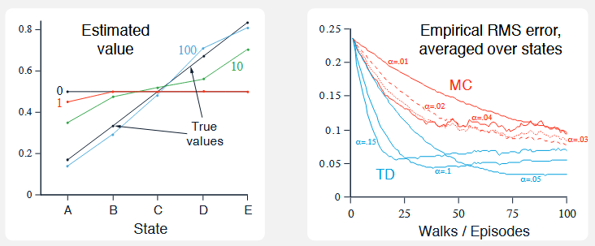

* **初始值设定**：所有状态的价值函数估计统一初始化为中心先验值：
  $$
  V_0(s) = 0.5, \quad \forall s \in \{A, B, C, D, E\}
  $$
  
* **均方根误差评价函数**：
  $$
  \text{RMS} \triangleq \sqrt{\frac{1}{|\mathcal{S}|} \sum_{s \in \mathcal{S}} \big( V(s) - v(s) \big)^2} = \sqrt{\frac{1}{5} \sum_{s \in \{A,B,C,D,E\}} \big( V(s) - v(s) \big)^2} \\
  \begin{aligned}
  \text{RMS}_0 &= \sqrt{\frac{1}{5} \left[ \left(\frac{1}{2} - \frac{1}{6}\right)^2 + \left(\frac{1}{2} - \frac{2}{6}\right)^2 + \left(\frac{1}{2} - \frac{3}{6}\right)^2 + \left(\frac{1}{2} - \frac{4}{6}\right)^2 + \left(\frac{1}{2} - \frac{5}{6}\right)^2 \right]} \\
  &= \sqrt{\frac{1}{5} \left[ \left(\frac{2}{6}\right)^2 + \left(\frac{1}{6}\right)^2 + 0 + \left(-\frac{1}{6}\right)^2 + \left(-\frac{2}{6}\right)^2 \right]} \\
  &= \sqrt{\frac{1}{5} \left[ \frac{4 + 1 + 0 + 1 + 4}{36} \right]} = \sqrt{\frac{10}{180}} = \sqrt{\frac{1}{18}} \approx 0.2357
  \end{aligned}
  $$
  

为了消除随机行走的蒙特卡洛采样噪声，右图的学习曲线是对每个参数配置在 **100 次完全独立的完整运行**上求得的经验均方根误差均值。

### 为何 TD 在随机游走中显著优于 MC？

在一维随机游走中，系统轨迹存在高度的**空间重叠性与回环游走**。例如，智能体在单次回合中可能经历：
$$
C \to B \to C \to D \to C \to B \to A \to \text{Left}
$$

* **蒙特卡洛的盲目性**：
  * MC 方法**完全忽略状态之间的马尔可夫图拓扑转移关系**。它将整条轨迹视作不可拆解的黑盒，仅将状态 $S_t$ 与最终终局 $G_t = 0$ 强行绑定配对。
  * 在上述轨迹中，虽然系统多次访问状态 $C$ 且在局部转移到了偏向右侧的 $D$，但因为最终由于远端随机游走落入左侧，MC 将对沿途所有的状态访问执行无差别的向下惩罚。
* **时序差分的拓扑感知性**：
  * TD 方法精确地建立在马尔可夫链的局部转移上。当出现单步转移 $C \to D$ 时，TD 直接利用当前对 $D$ 的评估来更新 $C$。
  * TD 隐式地利用了状态间的互联关系，将一次长轨迹解耦为多段局部马尔可夫转移，**最大化地榨取了有限数据中的状态转移概率结构**。

在一维无界吸收链中，到达终止吸收态的**随机停止时间 $\tau$**具有极大的方差。单次回合可能在 3 步内快速结束，也可能经历数百步的布朗运动式震荡。

* **MC 的方差累积**：
  * MC 目标为 $G_t \in \{0, 1\}$，其方差受整条随机游走长路径上的每一次抛硬币随机性的卷积累加。这种极高的样本方差严重削弱了参数更新的有效信噪比。
* **TD 的方差局域化**：
  * TD(0) 目标的方差仅来源于单步转移：
    $$
    \text{Target}_{\text{TD}} = R_{t+1} + \gamma V(S_{t+1}) = 0 + 0.5 \, V(S_t - 1) + 0.5 \, V(S_t + 1)
    $$
  * 由于绝大多数内部转移的即时奖励恒为 $0$，TD 靶子被严格限制在相邻状态的估计值均值内，**将全路径方差直接隔离在单步局部邻域之内**。

## Exercise 6.4(?)

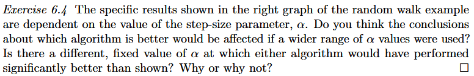

# 6.3 Optimality of TD(0)

在实际工程或科研中，交互数据往往是昂贵且有限的（例如仅记录了 10 条历史轨迹或 100 个转移样本，记为固定数据集 $\mathcal{D}$）。为了从有限数据中榨取最大的信息量，强化学习常采用**经验重放与批处理更新**机制。

设当前价值函数估计为 $V^{(k)}$（$k$ 为批迭代轮数）：

1. **冻结当前模型**：在遍历数据集 $\mathcal{D}$ 的过程中，**严格不就地修改价值表**；
2. **遍历累加所有样本增量**：对批次中每一个被访问到的非终止状态 $S_t$，根据单步公式计算更新建议量并累加：
   * **若采用 MC**（基于各时刻实际回报 $G_t$）：
     $$
     \Delta_{\text{batch}}^{\text{MC}}(s) \triangleq \alpha \sum_{t: S_t = s} \big( G_t - V^{(k)}(s) \big)
     $$
   * **若采用 TD(0)**（基于单步自举转移 $(S_t, R_{t+1}, S_{t+1})$）：
     $$
     \Delta_{\text{batch}}^{\text{TD}}(s) \triangleq \alpha \sum_{t: S_t = s} \big( R_{t+1} + \gamma V^{(k)}(S_{t+1}) - V^{(k)}(s) \big)
     $$
3. **批次结束，执行唯一一次全局更新**：
   $$
   V^{(k+1)}(s) \leftarrow V^{(k)}(s) + \Delta_{\text{batch}}(s), \quad \forall s \in \mathcal{S}
   $$
4. **循环往复**：拿着更新后的新表 $V^{(k+1)}$，把整批数据从头到尾再次输入计算，直至整个价值向量彻底收敛到不动点（即 $\Delta_{\text{batch}}(s) \to 0$）。

---

由于数据集 $\mathcal{D}$ 是完全固定的，批处理过程剥离了在线采样带来的随机游走噪声，转化为一个**确定性的压缩映射或线性迭代系统**。 当系统达到收敛不动点时，净更新量必须严格归零：
$$
\Delta_{\text{batch}}(s) = 0 \implies \alpha \sum_{t: S_t = s} \delta_t = 0
$$
因为假定 $\alpha > 0$，等式两边的 $\alpha$ 可以被**直接约去**：
$$
\sum_{t: S_t = s} \delta_t = 0
$$
**因此，最终解的数值仅取决于这批数据本身的统计结构，步长 $\alpha$ 仅决定逼近该解的迭代步幅与速率，对最终不动点的位置没有任何影响。**但面对同一批训练数据，MC 和 TD(0) 各自追求的**统计最优准则**有着根本性分歧：

**(1) 批处理 MC 的极限解：样本均值**

批处理 MC 求解的是使训练集上的经验误差平方和最小的价值函数：
$$
\min_{V} \sum_{t} \big( G_t - V(S_t) \big)^2
$$
**每个状态的价值，严格等于该状态在训练集里观测到的所有实际回报的算术平均值**。它将每个状态视为孤立的标量回归问题，完全忽略了马尔可夫决策过程的状态转移逻辑。

> [!IMPORTANT]
>
> 设我们拥有一批完全固定的有限历史经验数据集 $\mathcal{D}$。在该数据集中：
>
> * 状态 $s$ 被访问的总次数记为 $N(s) \triangleq \sum_{t} \mathbb{I}(S_t = s)$；
> * 状态 $s$ 转移到后继状态 $s'$ 的总次数记为 $N(s \to s')$；
> * 状态 $s$ 转移时产生的所有即时奖励总和记为 $\sum_{t: S_t = s} R_{t+1}$。
>
> ---
>
> 在批处理更新中，MC 对状态 $s$ 的总累加更新量为：
> $$
> \Delta_{\text{batch}}^{\text{MC}}(s) = \alpha \sum_{t: S_t = s} \big( G_t - V(s) \big)
> $$
> 当批处理算法迭代直至彻底收敛（到达不动点）时，总更新量必须严格归零：
> $$
> \Delta_{\text{batch}}^{\text{MC}}(s) = 0 \implies \alpha \sum_{t: S_t = s} \big( G_t - V(s) \big) = 0
> $$
> 两边约去 $\alpha$ 并展开求和号：
> $$
> \sum_{t: S_t = s} G_t - \sum_{t: S_t = s} V(s) = 0
> $$
> 因为此时已达到理论最优，在求和过程中 $V(s)$ 是固定的，一共累加了 $N(s)$ 次：
> $$
> \sum_{t: S_t = s} G_t - N(s) V(s) = 0 \\
> \implies V_{\text{MC}}^*(s) = \frac{1}{N(s)} \sum_{t: S_t = s} G_t
> $$
> 最终收敛的值 $V_{\text{MC}}^*(s)$，在数学上**严格等于状态 $s$ 后面所跟随的所有历史回报 $G_t$ 的算术平均值**！
>
> ##### 为什么它等价于“最小化样本均方误差”？
>
> 构造训练集上的经验均方误差损失函数：
> $$
> J(V) \triangleq \frac{1}{2} \sum_{t} \big( G_t - V(S_t) \big)^2 = \frac{1}{2} \sum_{s \in \mathcal{S}} \sum_{t: S_t = s} \big( G_t - V(s) \big)^2
> $$
> 对未知参数 $V(s)$ 求偏导数：
> $$
> \frac{\partial J}{\partial V(s)} = - \sum_{t: S_t = s} \big( G_t - V(s) \big)
> $$
> 令梯度等于 0：
> $$
> \frac{\partial J}{\partial V(s)} = 0 \iff V(s) = \frac{1}{N(s)} \sum_{t: S_t = s} G_t
> $$
> 批处理 MC 本质上就是**以全批次梯度下降法最小化经验均方误差**，因此其解必然是使得样本方差最小的均值解。

**(2) 批处理 TD(0) 的极限解：确定性等价估计**

批处理 TD(0) 求解的是与经验数据最为拟合的**最大似然马尔可夫模型的解析解**：
1. 它在隐式层面上，先统计了批次数据中状态转移的经验频次：
   $$
   \hat{p}(s' \mid s) \triangleq \frac{N(s \to s')}{N(s)}, \quad \hat{r}(s) \triangleq \frac{\sum R}{N(s)}
   $$
2. 然后，它精确求解该经验模型下的贝尔曼线性方程组：
   $$
   \mathbf{V}_{\text{TD}} = (\mathbf{I} - \gamma \hat{\mathbf{P}})^{-1} \hat{\mathbf{r}}
   $$

> [!IMPORTANT]
>
> 在批处理更新中，TD(0) 对状态 $s$ 累加的单步自举更新量为：
> $$
> \Delta_{\text{batch}}^{\text{TD}}(s) = \alpha \sum_{t: S_t = s} \big( R_{t+1} + \gamma V(S_{t+1}) - V(s) \big)
> $$
> 当算法达到不动点收敛时，总更新量同样必须为 0：
> $$
> \sum_{t: S_t = s} \big( R_{t+1} + \gamma V(S_{t+1}) - V(s) \big) = 0
> $$
> 我们将这三项逐一拆解求和：
>
> 1. **第一项（即时奖励求和）**：
>    根据统计学中经验平均即时奖励的定义 $\hat{r}(s) \triangleq \frac{1}{N(s)} \sum_{t: S_t = s} R_{t+1}$，可得：
>    $$
>    \sum_{t: S_t = s} R_{t+1} = N(s) \, \hat{r}(s)
>    $$
>    
>
> 2. **第三项（当前价值求和）**：
>    $V(s)$ 累加了 $N(s)$ 次：
>    $$
>    \sum_{t: S_t = s} V(s) = N(s) \, V(s)
>    $$
>
> 3. **第二项（后继状态价值自举项求和，核心关键步）**：
>    在数据集里，从状态 $s$ 出发、后继状态恰好转移到 $s'$ 的频次为 $N(s \to s')$。因此可以将时间求和转化为对所有可能后继状态 $s'$ 的空间求和：
>    $$
>    \sum_{t: S_t = s} V(S_{t+1}) = \sum_{s' \in \mathcal{S}} N(s \to s') \, V(s')
>    $$
>    引入经验转移概率的最大似然估计：
>    $$
>    \hat{P}(s' \mid s) \triangleq \frac{N(s \to s')}{N(s)} \implies N(s \to s') = N(s) \, \hat{P}(s' \mid s)
>    $$
>    代入上式：
>    $$
>    \sum_{t: S_t = s} V(S_{t+1}) = \sum_{s' \in \mathcal{S}} N(s) \, \hat{P}(s' \mid s) \, V(s') = N(s) \sum_{s' \in \mathcal{S}} \hat{P}(s' \mid s) \, V(s')
>    $$
>
> 将这三项代回批处理收敛方程：
> $$
> N(s) \, \hat{r}(s) + \gamma N(s) \sum_{s' \in \mathcal{S}} \hat{P}(s' \mid s) \, V(s') - N(s) \, V(s) = 0
> $$
> 等式两边同除以访问次数 $N(s)$（$N(s) > 0$）：
> $$
> \hat{r}(s) + \gamma \sum_{s' \in \mathcal{S}} \hat{P}(s' \mid s) \, V(s') - V(s) = 0  \\
> \implies V(s) = \hat{r}(s) + \gamma \sum_{s' \in \mathcal{S}} \hat{P}(s' \mid s) \, V(s')
> $$
> 这**分毫不差地正是基于经验转移模型 $\hat{\mathbf{P}}$ 和经验奖励 $\hat{\mathbf{r}}$ 的贝尔曼期望方程**！
>
> 将其写成全状态向量矩阵形式：
> $$
> \mathbf{V} = \hat{\mathbf{r}} + \gamma \hat{\mathbf{P}} \mathbf{V} \\
> \implies (\mathbf{I} - \gamma \hat{\mathbf{P}}) \mathbf{V} = \hat{\mathbf{r}} \\
> \implies \mathbf{V}_{\text{TD}}^* = (\mathbf{I} - \gamma \hat{\mathbf{P}})^{-1} \hat{\mathbf{r}}
> $$

* **MC 的最优是“狭隘、孤立的最优”**：它仅仅是把眼前这批**已发生样本**的历史平方误差降到了最低；
* **TD 的最优是“预测未来回报的最优”**：它考虑了数据背后的**马尔可夫状态转移拓扑结构**，对未来尚未发生的全新轨迹具有压倒性的泛化预测能力。

---

## **AB 状态转移问题**

观测到的固定数据集：

1. $A \to 0, B \to 0$（从 $A$ 出发，获得奖励 $0$，转移到 $B$，获得奖励 $0$，随后终止）
2. $B \to 1$（从 $B$ 出发，直接获得奖励 $1$，终止）
3. $B \to 1$
4. $B \to 1$
5. $B \to 1$
6. $B \to 1$
7. $B \to 1$
8. $B \to 0$（从 $B$ 出发，直接获得奖励 $0$，终止）

在 8 个回合中，状态 $B$ 共被访问 8 次：
* 其中 6 次最终获得回报 $1$；
* 另外 2 次最终获得回报 $0$。
  无论采用何种统计视角，大家一致认定状态 $B$ 的最优价值估计为其样本均值：
  $$
  V(B) = \frac{6 \times 1 + 2 \times 0}{8} = \frac{6}{8} = \mathbf{\frac{3}{4}} \quad (0.75)
  $$

---

状态 $A$ 的价值究竟应该是多少？面对这一批数据，有两种截然不同的推断逻辑：

- 答案 A（批处理蒙特卡洛 MC 的答案）：$V(A) = 0$

  * **推断依据**：全数据集中状态 $A$ 仅出现过一次，该回合紧接着的最终实际累计回报就是 $0$。

  * **数学性质**：该答案使得训练集上的误差严格为零：$(0 - V(A))^2 = 0$。它在已有样本上达到了绝对完美的“零残差”。

- 答案 B（批处理时序差分 TD 的答案）：$V(A) = \frac{3}{4}$

  * **推断依据**：
    
    1. 数据表明：从 $A$ 出发，有 $100\%$ 的确定性转移到状态 $B$，且即时奖励为 $0$；
    2. 我们已经通过 8 个样本确认了 $B$ 的价值是 $\frac{3}{4}$；
    3. 既然去了 $B$ 且沿途无损耗，那么处在状态 $A$ 理应获得与 $B$ 相同的期望价值：
       $$
       V(A) = 0 + 1 \times V(B) = \mathbf{\frac{3}{4}}
       $$

假设明天这个马尔可夫过程再次运行，智能体又从状态 $A$ 出发：
* 它必然走向 $B$；
* 一旦到达 $B$，它有高达 $75\%$ 的概率最终拿到 $+1$ 的奖励。
* **显然，认定 $V(A) = \frac{3}{4}$ 的人在打赌中会大获全胜；而认定 $V(A) = 0$ 的 MC 方法，则因为死记硬背了唯一一次偶然样本，彻底丧失了预测能力。**

---

## 确定性等价估计

确定性等价估计是经典统计学与控制论中最推崇的最优估计准则：

1. **构建最大似然模型**：从经验数据集中提取经验转移概率 $\hat{P}(j \mid i) = \frac{N(i \to j)}{N(i)}$ 以及经验期望奖励 $\hat{r}(i) = \frac{\sum R}{N(i)}$。这组参数使得生成该批观测数据的联合概率达到最大。
2. **求解确定性系统**：**假定该估计出的经验模型就是绝对确定的真实模型**，进而精确求解该模型对应的贝尔曼方程解析解：
   $$
   \mathbf{V}_{\text{CE}} = (\mathbf{I} - \gamma \hat{\mathbf{P}})^{-1} \hat{\mathbf{r}}
   $$

**批处理 $\text{TD}(0)$ 在数学上严格收敛至该确定性等价估计 $\mathbf{V}_{\text{CE}}$！**

* 在统计学中，确定性等价估计被证明在马尔可夫结构下具有**最小的渐近方差**，能将有限数据里的信息利用到极致。TD 算法虽然没有显式去算矩阵逆，但其自举迭代机制在无形中**完美求解了最大似然马尔可夫模型**。
* **在线更新（Non-batch）的映射**：平时的在线单步 TD(0) 虽然不会完全停在确定性等价点，但它每一步都在向着这个更高维度的最优解前进；而在线 MC 则是向着容易过拟合的样本均值前进。

设环境的离散状态数为 $n = |\mathcal{S}|$：

| 求解维度                          | 显式构建最大似然模型并求逆                                   | 时序差分算法（TD(0)）                                        |
| :-------------------------------- | :----------------------------------------------------------- | :----------------------------------------------------------- |
| **内存空间复杂度（Memory）**      | **$O(n^2)$** 必须开辟二维矩阵存储全转移矩阵 $\hat{\mathbf{P}} \in \mathbb{R}^{n \times n}$ | **$O(n)$** 仅需一个一维向量存储当前价值表 $V \in \mathbb{R}^n$ |
| **计算时间复杂度（Computation）** | **$O(n^3)$** 矩阵求逆 $(\mathbf{I} - \gamma \hat{\mathbf{P}})^{-1}$ 的经典计算开销 | **$O(n)$ 或 $O(L)$** 每次遍历仅涉及极其轻量的单步标量加减乘除 |

# 6.4 Sarsa: On-policy TD Control

在前几节中，讨论局限于给定固定目标策略 $\pi$ 时的**策略评估**，即估计状态价值函数 $v_\pi(s)$。本节的目标是求解马尔可夫决策过程的**最优控制问题**，即寻找最优策略 $\pi_*$ 及最优动作价值函数 $q_*$。控制算法遵循**广义策略迭代**的交替演化范式：

在无环境动力学模型的先验假设下，GPI 闭环的构建面临两个核心抉择：
1. **价值函数的载体选择**：从状态价值 $V(s)$ 彻底转向**动作价值 $Q(s, a)$**；
2. **行为策略与更新目标的关系**：采用**On-policy**架构，保证探索与利用的动态平衡。

在离散时间轴上，智能体与环境的交互轨迹表现为状态与动作的交替序列：
$$
S_0, A_0, R_1, S_1, A_1, R_2, S_2, A_2, \dots
$$

* **复合状态构建**： 
  定义复合状态变量 $Z_t \triangleq (S_t, A_t) \in \mathcal{S} \times \mathcal{A}$。
* **转移马尔可夫性证明**： 在固定行为策略 $\pi(a \mid s)$ 和马尔可夫决策过程转移核 $p(s', r \mid s, a)$ 下，序列 $\{Z_t\}_{t \ge 0}$ 构成一个定义在增广状态空间 $\mathcal{S} \times \mathcal{A}$ 上的**经典马尔可夫奖励过程（MRP）**：
  $$
  P(Z_{t+1} \mid Z_t) = P(S_{t+1}, A_{t+1} \mid S_t, A_t) = \sum_{r} p(S_{t+1}, r \mid S_t, A_t) \cdot \pi(A_{t+1} \mid S_{t+1})
  $$
*  “状态-动作对转移系统”与“状态转移系统”在数学结构上**完全同构**，**保证状态价值估计收敛的所有理论定理，无缝适用于动作价值函数 $Q(s, a)$ 的学习**。

---

## Sarsa 与五元组

单步时序差分应用于动作价值更新，得到 Sarsa 的核心迭代公式：
$$
Q(S_t, A_t) \leftarrow Q(S_t, A_t) + \alpha \, \delta_t
$$
其中**动作价值 TD 误差**定义为：
$$
\delta_t \triangleq R_{t+1} + \gamma Q(S_{t+1}, A_{t+1}) - Q(S_t, A_t)
$$
单次参数更新的触发，严格依赖于时序上相继发生的 5 个随机事件构成的五元组：
$$
\Big( \mathbf{S}_t, \, \mathbf{A}_t, \, \mathbf{R}_{t+1}, \, \mathbf{S}_{t+1}, \, \mathbf{A}_{t+1} \Big)
$$

---

## On-Policy与 $\varepsilon$-贪婪行为探索

Sarsa 属于严格的**On-policy控制算法**。

* **定义**：用于**生成与环境交互经验数据的策略（Behavior Policy）**，与算法当前正在**评估与优化的目标策略（Target Policy）**是**同一个策略 $\pi$**。
* 在自举项 $Q(S_{t+1}, A_{t+1})$ 中，动作 $A_{t+1}$ 不是虚构假设的动作，而是智能体**在现实中真正执行、真正迈出下一步的物理动作**。

为了确保所有“状态-动作”对均有非零概率被持续访问，当前行为策略 $\pi$ 采用关于 $Q$ 函数的 $\varepsilon$-贪婪分布：
$$\pi(a \mid s) = \begin{cases} 
1 - \varepsilon + \dfrac{\varepsilon}{|\mathcal{A}(s)|}, & \text{若 } a = \arg\max_{a' \in \mathcal{A}(s)} Q(s, a') \quad (\text{以绝对优势利用最优动作}) \\[8pt]
\dfrac{\varepsilon}{|\mathcal{A}(s)|}, & \text{若 } a \neq \arg\max_{a' \in \mathcal{A}(s)} Q(s, a') \quad (\text{以均匀概率探索非优动作})
\end{cases}$$
其中 $\varepsilon \in (0, 1)$ 为探索率，$|\mathcal{A}(s)|$ 为状态 $s$ 下的可用动作集合基数。

---

## Sarsa 数学收敛性

与被动预测任务不同，在控制问题中，行为策略 $\pi$ 随着 $Q$ 的改变而不断动态改变，导致转移核处于**非平稳环境**下。

设环境为有限马尔可夫决策过程，初始价值矩阵 $Q_0(s, a)$ 任意选取。若同时满足以下两组条件，则动作价值函数以概率 1 收敛至最优动作价值：
$$\mathbb{P}\left( \lim_{t \to \infty} Q_t(s, a) = q_*(s, a) \right) = 1, \quad \forall s \in \mathcal{S}, a \in \mathcal{A}$$
同时策略 $\pi$ 渐进收敛至确定性最优策略 $\pi_*$。

**必备条件一：GLIE 条件（Greedy in the Limit with Infinite Exploration）**

1. **无限探索性（Infinite Exploration）**： 在无穷时域内，所有可能的状态-动作对必须被无限次遍历访问，消除未探索盲区：
   $$
   \sum_{t=1}^{\infty} \mathbb{I}(S_t = s, A_t = a) = \infty, \quad \forall s \in \mathcal{S}, a \in \mathcal{A}
   $$
   
2. **极限贪婪性（Greedy in the Limit）**： 行为策略在时间极限下必须单调退化为完全确定性的贪婪策略。在 $\varepsilon$-贪婪架构下，要求探索率序列 $\varepsilon_t$ 随时间连续衰减至零：
   $$
   \lim_{t \to \infty} \varepsilon_t = 0 \quad \left(\text{典型实现如设置 } \varepsilon_t = \frac{1}{t}\right)
   $$

**必备条件二：Robbins-Monro 随机逼近步长条件**

各状态-动作对所经历的有效步长参数序列 $\alpha_t(s, a)$ 必须满足经典的随机逼近充要约束：
$$
\sum_{t=1}^{\infty} \alpha_t(s, a) = \infty \quad \text{且} \quad \sum_{t=1}^{\infty} \alpha_t^2(s, a) < \infty, \quad \forall (s, a) \in \mathcal{S} \times \mathcal{A}
$$
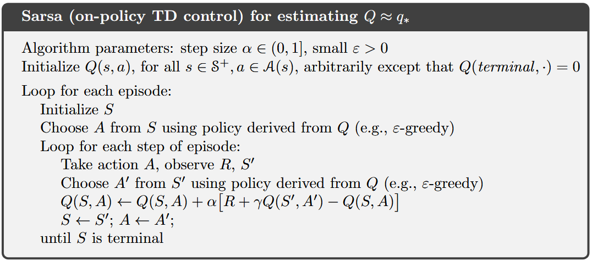

## Exercise 6.8

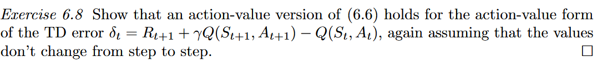

| 评估维度         | 蒙特卡洛全局误差（左式） | 单步 TD 误差定义（$\delta_k$）                               | 裂项累加等价恒等式                                           |
| :--------------- | :----------------------- | :----------------------------------------------------------- | :----------------------------------------------------------- |
| **状态价值 $V$** | $G_t - V(S_t)$           | $\delta_k^V \triangleq R_{k+1} + \gamma V(S_{k+1}) - V(S_k)$ | $$G_t - V(S_t) = \sum_{k=t}^{T-1} \gamma^{k-t} \delta_k^V$$  |
| **动作价值 $Q$** | $G_t - Q(S_t, A_t)$      | $\delta_k^Q \triangleq R_{k+1} + \gamma Q(S_{k+1}, A_{k+1}) - Q(S_k, A_k)$ | $$G_t - Q(S_t, A_t) = \sum_{k=t}^{T-1} \gamma^{k-t} \delta_k^Q$$ |

## Example 6.5

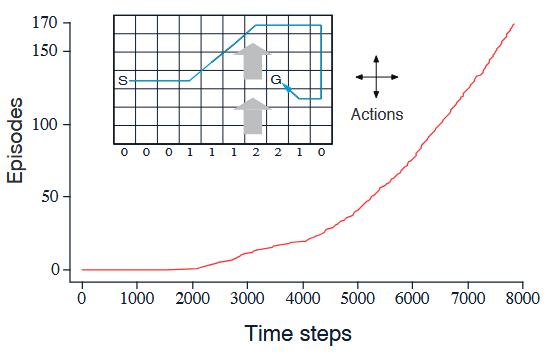

**状态空间** $\mathcal{S}$

* 环境由高 $7$、宽 $10$ 的二维离散网格构成，共 $7 \times 10 = 70$ 个离散状态；
* 状态坐标形式化表示为二维元组：$s \triangleq (r, c)$，其中行坐标 $r \in \{0, 1, \dots, 6\}$，列坐标 $c \in \{0, 1, \dots, 9\}$；
* **起点与终点**：初始状态固定为 $S \triangleq (3, 0)$，目标终止吸收态固定为 $G \triangleq (3, 7)$。

**动作空间 $\mathcal{A}$**

* 离散 4 动作集合：$\mathcal{A} \triangleq \{\text{上 (Up)}, \text{下 (Down)}, \text{左 (Left)}, \text{右 (Right)}\}$；
* 动作用单位位移向量表示：$\Delta \mathbf{a} \in \big\{ [1, 0]^\top, [-1, 0]^\top, [0, -1]^\top, [0, 1]^\top \big\}$。

**动力学转移方程与风力场**

* **垂直恒定风场**：在网格中部存在自下而上的横风，其强度仅与当前所处的列坐标 $c$ 相关，风力偏移向量定义为向上移动的格数 $w(c)$：
  $$
  w(c) = \begin{cases} 
  0, & c \in \{0, 1, 2, 9\} \\
  1, & c \in \{3, 4, 5, 8\} \\
  2, & c \in \{6, 7\} 
  \end{cases}
  $$
* **状态转移更新规则**：
  若智能体在状态 $(r_t, c_t)$ 采取动作 $\Delta \mathbf{a} = [\Delta r, \Delta c]^\top$，其后继状态 $(r_{t+1}, c_{t+1})$ 满足：
  $$
  \begin{cases}
  c_{t+1} = \operatorname{clip}\big( c_t + \Delta c, \, 0, \, 9 \big) \\
  r_{t+1} = \operatorname{clip}\big( r_t + \Delta r + w(c_t), \, 0, \, 6 \big)
  \end{cases}
  $$

**奖励函数与最优控制目标**

* **未折扣任务**：折扣因子 $\gamma = 1$；
* **阶段代价**：除到达终止态 $G$ 时的转移外，其余所有步进转移的即时奖励恒为 $-1$：
  $$
  R_{t+1} = -1, \quad \forall S_{t+1} \neq G
  $$
* **控制目标**：寻找使累计回报最大化的最优控制策略 $\pi_*$：
  $$
  G_0 = \sum_{t=0}^{T-1} (-1) = -T
  $$
  **在数学上严格等价于使到达终点的物理耗时最小化**。

---

不同于普通图表以 Episode 为横轴，本图采用了**横轴为累计时间步、纵轴为累计完成回合数**的反向度量坐标系。

* **斜率的物理意义**：
  $$
  \text{瞬时斜率} \triangleq \frac{d(\text{Episodes})}{d(\text{Time steps})} = \frac{1}{\text{当前完成单个回合所需的时间步长 } T}
  $$
  
  * **曲线斜率越大，代表完成一个回合所消耗的步数越少，智能体寻找最优路径的控制性能越强**。

1. **探索冷启动期（$t \in [0, 2000]$）**：  
   
   * 曲线在横轴 $0 \sim 2000$ 步区间高度贴紧横坐标轴，斜率接近于 $0$；
   * **物理原因**：初始动作价值全设为 $0$（$Q_0(s, a) \equiv 0$），智能体开局处于盲目布朗运动试错状态。受风持续吹飞影响，首个回合耗费了近 $2000$ 步才偶然跌跌撞撞抵达终点 $G$。
2. **高速收敛平稳期（$t > 3000$ 之后）**：  
   * 曲线迅速抬升并转化为一条**斜率恒定的大倾角陡峭直线**；
   * **量化测算**：在 $8000$ 步左右，曲线在约 $5000$ 个时间步内完成了近 $150$ 个回合，平均单回合耗时稳定在：
     $$
     \bar{T} \approx \frac{8000 - 3000}{170 - 20} \approx \frac{5000}{150} \approx 33 \text{ 步} \xrightarrow{t \to 8000} \mathbf{17 \text{ 步}}
     $$

* **理论绝对最短路径（15 步）**： 
  如图中右侧内嵌小图所示，最优确定性策略是一条巧妙“顺应风力并折向包抄”的流线型轨迹：
  * 先沿第 3 行水平向右推进（利用弱风区平稳过渡）；
  * 进入第 6、7 列强风区时被吹至顶格（第 6 行），继续向右突破风区至第 8、9 列无风区；
  * 从目标点右后方绕行南下，最终从右向左“逆风反切”切入目标点 $G$；
  * **全局最优步数严格为 $15$ 步**。
* **$\varepsilon$-贪婪的行为开销**： 
  由于测试中保留了 $\varepsilon = 0.1$ 的恒定试错概率，智能体平均每 10 步就会有 1 步随机乱走，导致实测平均步长维持在 **$17$ 步**。

### Exercise 6.9

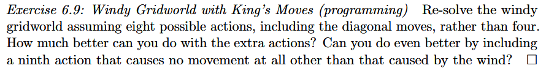

**Exercise 6.9** 要求我们在经典带风网格世界的基础上，**扩展智能体的动作自由度**，并定量对比以下三组控制实验：

1. **标准 4 动作基准**：$\mathcal{A}_4 = \{\text{上, 下, 左, 右}\}$；
2. **王走法**：在 4 动作基础上引入 4 个对角线斜向位移；
3. **含静止的王走法**：在 8 动作基础上引入第 9 种动作——**主动停留在原地（仅受竖直风力漂移驱动）**。

---

设起点坐标为 $S = (3, 0)$，目标终点坐标为 $G = (3, 7)$（行坐标 $r \in [0, 6]$，列坐标 $c \in [0, 9]$，自底向上为 $r=0 \sim 6$）：
* **水平位移下界**： 
  从列 $c=0$ 到列 $c=7$，横向距离必须跨越 $\Delta c = 7 - 0 = 7$ 格。 
  对于任意动作 $a$，每走一步的水平位移量满足：
  $$
  \Delta c_t \in \{-1, \, 0, \, +1\} \implies \Delta c_t \le 1
  $$
  因此，到达终点所需的理论最小物理步数 $T_{\min}$ 必然受到水平跨度的硬性几何下界约束：
  $$
  T \ge \frac{\Delta c}{\max(\Delta c_t)} = \frac{7}{1} = \mathbf{7 \text{ 步}}
  $$

* 第 9 种动作的位移增量为 $(\Delta r, \Delta c) = (0, 0)$，其水平位移贡献为 $\Delta c = 0$。智能体每停顿一次，向目标前进的水平距离就少推进 1 格。由水平几何下界 $T \ge 7$ 可知，**7 步已经是所有动作策略不可逾越的物理绝对下限**。

$$
\begin{array}{l}
\hline
\textbf{Algorithm: Tabular Sarsa(0) for Deterministic Windy Gridworld with King's Moves} \\
\hline
\textbf{Input:} \\
\quad \text{Learning rate } \alpha \in (0, 1] \quad (\texttt{alpha = 0.5}), \quad \text{Exploration rate } \varepsilon > 0 \quad (\texttt{epsilon = 0.1}), \quad \gamma = 1.0 \\
\quad \text{Grid dimensions: } H = 7, \, W = 10, \quad \text{Start } S_0 = (3, 0), \quad \text{Goal } G = (3, 7) \\
\quad \text{Deterministic wind vector: } \mathbf{w} = [0, 0, 0, 1, 1, 1, 2, 2, 1, 0] \in \mathbb{R}^{10} \\
\quad \text{Action displacement matrix: } \mathbf{A} \in \mathbb{R}^{|\mathcal{A}| \times 2} \quad (|\mathcal{A}| \in \{8, 9\}) \\
\textbf{Initialize:} \\
\quad \mathbf{Q} \leftarrow \mathbf{0}_{H \times W \times |\mathcal{A}|} \in \mathbb{R}^{7 \times 10 \times |\mathcal{A}|} \quad (\texttt{Q = np.zeros((7, 10, num\_actions))}) \\
\quad \mathbf{Q}[r_G, c_G, :] \leftarrow \mathbf{0} \quad (\text{Absorbing terminal boundary condition}) \\
\hline
\textbf{Loop for each episode:} \\
\quad 1.\; \text{Initialize state } S \leftarrow S_0 = (3, 0), \quad (r, c) \leftarrow (3, 0) \\
\quad 2.\; \text{Sample } \xi \sim \mathcal{U}([0, 1]) \\
\quad \quad \textbf{if } \xi \ge \varepsilon \textbf{ then} \\
\quad \quad \quad \mathcal{A}^* \leftarrow \left\{ a \in \mathcal{A} \;\middle|\; \mathbf{Q}[r, c, a] = \max_{a'} \mathbf{Q}[r, c, a'] \right\} \quad (\texttt{np.where(Q[r, c, :] == np.max(Q[r, c, :]))[0]}) \\
\quad \quad \quad A \sim \text{Uniform}(\mathcal{A}^*) \quad (\texttt{np.random.choice(candidate\_actions)}) \\
\quad \quad \textbf{else} \\
\quad \quad \quad A \sim \text{Uniform}(\{0, 1, \dots, |\mathcal{A}| - 1\}) \quad (\texttt{np.random.randint(num\_actions)}) \\
\quad \quad \textbf{end if} \\
\\
\quad \textbf{While } S \ne G \textbf{ do:} \\
\quad \quad 3.\; \text{Extract action displacement vector: } (\Delta r, \Delta c) \leftarrow \mathbf{A}[A, :] \\
\quad \quad 4.\; \text{Query deterministic vertical wind displacement: } W \leftarrow \mathbf{w}[c] \\
\\
\quad \quad 5.\; \text{Compute next state via saturated clipping addition:} \\
\quad \quad \quad r' \leftarrow \min(H - 1, \, \max(0, \, r + \Delta r + W)) \quad (\texttt{np.clip(r + dr + w, 0, 6)}) \\
\quad \quad \quad c' \leftarrow \min(W_{\text{width}} - 1, \, \max(0, \, c + \Delta c)) \quad (\texttt{np.clip(c + dc, 0, 9)}) \\
\quad \quad \quad S' \leftarrow (r', c'), \quad R \leftarrow -1.0 \\
\\
\quad \quad 6.\; \textbf{if } S' = G \textbf{ then} \\
\quad \quad \quad \delta \leftarrow R - \mathbf{Q}[r, c, A] \quad (\text{Terminal Bellman error}) \\
\quad \quad \quad \mathbf{Q}[r, c, A] \leftarrow \mathbf{Q}[r, c, A] + \alpha \, \delta \quad (\texttt{Q[r, c, A] += alpha * delta}) \\
\quad \quad \quad \textbf{break} \quad (\text{Episode terminates}) \\
\quad \quad \textbf{else} \\
\quad \quad \quad 7.\; \text{Select next action } A' \text{ from } S' \text{ using } \varepsilon\text{-greedy policy over } \mathbf{Q}[r', c', :] \\
\quad \quad \quad 8.\; \delta \leftarrow R + \gamma \, \mathbf{Q}[r', c', A'] - \mathbf{Q}[r, c, A] \quad (\text{Non-terminal TD error}) \\
\quad \quad \quad 9.\; \mathbf{Q}[r, c, A] \leftarrow \mathbf{Q}[r, c, A] + \alpha \, \delta \\
\quad \quad \quad 10.\; (r, c) \leftarrow (r', c'), \quad S \leftarrow S', \quad A \leftarrow A' \\
\quad \quad \textbf{end if} \\
\quad \textbf{end While} \\
\hline
\textbf{Output:} \text{Converged 3D tensor } \mathbf{Q}^* \in \mathbb{R}^{7 \times 10 \times |\mathcal{A}|}, \quad \text{Deterministic optimal trajectory } \tau^* \text{ of length } |\tau^*| - 1 \\
\hline
\end{array}
$$

### Exercise 6.10

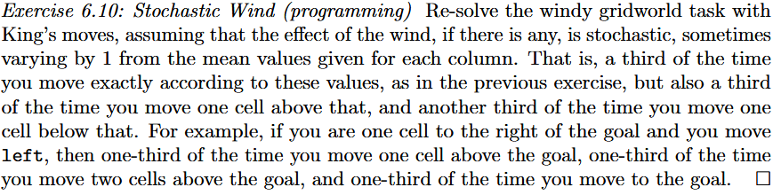

> 重新求解包含 **King's moves** 的有风网格世界任务。假定风力效果（如果存在风）是**随机的**，在每一列给定的基准均值风力基础上以各 $\frac{1}{3}$ 的概率上下浮动 $1$ 格。即：$\frac{1}{3}$ 的时间位移严格等于该列风速；$\frac{1}{3}$ 的时间向上多移动一格；$\frac{1}{3}$ 的时间向上少移动一格。例如：智能体位于目标正右侧相邻格（即第 8 列、第 3 行）并执行向左（`Left`）动作，则有 $\frac{1}{3}$ 概率到达目标正上方一格、$\frac{1}{3}$ 概率到达目标正上方两格、$\frac{1}{3}$ 概率恰好到达目标点。

---

网格世界尺寸设定为高 $H = 7$、宽 $W = 10$：

* **行坐标**：$r \in \{0, 1, 2, 3, 4, 5, 6\}$，以网格最底行为 $0$，最顶行为 $6$；

* **列坐标**：$c \in \{0, 1, 2, \dots, 9\}$，以最左列为 $0$，最右列为 $9$；

* **状态空间**：$\mathcal{S} = \{(r, c) \mid r \in \{0, \dots, 6\}, \, c \in \{0, \dots, 9\}\}$，总状态数 $|\mathcal{S}| = 70$；

* **初始状态**：$S_0 = (3, 0)$；

* **终止状态**：$S_{\text{terminal}} = G = (3, 7)$。

* **单步回报**：每个环境转移步均给予负惩罚，即：
  $$
  R_{t+1} = -1, \quad \forall t \ge 0
  $$

* **折扣因子**：未折扣回合型任务，$\gamma = 1.0$；

* **累积回报（Return）**：若回合在 $T$ 步后首次触及目标状态 $G$，则 $t=0$ 时的累积回报为：
  $$
  G_0 = \sum_{k=0}^{T-1} R_{k+1} = -T
  $$
  因此，最大化期望回报 $\mathbb{E}[G_0]$ 在数学上严格等价于**最小化到达目标点的期望耗费步数 $\mathbb{E}[T]$**。

---

**随机风转移核**：各列名义基准风速向量为：
$$
\bar{w} = [0, \, 0, \, 0, \, 1, \, 1, \, 1, \, 2, \, 2, \, 1, \, 0]
$$
根据题意，仅在存在风的列（即 $\bar{w}(c) > 0$ 的列：$c \in \{3, 4, 5, 6, 7, 8\}$）引入离散均匀噪声扰动 $\eta_t \in \{-1, 0, 1\}$；无风列（$c \in \{0, 1, 2, 9\}$）风力严格确定为 $0$。

随机扰动变量 $\eta_t$ 的概率分布律：
$$
P(\eta_t = k \mid c) = \begin{cases} 
\frac{1}{3}, & k \in \{-1, \, 0, \, +1\}, \quad \text{若 } \bar{w}(c) > 0 \\ 
1, & k = 0, \quad \text{若 } \bar{w}(c) = 0 
\end{cases}
$$
有效向上位移量 $W_t$ 为：
$$
W_t = \max\left(0, \, \bar{w}(c_t) + \eta_t\right)
$$

$$
\begin{array}{l}
\hline
\textbf{Algorithm: Tabular Sarsa(0) for Stochastic Windy Gridworld (Tensor Implementation)} \\
\hline
\textbf{Input:} \\
\quad \text{Learning rate } \alpha \in (0, 1] \quad (\texttt{alpha = 0.5}), \quad \text{Exploration rate } \varepsilon > 0 \quad (\texttt{epsilon = 0.1}), \quad \gamma = 1.0 \\
\quad \text{Grid dimensions: } H = 7, \, W = 10, \quad \text{Start } S_0 = (3, 0), \quad \text{Goal } G = (3, 7) \\
\quad \text{Nominal wind vector: } \bar{\mathbf{w}} = [0, 0, 0, 1, 1, 1, 2, 2, 1, 0] \in \mathbb{R}^{10} \\
\quad \text{Action displacement matrix: } \mathbf{A} \in \mathbb{R}^{8 \times 2} \quad (\texttt{ACTIONS}) \\
\textbf{Initialize:} \\
\quad \mathbf{Q} \leftarrow \mathbf{0}_{H \times W \times |\mathcal{A}|} \in \mathbb{R}^{7 \times 10 \times 8} \quad (\texttt{Q = np.zeros((7, 10, 8))}) \\
\quad \mathbf{Q}[r_G, c_G, :] \leftarrow \mathbf{0} \quad (\text{Terminal boundary condition}) \\
\hline
\textbf{Loop for each episode:} \\
\quad 1.\; \text{Initialize state } S \leftarrow S_0 = (3, 0), \quad (r, c) \leftarrow (3, 0) \\
\quad 2.\; \text{Sample } \xi \sim \mathcal{U}([0, 1]) \\
\quad \quad \textbf{if } \xi \ge \varepsilon \textbf{ then} \\
\quad \quad \quad \mathcal{A}^* \leftarrow \left\{ a \in \mathcal{A} \;\middle|\; \mathbf{Q}[r, c, a] = \max_{a'} \mathbf{Q}[r, c, a'] \right\} \quad (\texttt{np.where(Q[r, c, :] == np.max(Q[r, c, :]))[0]}) \\
\quad \quad \quad A \sim \text{Uniform}(\mathcal{A}^*) \quad (\texttt{np.random.choice(candidate\_actions)}) \\
\quad \quad \textbf{else} \\
\quad \quad \quad A \sim \text{Uniform}(\{0, 1, \dots, 7\}) \quad (\texttt{np.random.randint(8)}) \\
\quad \quad \textbf{end if} \\
\\
\quad \textbf{While } S \ne G \textbf{ do:} \\
\quad \quad 3.\; \text{Extract action vector } (\Delta r, \Delta c) \leftarrow \mathbf{A}[A, :] \\
\quad \quad 4.\; \text{Generate stochastic wind displacement: } \\
\quad \quad \quad \textbf{if } \bar{\mathbf{w}}[c] > 0 \textbf{ then} \\
\quad \quad \quad \quad \eta \sim \mathcal{U}(\{-1, 0, +1\}) \quad (\texttt{np.random.choice([-1, 0, 1])}) \\
\quad \quad \quad \quad W \leftarrow \max(0, \, \bar{\mathbf{w}}[c] + \eta) \\
\quad \quad \quad \textbf{else} \\
\quad \quad \quad \quad W \leftarrow 0 \\
\quad \quad \quad \textbf{end if} \\
\\
\quad \quad 5.\; \text{Compute next state via saturated vector addition:} \\
\quad \quad \quad r' \leftarrow \min(H - 1, \, \max(0, \, r + \Delta r + W)) \quad (\texttt{np.clip(r + dr + W, 0, 6)}) \\
\quad \quad \quad c' \leftarrow \min(W_{\text{width}} - 1, \, \max(0, \, c + \Delta c)) \quad (\texttt{np.clip(c + dc, 0, 9)}) \\
\quad \quad \quad S' \leftarrow (r', c'), \quad R \leftarrow -1.0 \\
\\
\quad \quad 6.\; \textbf{if } S' = G \textbf{ then} \\
\quad \quad \quad \delta \leftarrow R - \mathbf{Q}[r, c, A] \quad (\text{Terminal TD error}) \\
\quad \quad \quad \mathbf{Q}[r, c, A] \leftarrow \mathbf{Q}[r, c, A] + \alpha \, \delta \quad (\texttt{Q[r, c, A] += alpha * delta}) \\
\quad \quad \quad \textbf{break} \quad (\text{Episode terminates}) \\
\quad \quad \textbf{else} \\
\quad \quad \quad 7.\; \text{Select next action } A' \text{ from } S' \text{ using } \varepsilon\text{-greedy policy over } \mathbf{Q}[r', c', :] \\
\quad \quad \quad 8.\; \delta \leftarrow R + \gamma \, \mathbf{Q}[r', c', A'] - \mathbf{Q}[r, c, A] \quad (\text{Non-terminal TD error}) \\
\quad \quad \quad 9.\; \mathbf{Q}[r, c, A] \leftarrow \mathbf{Q}[r, c, A] + \alpha \, \delta \\
\quad \quad \quad 10.\; (r, c) \leftarrow (r', c'), \quad S \leftarrow S', \quad A \leftarrow A' \\
\quad \quad \textbf{end if} \\
\quad \textbf{end While} \\
\hline
\textbf{Output:} \text{Optimal action-value tensor } \mathbf{Q}^* \in \mathbb{R}^{7 \times 10 \times 8}, \quad \text{Closed-loop policy } \pi^*(s) = \arg\max_a \mathbf{Q}[r, c, :] \\
\hline
\end{array}
$$

# 6.5 Q-learning: Off-policy TD Control

## Q-learning 的本质

在马尔可夫决策过程（MDP）中，最优动作价值函数 $q_*(s, a)$ 满足 Bellman 最优方程：
$$
q_*(s, a) = \sum_{s', r} p(s', r \mid s, a) \left[ r + \gamma \max_{a'} q_*(s', a') \right] = \mathbb{E}\left[ R_{t+1} + \gamma \max_{a'} q_*(S_{t+1}, a') \;\middle|\; S_t = s, A_t = a \right]
$$
其对应的 Bellman 最优算子定义为 $\mathcal{T}^*$：
$$
(\mathcal{T}^* Q)(s, a) \triangleq \sum_{s', r} p(s', r \mid s, a) \left[ r + \gamma \max_{a'} Q(s', a') \right]
$$
由于智能体无法事先预知环境的转移概率分布 $p(s', r \mid s, a)$，Q-learning 采用**样本均值与随机逼近**机制：在时间步 $t$，智能体处于状态 $S_t$，执行动作 $A_t$，转移至 $S_{t+1}$ 并获得回报 $R_{t+1}$。此时，更新规则定义为：

$$
Q(S_t, A_t) \leftarrow Q(S_t, A_t) + \alpha_t \left[ R_{t+1} + \gamma \max_{a} Q(S_{t+1}, a) - Q(S_t, A_t) \right]
$$
其中：
*   **时序差分目标（TD Target）**：
    $$
    Y_t^{\text{Q}} \triangleq R_{t+1} + \gamma \max_{a} Q(S_{t+1}, a)
    $$
*   **时序差分误差（TD Error）**：
    $$
    \delta_t \triangleq Y_t^{\text{Q}} - Q(S_t, A_t) = R_{t+1} + \gamma \max_{a} Q(S_{t+1}, a) - Q(S_t, A_t)
    $$

---

## 为何无需重要性采样？

在经典离线策略方法中，若行为策略与目标策略不一致，必须借助**重要性采样比** $\rho_t = \frac{\pi(A_t \mid S_t)}{b(A_t \mid S_t)}$ 对期望进行加权校正，这往往会导致方差发散。**Q-learning 在更新过程中完全不需要重要性采样校正**。

Q-learning 的执行过程严格拆分为两个独立的策略：
1.  **目标策略 $\pi$**：算法所评估并致力于学习的策略。Q-learning 将其隐式固化为**关于当前估值 $Q$ 的确定性纯贪婪策略**：
    $$
    \pi(a \mid S_{t+1}) = \begin{cases} 1, & \text{若 } a = \arg\max_{a'} Q(S_{t+1}, a') \\ 0, & \text{其他} \end{cases}
    $$
2.  **行为策略 $b$**：负责与物理环境进行真实交互以产生样本转移轨迹的策略。通常采用探索性策略，如 $\varepsilon$-贪婪策略：
    $$
    b(a \mid S_t) = \begin{cases} 1 - \varepsilon + \frac{\varepsilon}{|\mathcal{A}(S_t)|}, & \text{若 } a = \arg\max_{a'} Q(S_t, a') \\ \frac{\varepsilon}{|\mathcal{A}(S_t)|}, & \text{其他} \end{cases}
    $$

在推导更新目标的期望时，针对下一时刻动作 $A_{t+1}$ 的求和：
$$
\sum_{a \in \mathcal{A}} \pi(a \mid S_{t+1}) Q(S_{t+1}, a) \equiv 1 \cdot \max_{a} Q(S_{t+1}, a) + \sum_{a \ne a^*} 0 \cdot Q(S_{t+1}, a) = \max_a Q(S_{t+1}, a)
$$

*   在 Sarsa 中，TD 目标是 $R_{t+1} + \gamma Q(S_{t+1}, A_{t+1})$，它显式依赖于行为策略在下一步实际抽样出的具体动作 $A_{t+1} \sim b(\cdot \mid S_{t+1})$，因此 Sarsa 学习的是行为策略本身的价值 $q_\pi$；
*   在 Q-learning 中，TD 目标直接取 $\max_a Q(S_{t+1}, a)$，**无论行为策略 $b$ 在下一时刻实际做出了什么动作，更新项都只取理论最优值**。因此，$Q$ 的更新完全独立于行为策略。

Q-learning 虽然在“更新标的”上独立于行为策略，但在“更新频率与覆盖率”上完全依赖行为策略：
*   如果在状态 $s$ 下，行为策略 $b(a \mid s) = 0$，则该状态-动作对 $(s, a)$ 永远不会被采样；
*   若 $(s, a)$ 永未经历环境采样转移，则对应的张量元素 $Q(s, a)$ 的数值将永远停留在初始化阶段，无法更新至最优值。

为了保证算法收敛到全局最优，行为策略必须具备**持续探索性**：
$$
\forall s \in \mathcal{S}, \; a \in \mathcal{A}(s), \quad b(a \mid s) > 0
$$
即任何可能的状态-动作对，在时间推演趋于无穷大时，必须被无限次访问。

| 特性维度             | **Sarsa(0)**                                                 | **Q-learning**                                               |
| :------------------- | :----------------------------------------------------------- | :----------------------------------------------------------- |
| **策略类型**         | **On-policy**                                                | **Off-policy**                                               |
| **目标策略 $\pi$**   | $\varepsilon$-贪婪探索策略 $\pi = b$                         | 纯贪婪策略 $\pi(s) = \arg\max_a Q(s, a)$                     |
| **行为策略 $b$**     | $\varepsilon$-贪婪探索策略（与目标策略同一）                 | 任意具有完全支撑的探索策略（如 $\varepsilon$-greedy）        |
| **时序差分更新公式** | $Q(S, A) \leftarrow Q(S, A) + \alpha [R + \gamma Q(S', A') - Q(S, A)]$ | $Q(S, A) \leftarrow Q(S, A) + \alpha [R + \gamma \max_a Q(S', a) - Q(S, A)]$ |
| **更新目标取值依赖** | 显式依赖实际采取的下一步动作 $A'$                            | 仅依赖下一步转移状态 $S'$ 及候选动作的极大值                 |
| **收敛收敛目标**     | 逼近当前探索策略的价值函数 $q_\pi(s, a)$                     | 直接逼近全局最优价值函数 $q_*(s, a)$                         |
| **悬崖行走环境表现** | 偏向远离悬崖的安全路径                                       | 收敛到贴近悬崖的理论最优路径                                 |

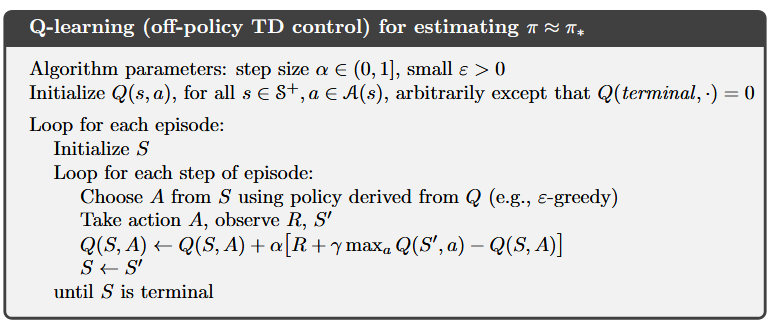

## Exercise 6.11

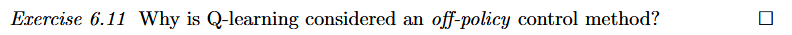
$$
Q(S_t, A_t) \leftarrow Q(S_t, A_t) + \alpha \left[ R_{t+1} + \gamma \max_{a} Q(S_{t+1}, a) - Q(S_t, A_t) \right]
$$
其时序差分目标为：
$$
Y_t^{\text{Q}} = R_{t+1} + \gamma \max_{a} Q(S_{t+1}, a)
$$
在状态 $S_{t+1}$ 处，项 $\max_a Q(S_{t+1}, a)$ 在数学期望意义下等价于：
$$
\max_a Q(S_{t+1}, a) \equiv \sum_{a \in \mathcal{A}} \pi(a \mid S_{t+1}) Q(S_{t+1}, a)
$$
其中，$\pi$ 是关于当前估值 $Q$ 的**确定性纯贪婪目标策略**：
$$
\pi(a \mid S_{t+1}) = \begin{cases} 1, & \text{若 } a = \arg\max_{a'} Q(S_{t+1}, a') \\ 0, & \text{其他} \end{cases}
$$
这表明：Q-learning 的更新标的始终是针对**纯贪婪策略 $\pi$（最终逼近最优策略 $\pi_*$）**进行价值估计。

为了保证算法收敛，必须满足持续探索条件。因此，在物理环境中实际采样选取动作 $A_t$ 时，智能体**不能**采取纯贪婪策略，而必须采用具备完全探索支撑的**软探索策略**，最典型的是 $\varepsilon$-贪婪策略：
$$
b(a \mid S_t) = \begin{cases} 1 - \varepsilon + \frac{\varepsilon}{|\mathcal{A}(S_t)|}, & \text{若 } a = \arg\max_{a'} Q(S_t, a') \\ \frac{\varepsilon}{|\mathcal{A}(S_t)|}, & \text{其他} \end{cases} \quad (\varepsilon > 0)
$$
由于：
$$\pi(a \mid s) \ne b(a \mid s) \quad (\text{因为 } \pi \text{ 具有零探索率，而 } b \text{ 保持 } \varepsilon > 0 \text{ 的探索率})$$数据生成分布与价值逼近目标策略相分离，故 Q-learning 在理论体系上是标准的**Off-policyTD 控制算法**。

## Exercise 6.12

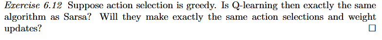

1.  **数值代数层面**：**是**。在确定性动作选择的前提下，二者的时序差分更新公式退化为完全相同的代数表达式。
2.  **动作选择与权重更新层面**：**取决于平局破缺机制（Tie-breaking Mechanism）**：
    *   若遇到最大值平局时采用**确定性破缺规则**（例如固定选择最小索引），则二者产生**完全相同的动作选择序列与权重更新序列**；
    *   若采用**随机平局破缺规则**（从并列最大值动作中均匀随机抽样），则二者可能做出**不同的动作选择，进而导致不同的权重更新**。
3.  **算法概念层面**：**严格来说不是同一个算法**。这属于特定极端参数（$\varepsilon = 0$）下的**行为退化重合**，二者的底层依赖结构与控制机理依然存在本质分野。

---

分别写出两者的标准时序差分更新方程：

* **Sarsa(0) 更新式**：
  $$
  Q(S_t, A_t) \leftarrow Q(S_t, A_t) + \alpha \left[ R_{t+1} + \gamma Q(S_{t+1}, A_{t+1}) - Q(S_t, A_t) \right]
  $$

* **Q-learning 更新式**：
  $$
  Q(S_t, A_t) \leftarrow Q(S_t, A_t) + \alpha \left[ R_{t+1} + \gamma \max_{a} Q(S_{t+1}, a) - Q(S_t, A_t) \right]
  $$

如果行为策略设定为**纯贪婪策略（$\varepsilon = 0$）**：
在 Sarsa 中，下一步动作 $A_{t+1}$ 必须通过贪婪策略选取：
$$
A_{t+1} \in \arg\max_{a} Q(S_{t+1}, a)
$$
因此，Sarsa 实际代入更新项的价值为：
$$
Q(S_{t+1}, A_{t+1}) = Q\left(S_{t+1}, \, \arg\max_a Q(S_{t+1}, a)\right) = \max_{a} Q(S_{t+1}, a)
$$
将此项代回 Sarsa 公式，其 TD 目标为：
$$
\text{TD Target}_{\text{Sarsa}} = R_{t+1} + \gamma \max_a Q(S_{t+1}, a) \equiv \text{TD Target}_{\text{Q-learning}}
$$
在纯贪婪选择下，Sarsa 的 TD 目标在代数上与 Q-learning 的 TD 目标完全重合。

---

尽管代数形式相同，但当状态 $S_{t+1}$ 处存在多个动作并列取得最大 Q 值时（即集合 $\mathcal{A}^* = \{a \mid Q(S_{t+1}, a) = \max_{a'} Q(S_{t+1}, a')\}$ 的基数 $|\mathcal{A}^*| > 1$）：

情形 A：**确定性平局破缺**:此时两者将执行**绝对完全相同的动作选择与权重更新序列**。

*   例如规则定义为：总是选取索引最小的动作 $a_{\min}^* = \min \mathcal{A}^*$；
*   从相同初始状态 $S_0$ 和初始表格 $Q_0$ 出发：
    *   两算法在每一步选出的动作 $A_t$ 严格同一；
    *   环境返回相同的转移 $S_{t+1}, R_{t+1}$；
    *   计算得到的 TD 误差 $\delta_t$ 完全相同；

情形 B：**随机平局破缺**:二者**不能保证**做出完全相同的动作选择与权重更新。

*   规则定义为：从 $\mathcal{A}^*$ 中按均匀分布随机抽取：$A \sim \text{Uniform}(\mathcal{A}^*)$；
*   **更新机制的时序差异**：
    *   **Q-learning** 计算 TD 目标仅依赖**标量最大值 $\max_a Q(S_{t+1}, a)$**，在时间步 $t$ 更新 $Q(S_t, A_t)$ 时，**无需确定具体的 $A_{t+1}$**；等到推演至时间步 $t+1$ 时，才独立进行随机动作抽取；
    *   **Sarsa** 在时间步 $t$ 计算更新前，**必须先在物理上实际抽取出具体的 $A_{t+1}$**，才能将其 $Q(S_{t+1}, A_{t+1})$ 填入公式。
*   由于随机数生成器独立抽样涨落，Sarsa 抽取出的动作与 Q-learning 抽取出的动作可能不同。一旦两者的随机采样在某一步发生分歧，后续的轨迹与 Q 表更新将彻底分道扬镳。

即使在情形 A 下二者数值轨迹完全一致，它们在概念体系上**仍然不能被视为同一个算法**：

| 比较维度         | Sarsa ($\varepsilon = 0$)                                    | Q-learning ($\varepsilon = 0$)                      |
| :--------------- | :----------------------------------------------------------- | :-------------------------------------------------- |
| **转移样本要求** | 需要完整的五元组样本 $(S_t, A_t, R_{t+1}, S_{t+1}, A_{t+1})$ | 仅需要四元组样本 $(S_t, A_t, R_{t+1}, S_{t+1})$     |
| **执行机制**     | 强依赖策略对下一步动作的实际生成结果                         | 直接在状态 $S_{t+1}$ 的动作通道上应用最大值泛函算子 |
| **策略关系**     | 目标策略 $\pi$ 始终被强制与当前行为策略 $b$ 绑定             | 目标策略 $\pi$ 在定义上独立于任何采样行为策略       |

# 6.6 Expected Sarsa

在 Bellman 期望方程中，给定转移后的下一状态 $S_{t+1}$，未来动作价值期望定义为：
$$
\mathbb{E}_{\pi}\left[ Q(S_{t+1}, A_{t+1}) \;\middle|\; S_{t+1} \right] \triangleq \sum_{a \in \mathcal{A}} \pi(a \mid S_{t+1}) Q(S_{t+1}, a)
$$
其中，$\pi(a \mid S_{t+1})$ 为目标策略在状态 $S_{t+1}$ 下选择动作 $a$ 的概率分布。

在接收到环境反馈转移样本 $(S_t, A_t, R_{t+1}, S_{t+1})$ 后，Expected Sarsa 的单步更新方程写作式：

$$
\begin{aligned}
Q(S_t, A_t) &\leftarrow Q(S_t, A_t) + \alpha \left[ R_{t+1} + \gamma \, \mathbb{E}_{\pi}\left[ Q(S_{t+1}, A_{t+1}) \;\middle|\; S_{t+1} \right] - Q(S_t, A_t) \right] \\
&\leftarrow Q(S_t, A_t) + \alpha \left[ R_{t+1} + \gamma \sum_{a \in \mathcal{A}} \pi(a \mid S_{t+1}) Q(S_{t+1}, a) - Q(S_t, A_t) \right] \quad (6.9)
\end{aligned}
$$

*   **时序差分目标（TD Target）**：
    $$
    Y_t^{\text{Expected}} \triangleq R_{t+1} + \gamma \sum_{a \in \mathcal{A}} \pi(a \mid S_{t+1}) Q(S_{t+1}, a)
    $$
*   **时序差分误差（TD Error）**：
    $$
    \delta_t^{\text{Expected}} \triangleq Y_t^{\text{Expected}} - Q(S_t, A_t) = R_{t+1} + \gamma \sum_{a \in \mathcal{A}} \pi(a \mid S_{t+1}) Q(S_{t+1}, a) - Q(S_t, A_t)
    $$

---

## 方差消除

在基于采样的时序差分算法中，单步 TD 目标的方差由两个相互独立的不确定性源头叠加而成：
$$
\text{Var}\left( Y_t \right) = \underbrace{\text{Var}_{S_{t+1}, R_{t+1}}\left( \mathbb{E}\left[ Y_t \mid S_{t+1}, R_{t+1} \right] \right)}_{\text{环境转移与回报的固有方差 (Environment Noise)}} + \underbrace{\mathbb{E}_{S_{t+1}}\left( \text{Var}_{A_{t+1} \sim \pi}\left( \gamma Q(S_{t+1}, A_{t+1}) \mid S_{t+1} \right) \right)}_{\text{下一动作抽样的策略方差 (Policy Action Noise)}}
$$

### Sarsa 方差
Sarsa 采用单次蒙特卡洛抽样产生 $A_{t+1}$，必须同时承受上述**两层方差的叠加**。特别是在探索率 $\varepsilon$ 较大或探索动作的价值差距悬殊时，$\text{Var}_{A_{t+1}}(Q)$ 极大，导致更新方向剧烈震荡。

### Expected Sarsa 方差
Expected Sarsa 给定转移状态 $S_{t+1}$ 后，通过有限动作集合的确定性加权求和 $\sum_a \pi(a \mid S_{t+1}) Q(S_{t+1}, a)$，**将第二项“策略动作方差”在解析层面压缩至绝对零**：
$$
\text{Var}_{A_{t+1}}\left( \sum_{a} \pi(a \mid S_{t+1}) Q(S_{t+1}, a) \;\middle|\; S_{t+1} \right) \equiv 0
$$
算法仅保留第一项环境转移方差。若环境本身的动力学转移也是确定性的，则 TD 目标的方差彻底为零。

---

图展示了三种 TD 控制方法在悬崖行走任务中的核心性能曲线，其横坐标为步长 $\alpha \in [0.1, 1.0]$，纵坐标为回合累积回报。

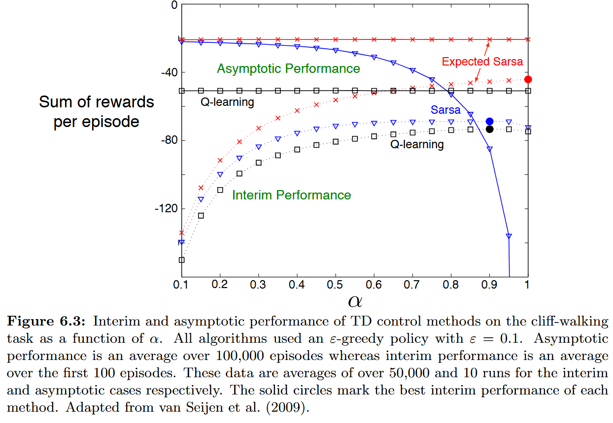

**(1) Expected Sarsa（红色实线与叉号）**

*   **曲线表现**：从 $\alpha = 0.1$ 到 $\alpha = 1.0$，水平笔直地锁定在约 $-20$ 的理论上限，完全不受步长增大的影响。
*   **动力学成因**：悬崖行走环境的状态转移是确定性的（无环境噪声）。由于 Expected Sarsa 消除了动作采样方差，其更新目标 $R + \gamma \sum_a \pi(a \mid S') Q(S', a)$ 是**完全确定且零噪声的精确数值**。在零方差条件下，即使将学习率推至极限 $\alpha = 1.0$（即直接令 $Q(S, A) \leftarrow \text{Target}$），算法相当于在执行确定性动态规划的就地值迭代，数值不仅不发散，反而以最快速度精确收敛至固定点。

**(2) Sarsa（蓝色实线与三角号）**

*   **曲线表现**：在 $\alpha = 0.1$ 时勉强接近 $-20$；随着 $\alpha$ 增大，性能迅速单调恶化；当 $\alpha \to 1.0$ 时，回报断崖式跌落至负无穷大。
*   **动力学成因**：Sarsa 保留了动作采样噪声。当 $\alpha = 1.0$ 时，更新公式变为：
    $$
    Q(S_t, A_t) \leftarrow R_{t+1} + \gamma Q(S_{t+1}, A_{t+1})
    $$
    一旦在临界状态触发了 $\varepsilon$ 探索选取了跳崖动作，前序动作的 Q 值将以**权重 $1.0$ 被全额覆盖为极其恶劣的数值**；紧接着下一步若抽中安全动作，数值又被大幅冲洗覆写。高学习率彻底放大了随机采样的抽样方差，导致策略振荡发散。因此，Sarsa 必须依赖很小的 $\alpha$ 来平均随机探索噪声。

**(3) Q-learning（黑色实线与方块号）**

*   **曲线表现**：在所有 $\alpha$ 取值下均平稳收敛在约 $-50$ 附近。
*   **动力学成因**：Q-learning 的更新算子为 $\max_a Q(S', a)$，其学习目标始终是最优贴崖路径（目标回报 $-13$）。但由于必须执行恒定 $\varepsilon = 0.1$ 的行为探索，智能体在物理上不断失足坠崖。**Q-learning 在线性能差是由其探索与目标的分离导致的客观物理惩罚，与步长 $\alpha$ 无关**。

中期性能衡量算法的**早期样本效率与学习速率**：
*   **Sarsa 与 Q-learning**：由于存在随机性，当 $\alpha$ 较小时学习过于迟缓；当 $\alpha \approx 0.9 \sim 1.0$ 时方差爆炸。其最佳短期折中点通常在 $\alpha \approx 0.8 \sim 0.9$ 处，但峰值表现极差。
*   **Expected Sarsa**：在整个区间内均显著优于前两者，且其最佳短期性能恰好在 **$\alpha = 1.0$ 处取得**。这证明其能够在完全没有方差干扰的情况下，以最大步长进行激进学习，实现最优的初期收敛加速度。

---

## Expected Sarsa 对 Q-learning 与 Sarsa 

在通用框架下，设定行为策略为 $b$（用于与环境交互产生转移 $(S_t, A_t, R_{t+1}, S_{t+1})$），而更新式内部的目标策略为 $\pi$：

$$
Q(S_t, A_t) \leftarrow Q(S_t, A_t) + \alpha \left[ R_{t+1} + \gamma \sum_{a \in \mathcal{A}} \pi(a \mid S_{t+1}) Q(S_{t+1}, a) - Q(S_t, A_t) \right]
$$

### 退化情形一：$\pi \equiv b$（同策略 Expected Sarsa）
当算法令目标策略等于当前的行为策略时：
*   算法在同策略（On-policy）下运行；
*   消除了 Sarsa 的动作采样方差，收敛到针对行为策略 $b$ 的真实价值函数 $q_\pi$。

### 退化情形二：$\pi$ 取关于 $Q$ 的纯贪婪策略
设目标策略为退化的确定性狄拉克测度：
$$
\pi(a \mid S_{t+1}) = \begin{cases} 1, & \text{若 } a = \arg\max_{a'} Q(S_{t+1}, a') \\ 0, & \text{其他} \end{cases}
$$
将此分布代入期望求和式：
$$
\sum_{a \in \mathcal{A}} \pi(a \mid S_{t+1}) Q(S_{t+1}, a) = 1 \cdot \max_{a} Q(S_{t+1}, a) + \sum_{a \ne a^*} 0 \cdot Q(S_{t+1}, a) \equiv \max_{a} Q(S_{t+1}, a)
$$
**结论**：当目标策略设为纯贪婪策略时，**Expected Sarsa 在数学上与 Q-learning 完全等价**。Q-learning 仅是 Expected Sarsa 特定目标策略配置下的一个特例。

### 边际动作采样与重要性采样

当 $\pi \ne b$ 时，更新公式计算的是条件期望 $\mathbb{E}_{a \sim \pi}[Q(S_{t+1}, a)]$。由于算法显式根据目标策略概率 $\pi(a \mid S_{t+1})$ 对所有动作的 $Q$ 值进行加权求和，**更新项中不存在任何关于行为策略 $b(a \mid S_{t+1})$ 的边际动作采样**。因此，异策略 Expected Sarsa 与 Q-learning 一样，**从底层代数上完全免除了重要性采样比$\frac{\pi}{b}$**。

#### 边际动作采样

在强化学习的一个单步物理转移中，数据流由**两个完全不同性质的随机机制**级联而成：
$$
(S_t, A_t) \xrightarrow[\text{客观物理规律}]{\text{阶段 1：环境转移}} (R_{t+1}, S_{t+1}) \xrightarrow[\text{主观策略控制}]{\text{阶段 2：动作生成}} A_{t+1}
$$

1.  **阶段 1（环境动力学 $p(s', r \mid s, a)$）**： 
    这是客观环境决定的。无论智能体心中想评估什么策略，一旦它在物理上执行了 $(S_t, A_t)$，落入新状态 $S_{t+1}$ 和获得 $R_{t+1}$ 的物理规律是完全一致的。
2.  **阶段 2（下一时刻动作 $A_{t+1}$ 的产生）**： 
    这是智能体主观决策决定的。当智能体站在 $S_{t+1}$ 处时，**如果算法命令身体“实际抽样出一个具体的动作 $A_{t+1}$”**，那么这个 $A_{t+1}$ 必然来自于当前控制身体的**行为策略 $b$**：
    $$
    A_{t+1} \sim b(\cdot \mid S_{t+1})
    $$
    这一步从概率分布 $b$ 中抽取单个随机变量 $A_{t+1}$ 的物理过程，就叫做**关于行为策略的边际动作采样**。

---

#### 估计量发生系统性偏差

在时序差分学习中，我们要学习的是**目标策略 $\pi$** 的价值函数 $q_\pi$。 根据 Bellman 期望方程，我们希望更新项包含的期望必须是**在策略 $\pi$ 下的期望**：
$$
\mathbb{E}_{A \sim \pi}\left[ Q(S_{t+1}, A) \;\middle|\; S_{t+1} \right] = \sum_{a \in \mathcal{A}} \pi(a \mid S_{t+1}) Q(S_{t+1}, a)
$$
如果算法采用了采样，由于数据是在物理世界中由行为策略 $b$ 采集的，我们手中拿到的动作样本 $A_{t+1}$ 服从的是分布 $b$：
$$
A_{t+1} \sim b(\cdot \mid S_{t+1})
$$
如果我们**直接拿这个采出来的 $Q(S_{t+1}, A_{t+1})$ 充当更新目标**，那么该样本的期望其实是：
$$
\mathbb{E}_{A_{t+1} \sim b}\left[ Q(S_{t+1}, A_{t+1}) \;\middle|\; S_{t+1} \right] = \sum_{a \in \mathcal{A}} b(a \mid S_{t+1}) Q(S_{t+1}, a)
$$
由于在异策略设定下，$\pi \ne b$：
$$
\sum_{a \in \mathcal{A}} b(a \mid S_{t+1}) Q(S_{t+1}, a) \;\ne\; \sum_{a \in \mathcal{A}} \pi(a \mid S_{t+1}) Q(S_{t+1}, a)
$$
直接拿从 $b$ 采样出来的动作价值 $Q(S_{t+1}, A_{t+1})$ 更新，得到的是**针对行为策略 $b$ 的有偏估计量**，算法学出来的根本不是目标策略 $\pi$ 的价值！

---

#### 重要性采样比的数学矫正机制

为了消除这种由于“采样分布 $b$”与“目标分布 $\pi$”不同而产生的偏差，统计学引入了**测度变换**。其核心技巧是对被积项乘以并除以行为策略概率 $b(a \mid S_{t+1})$：
$$
\begin{aligned}
\mathbb{E}_{A \sim \pi}\left[ Q(S_{t+1}, A) \;\middle|\; S_{t+1} \right] 
&= \sum_{a \in \mathcal{A}} \pi(a \mid S_{t+1}) Q(S_{t+1}, a) \\
&= \sum_{a \in \mathcal{A}} b(a \mid S_{t+1}) \cdot \underbrace{\left( \frac{\pi(a \mid S_{t+1})}{b(a \mid S_{t+1})} \right)}_{\text{重要性采样比 } \rho(a)} \cdot Q(S_{t+1}, a) \\
&= \mathbb{E}_{A_{t+1} \sim b}\left[ \frac{\pi(A_{t+1} \mid S_{t+1})}{b(A_{t+1} \mid S_{t+1})} Q(S_{t+1}, A_{t+1}) \;\middle|\; S_{t+1} \right]
\end{aligned}
$$

*   **$\rho(A_{t+1}) = \frac{\pi(A_{t+1} \mid S_{t+1})}{b(A_{t+1} \mid S_{t+1})}$ 是权重的频率矫正因子**：
    *   如果某个动作在目标策略 $\pi$ 中非常重要（$\pi(A) = 0.9$），但在探索策略 $b$ 中很少发生（$b(A) = 0.1$），一旦该动作被 $b$ 偶然采样到了，必须将其价值乘以 $\rho = \frac{0.9}{0.1} = 9$（大幅放大其话语权）；
    *   反之，如果某个探索动作在 $\pi$ 中根本不可能发生（$\pi(A) = 0$），但 $b$ 却频繁采样它，则其乘上 $\rho = 0$，将该样本对更新的干扰彻底抹零。

**因此，只要你试图用一个服从 $b$ 的动作样本 $A_{t+1}$ 来充当 $\pi$ 下的期望，乘上重要性采样比 $\rho$ 就是保证估计无偏**

---

### 为什么 Expected Sarsa 与 Q-learning 根本不需要重要性采样？

*   **异策略 Sarsa（Off-policy Sarsa with Sampling）**：
    
    1. 身体在 $S_{t+1}$ 处，从 $b$ 里面**掷骰子抽出了一个离散动作** $A_{t+1}$；
    2. 目标项写成：$R_{t+1} + \gamma Q(S_{t+1}, A_{t+1})$；
    3. **结论**：因为用了这个被骰子抽出来的 $A_{t+1}$，更新项被 $b$ 的概率分布污染了，**必须强行乘以 $\rho = \frac{\pi(A_{t+1} \mid S_{t+1})}{b(A_{t+1} \mid S_{t+1})}$ **
    
*   **Expected Sarsa**：
    
    1. 身体到达 $S_{t+1}$ 处，**算法根本没有去掷骰子抽取任何 $A_{t+1}$！**
    2. 算法直接从内存中读取目标策略的先验概率向量 $\boldsymbol{\pi}(S_{t+1})$ 与价值向量 $\mathbf{Q}(S_{t+1}, :)$；
    3. 直接执行**解析内积（Analytic Dot Product）**：
       $$
       \sum_{a \in \mathcal{A}} \pi(a \mid S_{t+1}) Q(S_{t+1}, a)
       $$
       
    4. **结论**：既然**没有发生任何针对未来动作的随机蒙特卡洛抽样（No Sampling Occurred）**，整个计算过程就是纯粹的代数矩阵运算，数据来源直接是目标策略 $\pi$ 本身，**根本不存在任何“样本来自 $b$”的分布偏差。**
    
*   **Q-learning**：
    
    1. 身体到达 $S_{t+1}$ 处，**同样没有对下一动作进行任何抽样！**
    2. 算法直接对张量通道执行纯代数求极大值：
       $$
       \max_{a} Q(S_{t+1}, a)
       $$
    3. **结论**：直接用算子提取了极值，同样没有任何从 $b$ 抽样的过程，天然免疫重要性采样比。

# 6.7 Maximization Bias and Double Learning

## 最大化偏差

在第 6 章前面学习的所有控制算法中（如 Q-learning 的贪婪策略、Sarsa 的 $\varepsilon$-贪婪策略），在构建目标策略时都包含一个共同的操作：**$\max$ 操作**。

* 在现实学习过程中，智能体手中的动作价值估计值 $Q(s, a)$ **由于采样次数有限，是不精确、充满不确定性的**。
* 即使很多动作的**真实价值 $q(s, a)$ 都是 $0$**，它们当前的**估计值 $Q(s, a)$ 也会在 $0$ 的上下随机波动**。此时，算法使用最大化操作：$$\max_{a} Q(s, a)$$，但它只挑估计值最大的那个！哪怕所有动作本质上都是 $0$，只要其中有一个动作因为随机扰动偶然冲到了 $+0.5$，$\max$ 算子就会瞬间把这个 $+0.5$ 挑出来作为这一状态的代表价值。
  * **真实价值的最大值**：$\max_a q(s, a) = 0$；
  * **估计价值的最大值**：$\max_a Q(s, a) > 0$。
  这种**用估计值的最大值来近似真实最大值时产生的正向偏差**，教科书正式将其命名为**最大化偏差**。

---

## Example 6.7

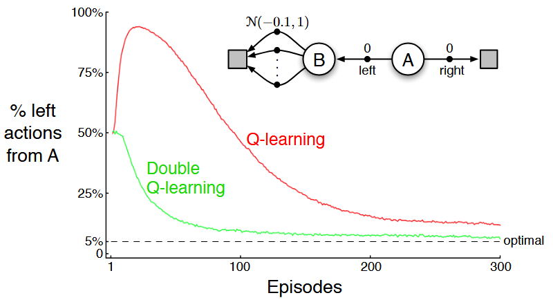

* **状态集合**：包含两个非终止状态 $A$ 和 $B$。
* **起点**：每个回合固定从状态 $A$ 开始，此时只有两个可选动作：向左（`left`）或向右（`right`）。
  * **动作 `right`**：直接转移到终止状态，获得固定回报 $R = 0$。因此其真实回报恒为 $0$：$$q(A, \text{right}) = 0$$
  * **动作 `left`**：转移到状态 $B$，即时回报 $R = 0$。
* **状态 $B$ 的动作**：从状态 $B$ 出发有许多可选动作，无论选哪个都会立刻到达终止状态，其单步回报从均值为 $-0.1$、方差为 $1.0$ 的正态分布中随机抽取：
  $$
  R \sim \mathcal{N}(-0.1, \, 1.0)
  $$
  因此，从状态 $B$ 出发的任何动作，其真实期望价值全都是 $-0.1$：
  $$
  q(B, a) = -0.1, \quad \forall a \in \mathcal{A}(B)
  $$

* 走右边 `right`：期望收益为 $0$；
* 走左边 `left`：期望收益为 $0 + (-0.1) = -0.1$；
* **结论**：因为 $0 > -0.1$，**在状态 $A$ 采取 `left` 永远是一个错误动作**，智能体理应几乎 $100\%$ 选择向右走。

---

现在看 **Q-learning** 是如何在这个简单任务中崩溃的：

1. 智能体从 $A$ 偶尔探索走到 $B$；
2. 在状态 $B$，有几十个动作，每个动作的回报均值为 $-0.1$。但在刚开始试验时，由于正态分布采样噪声，**几十个动作中大概率会有一两个动作偶然摇出正分（例如某个动作摇出了 $+0.8$ 或 $+1.2$）**；
3. Q-learning 在状态 $A$ 执行向左动作后，使用更新公式：
   $$
   Q(A, \text{left}) \leftarrow Q(A, \text{left}) + \alpha \left[ R + \gamma \max_{a} Q(B, a) - Q(A, \text{left}) \right]
   $$
4. 由于公式里取的是 $\max_a Q(B, a)$，算法立刻抓住了那个偶然摇出 $+0.8$ 的动作。此时 $\max_a Q(B, a) = +0.8$；
5. 结果：**$Q(A, \text{left})$ 被迅速更新为一个显著的正数（例如 $+0.4$）**！
6. 此时对比两边：
   * $Q(A, \text{left}) > 0$（虚假的高额正分）
   * $Q(A, \text{right}) = 0$
7. 智能体根据 $\varepsilon$-贪婪策略，**开始疯狂地选择向左走**。

8. 虽然随着访问次数增加，大数定律最终会把 $B$ 里面所有动作的均值慢慢拉回负数。

> 原因在于**算法使用了同一套样本数据，既用来决定哪个动作最大（挑选动作），又用来对这个动作进行估值（计算数值）。**

* **选拔阶段**：$\arg\max_a Q(s, a)$ 负责选拔出估计值最大的动作。这个选拔机制天然带有偏见，那些被随机噪声推高的动作会被优先选中；
* **评估阶段**：选拔出来之后，算法直接把这个已经被噪声推高的数值 $Q(s, \arg\max_a Q(s, a))$ 作为未来的评估值。
* **二者重叠**：选出来的“幸运儿”带着运气成分，你却把运气当成了实力，导致整个估计必然正向偏高。

---

## Double Learning&Double Q-learning

**将“挑选动作”与“评估价值”彻底解耦给两个独立的估计器**。假设我们有两套独立学习的动作价值估计表，分别记为 $Q_1$ 和 $Q_2$（各自通过不同的样本集更新）：

1. **用 $Q_1$ 来挑选出认为最好的动作**：
   $$
   A^* = \arg\max_{a} Q_1(a)
   $$
   **绝对不用 $Q_1$ 的分数，而是转交由完全独立的 $Q_2$ 来为 $A^*$ 打分**：
   $$
   \text{评估值} = Q_2(A^*) = Q_2\left( \arg\max_a Q_1(a) \right)
   $$
3. **为什么这样就消除了偏差？**
   因为 $Q_2$ 没有参与选拔过程。某个动作是因为在 $Q_1$ 里运气好被选出来的，在完全独立的 $Q_2$ 看来，它没有经历过任何极值偏见筛选，其期望值严格无偏：
   $$
   \mathbb{E}\left[ Q_2(A^*) \right] = q(A^*)
   $$
4. 同理，我们也可以对称地反过来：用 $Q_2$ 选动作，用 $Q_1$ 来打分评估：$Q_1(\arg\max_a Q_2(a))$。

教材将上述思想推广至全 MDP，定义了式 (6.10)。在每个时间步，以 $0.5$ 的概率掷硬币：

**(1) 正面（更新 $Q_1$，用 $Q_1$ 选、用 $Q_2$ 估）：**
$$
Q_1(S_t, A_t) \leftarrow Q_1(S_t, A_t) + \alpha \left[ R_{t+1} + \gamma \, Q_2\left( S_{t+1}, \; \arg\max_{a} Q_1(S_{t+1}, a) \right) - Q_1(S_t, A_t) \right]
$$
**(2) 反面（更新 $Q_2$，用 $Q_2$ 选、用 $Q_1$ 估）：**
$$
Q_2(S_t, A_t) \leftarrow Q_2(S_t, A_t) + \alpha \left[ R_{t+1} + \gamma \, Q_1\left( S_{t+1}, \; \arg\max_{a} Q_2(S_{t+1}, a) \right) - Q_2(S_t, A_t) \right]
$$
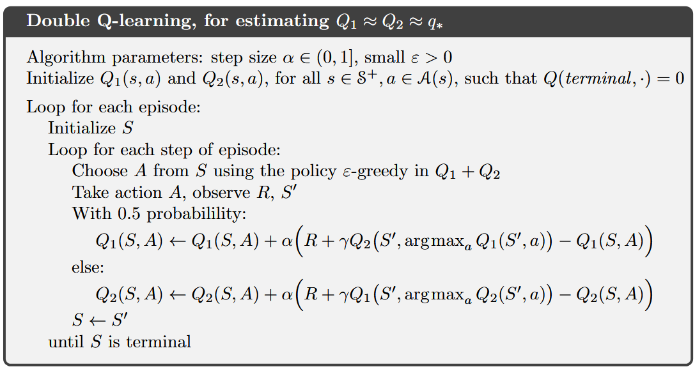

# 6.8 Games, Afterstates, and Other Special Cases

## Afterstates价值函数

在强化学习的控制问题（Control Problems）中，通常根据智能体对环境动力学的了解程度采用不同的价值函数表示：

---

**常规状态价值函数$V(s)$**

* **评估时机**：评估智能体**正处于决策点、拥有动作选择权**时的环境状态 $s$。
* **动作决策的局限性**：若要在Model-Free环境下仅根据 $V(s)$ 实现最优贪婪动作选择，智能体必须预先掌握完整的环境转移概率模型 $p(s', r \mid s, a)$：
  $$
  a^* = \arg\max_{a \in \mathcal{A}(s)} \sum_{s', r} p(s', r \mid s, a) \big[ r + \gamma V(s') \big]
  $$
  若环境动力学未知，仅凭 $V(s)$ 根本无法执行策略改进。

---

**常规动作价值函数$Q(s, a)$**

* **评估时机**：评估“在状态 $s$ 下采取动作 $a$”这一**状态-动作二元组**的预期回报。
* **优势与代价**：无需任何转移模型即可直接实现无模型贪婪控制（$a^* = \arg\max_a Q(s, a)$），但其代价是将状态空间 $\mathcal{S}$ 扩展为巨大的状态-动作笛卡尔积空间 $\mathcal{S} \times \mathcal{A}$，导致样本探索与收敛效率显著降低。

在本书第 1 章中，作者曾介绍过一种利用时序差分（TD）方法学习井字棋的算法。表面上看，该算法学习的是棋盘盘面的价值，类似于状态价值函数；但若深入审视便会发现：**它既不是常规的动作价值函数，也不是通常意义上的状态价值函数**。

---

**事后状态价值函数$V_{after}(s')$**

* **事后状态（Afterstates ）**：特指智能体**执行完动作之后、但在环境的后续随机转移或对手走子之前**所形成的中间环境格局。记作：
  $$
  S'_t = f(S_t, A_t)
  $$
  其中 $f: \mathcal{S} \times \mathcal{A} \to \mathcal{S}_{\text{after}}$ 表示智能体动作对环境造成的即时确定性映射。
* **事后状态价值函数$V_{\text{after}}(S'_t)$**：建立在事后状态集合 $\mathcal{S}_{\text{after}}$ 之上的标量价值评估函数，度量从该中间格局出发直至幕终止所能获得的期望折扣回报：
  $$
  v_{\text{after}}(s') \triangleq \mathbb{E}_\pi \left[ \sum_{k=0}^{\infty} \gamma^k R_{t+k+1} \;\Bigg|\; S'_t = s' \right]
  $$

其**核心成立条件是局部环境动力学已知**，在真实的物理系统或对抗博弈中，环境往往并不属于“动力学完全已知”或“动力学完全未知”的极端二元对立，而是处于**部分动力学已知**的中间状态：

1. **第一阶段（动作的即时效应完全确定已知）**：
   * 智能体完全清楚自己走某一步棋、按某个开关对系统的直接改变。例如在国际象棋或井字棋中，智能体在某个空位落子，落子后的棋盘布局是 $100\%$ 确定且完全已知的；
2. **第二阶段（环境或对手的后续响应随机未知）**：
   * 智能体完全无法预测对手下一步会走哪一步棋，或者无法预知未来外界干扰的具体实现。

**事后状态价值函数正是针对这种“初始动力学已知、后续动力学未知”的结构性先验量身定制的最优表象方式。**

> [!IMPORTANT]
> $$
> v_{\text{after}}(s') \triangleq \mathbb{E}_\pi \left[ \sum_{k=0}^{\infty} \gamma^k R_{t+k+1} \;\Bigg|\; S'_t = s' \right]
> $$
>
>  **$f$ 是一个“物理动作映射”，它发生在评估之前；这个公式是对“动作已经发生后的结果”进行估值。**
>
> * **$f(s, a)$ 的角色是“生成状态”**：
>   在时刻 $t$，你面对盘面 $s$，决定采取动作 $a$。根据物理规则（或游戏规则），棋盘一定会变成一个新的格局 $s'$。这个规则函数就是 $f$：
>   $$
>   s' = f(s, a)
>   $$
>
> * **$v_{\text{after}}(s')$ 的角色是“给这个格局打分”**：
>   当你已经通过 $f$ 把棋子摆上去、形成了格局 $s'$ 之后，**$s'$ 已经确定摆在眼前了**。
>   此时公式中的条件是：$| S'_t = s'$（“已知当前落子后的格局是 $s'$”）。
>   公式问的是：**从这个已经形成的格局 $s'$ 开始，由于接下来轮到对手走子，未来直到游戏结束，智能体期望能得多少分？**
>
> 当智能体面对落子前的盘面 $S_t$，它手头有若干个候选动作 $a_1, a_2, \dots$：
>
> 1. 智能体利用规则 $f$ 在脑海中预演：
>
>    * 如果选 $a_1$，会生成格局 $s'_1 = f(S_t, a_1)$；
>    * 如果选 $a_2$，会生成格局 $s'_2 = f(S_t, a_2)$；
>
> 2. 智能体去查事后状态价值表：看 $v_{\text{after}}(s'_1)$ 和 $v_{\text{after}}(s'_2)$ 谁的分数高；
>
> 3. 智能体挑选出让事后状态价值最高的动作：
>    $$
>    A^* = \arg\max_{a} v_{\text{after}}\big( f(S_t, a) \big)
>    $$
>
> 这就是动作价值与事后价值的代数等价关系：
> $$
> Q(S_t, a) = v_{\text{after}}\big( f(S_t, a) \big)
> $$

---

## 样本效率

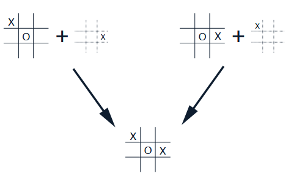

若采用常规动作价值函数 $Q(s, a)$：

* $(s_1, a_1)$ 与 $(s_2, a_2)$ 是定义在 $\mathcal{S} \times \mathcal{A}$ 空间中的**两个完全独立的二元组**；
* 在查表式（Tabular）强化学习中，算法必须分别为 $Q(s_1, a_1)$ 与 $Q(s_2, a_2)$ 分配独立的存储单元；
* 智能体在经历 $(s_1, a_1)$ 时获得的输赢经验与价值更新，**完全无法传递给 $(s_2, a_2)$**，必须等待未来某次回合偶然经历 $(s_2, a_2)$ 时从零开始独立学习。

然而从博弈规则来看，$(s_1, a_1)$ 与 $(s_2, a_2)$ 施加之后，**产生的事后盘面 $s'$ 完全一致**：
$$
f(s_1, a_1) = f(s_2, a_2) = s'
$$
因为后续轮到对手走子时，对手面对的是完全相同的客观盘面 $s'$，因此从该盘面出发的未来博弈树分支与胜负概率分布是**严格等同的**：
$$
q_*(s_1, a_1) \equiv q_*(s_2, a_2) \equiv v_{\text{after}}^*(s')
$$
* **即时无损泛化**：事后状态价值函数 $V_{\text{after}}$ 直接对 $s'$ 评估。任何针对路径 1 的学习更新，都会使 $V_{\text{after}}(s')$ 发生改变，从而**泛化到了路径 2**！
* **维度压缩效应**：事后状态将原本高维离散的 $\mathcal{S} \times \mathcal{A}$ 空间折叠为其在映射 $f$ 下的**等价商空间 $\mathcal{S} \times \mathcal{A} / \sim$**。

---

## 时序差分更新

在常规状态价值函数中，贪婪选择必须计算关于未来状态的期望转移；但在事后状态体系下，由于 $f(S_t, a)$ 是确定性已知的，智能体**无需知道任何对手或环境的随机转移概率**，即可直接执行贪婪评估：
$$
A^* = \arg\max_{a \in \mathcal{A}(S_t)} V_{\text{after}}\big( f(S_t, a) \big)
$$
对应于动作价值的退化关系为：
$$
Q(S_t, a) = V_{\text{after}}\big( f(S_t, a) \big)
$$

马尔可夫序列在事后状态下的推进时序为：
$$
S_t \xrightarrow{A_t} \underbrace{S'_t}_{f(S_t, A_t)} \xrightarrow[R_{t+1}]{\text{对手走子 / 环境扰动}} S_{t+1} \xrightarrow{A_{t+1}} \underbrace{S'_{t+1}}_{f(S_{t+1}, A_{t+1})} \to \dots
$$
智能体在经历了对手的应对并获得即时奖赏 $R_{t+1}$、并根据自身策略决定了下一个动作 $A_{t+1}$ 形成新的事后状态 $S'_{t+1}$ 之后，执行**事后状态之间的 TD(0) 自举更新**：
$$
V_{\text{after}}(S'_t) \leftarrow V_{\text{after}}(S'_t) + \alpha \left[ R_{t+1} + \gamma V_{\text{after}}(S'_{t+1}) - V_{\text{after}}(S'_t) \right]
$$
* **对比第 1 章式 (1.1)**：在第 1 章的井字棋无即时奖赏（仅终止时刻奖励胜负）且 $\gamma = 1$ 的无折扣情境下，该公式精准退化为：
  $$
  V(S'_t) \leftarrow V(S'_t) + \alpha \big[ V(S'_{t+1}) - V(S'_t) \big]
  $$
  这揭示了第 1 章井字棋算法在现代强化学习体系中的严格理论归属——**基于事后状态的时序差分预测控制算法**。

| 对比维度           | 常规状态价值函数 $V(s)$            | 常规动作价值函数 $Q(s, a)$                     | 事后状态价值函数 $V_{\text{after}}(s')$     |
| :----------------- | :--------------------------------- | :--------------------------------------------- | :------------------------------------------ |
| **定义定义域**     | 决策前状态空间 $\mathcal{S}$       | 状态-动作空间 $\mathcal{S} \times \mathcal{A}$ | 动作后状态空间 $\mathcal{S}_{\text{after}}$ |
| **评估时刻**       | 智能体拥有动作选择权时             | 执行动作二元组时                               | 动作执行完毕、环境响应发生前                |
| **无模型控制能力** | **不可行**（必须依赖完整转移模型） | **完全可行**（直接 $\arg\max_a Q$）            | **完全可行**（已知确定映射 $f(s,a)$ 即可）  |
| **适用物理场景**   | 动力学完全已知的规划问题（DP）     | 动力学全黑箱的通用控制问题                     | 局部动作效应确定、后续转移随机的系统        |

---

## Exercise 6.14

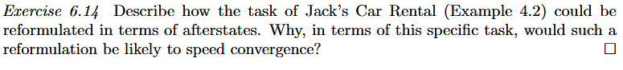

* **常规状态 $S_t = (n_1, n_2)$**：
  * 定义在第 $t$ 天**夜晚营业结束时**，地点 1 与地点 2 场地上留存的车辆数目；
  * $n_1, n_2 \in \{0, 1, \dots, 20\}$，总状态数为 $|\mathcal{S}| = 21 \times 21 = 441$。
* **智能体动作 $A_t = a$**：
  * 在**夜间**将车辆从一个车场调配至另一个车场；
  * $a \in \{-5, -4, \dots, 0, \dots, 4, 5\}$，其中正数表示由地点 1 运往地点 2，负数表示由地点 2 运往地点 1。
* **环境随机动力学**：
  * 次日白天，两个车场分别迎来服从泊松分布的随机租车需求流（$\lambda_{\text{demand}} = 3, 4$）与随机还车流（$\lambda_{\text{return}} = 3, 2$），产生租车收益并形成当晚的新状态 $S_{t+1}$。

---

### 事后状态：清晨营业前的现车库存
在智能体夜间执行调配动作 $a$ 时，车辆的转移是**完全确定且即时生效的机械操作**，不存在任何环境随机性。当夜间车辆调配完毕、次日清晨**租车业务尚未开门迎客的瞬间**，两个车场的可用现车数量构成了一个天然且完备的**事后状态**：

$$
S'_t = (n'_1, n'_2) = f(S_t, A_t) = \Big( \min(20, \; n_1 - a), \; \min(20, \; n_2 + a) \Big)
$$

* **定义域**：事后状态空间 $\mathcal{S}_{\text{after}} = \{0, 1, \dots, 20\}^2$；
* **物理实质**：$S'_t$ 就是次日清晨各车场**开门营业时的现车库存向量（Morning Inventory）**；
* **即时确定性损耗**：移动车辆的成本在夜间立即结算，其损耗完全确定已知且无方差：
  $$
  R_{\text{move}}(a) = -2|a|
  $$
* **事后状态价值函数 $V_{\text{after}}(n'_1, n'_2)$**：评估从清晨现车数为 $(n'_1, n'_2)$ 出发，面临全天客户随机租还车流直至长远未来的期望总折扣回报：
  $$
  v_{\text{after}}(n'_1, n'_2) \triangleq \mathbb{E}_\pi \left[ R_{\text{day}} + \gamma R_{\text{move}} + \gamma^2 R_{\text{day}} + \dots \;\Bigg|\; \text{清晨开门库存为 } (n'_1, n'_2) \right]
  $$

---

在夜间面对当前状态 $S_t = (n_1, n_2)$ 时，智能体**完全无需知道白天的泊松租还车转移概率**，只需直接最大化即时移车损耗与对应清晨事后状态价值之和：

$$
A^* = \arg\max_{a \in \mathcal{A}(S_t)} \left[ -2|a| + V_{\text{after}}\Big( \min(20, n_1 - a), \; \min(20, n_2 + a) \Big) \right]
$$

其对应的动作价值退化为：
$$
Q(S_t, a) = -2|a| + V_{\text{after}}\big( f(S_t, a) \big)
$$

---

### 加速收敛

#### 1. 待估计参数空间的数量级压缩

* **常规动作价值方法 $Q(s, a)$ 的参数规模**：每个状态 $s = (n_1, n_2)$ 有多达 11 个可选动作，在全状态空间下：
  $$
  |\mathcal{S} \times \mathcal{A}| \approx 441 \times 11 - (\text{边界非法动作}) \approx 4000+
  $$
  智能体必须为这 $4000$ 多个独立的状态-动作对分配独立的表格条目，并通过样本逐一探索和估计。
  
* **事后状态方法 $V_{\text{after}}(s')$ 的参数规模**：清晨现车库存的可能组合依然只有 $21 \times 21 = 441$ 个：
  $$
  |\mathcal{S}_{\text{after}}| = 441
  $$

---

#### 2. 高度的多对一坍缩与跨轨迹无损泛化

在杰克租车中，**“不同的夜间盘存 + 不同的调配动作”导向完全相同的次日清晨库存**是非常普遍的客观事实。考虑以下 5 组截然不同的状态-动作对：

$$
\begin{aligned}
(10, 10) &+ \text{动作 } a = 0 \quad \implies S' = (10, 10) \\
(11, 9) &+ \text{动作 } a = +1 \implies S' = (10, 10) \\
(12, 8) &+ \text{动作 } a = +2 \implies S' = (10, 10) \\
(9, 11) &+ \text{动作 } a = -1 \implies S' = (10, 10) \\
(8, 12) &+ \text{动作 } a = -2 \implies S' = (10, 10)
\end{aligned}
$$

* **常规 $Q$ 学习的严重割裂**：在常规 $Q(s, a)$ 中，上述 5 种情形对应 5 个互不相干的独立变量：$Q((10,10), 0)$、$Q((11,9), +1)$ 等。若智能体经历了一条包含 $((11, 9), +1)$ 的轨迹并获得了白天经营数据的更新，其他 4 个状态-动作对**完全无法享受到任何经验共享**，必须等待未来某次回合独立采样；
* **事后状态的即时全局共享**：只要清晨开门时的现车数是 $(10, 10)$，白天面临的客户泊松到达流和还车流在物理和统计分布上是**严格完全相同的**。 
  在事后状态下，白天的经验直接且唯一地更新 $V_{\text{after}}(10, 10)$。

---

#### 3. 确定性成本与随机回报的解耦

系统转移总回报由两部分构成：
$$
R_{\text{total}} = \underbrace{-2|a|}_{\text{夜间调配成本（完全确定，方差为 0）}} + \underbrace{\sum (\text{白天租车收益})}_{\text{泊松随机过程（高方差噪声源）}}
$$

* **常规 $Q$ 学习的缺陷**：常规方法将确定的 $-2|a|$ 与充满随机波动的白天收益绑死在同一个标量更新目标中，强行使用随机采样去逼近 $-2|a|$，引入了大量无谓的样本方差；
* **事后状态的显式分离**：
  $$
  Q(s, a) = -2|a| + \gamma V_{\text{after}}(f(s, a))
  $$
  确定的成本由解析式精确计算，**方差为绝对零**；算法只需让 $V_{\text{after}}$ 专注于逼近白天经营的期望值。这种先验结构的分离大幅降低了时序差分更新目标的方差，显著稳定并加速了数值收敛。

> [!IMPORTANT]
>
> 设环境在夜晚状态为 $S_t$，执行调车动作 $A_t = a$，产生夜间确定性移车支出 $-2|a|$；次日清晨形成现车库存 $S'_t = f(S_t, A_t)$；随后白天营业，产生高波动的随机租车收益 $R_{\text{day}}$，并在夜晚到达下一状态 $S_{t+1}$。
>
> * **常规 Q 学习（未解耦）**：
>   $$
>   Q(S_t, A_t) \leftarrow Q(S_t, A_t) + \alpha \Big[ \underbrace{\big( -2|A_t| + R_{\text{day}} \big)}_{\text{混合回报 } R_{t+1}} + \gamma \max_{a'} Q(S_{t+1}, a') - Q(S_t, A_t) \Big]
>   $$
>   * **机制**：它把确定的成本 $-2|A_t|$ 和完全随机的白天收入 $R_{\text{day}}$ 揉成一团（记为 $R_{t+1}$）。算法在用带学习率 $\alpha$ 的随机采样去“猜测”这个混合总和。
>
> * **事后状态 TD 学习（显式解耦）**：
>   $$
>   V_{\text{after}}(S'_t) \leftarrow V_{\text{after}}(S'_t) + \alpha \Big[ \underbrace{R_{\text{day}}}_{\text{只更新白天收益}} + \gamma \max_{a'} \big( -2|a'| + V_{\text{after}}(f(S_{t+1}, a')) \big) - V_{\text{after}}(S'_t) \Big]
>   $$
>   * **机制**：**$-2|A_t|$ 根本不出现在更新目标的前半部分**！$V_{\text{after}}$ 在白天营业后，只用来记录清晨库存 $S'_t$ 在白天能赚多少钱。确定的移车费被完完全全剥离了出去。
>
> 在夜晚面对车况 $S_t$，两者选择最优贪婪动作的规则为：
>
> * **常规 Q 学习**：
>   $$
>   A^* = \arg\max_{a} Q(S_t, a)
>   $$
> * **事后状态方法**：
>   $$
>   A^* = \arg\max_{a} \Big[ \underbrace{-2|a|}_{\text{直接代数相减}} + \gamma V_{\text{after}}\big( f(S_t, a) \big) \Big]
>   $$
>
> ---
>
> ### 面对巨大的白天随机波动，为什么事后状态不会被骗？
>
> * **情境 1**：昨晚库存是 **$S_A = (10, 10)$**。杰克选择 **$a_A = 0$（不调车，成本 $\$0$）**。
>   $\implies$ 清晨营业时，库存是 **$(10, 10)$**。
> * **情境 2**：昨晚库存是 **$S_B = (11, 9)$**。杰克选择 **$a_B = +1$（运 1 辆车，成本 $\$2$）**。
>   $\implies$ 清晨营业时，库存也是 **$(10, 10)$**。
>
> 在这两个情境下，清晨开门时的现车库存都是 $(10, 10)$。因此，只要是一个理性的系统，就必须得出结论：**情境 1（免费得到该库存）必然严格优于情境 2（花了 $\$2$ 得到完全相同的库存）**！现在，让完全相同的**剧烈随机噪声**发生：
>
> * **第 1 天（情境 1）**：白天不幸遇到**极度萧条的淡季**，只来了 2 个客人，租车收益仅为 **$+20$**；
> * **第 2 天（情境 2）**：白天幸运遇到**极度火爆的旺季**，来了 7 个客人，租车收益高达 **$+70$**。
>
> ---
>
> 在常规 Q 学习眼里，$((10, 10), 0)$ 和 $((11, 9), +1)$ 是两张毫无关联的独立表格行：
>
> 1. **第一天更新情境 1**：
>    * 混合回报：$0 + 20 = \mathbf{+20}$；
>    * $Q((10, 10), 0)$ 被萧条的白天严重拉低（假设步长 $\alpha=1$）：
>      $$Q((10, 10), 0) = \mathbf{+20}$$
> 2. **第二天更新情境 2**：
>    * 混合回报：$-2 + 70 = \mathbf{+68}$；
>    * $Q((11, 9), +1)$ 被火爆的白天严重推高：
>      $$Q((11, 9), +1) = \mathbf{+68}$$
> 3. **此时智能体怎么做决策？**
>    比较两个动作的值：
>    $$
>    Q((11, 9), +1) = 68 \quad \gg \quad Q((10, 10), 0) = 20 
>    $$
>    它完全不知道这多出来的收益是因为白天客流好，反而把功劳全记在了移车动作头上。为了纠正这个荒谬的错误，算法必须把两个动作各自重复几十天，靠大数定律把 20 和 70 的客流方差慢慢抹平。
>
> ---
>
> 在事后状态眼里，这两天虽然夜间起点不同、动作不同，但**清晨的开门库存全都是 $(10, 10)$**！
>
> 1. **白天的更新过程**：
>    * 无论白天遇到的是萧条（$+20$）还是火爆（$+70$），算法**只更新同一个变量**：清晨库存 $V_{\text{after}}(10, 10)$。
>    * 假设经历这两天后，$V_{\text{after}}(10, 10)$ 被随机噪声拉成了一个任何可能的值（比如更新后等于 $45$）。
>
> 2. **智能体做决策对比**：
>    现在智能体要评估这两个情境，根据决策公式：
>    $$
>    \text{估值} = \underbrace{0}_{\text{确定性成本}} + \gamma V_{\text{after}}(10, 10)\\
>    \text{估值} = \underbrace{-2}_{\text{确定性成本}} + \gamma V_{\text{after}}(10, 10)
>    $$
>
> 3. **关键的数学奇迹发生**：
>    智能体在比较两者谁优谁劣时：
>    $$
>    \big[ 0 + \gamma V_{\text{after}}(10, 10) \big] \quad \text{vs} \quad \big[ -2 + \gamma V_{\text{after}}(10, 10) \big] \\
>    \implies0 > -2 \quad
>    $$
>
> 因为**移车成本 $-2|a|$ 是显式剥离出来的精确代数项**，而**白天的随机价值被压缩进了同一个事后状态变量里**。因此，白天客流量从 20 到 70 的巨大波动，**根本不可能误导智能体去选择花 $\$2$ 运车来换取完全相同的库存**
>

---

#### 4. 规避复杂的高维模型积分，使无模型 TD 学习极为轻量

* 在第 4 章的动态规划中，策略迭代必须依赖双变量泊松联合分布的四重嵌套求和卷积，计算极其繁重；
* 重构为事后状态后，采用无模型单步 TD(0) 即可进行极其简洁的在线学习：
  $$
  V_{\text{after}}(S'_t) \leftarrow V_{\text{after}}(S'_t) + \alpha \left[ R_{\text{day}} + \gamma R_{\text{move}}(A_{t+1}) + \gamma V_{\text{after}}(S'_{t+1}) - V_{\text{after}}(S'_t) \right]
  $$
  这使得智能体只需在轻量级的仿真或实际营业数据中推进一步，就能以极高效率收敛到最优策略。
